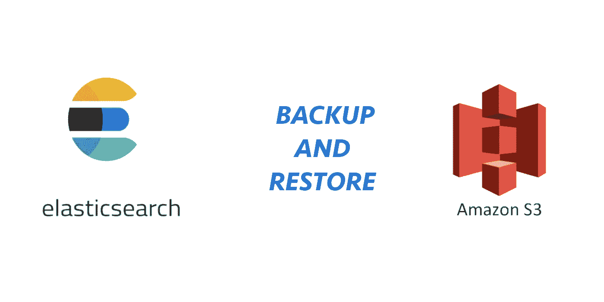
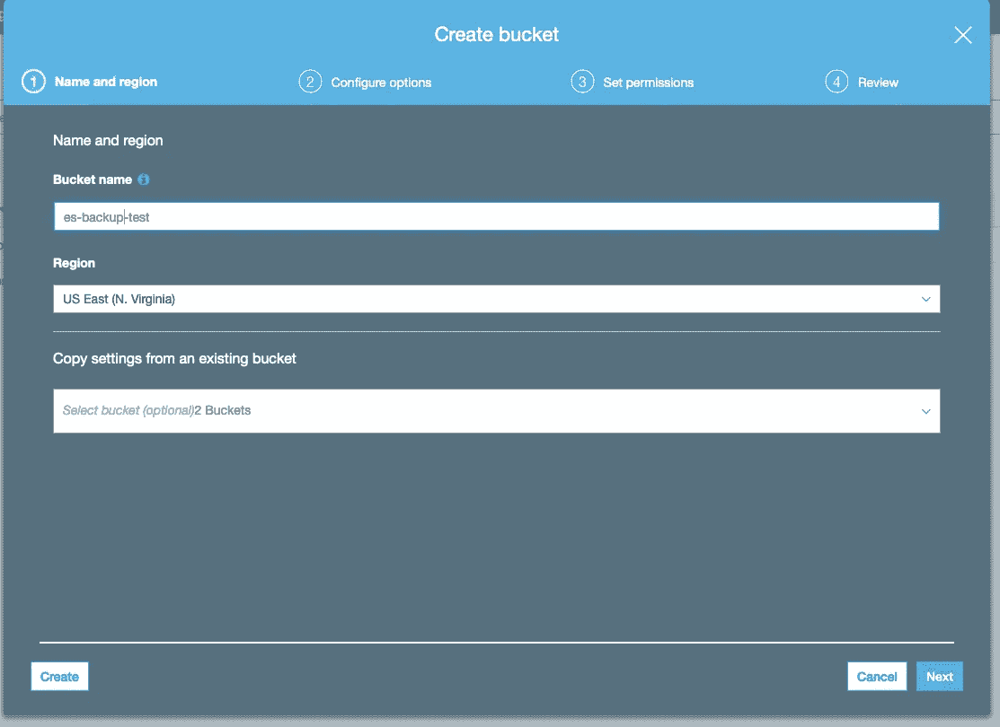
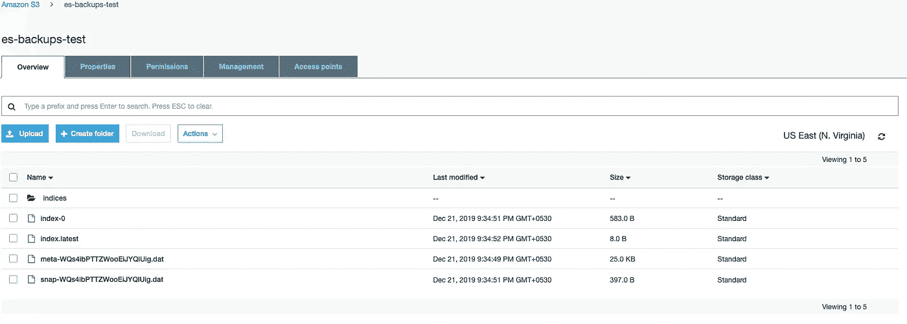

# 使用 SLM 进行弹性搜索备份，使用亚马逊 S3 进行恢复

> 原文：<https://itnext.io/elasticsearch-backup-using-slm-and-restore-on-amazon-s3-c42bd0c0fd26?source=collection_archive---------5----------------------->



将备份存储在生产服务器上的中并不是一个好主意。最好使用云数据存储服务，如 AWS S3 或其他一些服务。你也可以使用迷你像开源自托管对象存储与 ZFS。我将演示如何将 Elasticsearch 数据备份到 S3，并在其上创建保留策略。正如我之前提到的，我使用了两个脚本来管理 s3 中的备份生命周期，一个用于创建快照，另一个用于删除旧快照。但是快照生命周期管理(SLM)是 Elasticsearch 7.5 版本的一大特色。在这篇文章中，演示了如何配置 S3 和管理备份的生命周期。如果你想安装 Elasticsearch 并对其进行配置，只需遵循之前的[文档](https://medium.com/@jasmedia/elasticsearch-backups-lifecycle-management-with-slm-8268366553a8)即可。

# 创建 S3 存储桶

我希望你已经为 S3 创建了一个 AWS 帐户和 IAM 用户凭证。因此，让我们从创建一个 S3 存储桶来存储弹性搜索快照开始。转到 AWS S3 服务页面，单击“创建存储桶”按钮，为存储桶设置一个名称，然后按照步骤操作。



# 在 Elasticsearch 密钥库中配置 S3 访问权限

接下来，将 IAM 用户凭证设置为 Elasticsearch 密钥库，以访问我们已经创建的 S3 存储桶。使用以下命令设置这些凭据。

```
bin/elasticsearch-keystore add s3.client.default.access_key
bin/elasticsearch-keystore add s3.client.default.secret_key
```

# 安装 S3 插件

您需要安装 Elasticsearch s3-repository 插件，只需运行命令:

```
bin/elasticsearch-plugin install repository-s3
```

您可以检查是否安装了 repository-s3。

```
curl -X GET "localhost:9200/_cat/plugins?v&s=component&h=component,version,description&pretty"
```

回答应该是这样的:

```
component version description
repository-s3 7.5.0 The S3 repository plugin adds S3 repositories
```

# 配置备份存储库

使用 s3 存储桶设置备份存储库。

响应应为“已确认”:如果存储库创建成功，则为 true。

# 配置 SLM 策略

之后，在其上设置 s3 快照生命周期管理策略。设置备份时间、快照名称、存储库、索引和保留策略。

最后，运行命令立即备份到 s3。

```
curl -X POST "localhost:9200/_slm/policy/my-s3-snapshots/_execute?pretty"
```

如果成功，您将获得带有快照名称的响应。你的 S3 水桶看起来像:



现在我们可以检查策略了。

```
curl -X GET "localhost:9200/_slm/policy/my-s3-snapshots?human&pretty"
```

答案应该是:

该响应包含拍摄的快照数量、下一次快照时间以及 SLM 策略的许多其他详细信息。

# 从快照恢复

您将获得完整的快照列表，并记下您要恢复的快照名称。

```
curl -X GET “localhost:9200/_snapshot/my_s3_repository/_all?pretty”
```

从 Elasticsearch 集群中删除一个索引以测试恢复过程。

首先，列出集群中可用的索引。

删除用于演示 s3 备份恢复的索引“hastags”。

```
curl -X DELETE "localhost:9200/hashtags?pretty"
```

只需运行上面的 indices list 命令来验证删除。现在是运行恢复命令的时候了:

如果要将数据恢复到新的集群中，则不需要指定索引名称。否则，如果 Elasticsearch 集群中已经有一些可用的索引，您将得到一个错误消息“同名索引已经存在”。

现在，再次使用 index list 命令验证索引恢复。您可以看到索引恢复前后 uuid 的差异。

这是在 Elasticsearch 上管理备份生命周期的最酷的方法。您还可以使用 Kibana 来配置生命周期策略。您可以使用上述存储库配置直接将快照恢复到新的 Elasticsearch 集群。

干杯，