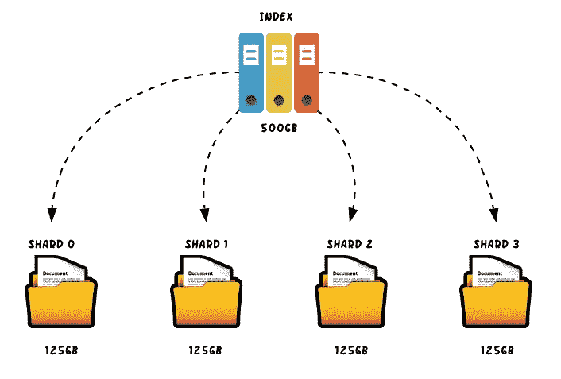
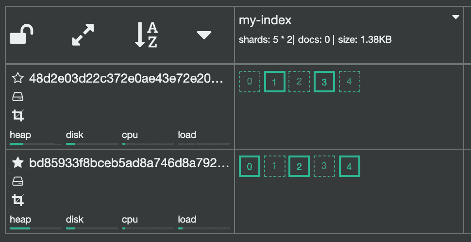
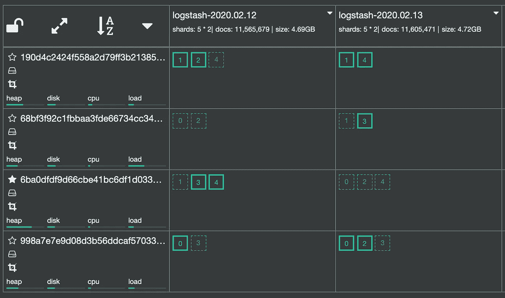

# 弹性搜索索引管理

> 原文：<https://itnext.io/elasticsearch-index-management-17b1f2b28553?source=collection_archive---------0----------------------->


Elasticsearch 集群中跨节点组织数据的方式对性能和可靠性有着巨大的影响。一个经过良好优化的配置可以改变一切。

Elasticsearch 中的数据存储在索引中。例如，索引管理和配置在弹性搜索集群的性能中起着关键作用。

# 索引概述

Elasticsearch 中的指数到底是什么？尽管这是一个非常基本的问题，但答案却令人惊讶地微妙。

一个**索引**是一个具有相似特征的**文档**的集合。索引由名称标识，当对其中的文档执行索引、搜索、更新和删除操作时，该名称用于引用索引。

**文档**是存储在弹性搜索索引中的 JSON 对象，被认为是存储的基本单元。在关系数据库的世界中，文档可以比作表中的一行。

一个文档包含一系列的**字段**，或者键值对。该值可以是简单的值(如字符串、整数、日期)，也可以是嵌套结构，如数组或对象。字段类似于关系数据库中表中的列。

随着索引的增长，其大小可能会超过节点的硬件限制。然而，索引被水平分割成称为**碎片**的块。一个碎片包含一个索引数据的子集。当对索引进行分片时，该索引中的给定文档将只存储在其中一个分片中。



分片允许跨节点更好地分布数据和操作，从而提高性能。搜索可以跨不同的分片并行运行，从而加快查询处理。

> 索引中碎片的数量由索引创建决定，以后不能轻易更改。

碎片有两种类型:**初级**和**副本**。**主碎片**是处理文档索引的主碎片，也可以处理查询。索引中的每个文档都属于一个主碎片。副本碎片**是主碎片的副本。副本碎片处理查询，但不直接索引文档。它们为您的数据提供冗余拷贝，以防止硬件故障，并增加处理读取请求(如搜索或检索文档)的能力。副本总是被分配到与主碎片不同的节点，并且在主碎片失败的情况下，副本碎片可以被提升以取代它的位置。**

对于节点和索引状态的可视化表示，我们发现 [cerebro](https://github.com/lmenezes/cerebro) 做得非常好。在集群升级期间进行集群重新平衡是一件非常有趣的事情。



下图显示了包含 5 个碎片和 1 个副本的索引在两个节点上的分布。连续的线方块代表原始碎片，而不连续的线方块代表复制品。

# 日志索引

使用 Elasticsearch 进行日志记录是扩展最多的用例。在这种情况下，每天创建一个包含一天日志的新索引是很常见的。索引列表可能如下所示:

```
GET _cat/indices?v
health  status index                uuid   pri rep  docs.count docs.deleted store.size pri.store.size
green   open   logstash-2020.04.03  xxxx   5   1    1941829    0            2gb        1gb
green   open   logstash-2020.04.02  xxxx   5   1    2102403    0            2gb        1gb
green   open   logstash-2020.04.01  xxxx   5   1    2243759    0            2gb        1gb
```

> Kibana 允许您定义一个索引模式，并一次查询多个索引。

指数将使用默认的弹性搜索配置，即:

*   5 个主要碎片
*   1 个副本碎片
*   1000 个字段
*   1s 刷新间隔

这些值并不总是最佳的，这取决于您的使用情况。如果您想修改它们，建议在创建索引时进行，因为以后修改它们是一个麻烦而困难的过程。这可以通过使用索引模板来实现。

# 索引模板

索引模板定义了基于索引模式创建新索引时将自动应用的设置和映射。

> 模板仅在索引创建时应用。更改模板不会影响现有的索引。

对于日志索引，通常让[动态映射](https://www.elastic.co/guide/en/elasticsearch/reference/current/dynamic-mapping.html)完成它的工作，自动检测并向映射添加新的字段。动态制图允许您快速开始可视化和索引数据。

> 动态映射有以不需要的字段数据类型结束的风险。任何新字段都将被检测到，并使用 Elasticsearch 认为最接近的数据类型创建。为了强制字段数据类型，您必须在索引模板中为索引定义映射。

添加下面的模板，所有前缀为 **logstash-** 的新索引将创建 4 个分片，1 个副本(默认)，刷新间隔为 30 秒，限制为 1500 个字段。

```
PUT _template/logstash
{
    "index_patterns" : ["logstash-*"],
    "settings" : {
        "index.mapping.total_fields.limit" : "1500",
        "number_of_shards": 4,
        "refresh_interval": "30s"
    }
}
```

可以使用以下命令检索索引模板:

```
GET /_template/logstash
```

可以使用以下方法检索所有模板的列表:

```
GET _cat/templates
```

可以使用以下方法检索所有模板的列表:

# 索引状态管理

此时，使用由索引模板指定的设置和映射创建新的索引。然而，索引将永远存在，除非它们被手动删除。这就是 ISM 政策有用的地方。

[**索引状态管理(ISM)**](https://opendistro.github.io/for-elasticsearch-docs/docs/ism/) 是一个插件，通过根据索引年龄、索引大小或文档数量的变化触发这些操作，您可以自动执行定期的管理操作。使用 ISM 插件，您可以定义自动处理索引翻转或删除的策略，以适应您的使用情况。

策略是定义以下内容的 JSON 文档:

*   **表示索引可以处于的**，包括新索引的默认状态。例如，您可以将您的状态命名为“热”、“暖”、“删除”等等。
*   当索引进入一种状态时，您想要采取的任何**动作**，比如执行翻转或者删除索引。
*   指数进入新状态所必须满足的**条件**，称为转换。例如，如果一个索引超过 60 天，您可能希望将其移至“删除”状态。

```
PUT _opendistro/_ism/policies/60d_retention
{
  "policy": {
    "policy_id": "60d_retention",
    "description": "60d retention policy",
    "default_state": "hot",
    "schema_version": 1,
    "states": [
      {
        "name": "hot",
        "actions": [],
        "transitions": [
          {
            "state_name": "delete",
            "conditions": {
              "min_index_age": "60d"
            }
          }
        ]
      },
      {
        "name": "delete",
        "actions": [
          {
            "delete": {}
          }
        ]
      }
    ]
  }
}
```

以下策略包含两个**状态**(热状态和删除状态)，当满足条件时的**转换**(索引超过 60 天)，以及当索引从热状态转换到删除状态时采取的**动作**(删除状态):

```
PUT _template/logstash
{
    "index_patterns" : ["logstash-*"],
    "settings" : {
        "index.mapping.total_fields.limit" : "1500",
        "number_of_shards": 4,
        "opendistro.index_state_management.policy_id": "60d_retention"
    }
}
```

不同的政策可以应用于不同的指数。通过将策略添加到索引模板定义中，可以在创建索引时将策略附加到索引:

```
PUT logstash-2020.04.01
{
  "settings" : {
      "index.mapping.total_fields.limit" : "1500",
      "number_of_shards": 4,
      "opendistro.index_state_management.policy_id": "60d_retention"
    }
}
```

您还可以向现有索引添加策略:

# 选择索引设置时的一些注意事项

**碎片数量:**一个好的经验法则是尽量保持碎片大小在 10-50 GiB 之间。大碎片会让 Elasticsearch 很难从失败中恢复。另一方面，太多的小碎片会导致性能问题和内存不足错误。

**副本数量:**为了实现高可用性，建议至少有一个副本。副本通常会提高搜索性能。但是，插入和更新需要传播到所有副本，因此，如果您的群集是写入密集型的，您可能希望保留少量副本。



**节点和分片之间的关系:**对于一个平衡良好的集群，分片(主+副本)的数量应该与节点的数量成正比。否则，一些节点会比其他节点有更多的碎片，导致更高的负载。

# 额外的好处:启用慢速日志

Elasticsearch 有两个慢速日志可以帮助您识别性能问题:搜索慢速日志**和索引慢速日志**。这些日志依赖于阈值，这些阈值定义了什么是“缓慢”的搜索或索引操作。****

## **搜索慢速日志**

**搜索缓慢日志用于记录缓慢的搜索。弹性搜索分为两个阶段:**

*   ****查询阶段**:在查询阶段，Elasticsearch 收集相关结果的文档 id。这个阶段完成后，只返回与搜索匹配的文档的 id，不会有其他信息，如字段或它们的值等。**
*   ****获取阶段**:在获取阶段，来自查询阶段的文档 id 被用来获取真正的文档，这样搜索请求就可以说是完成了。**

**可以为查询阶段和获取阶段设置阈值。**

## **索引慢速日志**

**索引慢速日志用于记录索引过程。当在 Elasticsearch 中对文档进行索引时，索引缓慢日志会记录需要较长时间才能完成的请求。可以在索引日志的配置设置中调整阈值。**

**默认情况下，Elasticsearch 会将文档的前 1000 行记录到日志文件中。根据我们如何配置设置，这可以更改为 null，或者更改为记录整个文档。**

```
PUT _template/logstash
{
    "index_patterns" : ["logstash-*"],
    "settings" : {
        "index.mapping.total_fields.limit" : 1500,
        "opendistro.index_state_management.policy_id": "60d_retention",
        "number_of_shards": 4,
        "index.search.slowlog.threshold.query.warn": "10s",
        "index.search.slowlog.threshold.query.info": "5s",
        "index.search.slowlog.threshold.query.debug": "2s",
        "index.search.slowlog.threshold.query.trace": "500ms",
        "index.search.slowlog.threshold.fetch.warn": "1s",
        "index.search.slowlog.threshold.fetch.info": "800ms",
        "index.search.slowlog.threshold.fetch.debug": "500ms",
        "index.search.slowlog.threshold.fetch.trace": "200ms",
        "index.search.slowlog.level": "info",
        "index.indexing.slowlog.threshold.index.warn": "10s",
        "index.indexing.slowlog.threshold.index.info": "5s",
        "index.indexing.slowlog.threshold.index.debug": "2s",
        "index.indexing.slowlog.threshold.index.trace": "500ms",
        "index.indexing.slowlog.level": "info",
        "index.indexing.slowlog.source": "1000"
    }
}
```

# **结论**

**在 giffgaff，我们在管理弹性搜索集群时遇到了一些困难。我们已经从使用现成的索引设置发展到使用定制的索引模板。我们针对不同的索引实施了保留策略，在数据保留和存储之间找到了恰当的平衡。我们还增加了额外的日志记录来识别搜索和索引中的性能问题。**

**根据您的工作量，您必须找到适合您的设置。如果你已经达到这一步，实现它们应该很容易。**

## **来源**

*   **弹性文档:[https://www . elastic . co/guide/en/elastic search/reference/current/index . html](https://www.elastic.co/guide/en/elasticsearch/reference/current/index.html)**
*   **open distro docs:[https://open distro . github . io/for-elastic search-docs/docs/ism/](https://opendistro.github.io/for-elasticsearch-docs/docs/ism/)**

***原发布于*[*https://www . giffgaff . io*](https://www.giffgaff.io/tech/elasticsearch-index-management/)*。***