# 用 Vue 和 Vue 化创建一个电子应用程序

> 原文：<https://itnext.io/electron-application-with-vue-js-and-vuetify-f2a1f9c749b8?source=collection_archive---------1----------------------->

## 使用 Vue、Vuetify 和 Electron 快速创建项目

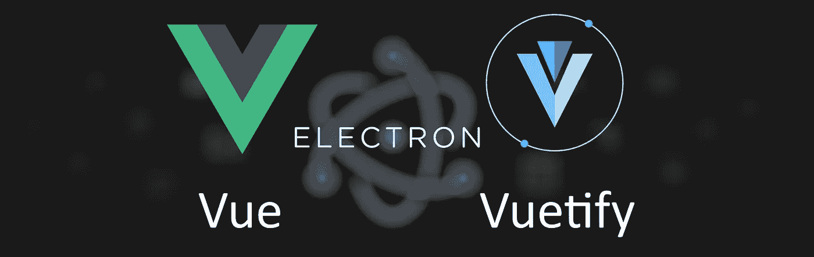

## 2021 年 8 月 2 日更新

*   使用电子 v13
*   更新了所有依赖项(次要)

## 2021 年 3 月 21 日更新

*   使用电子 v11
*   更新了所有依赖项(次要)
*   由于 typescript，vuetify 不再有错误
*   电子和开发工具不再出错

# 动机

目前，我正在创建许多原型，需要一个框架，让我可以快速完成这项工作，而不用花太多时间来修改配置、设置和项目依赖关系。我发现的例子从来没有提到如何为一个项目配置所有 3 个组件。这就是这篇文章的目的，我们最终可以用它来建立一个新的项目。6 个命令。
最后，我们有一个使用 Vue、Vuetify 和 Electron v9 为 TypeScript 配置的项目。

# 准备

要遵循这些说明，您需要在系统中预装[节点和 npm](https://nodejs.org/) 。此外，您应该已经有一些关于节点和 npm 的知识。

## Vue CLI

为了尽可能简单地使用 Vue，我们使用一个叫做 [Vue CLI](https://cli.vuejs.org) 的工具。如果您的系统上还没有安装它，您可以使用以下命令来完成此操作(需要管理员权限)。

```
npm install -g @vue/cli
```

要验证安装是否成功，您可以通过输入以下命令来检查 Vue CLI 的版本:

```
vue --version
```

# 准备项目

在 Vue CLI 的帮助下，您现在可以轻松地准备项目。为此，请输入以下命令:

```
vue create vue-electron-app
```

最后一个参数(" vue- *electron-app"* )是项目的名称。Vue CLI 将创建一个同名的文件夹。

在第一步中，您将被要求提供项目所需的功能，通过选择*手动选择功能。*

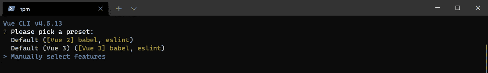

我建议至少选择 TypeScript，Router 和 Vuex 特性。

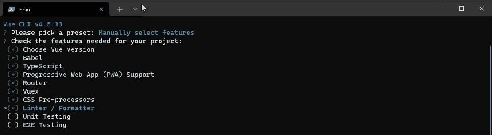

如果你想在后面的步骤中使用 Vue 化，我推荐结合使用 Vue 的第 2 版和 [Vue 组合 API](https://github.com/vuejs/composition-api) 。
Vuetify 目前与 Vue 3.0 不兼容

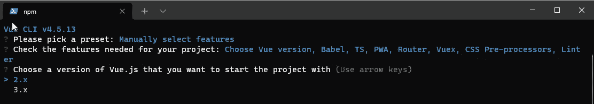

在下一步中，我可以推荐以下设置。

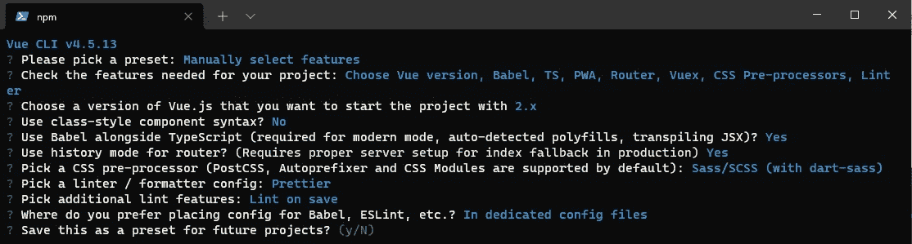

*   使用类样式的组件语法？**否**
*   在 TypeScript 旁边使用 Babel(现代模式、自动检测的 polyfills、transpiling JSX 所需的)？**是**
*   对路由器使用历史模式？(需要为生产中的索引回退进行正确的服务器设置)**是**
*   选择一个 CSS 预处理器(默认支持 PostCSS、Autoprefixer 和 CSS 模块): **Sass/SCSS(带 dart-sass)**
*   选择棉绒/格式器配置:**更漂亮**
*   拾取附加皮棉功能:**皮棉保存时**
*   你更喜欢把 Babel，ESLint 等的配置放在哪里？？**在专用配置文件中**

关于设置的详细信息，你应该阅读文章*[*Vue 项目与 Vue CLI3，ESLint，在 VS 代码*](https://medium.com/@kozyreva.hanna/vue-project-with-vue-cli3-eslint-prettier-in-vs-code-1e59d686eb93)**Anna Kozyreva*。**

**Vue CLI 完成后，按照屏幕上的说明，键入以下命令:**

**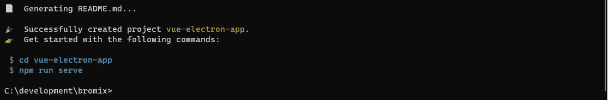**

```
**cd vue-electron-app
npm run serve**
```

**如果您打开默认浏览器并导航到[*http://localhost:8080*](http://localhost:8080)，您应该会看到 Vue 应用程序的欢迎页面。**

**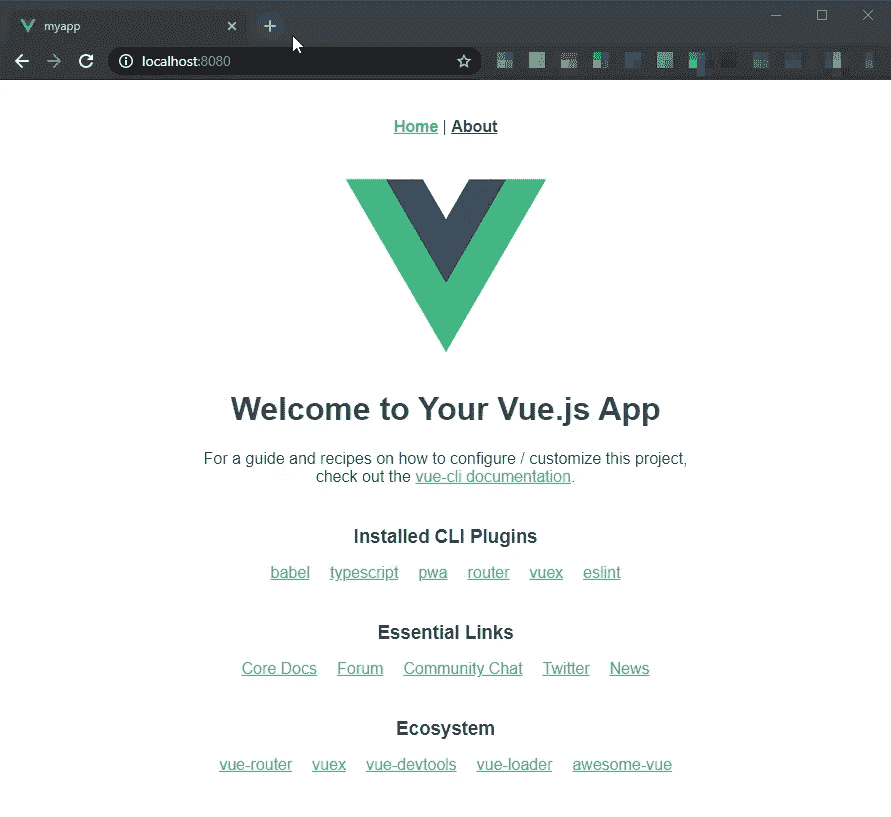**

**要停止服务器，您可以在终端中按下 *ctrl+c* 。**

**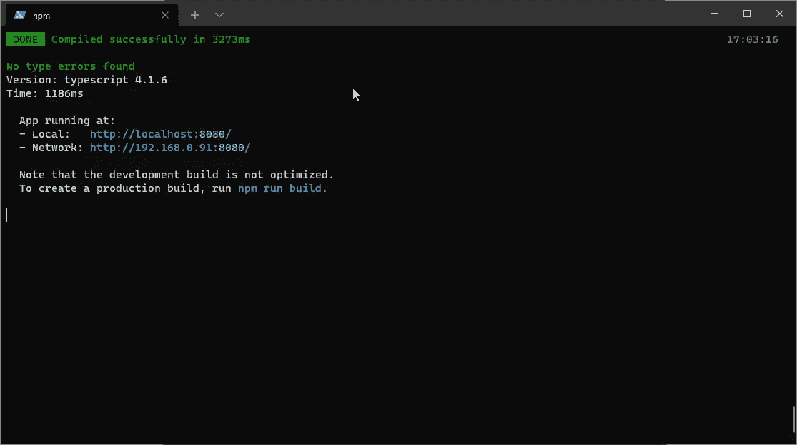**

## **为什么我不使用“vue ui”**

**现在，你们中的一些人可能知道 Vue CLI 附带了一个 UI (web 前端)来进一步配置项目。我在本文中不使用 *vue ui* 有三个原因:**

1.  **我更喜欢(如果可能的话)终端**
2.  **(在我看来)T21 太慢了**
3.  **不是所有的插件都被 *vue ui* 很好的支持(也许这在将来会改变)**

# **将 Vuetify 添加到项目中(可选)**

**如果要对材料设计组件使用 Vuetify，此步骤是可选的。为此，您输入以下命令并选择*“配置(高级)”:***

```
**vue add vuetify**
```

**在下一步中，我可以推荐以下设置。**

**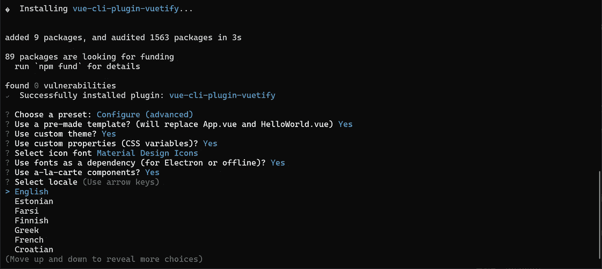**

*   **用预制的模板？(将替换 App.vue 和 HelloWorld.vue) **是****
*   **使用自定义主题？**是****
*   **使用自定义属性(CSS 变量)？**是****
*   **选择图标字体**材料设计图标****
*   **使用字体作为依赖(电子版或离线版)？**是****
*   **使用按菜单点菜的组件？**是****

**Vue CLI 完成安装后，您可以再次输入以下命令…**

```
**npm run serve**
```

**如果再次打开默认浏览器，导航到[*http://localhost:8080*](http://localhost:8080)，应该会看到 Vuetify 的欢迎页面。**

**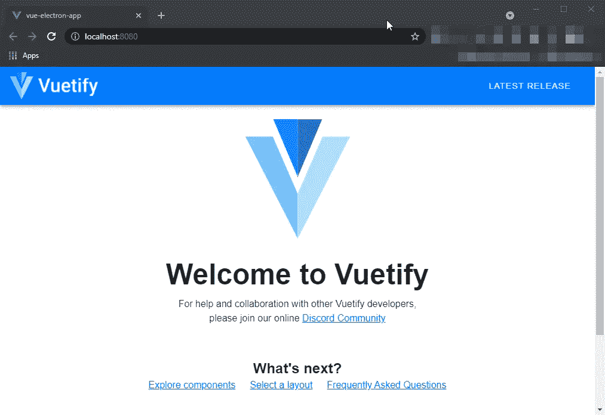**

# **可选:您可以在此处停止；)**

**此时，您已经为 PWA 或带有 Vue 的网站配置好了项目，并使用 TypeScript 将 Vue 化为 UI 框架。
但是如果你想用电子制作一个桌面应用程序，请继续读下去。**

# **向项目中添加电子**

**在最后一步，你仍然需要电子。Electron 只是一个扩展，它将你的 Vue 应用打包成一个独立的应用。为此，我们使用电子生成器，并按如下方式安装:**

```
**vue add electron-builder**
```

**安装*电子生成器*时，会要求您选择一个电子版本，只需选择最新版本即可。**

**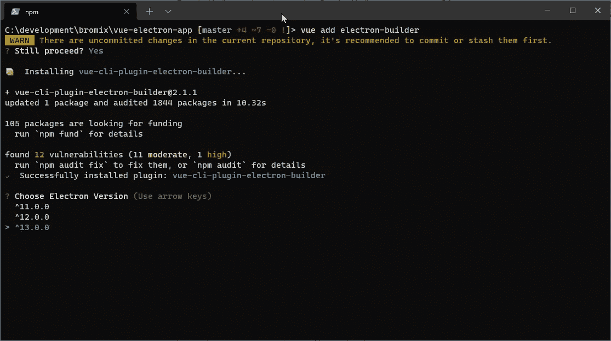**

**之后，我们有一个额外的命令:**

```
**npm run electron:serve**
```

**这将打开您的电子应用程序。**

**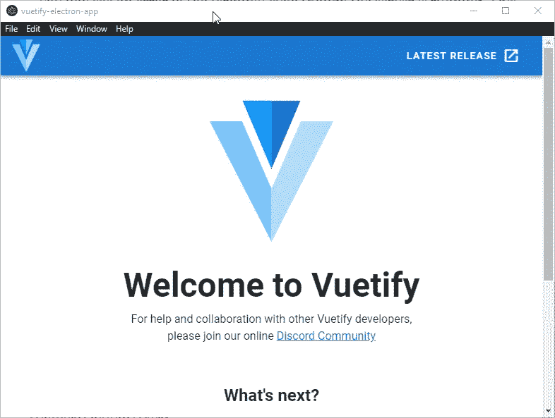**

# **所有命令是干什么用的？**

**我们的项目中现在至少有 4 个命令。这些命令在我们的*脚本*部分下的 *package.json* 中定义。但是最重要的是*构建*和*服务*命令。**

**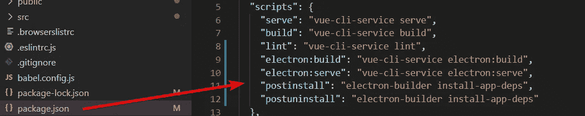**

*   ****npm run serve**
    在本地服务器上运行您的 Vue 应用程序，您可以在本地浏览器中查看它**
*   ****npm run build**
    这将捆绑您的 Vue 应用程序，以便部署在托管服务器上(但这将是一篇独立的文章)**
*   ****npm 运行电子:服务**
    与 *npm 运行服务*相同，但作为电子应用在本地运行**
*   **npm run electron:build
    与 *npm run build* 相同，但是 electron 的构建器也会将所有东西与目标系统(Windows、MacOS 或 Linux)的可执行文件捆绑在一起。在某些情况下，默认设置还会创建简单设置(Windows)、应用程序(MacOS)和软件包(例如*。deb for Linux)。**

# **摘要**

**就是这样！基本上，我们只需要执行 4 个命令(加上对 TypeScript 的修复)，就可以开发我们的电子应用程序了。**

```
**npm install -g @vue/cli
vue create vue-electron-app
vue add vuetify
vue add electron-builder(optional)
npm install -D @types/node@">=12.0.0 <13.0.0"**
```

**完整的例子可以在 GitHub 上找到:
[https://github.com/bromix/vue-electron-app](https://github.com/bromix/vue-electron-app)**

## **排除故障**

**如果您想知道如何在 Visual Studio 代码中直接调试您的项目，请阅读下面的文章: [**设置 Visual Studio 代码以使用 Vue CLI 服务调试电子应用程序**](https://bromix.medium.com/setup-visual-studio-code-for-debugging-an-electron-application-with-the-vue-cli-service-c224600fc219)**