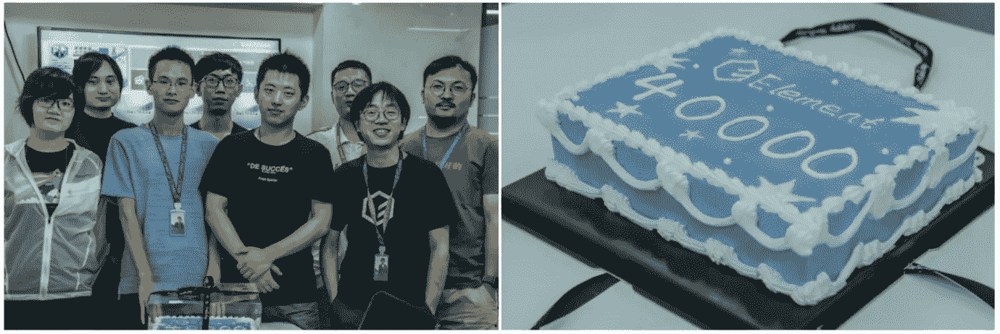
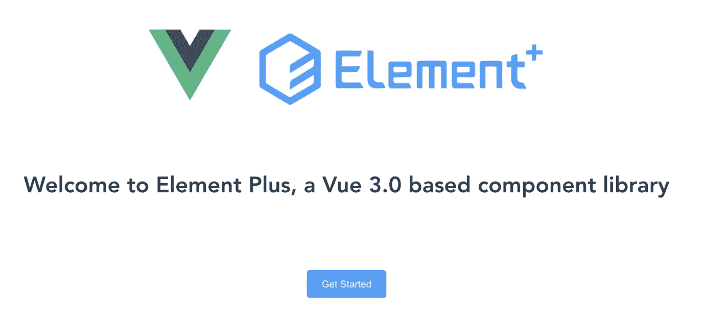

# 🎉Vue 3.0 的元素 UI 来了！

> 原文：<https://itnext.io/element-ui-for-vue-3-0-is-coming-53dfa6d4fe32?source=collection_archive---------3----------------------->

> *首个用 TypeScript+Vue 3.0 Composition API 编写的 UI 组件库 Element Plus 今天发布！*

[Element UI](https://github.com/ElemeFE/element) 诞生于 2016 年 3 月 13 日，4 年内从 Ele.me 的内部组件库[成长为 Vue 生态中最受欢迎的开源 UI 组件库之一。](https://medium.com/@leopoldthecuber/element-a-vue-js-2-0-ui-toolkit-for-web-f6ed9d953758)

到目前为止，Element 已经获得了每月**48800**Github Stars 和**100 万** NPM 下载量。来自社区的 530 多名贡献者做出了 4400 项承诺，与我们的团队一起参与维护。

*元素战队 40000 Github 明星庆典

# Vue 3.0 的 Element Plus

Vue 已经在 2020 年 9 月发布了它的 3.0 版本。为了支持最新的 Vue 3.0 语法，这是 Element UI 进行大量内部更改和改进的新主要版本的绝佳机会。

经过 23 个 alpha 版本的艰苦开发，我们很高兴地宣布，用于 Vue 3.0 Beta 的 Element Plus 今天**可用**！

[Element Plus](https://github.com/element-plus/element-plus) for Vue 3.0 是一个全新的项目，使用 TypeScript + Composition API。我们用 Vue 3.0 的方式重写了几乎每一行代码，主要包括:

*   使用 TypeScript 获得更好的开发体验，并提供完整的类型定义
*   使用 Vue 3.0 组合 API 来简化和重用逻辑
*   使用传送，Vue 3.0 中引入的一个新特性来重构组件
*   使用 [Day.js](https://github.com/iamkun/dayjs) ，一个更轻便更好的日期时间库
*   使用 Lerna 管理子项目
*   核心依赖项升级，如 Popper.js、异步验证器
*   改进了对 52 种语言的 i18n 支持

更多内容:

*   酷的设计语言
*   优化的组件 API
*   更多定制选项
*   更详细和友好的文档

# 开始

今天有很多方法可以尝试 Vue 3.0 的 Element Plus。

*   手动安装`npm install element-plus`，详情请查看我们的网站[安装指南](https://element-plus.org/#/en-US/component/installation)
*   我们已经提供了一个 [Webpack 脚手架](https://github.com/element-plus/element-plus-starter)，您可以直接使用
*   此外，一个清新凉爽的[维特支架](https://github.com/element-plus/element-plus-vite-starter)也已上市
*   通过 [Vue CLI 插件](https://github.com/element-plus/vue-cli-plugin-element-plus)

你喜欢[元素加](https://github.com/element-plus/element-plus)吗？随时给我们一个[星](https://github.com/element-plus/element-plus/stargazers) ❤️来支持我们。

在过去的 4 年里，非常感谢您的支持和帮助，使 Element UI 变得越来越好。Element UI 离不开社区，欢迎您加入 Github，让 Element UI 变得更好。