# ELK 堆栈、filebeat 和性能分析器

> 原文：<https://itnext.io/elk-stack-filebeat-and-performance-analyzer-2d6f0119e70d?source=collection_archive---------6----------------------->

虽然我们的产品中没有日志管理解决方案(但请保持关注),但我们帮助客户将他们现有的监控平台集成到 Performance Analyzer 中。我们遇到的最完整和最受欢迎的解决方案之一是 Elasticsearch、Logstash 和 Kibana，也称为 als ELK stack。此外，我们注意到 File beat 在收集应用程序日志和 docker 容器日志方面变得越来越流行。

当我们正在设置我们最新的测试实验室，以将 ELK stack 集成到 Performance Analyzer 中时，我们决定将我们所做的步骤写在博客上。你可能会得到一些好的见解或者学到一些新的技巧。

如果你还不知道[麋鹿栈](https://www.elastic.co/elk-stack)，让我们先来一个快速介绍。

麋鹿栈由[弹性搜索](https://www.elastic.co/products/elasticsearch)、[日志存储](https://www.elastic.co/products/logstash)和[基巴纳](https://www.elastic.co/products/kibana)组成。开源公司 [Elastic](https://www.elastic.co/) 将这三个组件作为独立的项目来构建，这三个组件非常适合一起工作。同时，它是一个完整的日志管理和分析软件套件。

中央日志管理和索引是运行数据中心、集群、分布式服务器等所需的功能。

Elasticsearch 是后端，其功能是数据存储，Logstash 是数据处理引擎(服务器端数据处理管道)，它从各种来源获取数据，将其转换为所需的格式，并将其转发到数据存储(像 Elasticsearch 一样)，Kibana 是仪表板前端引擎，允许使用浏览器查看和分析日志数据(以及更多)。

如果您想从头开始安装完整的 ELK 堆栈，有很多指南可供参考。如果你不想花太多的时间去快速启动，可以考虑 docker hub。

# 麋鹿码头集装箱

虽然有大量 ELK 容器，但我们认为有一个项目维护得非常好，非常受欢迎:

[https://hub.docker.com/r/sebp/elk/](https://hub.docker.com/r/sebp/elk/)(500 多万次下载，800 多颗星)

还有一个关于如何使用容器的很棒的文档: [elk-docker](https://elk-docker.readthedocs.io/)

因为我们想要运行多个容器，docker-compose 总是最好的选择。

**docker-compose.yml**

```
version: ‘3.7’services:elk:image: sebp/elkports:– “5601:5601”– “9200:9200”– “5044:5044”restart: “unless-stopped”container_name: opvizor-elk
```

docker-撰写向上-d

docker-撰写 ps

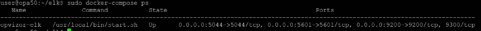

所有这些完成后，ELK stack 以最小化的配置作为守护进程运行。

# Filebeat

接下来我们要做的是从运行 ELK 堆栈的系统中收集日志数据。Filebeat 是这样做的一个很好的快速选择。

让我们运行没有配置的 filebeat 容器来定制现有的 ELK 堆栈(创建索引、添加仪表板等等)。确保更改 Kibana 和 Elasticsearch 主机参数以匹配您的安装。如果容器运行在与 ELK 堆栈相同的主机上(docker-compose up)，您还可以在 docker-compose.yml 文件中使用 container_name(如果您也使用了正确的网络)。

要找到网络名称，只需运行 *docker network ls*

通常，网络的命名类似于服务，并添加了 _default。

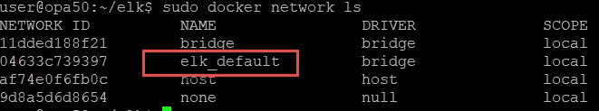

有这么多的方法来连接 docker 容器，请随意使用您更喜欢的替代品。

```
*docker run –network=elk_default \ docker.elastic.co/beats/filebeat:6.6.0 \
setup -E setup.kibana.host=opvizor-elk:5601 \
-E output.elasticsearch.hosts=[“opvizor-elk:9200”]*
```

如果一切顺利，您应该会看到以下输出:

*加载指标模板*

*加载仪表板(Kibana 必须正在运行且可访问)*

*加载的仪表板*

*加载的机器学习作业配置*

# 运行 Filebeat

首先要做的是为 filebeat 创建一个配置文件——您也可以下载一个模板:

```
curl -L -O [https://raw.githubusercontent.com/elastic/beats/6.6/deploy/docker/filebeat.docker.yml](https://raw.githubusercontent.com/elastic/beats/6.6/deploy/docker/filebeat.docker.yml)
```

此配置具有开箱即用的 docker 支持，并且只需要弹性搜索目标:

*filebeat.config:*

```
*modules:**path: ${path.config}/modules.d/*.yml**reload.enabled: false**filebeat.autodiscover:**providers:**– type: docker**hints.enabled: true**processors:**– add_cloud_metadata: ~**output.elasticsearch:**hosts: ‘${ELASTICSEARCH_HOSTS:opvizor-elk:9200}’*
```

在我们的例子中，将 filebeat 添加到 docker-compose.yml 是有意义的:

```
filebeat:image: docker.elastic.co/beats/filebeat:${ELASTIC_VERSION:-6.5.0}hostname: “opvizor-elk-filebeat”container_name: filebeatrestart: unless-stoppeduser: rootvolumes:– ./filebeat.docker.yml:/usr/share/filebeat/filebeat.yml– filebeat:/usr/share/filebeat/data– /var/run/docker.sock:/var/run/docker.sock– /var/lib/docker/containers/:/var/lib/docker/containers/:ro– /var/log/:/var/log/:roenvironment:– ELASTICSEARCH_HOST=opvizor-elk:9200# disable strict permission checkscommand: [“–strict.perms=false”]volumes:filebeat:
```

*docker-compose down&docker-compose up-d*

Elasticsearch 准备接收数据，Filebeat 正在向 Logstash 发送数据，Logstash 正在处理数据并存储在 Elasticsearch 中。

少了什么？当然还有 Kibana，用于分析和搜索日志数据的 UI。

Kibana 在端口 5601 上运行，默认情况下没有身份验证。

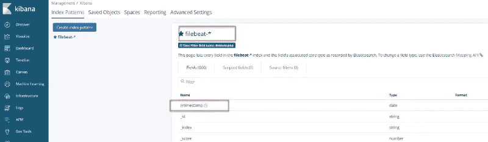

因为我们现在只有 filebeat 数据传入，所以创建一个索引 filebeat——并使用@timestamp

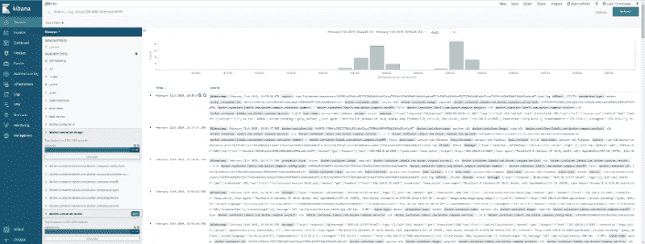

接下来要添加的是通过系统日志的 VMware ESXi 日志。当然，您可以设置 logstash 来接收 syslog 消息，但是既然我们已经有了 Filebeat，为什么不使用它的 syslog 输入插件呢？

VMware ESXi 系统日志仅支持系统日志的端口 514 udp/tcp 或端口 1514 tcp。

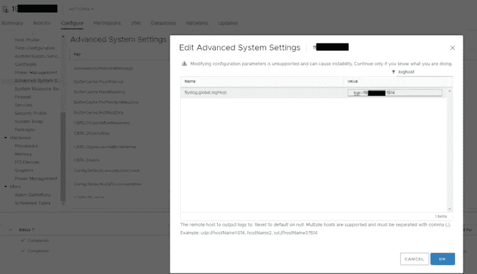

更改防火墙以允许传出系统日志— 1514 TCP

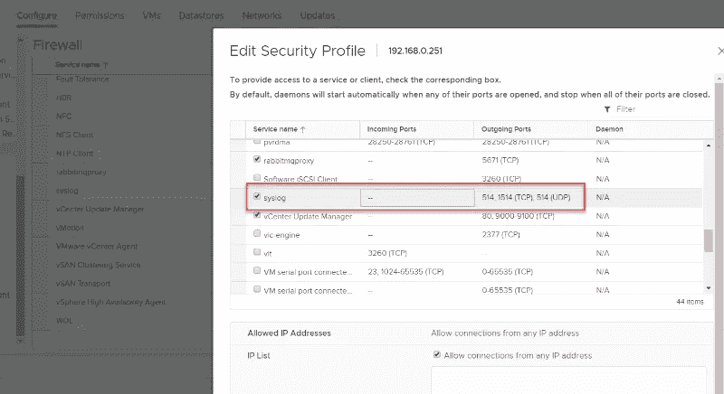

重新启动系统日志服务

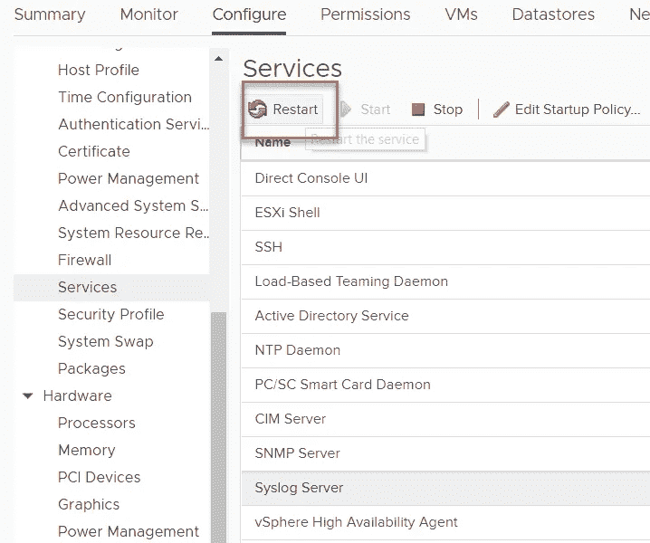

更多信息可在此处找到:

[https://docs . VMware . com/en/VMware-VSP here/6.7/com . VMware . esxi . upgrade . doc/GUID-9f 67 db 52-F469-451 f-B6 c8-dae8d 95976 e 7 . html](https://docs.vmware.com/en/VMware-vSphere/6.7/com.vmware.esxi.upgrade.doc/GUID-9F67DB52-F469-451F-B6C8-DAE8D95976E7.html)

将 **docker-compose.yml** 文件更改为打开端口 1514

```
filebeat:image: docker.elastic.co/beats/filebeat:${ELASTIC_VERSION:-6.5.0}hostname: “opvizor-elk-filebeat”container_name: filebeatrestart: unless-stoppeduser: root**ports:****– “1514:1514”**volumes:– ./filebeat.docker.yml:/usr/share/filebeat/filebeat.yml– filebeat:/usr/share/filebeat/data– /var/run/docker.sock:/var/run/docker.sock– /var/lib/docker/containers/:/var/lib/docker/containers/:ro– /var/log/:/var/log/:roenvironment:– ELASTICSEARCH_HOST=opvizor-elk:9200# disable strict permission checkscommand: [“–strict.perms=false”]
```

**更改 Filebeat.yml**

```
**filebeat.inputs:****– type: syslog****protocol.udp:****host: “:1514”****filebeat.inputs:****– type: syslog****protocol.tcp:****host: “:1514”**
```

让我们看看是否有数据传入:

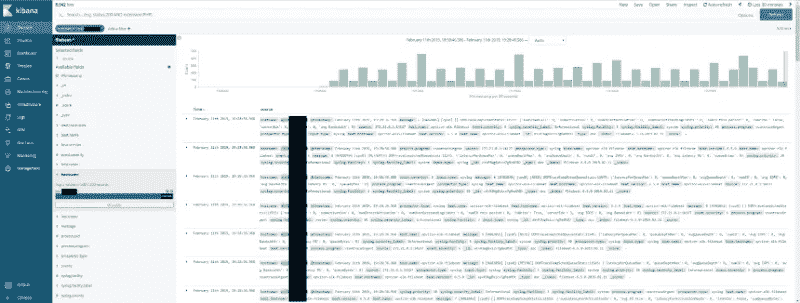

看起来不错，现在我们可以开始定制仪表板和输入流处理了。

所有数据都很好地流入到我们的设置中，因此我们可以开始向 Performance Analyzer 仪表板添加最重要的信息。

要将 Elasticsearch 集成到 Performance Analyzer 中，我们需要添加一个数据源。

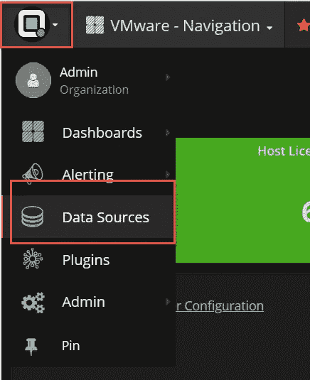

添加 Elasticsearch 数据源时，确保设置正确的索引并使用有效的 url

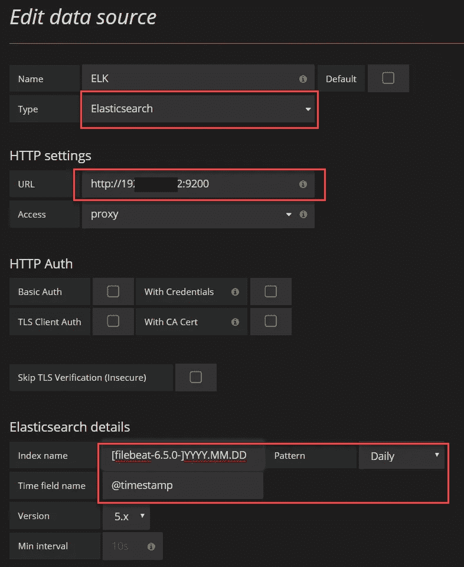

# 为 Elasticsearch 创建新的仪表板

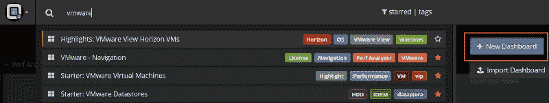

您可以使用齿轮图标(1)更改名称，并添加一个新表格来查看弹性搜索条目(2)。

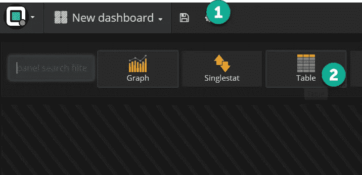

选择正确的数据源并创建您的 Elasticsearch 查询。

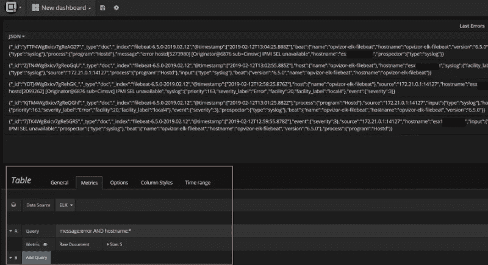

如果一切顺利，您可以将日志错误小部件或计数与 ESXi 或虚拟机信息混合使用。

# 清理工作管理员

您可能希望不时清理 Elasticsearch 内容，以避免存储不需要的数据。有一个很好的工具叫做策展人，它可以在 docker 容器中很好地运行。

以下示例清理 Elasticsearch 数据库并删除超过 30 天的数据:

```
*docker run –rm –network=elk_default -e ES_HOST=opvizor-elk -e DAYS_TO_KEEP=30 omerha/docker-elasticsearch-curator:latest*
```

当然，您可以设置一个每日 cron 作业，以确保定期进行清理。

*最初发表于*[*【www.opvizor.com】*](https://www.opvizor.com/integrate-elk-stack-and-filebeat-into-performance-analyzer)*。*