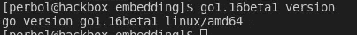

# 在 Golang 二进制文件中嵌入 Web 应用程序

> 原文：<https://itnext.io/embedding-a-web-application-in-a-golang-binary-f9733b25bbf7?source=collection_archive---------2----------------------->


照片由[赫利贝托·阿里亚斯](https://unsplash.com/@helibertoarias?utm_source=unsplash&utm_medium=referral&utm_content=creditCopyText)在 [Unsplash](https://unsplash.com/s/photos/software?utm_source=unsplash&utm_medium=referral&utm_content=creditCopyText) 上拍摄

前一段时间，我写了一篇关于如何在没有 Envoy 的情况下通过 web 应用程序运行 gRPC 的文章。我将在本文中使用[项目](https://github.com/percybolmer/grpcexample)，并将 web 应用程序嵌入到二进制文件中。如果你不熟悉这个项目，我建议你阅读第一部分。

[](https://programmingpercy.tech/blog/using-grpc-tls-go-react-no-reverse-proxy/) [## 将 gRPC 与 TLS、Golang、React 一起使用，无需反向代理(Envoy)

### 一篇关于如何在 Go 后端服务器和 React 客户端之间实现 gRPC 而不使用反向代理的文章…

编程 percy.tech](https://programmingpercy.tech/blog/using-grpc-tls-go-react-no-reverse-proxy/) 

但是如果你只是想学习如何在 Go 中使用 embed 包，你应该可以在没有任何先验知识的情况下阅读这篇文章。

为什么我们要在二进制文件中包含像 web 应用程序这样的东西？

对我来说，一切都在于部署。能够只向服务器发送一个二进制文件可以节省大量时间。

在 Golang 1.16 之前(这是 embed 包发布的时候)，我们需要部署二进制文件、web 应用程序或任何其他我们需要的非编译代码的文件。

为了解决这个问题，我倾向于使用 [Docker](https://www.docker.com/) ，我知道很多人也推荐 [Packer。不要让我在 docker 上开始，我喜欢它，我是一个超级粉丝。](https://www.packer.io/)

但是，说实话，有时候二进制比 docker 更有意义。

# 让我们开始设置项目

在我们开始编码之前，让我们抓住我们将要修改的项目。

```
mkdir embedding && cd embedding
git init
git pull https://github.com/percybolmer/grpcexample
```

这是一个超级简单的 gRPC API，它有一个 Ping 函数和一个 React 应用程序，该应用程序托管在 [localhost:8080](https://localhost:8080/ui/pingpongapp/build/) 上，每隔 3 秒调用一次 Ping 函数。这对于本教程并不重要，您可以使用任何其他 web 应用程序。如果你有兴趣阅读更多关于这个项目的内容，请看这个系列的第一部分。

如果您正在使用该项目，您需要生成证书，如果您还没有。进入 cert 文件夹并运行 *certgen.sh* 脚本。这需要您安装 openssl。

```
cd cert 
bash certgen.sh
```

我们还需要编译我们嵌入的 react 应用程序。该应用程序位于 *ui* 文件夹中。
在运行构建命令之前，确保在 *package.json* 文件中添加两行。我们需要告诉 React 应用程序，这些文件将在没有服务器的情况下被提供。

将下面两行添加到*ui/pingpongapp/package . JSON*

```
“homepage”: “.”,
”proxy”: “https://localhost:8080",
```

运行以下命令。

```
npm install
npm run build
```

*npm install* 将下载任何需要的依赖项，而 *npm run build* 将在名为 build 的新文件夹中构建一个静态应用程序。这是我们稍后将嵌入的文件夹。

你还需要运行至少 Golang ***1.16。*** 运行以下命令测试您的安装

```
go version
```



您应该会看到一个提到当前版本的输出

# 让嵌入

完成所有设置后，打开 main.go。

你可以在这里 *阅读关于 embed 包 [*。我们需要的是嵌入我们的构建文件夹，并将其作为文件系统嵌入到我们的二进制文件中。我推荐阅读链接的软件包文档，它非常简短，并且解释得非常清楚。*](https://tip.golang.org/pkg/embed/)*

嵌入包不同于我以前见过的其他包。我们实际上将使用注释来告诉编译器要执行什么操作。
语法短小精悍。

```
//go:embed $PATH
var content $WANTED_DATA_TYPE
```

有 2 行代码，一个注释和一个变量声明。他们必须直接跟在对方后面，从评论开始。

看到$PATH 和$WANTED_DATA_TYPE 了吗？那些需要被替换。
$PATH 应该替换为您想要包含的文件或目录的路径。另一个注意事项是，如果使用数据类型 embed。FS，它在一个注释中接受多个路径，同时也接受多个注释。

$WANTED_DATA_TYPE 将替换为任何可用的数据类型:

*   ***String*** =接受单个文件，并在构建时将该文件的内容作为字符串读入变量
*   ***[]字节*** =与字符串相同，但为[]字节
*   ***嵌入。FS*** (文件系统的缩写)=这就是嵌入式让我兴奋的地方。我们被允许嵌入多个目录和文件。而最好的部分，它们是 [io/FS](https://tip.golang.org/pkg/io/fs/) 接口的一部分。这意味着 net/http 包可以开箱即用。

有了这些新的知识，让我们更新 *main.go* 以在 *ui/pingpongapp/* build 中嵌入构建文件夹。

在旧的 *main.go* 中，路径是硬编码的，需要转换成嵌入式文件系统。

让我们构建二进制文件并运行它

```
go1.16beta1 build -o api . && ./api
```

访问 [localhost:8080](https://localhost:8080/ui/pingpongapp/build/) ，3 秒后观察状态由假变真！

就是这样！我不得不把它交给 Golang 的团队，他们把它做得超级简单。我们只用了 2 行新代码就在二进制文件中添加了一个嵌入式 web 应用程序。

如果你感兴趣，请随意阅读[关于实现 gRPC 拦截器的第 2 部分。](/grpc-interceptors-e221aa4cc49)