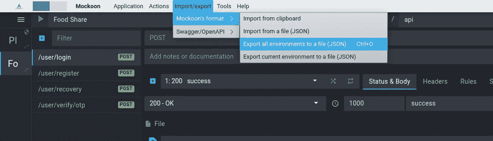
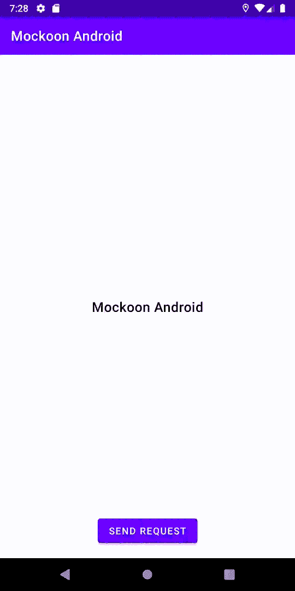
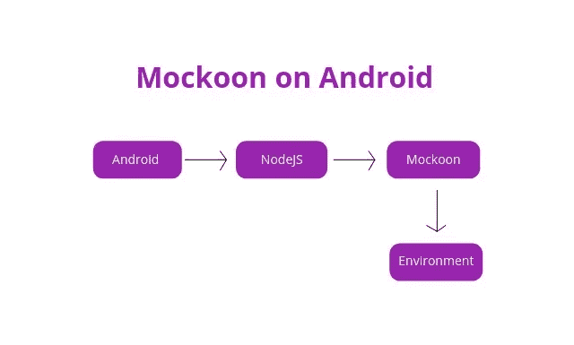
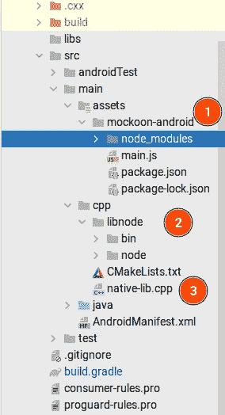

# 在 Android 上嵌入 mockoon

> 原文：<https://itnext.io/embedding-mockoon-on-android-5c240f2a3143?source=collection_archive---------3----------------------->

我是 Mockoon 的忠实粉丝，我已经写了一篇关于它的博文[在这里](https://susuthapa19961227.medium.com/easy-front-end-development-with-mockoon-1ff656a7dba6)。在 Android 上嵌入 mockoon 并不是一个要求，而是我想做的事情，在这篇博客中我将解释我是如何做到的。

这是为那些着急的人准备的项目链接。

[](https://github.com/susonthapa/mockoon-android) [## GitHub-suson Thapa/mocoon-Android:Android 中的嵌入式 mocoon 实现

### 嵌入式 mockoon 在 Android 中的实现。创建一个帐户，为 suson tapa/mocoon-Android 开发做贡献…

github.com](https://github.com/susonthapa/mockoon-android) 

## 这是什么？

这是一个用于 Android 的 Mockoon 端口。只需从 mockoon 导出您的所有环境。



然后像这样在安卓里运行。



## 用例

假设您开发了一个 android 应用程序，并希望向客户端展示一个演示。我们都知道那是怎么回事。

在演示时间之前，一切都正常。

## 我们能做些什么呢？

嗯，只需用应用程序打包一个完整的模拟服务器。这样可以降低向客户端暴露后端错误的风险。但是怎么做呢？这是大图。



Mockoon 是一个 nodejs 应用程序，所以我们需要解决的第一件事是如何在 android 上运行 nodejs。之后，我们只需要运行 mockoon，一切都应该工作，对不对？

事情没那么简单。mocoon 有三个项目[mocoon-GUI](https://github.com/mockoon/mockoon)、[mocoon-CLI](https://github.com/mockoon/cli)和[mocoon-common](https://github.com/mockoon/commons-server)。起初我不知道 mocoon-common，所以我选择了 mocoon-CLI，因为这是唯一可行的选择。我做了设置，并试图运行，但 mocoon-CLI 是一个成熟的应用程序，所以它试图创建进程和访问受保护的目录，如`/etc`。在与 mockoon developer 一起使用后，我知道了 mockoon-common，它是一个最简单的服务器，GUI 和 CLI 都使用它。但是首先我们需要想出一个在 android 上运行 nodejs 的方法。

## 如何在 Android 上运行 nodejs？

有一个很棒的库 [nodejs-mobile](https://github.com/JaneaSystems/nodejs-mobile) ，我们可以用它在 Android 上运行 nodejs 代码。你可以参考这篇[博客](https://code.janeasystems.com/nodejs-mobile/getting-started-android)关于如何集成 nodejs-mobile 的帖子。下面是项目结构。



1.  在`assets`文件夹中创建一个目录`mockoon-android`，并使用`npm`安装 mocoon-commons。

```
npm install @mockoon/commons-server
```

2.设置`cpp`文件夹，如这个[博客](https://code.janeasystems.com/nodejs-mobile/getting-started-android)帖子所示。其实博文挺老的，参考源码，可以直接复制粘贴文件夹就行了。

3.一个基本的`C++`文件，通过日志重定向向 start nodejs 公开函数。

因为我们将 mockoon 打包在 apk 中，所以我们需要首先将项目提取到设备存储中，然后从那里运行它。

这个类加载 nodejs 运行时的共享库，将 mockoon 项目和模拟文件复制到缓存目录(如果还没有复制的话)。它还验证只有一个 nodejs 运行时实例是活动的，然后启动 mockoon 服务器。

这个类处理从目录和资产中复制文件。我们还需要编写一个简单的 javascript 文件(`main.js`)来启动 mockoon 服务器。

我们只是遍历所有环境并启动它们。我没有处理过许多边缘情况，如重复端口等，因为我希望这是简单的。

## Apk 大小

因为我们正在打包 mockoon 和 nodejs 运行时，这给你的 APK 增加了大约 60MB。因此，我们需要确保这不会影响生产。为了解决这个问题，我们需要创建一个专门用于模仿的构建变体。

## 我必须做这些吗？

你不必经历这一切，我已经把它作为一个库发布了，你可以使用它。为此，首先创建一个新的变体。

然后添加特定于该变体的依赖项，因为我们不想在生产或任何其他变体中泄露这一点。

现在初始化 mockoon 并提供环境文件的位置。您可以将环境文件与您的 apk 打包在一起，或者只从文件系统加载文件。

你可能已经注意到我们使用反射，因为我们只在`mock`版本中使用这个库，如果我们试图直接访问这个类，gradle 会抱怨，因为它在所有版本中都不可用。

这篇文章到此为止，我希望这对任何想在应用程序中嵌入模拟服务器的人都有帮助。