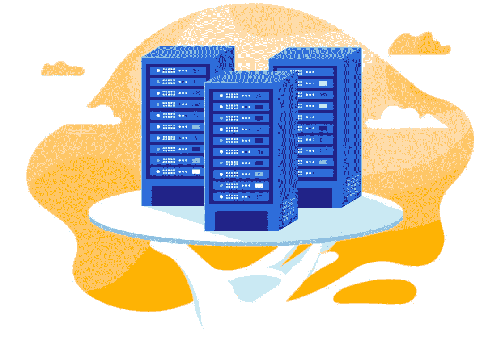
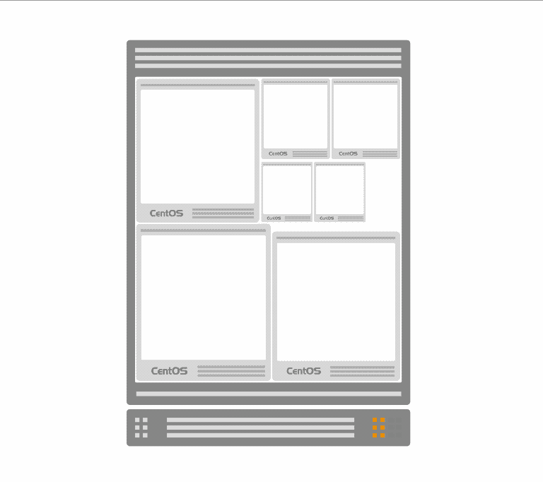
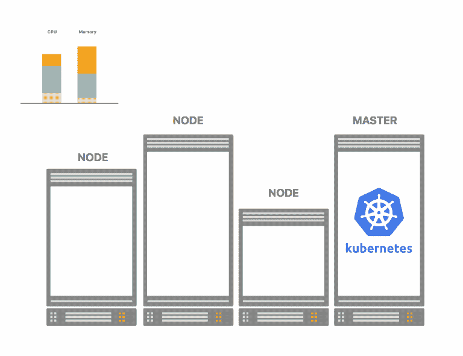
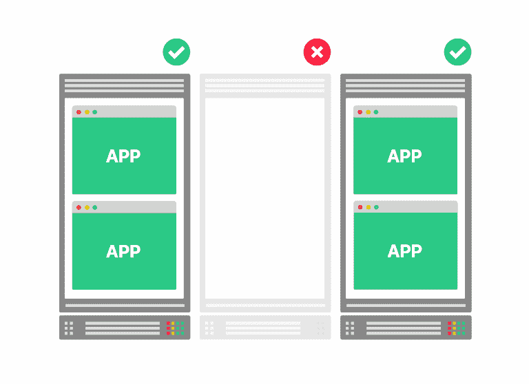

# 拥抱失败和削减基础设施成本:Kubernetes 的现场实例

> 原文：<https://itnext.io/embracing-failures-and-cutting-infrastructure-costs-spot-instances-in-kubernetes-6976781beacc?source=collection_archive---------0----------------------->

在过去的几十年里，全球已经从内部数据中心转向由主流云提供商提供虚拟机(VM)，如*亚马逊网络服务*、 *Azure* 、*谷歌云平台*。

> 运行和管理您自己的物理机既困难又昂贵；你可能永远不会像任何顶级云提供商那样成功和高效。

当您可以利用成熟的平台和功能时，还有什么不喜欢的呢，例如:

*   **垂直可伸缩性** —您可以获得不同大小的实例
*   **水平可伸缩性** —您可以获得(几乎)想要的任意多的实例
*   **灵活定价** —您只需为您使用的产品付费
*   **物流成本** —您不必实际维护任何服务器(热控制、电力、备份、存储成本、防火等)
*   **可用性** —在独立的数据中心调配虚拟机
*   **可靠性** —如果你为一个实例付费，你会一直保留它，直到你完成为止。如果它坏了，你会立即(+-5 分钟)得到一个替代品

在本文中，我们将探讨典型云提供商的不同定价模式。我们将专注于一种策略，看看如果你愿意牺牲可靠性，它如何能够**让你的账单减少 80%** 。最后，我们将看到 Kubernetes 如何使可靠性的缺乏变得无关紧要，并允许您运行一个廉价但高度可用的集群。

# 现收现付:灵活性是有代价的

云提供商的典型定价模式基于现收现付方案。计算资源有不同的大小(即内存、CPU、磁盘等..)和一个小时的费用。**你会收到实例运行时间的账单**。

这种定价的灵活性非常好，也很公平，但是你必须小心你消费的东西。如果您让实例运行，而您不再需要它们，您将把钱扔出窗外。

> 但是，假设您可以预见一个虚拟机一整年的利用率。你的账单不应该有批量折扣吗？

# 通过预订实例获得批量折扣

对于保留的实例，你需要**承诺**至少一整年的计算资源，如果你真的喜欢承诺，最多五年。你可以决定提前支付一部分费用。

你得到的折扣将取决于你愿意承诺多长时间以及你可以预付多少钱。例如，在 Amazon Web Services 上， *m4.large* 实例类型的折扣如下:

大宗购买折扣

如您所见，预订实例提供的折扣**通常在 30%到 40%之间**。

> 在保留的情况下，你基本上是用灵活性换取现金。

虽然 30%到 40%听起来是合理的节省，但并不总是值得的。您能否预测未来 1 到 5 年的计算资源利用率？如果你正在云中建立一个前沿的创业公司，你能准确预测几年后你的流量会是什么样的吗？

> 如果这听起来像是一场赌博，那它就是。或许承诺和预付并不是你节省云账单的唯一方式。

# 现场实例:当便宜比可靠更好的时候

AWS 称它们为 [Spot Instances](https://aws.amazon.com/ec2/spot/) ，Azure [低优先级 VM](https://docs.microsoft.com/en-us/azure/virtual-machine-scale-sets/virtual-machine-scale-sets-use-low-priority) 和 Google [可抢占 VM](https://cloud.google.com/compute/docs/instances/preemptible) 。我们将称它们为“点实例”，因为这似乎是最常见的术语。尽管它们的内部工作方式略有不同，但它们源于相同的基本原理。

一个典型的云提供商购买大量组织在大型数据中心的强大服务器。为了最大限度地利用硬件，他们将这些计算机分成更小的虚拟机。

云提供商通常将裸机服务器拆分成较小的虚拟机

**因为他们向每个人承诺横向可扩展性，所以他们需要保留大量未利用的硬件，以防有人突然需要额外的计算单元。然而，这留下了大量未使用的资源。**

spot 实例背后的想法是允许用户以低得多的成本利用这些额外的资源，但前提是您可能随时会丢失实例。如果您正在运行一个 spot 实例，而云提供商突然需要该资源来满足按需客户或预订客户的需求，您将会立即丢失您的实例。

鉴于**灵活性**被用作保留实例的筹码，这里给出的是**可靠性**。不过，节省的好处要大得多。一般来说，你的账单会减少 70%到 80%。

随之而来的是一个大问题:

> **您是否应该因为账单有 70%到 80%的折扣而赌上基础设施的稳定性？如果您随时都有可能失去一个节点，这对您的客户会有什么影响？**

# 拥抱失败

对大规模系统的观察已经证明，您的应用程序**最终会关闭**。硬盘、网络、JVM 等。如果你给他们足够的时间和要求，他们所有的 T21 都会失败。

> 你对抗失败的主要武器是**复制**和**冗余**。

如果您运行每个组件的几个副本，它可能对一定数量的故障具有弹性。您可以从故障中恢复的程度将取决于您愿意放置多少冗余。

不要忘记冗余意味着更多的计算资源。更多的计算资源导致更高的账单。

要考虑的另一点是 spot 实例的动态方面。基于闲置的资源，你可用的实例的大小将**取决于什么是当前不受欢迎的**。换句话说，*乞丐不能挑肥拣瘦*。

也许本周你可以买到便宜的 2GB 内存实例，如果这是你的应用程序需要的内存量，那就太好了。如果这些实例变得不可用，并且您只能购买 4GB 内存的实例，那么下周您应该做什么？当然，您可以使用这些实例，但是您将付出两倍的代价，并且额外的内存将被浪费。

Spot 实例是一个很好的交易，但是缺点可能是不可接受的。如何应对随机节点在毫无察觉的情况下消失？您的基础设施应该如何处理不断变化大小的节点？

> 您需要的是一个持续监控节点并自动管理冗余的工具。

这个工具应该在您的基础设施上扩展和分布应用程序的组件；当丢失或创建一个节点时，基础架构会重新平衡。

如果没有这样的工具，似乎就无法管理随之而来的云基础设施。很可能已经有人建造了它。你很幸运，谷歌在几年前就面临这些问题，并且已经开源了他们的解决方案。

# 将数据中心抽象为一台计算机

在传统的基础设施中，比如说 21 世纪初，你有固定数量的服务器和可预测数量的资源。

云基础设施——尤其是 spot 实例——已经完全改变了游戏规则。开发 Kubernetes 是为了监督管理不断变化的计算资源的日益增加的复杂性。

Kubernetes 为您的所有计算资源提供了一个抽象层——不管有多少，也不管它们的大小。你只需要与一个**单个**实体:**集群**进行交互。

您的集群可以由 10 个小型虚拟机或 2 个大型裸机服务器组成，最终结果是一样的:*管理和扩展节点上工作负载的单一交互点*。

Kubernetes 让你忘记单个节点；你可以只想到“集群”

当你在你的基础设施上安装 Kubernetes 时，你选择一台计算机作为主节点，其余的作为 T2 节点加入集群。当您在集群中添加或删除节点时，Kubernetes 会跟踪每个节点上的可用内存和 CPU。

当集群准备就绪时，您向主节点发送部署请求。

> 收到请求后，Kubernetes 会调查工作节点的可用内存和 CPU，并找到运行应用程序的最佳候选节点。

作为用户，你不用担心你的应用在哪里运行；它在星团里。如果运行您的应用程序的节点死亡，它的工作负载将立即转移到其他节点。

有趣的是，Kubernetes 并不关心一个 worker 节点的大小，只要它提供内存和 CPU。

当具有 4GB 内存和 2 个 CPU 的工作节点向集群注册时，主节点会跟踪总的可用和备用容量。它持续监视每个节点上的当前工作负载，并可以决定给定节点是否有足够的可用资源来运行应用程序。

这是库伯内特真正的美丽之一。**你可以忘记有多少单独的节点加入了集群，它们有多大:你只看到一个统一的实体。**但是，如果您有兴趣了解您的集群有多大，您可以将所有节点的内存和 CPU 相加，这将告诉您您的集群有多少总容量。

如果您有一个 4GB/1vCPU 和一个 8GB/2 vCPU 实例，那么您只有一个包含 12GB 和 3 个 vcpu 的集群。

Kubernetes 跟踪可用的内存和 CPU

Kubernetes 中另一个值得注意的特性是监控节点的正常运行时间。

> 如果一个节点丢失，Kubernetes 将从集群中删除其内存和 CPU，并将所有应用程序迁移到其他工作节点。

# Kubernetes 的自我修复基础设施

主节点运行一系列同步循环，这些循环遵循一个简单的原则:作为用户，您指定所需的状态，例如“我想要我的应用程序的 3 个实例”。

主节点定期检查当前状态，将其与所需状态进行比较，并进行任何必要的调整。例如，如果一个主节点注意到一个应用程序只有两个实例在运行，但您请求了三个，它会立即启动另一个实例。

> Kubernetes 的大部分组件都是这样设计的:一个控制回路，不断地将当前状态调节到理想状态附近。

假设您有 3 个节点和一个应用程序的 3 个副本，每个节点上运行一个。当运行在 spot 实例上的节点被云提供商回收时，该节点上的应用程序将丢失。Kubernetes 意识到您只有 2 个副本在运行，而不是 3 个，并立即在剩余的两个节点中的一个节点上启动另一个副本(当然，如果空间可用的话)。

Kubernetes 自动从节点故障中恢复

# 现场实例和 Kubernetes:天作之合

在过去的十年中，我们的行业已经大规模采用了微服务架构。一些人会认为这是一种时尚，另一些人则认为这只是 SOA 的更名。我认为微服务架构带来的最重要的变革不是我们决定编写更小的应用程序，而是从预防故障到拥抱故障的转变。

像*网飞*、*谷歌*和*亚马逊*这样的人最重要的见解是，在规模上**，事情会出错**。即使在最好和最昂贵的硬件上，故障的概率也严格地大于零。

*那么如何围绕它进行设计呢？*

> **您使用混沌工程测试故障转移。**

**混沌工程**建议你积极地在你的基础设施中制造故障，以确保你确实具有弹性。

> 如果你需要记住一件事，那就是**可用性和可靠性只有在你主动测试它们的时候才能实现**。

如果要确保应用程序的高可用性，需要定期杀死节点。

*如果不能发现实例，还有什么更好的方法可以随机杀死节点呢？*

因此，您不仅因为利用了闲置资源而节省了 80%的云费用，而且还不断测试基础架构的弹性。

你从保留的实例中获得的宝贵的可靠性不再那么重要了。事实上，您实际上并不关心您的云提供商是否意外回收了您的节点；如果你有现代而有弹性的建筑，你甚至不会注意到。

**减单和混沌工程。这是双赢。**

# 热点实例热点提示

如果您希望在 Kubernetes 集群中尝试 spot 实例，有几件事可以帮助您优化基础设施。

# 明智地使用实例类型

选择不受欢迎的实例类型。例如，亚马逊网络服务上的 m4 实例很便宜，因为最近发布了 m5 实例系列。这使得 m4 实例不再流行，对你来说意味着更低的需求和更好的价格！

# 最高投标价(仅 AWS)

虽然 Azure 的低优先级虚拟机和 Google 可抢占虚拟机有固定的价格，但 Spot 实例的价格是通过投标过程确定的。作为用户，您可以指定愿意支付的每小时最高价格。如果 AWS 有足够的空闲虚拟机为每个人服务，每个人都可以以较低的价格获得实例。然而，随着需求的增加，价格会越来越高。

选择最高投标价允许你决定你愿意在中交换多少**可靠性。一个**的低出价**将确保你的**账单保持在低水平**，但会增加失去一个节点**的**可能性。一个**高出价**(例如等于按需价格)将**减少节点故障**，但意味着你可能支付与按需价格相同的价格，即没有折扣。**

您可以选择将投标价格与 3 年的保留实例价格保持一致(通常比按需价格便宜约 35%)。这样，您肯定不会在没有实际预订的情况下支付超过预订实例的费用。

那也取决于你在做什么。如果你想以最低的价格做非关键的工作，你可能会有一个较低的投标价格，希望能得到便宜的资源，否则什么也得不到。

# 监控一切

适当的监控将告诉您系统在节点故障后是否正常恢复。如果您的应用程序不能处理集群中丢失的 spot 实例，您需要很快知道。

在您开始使用 spot 实例时，您可以设置当您的云提供商回收您的一个节点时的电子邮件通知。随着你的系统越来越健壮，你越来越自信，你可能不再需要这些了。

在 AWS 上，您可以尝试使用 [Spot 终止通知处理程序](https://github.com/mumoshu/kube-spot-termination-notice-handler),它可以在 Spot 实例终止发生之前得到通知，让您有时间将应用程序重新安排到其他节点上。

在 AWS 上，你还应该监控你支付了多少。如果投标价格最终接近按需价格，您可能应该找到另一个实例类型。记住 **Kubernetes 会帮你解决这个问题**。拥有 8GB 内存的 3 个实例几乎等同于拥有 4GB 内存的 6 个实例。放聪明点！

# 准备替代方法

有提供实例的替代方法。例如，如果您在 Amazon Web Services 中配置集群，您可以在现收现付模式下准备额外的节点池，并将所需的数量设置为 0。如果没有可用的 spot 实例，您总是可以让 Kubernetes 切换到其他节点池。

# 摘要

Kubernetes 被设计成**抽象节点**的大小，并在节点之间无缝**移动组件。这使得它成为与 **spot 实例**一起工作的完美候选。建立在 spot 实例之上的集群几乎不会比建立在保留的虚拟机上的集群更不可靠。在为您的 Kubernetes 集群选择节点时，可靠性不应该是您主要关心的问题。你要重点关注**廉价内存和 CPU** ！这呼应了谷歌的一个基本原则:**

> **你不需要有足够好软件的可靠硬件！**

但是请记住**在 Kubernetes 上运行您的应用程序并不会使它们具有水平可伸缩性**。您的**职责是**确保应用程序的多个副本可以同时运行，并且可以在不中断连接的情况下优雅地关闭。更重要的是，积极测试你的可用性是非常关键的。

选择点实例将迫使你在削减开支的同时进行某种程度的混沌工程。如果你还没有跟上潮流，你现在就应该尝试一下！

如果您喜欢这篇文章，您可能会发现下面的文章很有趣:

*   [Windows 10 上的 Docker 和 Kubernetes 入门](https://learnk8s.io/blog/installing-docker-and-kubernetes-on-windows)在这里，您将亲自动手，在您的 Windows 环境中安装 Docker 和 Kubernetes。
*   [利用消息队列、Spring Boot 和 Kubernetes 扩展微服务](http://learnk8s.io/blog/scaling-spring-boot-microservices/)。了解如何使用水平窗格自动缩放器来动态调整应用程序群的大小。