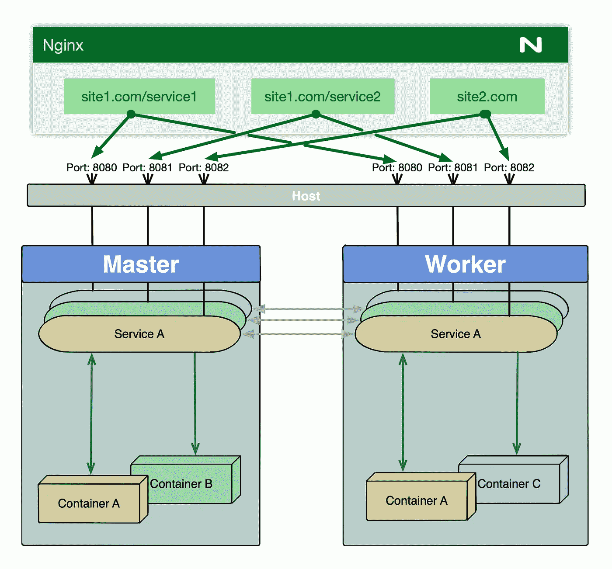
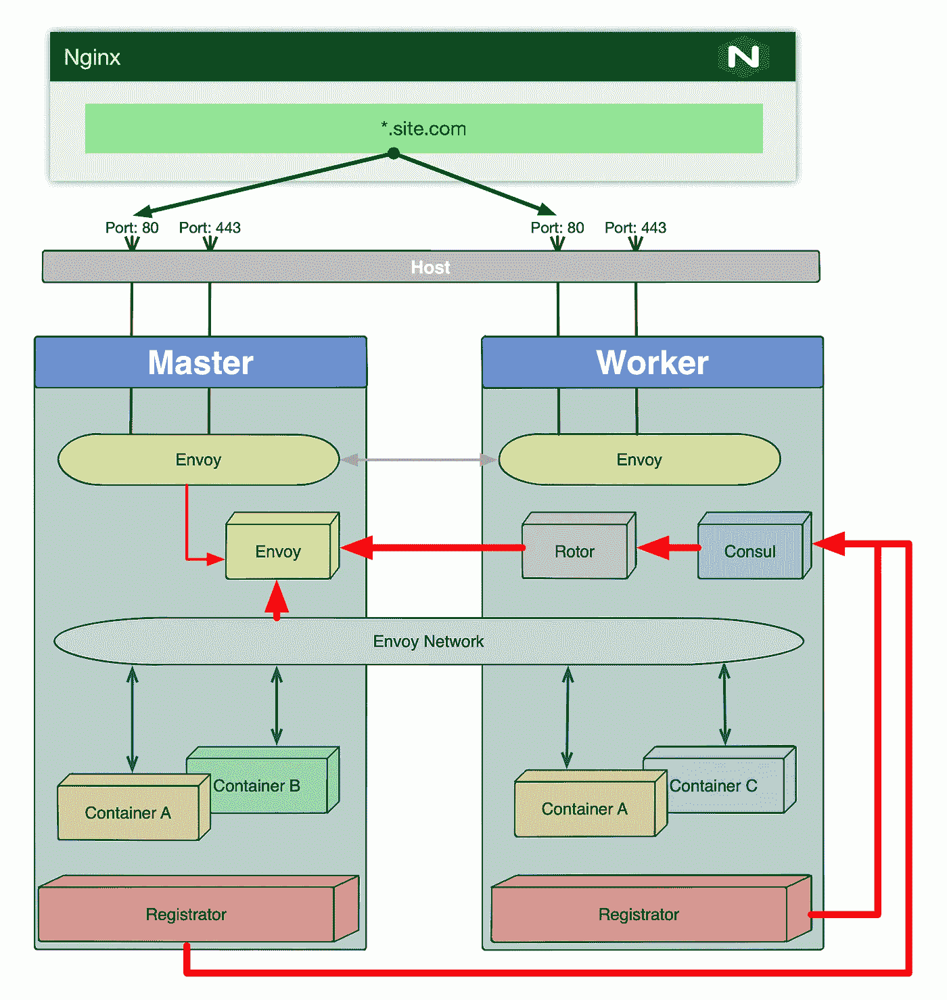

# 在 15 分钟内在 Docker Swarm 中实现服务自动发现

> 原文：<https://itnext.io/enable-services-auto-discovery-in-docker-swarm-in-15-minutes-ae30f3877dc8?source=collection_archive---------2----------------------->


当访问部署到 Docker Swarm 的应用程序时，这与访问部署到独立 Docker 实例的应用程序非常相似:我们必须发布服务的一个或多个端口，以便外部客户端可以访问它。

然后，理想情况下，我们在群集前建立一个反向代理服务器，一方面将群集服务的任意端口转换为代理中的虚拟服务器或上下文，另一方面提供某种形式的高可用性和负载平衡。



经典群体部署图

只要服务的数量相对较少，这种方法就可以很好地工作。然而，在某个点之后，从为每个服务分配端口号到手动配置虚拟服务器和上下文，管理变得相当困难。

在理想情况下，我们希望服务在部署后几秒钟内就可以使用，而不需要任何额外的手动操作。

在少数开源产品的帮助下，这似乎相对容易。



特使部署到码头群

要使用[特使代理](https://www.envoyproxy.io/)配置自动发现，我们将使用以下产品:

*   [注册器](https://github.com/gliderlabs/registrator) —服务注册桥。当 Docker 容器上线时，它可以注册和注销它们
*   [consult](https://www.consul.io/)——一个服务网格解决方案，用于连接整个集群的服务
*   [转子](https://github.com/turbinelabs/rotor) —咨询服务网与特使之间的桥梁

所提出的解决方案的工作方式是，Registrator 运行在集群的每个节点上，在容器被启动和关闭时不断地监视它们。Registrator 然后将数据提供给 consul，consul 为我们想要注册的服务中的每个容器构建服务定义。

Rotor 然后连接到 Consul 实例并读取服务信息，用实时配置信息构建 feeding envoy，该信息被配置为动态设置代理监听器和集群。

> **一个免责声明，或者实际上是两个:
> 首先，这是众多解决方案之一。它在我们的测试环境中运行得非常好，但是将它推广到生产环境中需要您自担风险。
> 第二，旋翼不再正式维护了。其背后的公司，** [**涡轮实验室**](https://www.turbinelabs.io/) **已经关闭。这是一个稳定的软件，但请记住这一点。还有，注册器代码库中有一个** [**pull 请求**](https://github.com/gliderlabs/registrator/pull/529) **三年不合并，在上面的架构中帮助极大。本质上，它允许使用特定的网络将 Envoy 与底层服务连接起来。**

为了通过 envoy 访问群中的服务，您必须创建一个通配符 DNS 记录，指向群中的一个节点或部署在群前面的负载平衡器。Envoy 将监听端口 80，为了成功地路由到特定的服务`Host`，HTTP 头必须是指定服务外部名称的请求的一部分。

因此，在我们开始部署堆栈之前，我们希望有一个专用于特使及其连接的服务的覆盖网络。

为了创建新网络，请运行以下命令:

```
docker network create -d overlay --attachable --scope swarm envoy
```

现在，我们必须部署一个包含三个服务的堆栈:领事、转子和特使。

堆栈的合成文件如下所示:

```
version: '3.7'

services:
  consul:
    image: consul:latest
    command: "agent -server -retry-join consul -client 0.0.0.0 -domain swarm.demo.com -bind '{{ GetInterfaceIP \"eth0\" }}' -ui"
    environment:
      - CONSUL_BIND_INTERFACE=eth0
      - 'CONSUL_LOCAL_CONFIG={"server": true,"skip_leave_on_interrupt": true,"ui" : true,"bootstrap_expect": 1}'
      - SERVICE_8500_NAME=consul.swarm.demo.com
      - SERVICE_8500_NETWORK=envoy
    ports:
      - "8500:8500"
    networks:
      - default
      - envoy
    deploy:
      replicas: 1
      placement:
        constraints: [node.role == manager]

  rotor:
    image: turbinelabs/rotor:0.19.0
    ports:
      - "50000:50000"
    environment:
      - ROTOR_CMD=consul
      - ROTOR_CONSUL_DC=dc1
      - ROTOR_CONSUL_HOSTPORT=consul:8500
      - ROTOR_XDS_RESOLVE_DNS=true

  envoy:
    image: envoyproxy/envoy:v1.13.0
    ports:
      - "9901:9901"
      - "80:80"
    configs:
      - source: envoy
        target: /etc/envoy/envoy.json
        mode: 0640

    command: envoy -c /etc/envoy/envoy.json
    deploy:
      mode: global
    networks:
      - default
      - envoy

configs:
  envoy:
    file: envoy.json

networks:
  envoy:
    external: true
```

您必须根据自己的需要调整上面的示例。特别要注意 consul 命令中的域和服务的名称。我以 swarm.demo.com 为例，如果你想尝试这种方法，应该用真实的例子来代替。

特使服务需要一个配置，该配置应存储在与上述 docker-compose.yaml 文件相同的目录中。配置文件名为 envoy.json，它应该包含以下内容:

特使. json

要部署堆栈，请从存储上述两个文件的目录中运行以下命令:

```
docker stack deploy -c docker-compose.yaml envoy
```

一旦栈被部署，你必须在集群的每个节点上运行容器中的 Registator。这些容器不应该部署成集群，而应该作为独立的容器启动。

这将允许在必要时成功地清空节点，并且不会在 Consul 配置中留下悬空服务。

要运行 Registrator，请在集群的每个节点上执行以下命令:

```
docker run -d --name registrator -v /var/run/docker.sock:/tmp/docker.sock --restart unless-stopped --net envoy iktech/registrator -internal=true -cleanup -explicit=true -tags "tbn-cluster" -resync=5 consul://consul:8500
```

一旦注册器容器启动，您应该能够使用 name 通过 envoy 直接访问 Consul 前端，在 Consul 服务中指定为`SERVICE_8500_NAME`环境变量:在我们的示例中为 consul.swarm.demo.com。

所以现在，为了使群中的服务能够被特使发现，应该满足以下三个条件:

*   envoy 将用作上游连接的端口必须在映像构建时使用 Dockerfile 中的`EXPOSE`指令公开。
*   连接到`envoy`网络的相关容器
*   通过设置以下环境变量来正确配置容器

SERVICE_ <port>_NETWORK —在本例中，它应该始终是 envoy，但是在理论上，相同的配置可以使用多个不同的覆盖网络，只要 envoy 容器连接到所有这些网络。提醒！此选项仅在[拉式请求#529](https://github.com/gliderlabs/registrator/pull/529) 应用于注册商代码库时可用。</port>

SERVICE_ <port>_NAME —这是相关服务的 DNS 名称。应该可以被群节点或负载平衡器 IP 解析。</port>

SERVICE_ <port>_IGNORE —对于所有不应被代理的公开端口，应设置为 true。</port>

<port>以上三个变量都是集装箱暴露的港口。</port>

例如，假设我们有一个公开端口 8080 和 5005 的服务，我们希望它可以通过 test-service.swarm.demo.com 名称访问。为了实现这一点，应将以下三个变量添加到正在讨论的服务定义中:

```
environment:
  - SERVICE_8080_NETWORK=envoy - SERVICE_8080_NAME=test-service.swarm.demo.com - SERVICE_5005_IGNORE=true
```

使用这种方法，不需要发布单个服务的端口，因为它们都将由 Envoy 代理提供服务。