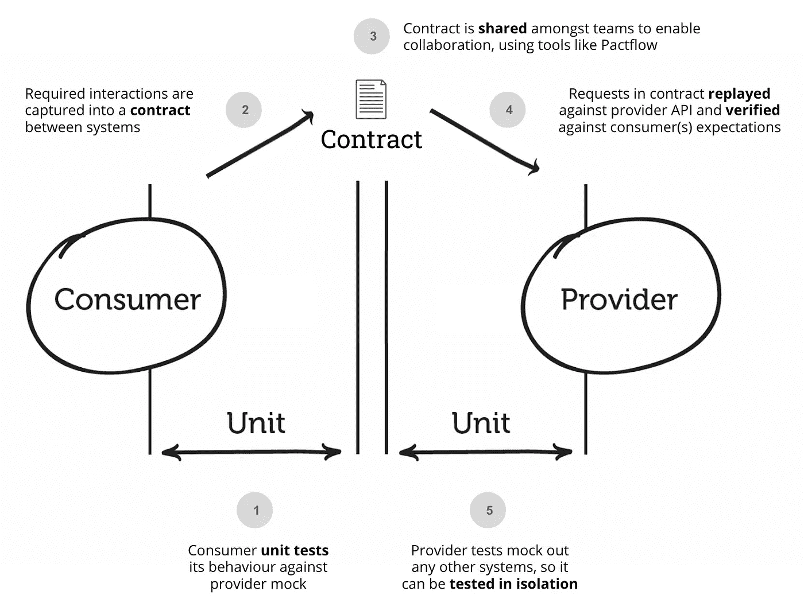
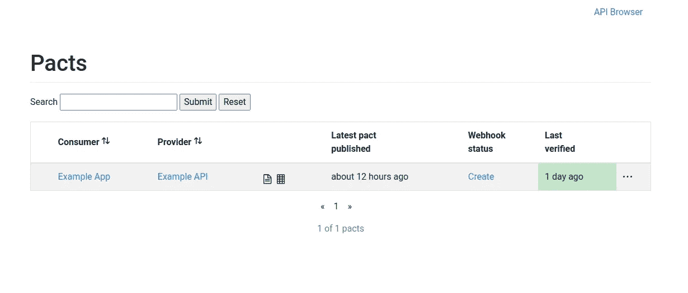
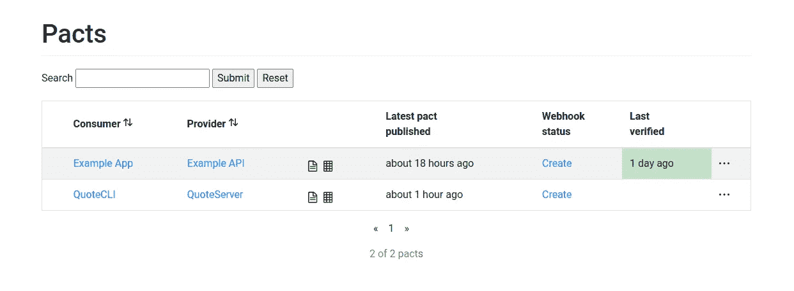
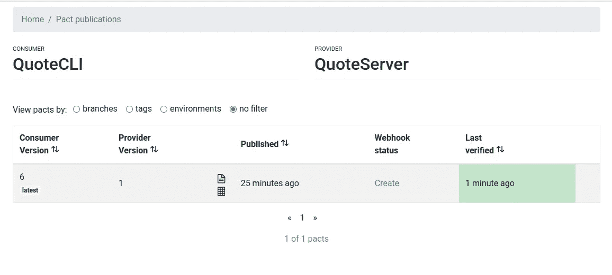

# 使用 Kubernetes 启用合同测试平台

> 原文：<https://itnext.io/enabling-contract-testing-platform-with-kubernetes-4ab774cb8186?source=collection_archive---------3----------------------->

**TL；DR** :如何在生产级环境中开始使用带有 Pact 的消费者驱动合同测试平台。


再见，E2E！Hellooo 疾控中心！

# 动机

现代软件开发行业的每个人都使用 **E2E 测试来对发布**的新开发有信心。这些测试给了我们很高的信心**，但在持续时间和处理方面成本很高**。

如你所知，**单元测试比 E2E 便宜，因为它们速度快但可信度低**。

[**消费者驱动的契约**](https://www.martinfowler.com/articles/consumerDrivenContracts.html) 测试是作为 E2E 测试的替代而诞生的。这个想法很简单:如果我们有一个所有涉众(生产者和消费者)都熟知的接口(契约)，为什么不使用这个契约并对照它和生产者来测试消费者呢？



资料来源:docs.pact.io /版权公约基金会

我们可以孤立地测试生产者和消费者。有道理，对吧？

# 合同测试和契约

据我所知，现在做疾控中心检测的选择不多。

我们可以列举两个开源解决方案。一个是[春云契约](https://spring.io/projects/spring-cloud-contract)另一个是[契约](https://pact.io/)。

Spring Cloud Contract 与 Java Spring 框架紧密耦合。

**然而，Pack 更多的是平台/语言不可知的**。您可以使用 JSON(及其模式)来编写“契约”。

比起 Java，我更喜欢 Python，所以你可以猜到今天要谈论的框架。玩笑归玩笑，由于微服务架构上的最佳应用，我更喜欢不可知的解决方案。

Pact 规范是一个 JSON 文件，其中指定了请求(带有头、有效负载等)以及预期的响应。

你可以手动写，但是没人写。最后，您使用一个框架，当测试第一次运行时，pact 规范被创建。

事实上，我们从消费者的角度开始编写测试。我们定义请求以及我们需要什么来响应请求。

除了创建 Pact 规范，**框架还运行一个模拟服务器**，在那里您的消费者代码可以正常运行。

该框架将使用之前在提供者代码测试期间编写的 **pact 规范来验证契约**(接口)。

正如您所想象的，关于如何管理 pact 规范生命周期，有一些权衡。我们什么时候把这些文件放在哪里？这些文件的管理可能有点奇怪。因此，Pact 背后的人为此创造了一个解决方案。

# 介绍契约经纪人

Pact foundation 创建了一个存储库管理器来处理 Pact 规范、 [**、pact broker**](https://github.com/pact-foundation/pact_broker) 的注册和检索。

您可以自托管 pact broker 或使用其 SaaS 服务: [**pactflow.io**](https://pactflow.io/)

我们的想法是将它部署在您的基础架构下，以便它可以用于您的 CI 渠道。

当 CDC 消费者测试开始执行时，要做的第一件事是下载 Pact 规范(如果存在的话)。如果不存在或者不需要更新(自从上次执行以来测试已经改变了)，更新它。

另一方面，当执行 CDC 提供者端测试时，会下载 Pact 规范并根据提供者实现进行验证。

所以，首先要做的是。我们开始在 K8S 集群下部署一个契约代理。

# Kubernetes 手下的契约经纪人

Pact broker 需要一个 Postgres 数据库来存储规范及其元数据。

在 Kubernetes 中部署 Postgres 数据库非常简单，这超出了本文的范围。在我的例子中，我将为这种服务使用一个共享的 Postgres 部署。

## K8S 清单

我们创建一个 YAML 一体化清单文件

我们应用它

```
kubectl apply -f pact-broker.yml
```

因为它是内部服务，所以没有必要创建入口资源。

为了测试它，我们可以做一个简单的端口转发

```
kubectl port-forward -n pact pod/pact-broker-6fd6c49854-rjhch 9292
```

如果我们在我们最喜欢的浏览器中打开 URL `localhost:9292`,我们会默认查看带有示例的 pact broker WebUI。



契约代理入口点

我们可以使用下面的 HTTP 调用来检索“示例应用程序”消费者和“示例 API”提供者之间的最新约定

```
http localhost:9292/pacts/provider/Example%20API/consumer/Example%20App/latest
```

这是结果(没有 HAL 元数据)

```
{
    "consumer": {
        "name": "Example App"
    },
    "createdAt": "2022-12-13T20:49:39+00:00",
    "interactions": [
        {
            "_id": "ef69ceef4d7fb82af014da950a3d9028a905c4de",
            "description": "a request for an alligator",
            "providerState": "there is an alligator named Mary",
            "request": {
                "headers": {
                    "Accept": "application/json"
                },
                "method": "get",
                "path": "/alligators/Mary"
            },
            "response": {
                "body": {
                    "name": "Mary"
                },
                "headers": {
                    "Content-Type": "application/json;charset=utf-8"
                },
                "matchingRules": {
                    "$.body.name": {
                        "match": "type"
                    }
                },
                "status": 200
            }
        },
        {
            "_id": "4b3c23c364f420e1d1296d56a47695de0428d0af",
            "description": "a request for an alligator",
            "providerState": "there is not an alligator named Mary",
            "request": {
                "headers": {
                    "Accept": "application/json"
                },
                "method": "get",
                "path": "/alligators/Mary"
            },
            "response": {
                "headers": {},
                "status": 404
            }
        },
        {
            "_id": "e57e7ac251a8bd078fcb81cad1e577cbafebcef5",
            "description": "a request for an alligator",
            "providerState": "an error occurs retrieving an alligator",
            "request": {
                "headers": {
                    "Accept": "application/json"
                },
                "method": "get",
                "path": "/alligators/Mary"
            },
            "response": {
                "body": {
                    "error": "Argh!!!"
                },
                "headers": {
                    "Content-Type": "application/json;charset=utf-8"
                },
                "status": 500
            }
        }
    ],
    "metadata": {
        "pactSpecification": {
            "version": "2.0.0"
        }
    },
    "provider": {
        "name": "Example API"
    }
}
```

到目前为止一切顺利。我们来做个演示吧！

# 简单的演示

是时候创建一个简单的 Python API 项目了。

对于 Python，可以使用官方包`pact-python`。

我已经创建了这个演示回购= >[https://github.com/jmrobles/pact-python-demo](https://github.com/jmrobles/pact-python-demo)

这很简单，但很能说明问题。

我不详述所有的细节，我将突出最有趣的部分。

## 消费者方面

**quotes_consumer.py**

```
import requests

class QuoteConsumer:

    QUOTES_EP =  '/api/v1/quotes'

    def __init__(self, host: str):

        self.host = host

    def get_random_quote(self) -> str:

        response = requests.get(self.host + self.QUOTES_EP)
        data = response.json()
        return f"{data['quote']}, {data['author']}"

    def put_my_quote(self, quote: str, author: str) -> bool:

        response = requests.post(self.host + self.QUOTES_EP, json={'quote': quote, 'author': author})
        return response.status_code == 201

if __name__ == '__main__':

    # Put a quote
    if not put_my_quote(quote, 'Today is a great day to do CDC testing', 'Aristestoles'):
        print('Something went wrong!')

    # Get a quote
    print(f'Quote of the day => {get_random_quote()}')
```

我们开始定义我们的消费者。一个简单的 CLI 工具，以获得随机报价，并把一个固定的。对，是玩具:)

这里重要的是，我们的消费者在构造函数中传递主机，这样我们就可以注入 pact 模拟服务器。

**test _ quotes _ consumer . py**

```
from quotes_consumer import QuoteConsumer

PACT_MOCK_HOST = "localhost"
PACT_MOCK_PORT = 1234

def test_get_quote(pact):

    consumer = QuoteConsumer(f'http://{PACT_MOCK_HOST}:{PACT_MOCK_PORT}')

    expected = {
        'quote': 'A quote',
        'author': 'Anonymous'
    }

    (
        pact.given("A fixed quote")
        .upon_receiving("a request for the quote")
        .with_request("get", "/api/v1/quotes")
        .will_respond_with(200, body=expected)
    )
    with pact:
        quote = consumer.get_random_quote()
        assert quote == 'A quote, Anonymous'
        pact.verify()

def test_create_quote(pact):

    consumer = QuoteConsumer(f'http://{PACT_MOCK_HOST}:{PACT_MOCK_PORT}')

    quote = {
        'quote': 'To test or to test',
        'author': 'A tester'
    }

    (
        pact.given("A quote to add")
        .upon_receiving("a request for adding the new quote")
        .with_request("post", "/api/v1/quotes", body=quote, headers={'Content-type': 'application/json'})

        .will_respond_with(201)
    )

    with pact:

        is_created = consumer.put_my_quote(quote['quote'], quote['author'])
        assert is_created
        pact.verify()
```

这个更有意思。这里我们定义了两个 pytest 测试，它们指定了我们所期望的，然后，在“pact”对象的上下文中，我们测试我们的代码。

“契约”是`conftest.py`中的一个固定项目

**conftest.py**

```
import atexit
import os

import pytest

from pact import Consumer, Provider

PACT_BROKER_URL = "http://localhost:9292"
PACT_MOCK_HOST = "localhost"
PACT_MOCK_PORT = 1234

PACT_DIR = os.path.dirname(os.path.realpath(__file__))

def pytest_addoption(parser):
    parser.addoption(
        "--publish-pact", type=str, action="store", help="Upload generated pact file to pact broker with version"
    )

    parser.addoption("--provider-url", type=str, action="store", help="The url to our provider.")

@pytest.fixture(scope="session")
def pact(request):

    version = request.config.getoption("--publish-pact")
    publish = True if version else False

    pact = Consumer("QuoteCLI", version=version).has_pact_with(
        Provider("QuoteServer"),
        host_name=PACT_MOCK_HOST,
        port=PACT_MOCK_PORT,
        pact_dir=PACT_DIR,
        publish_to_broker=publish,
        broker_base_url=PACT_BROKER_URL,
    )

    pact.start_service()

    atexit.register(pact.stop_service)

    yield pact

    pact.stop_service()

    pact.publish_to_broker = False
```

这个文件负责添加将契约发布到代理中的选项，为消费者-提供者对创建一个契约对象，并启动/完成模拟服务器。

如果我们用`run_pytest.sh`运行它，必须出现一个新的契约规范 JSON，并且该契约也应该在我们的代理中注册。



我们的契约规范得到了控制

## 提供商方

现在是时候实现一个后端来满足我们的契约了。

我使用了`fastapi`作为 API 框架。

quote_server.py

```
import random

from fastapi import FastAPI, APIRouter
from pydantic import BaseModel

class Quote(BaseModel):

    quote: str
    author: str

router = APIRouter()

app = FastAPI()

quotes = []

@app.get('/api/v1/quotes')
def get_random_quote():
    return random.choice(quotes)

@app.post('/api/v1/quotes', status_code=201)
def create_new_quote(quote: Quote):
    quotes.append({'quote': quote.quote, 'author': quote.author})
    return ''
```

这里唯一有趣的是，我们没有使用数据库或类似的东西。`quotes`数组将是我们的内存存储。

**pact_quotes_server.py**

```
import uvicorn
from fastapi import APIRouter
from pydantic import BaseModel

from quote_server import app, quotes, router as main_router

pact_router = APIRouter()

class ProviderState(BaseModel):
    state: str  # noqa: E999

@pact_router.post("/_pact/provider_states")
async def provider_states(provider_state: ProviderState):
    mapping = {
        "A fixed quote": setup_fixed_quote,
        "A quote to add": setup_add_quote,
    }
    mapping[provider_state.state]()

    return {"result": mapping[provider_state.state]}

# Make sure the app includes both routers. This needs to be done after the
# declaration of the provider_states
app.include_router(main_router)
app.include_router(pact_router)

def run_server():
    uvicorn.run(app)

def setup_fixed_quote():

    quotes.clear()
    quotes.append({'quote': 'A quote', 'author': 'Anonymous'})

def setup_add_quote():

    quotes.clear()
```

依我拙见，这是这个项目最奇怪的部分。

这里，我们基于原始提供者创建了一个 fastapi 服务器，但是增加了存储测试中定义的每个交互的状态和 fixture 映射的功能。

正如您所看到的，根据测试规范，我们修改了`quotes`数组来包含测试所需的数据。

**test_quotes_provider.py**

```
from multiprocessing import Process

import pytest
from pact import Verifier

from pact_quotes_server import run_server

PACT_BROKER_URL = "http://localhost:9292"
PROVIDER_URL = "http://localhost:8000"

@pytest.fixture(scope="module")
def server():
    proc = Process(target=run_server, args=(), daemon=True)
    proc.start()

    yield proc

    proc.kill()

def test_quote_service(server):

    verifier = Verifier(provider="QuoteServer", provider_base_url=PROVIDER_URL)
    success, logs = verifier.verify_with_broker(
        broker_url=PACT_BROKER_URL,
        verbose=True,
        provider_states_setup_url=f"{PROVIDER_URL}/_pact/provider_states",
        enable_pending=False,
        publish_verification_results=True,
        publish_version="1"
    )
    assert success == 0
```

这更像是样板代码。我们只是实例我们的特殊供应商之前显示，并执行契约验证方法对我们的经纪人。我们用`publish_version`和`publish_verification_result`表示我们也想将验证结果存储在我们的代理中。

用`run_pytest.sh`执行之后，我们可以再次检查 WebUI 瞧！验证效果很好！



成功的测试握手

# 结论

CDC 测试是一个相对较新的范例/技术。Sam Newman 等一些微服务作者在他的畅销书《构建微服务》中讨论了这一点。

取消昂贵的 E2E 测试的承诺，嗯，我认为我们可以减少他们的数量，但不是全部。对于一些需要测试安全性、时间约束等的测试，我们仍然需要在最接近生产环境的环境中执行它们。

在我看来，在将 CDC 和 Pact 投入生产之前，有一些事情需要改进或了解。可能我会尝试在一个真实的项目中应用它，看看挑战和潜在的解决方案。

如果你想知道更多关于 CDC 测试的信息，请随时通知我们。