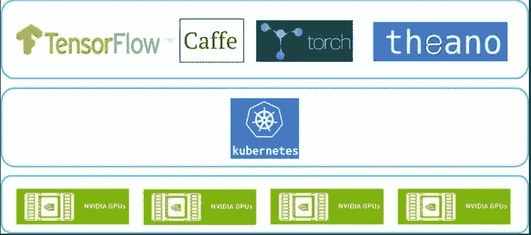

# 在 K3s 上为 CUDA 工作负载启用 NVIDIA GPUs

> 原文：<https://itnext.io/enabling-nvidia-gpus-on-k3s-for-cuda-workloads-a11b96f967b0?source=collection_archive---------0----------------------->

如果你是一个机器学习或加密爱好者，并且在家里用几台连接 GPU 的机器构建了一个迷你数据中心，那么你可能会将宝贵的时间花在管理机器上的工作负载上。当您决定重新格式化您的一台机器时，您如何重新配置一切并部署您的工作负载，您如何将一个工作负载从一台机器转移到另一台机器，您如何确保您的设置是可重复的？难道您不想在自己的家庭实验室中部署 Kubernetes 集群，集中管理您的所有工作负载，而不必过多担心如何设置您从易贝购买的新的戴尔 R510 吗？



图片来源:programmerwiki.com

K3S 允许任何人在几分钟内创建 Kubernetes 集群，从而使 Kubernetes 民主化。即使在单节点设置中，您也可以使用 K3S 轻松设置 Kubernetes 集群，并改善您管理工作负载的方式。稍后，您可以将相同的工作负载迁移到云或更大的本地 Kubernetes 集群，只需进行最少的更改。不用说，如果你想提高你的 Kubernetes 技能，这也是一个很好的学习机会。

自然，本文的目的不是告诉 Kubernetes 有多棒，而是如何针对需要 GPU 的工作负载增强它。我最近的挑战是在我的 K3S 集群上运行 CUDA 工作负载，以进一步提高我的机器学习技能。可以在 K3S 上运行使用 NVIDIA GPUs 处理 CUDA 工作负载的 Kubernetes Pods，除了几个步骤之外，它不需要任何东西。但是，我注意到没有一套清晰的说明来显示这些步骤，需要哪些组件，如何启用它们，等等。因此，我已经决定写这篇文章，概述了所需的步骤一个接一个。

从鸟瞰的角度来看，所需的步骤首先是在 K3s 节点上安装 NVIDIA 驱动程序。请注意，在节点本身上，我们只需要设备驱动程序，而不一定需要 CUDA 本身。NVIDIA 发布了支持 CUDA 的容器，你可以用它来构建你的应用程序容器。这也意味着在同一台机器上，您可以轻松地运行不同 CUDA 版本的不同容器。第二步是安装 [NVIDIA 容器工具包](https://docs.nvidia.com/datacenter/cloud-native/container-toolkit/overview.html)，它有助于将 K3S 节点的 GPU 资源暴露给运行在其上的容器。第三步是告诉 K3S 使用这个工具包在容器上启用 GPU。在这些步骤之后，其他的一切都是标准的 Kubernetes 的东西，这就是将用于 Kubernetes 的 NVIDIA 设备插件安装到您的集群，以使 Kubernetes 知道 GPU 资源，并使它们对 Pods 可用。

在本文中，我们假设您已经有一个正在运行的 K3S 集群，并且您有一些安装了 NVIDIA GPUs 的节点。另一个假设是你的节点运行 Ubuntu 20.04 和 K3s v1.21.3+k3s1，但我相信同样的说明也适用于其他发行版和大多数其他最新的 K3s 版本。

现在，让我们进入步骤:

# 步骤 1:安装 NVIDIA 驱动程序

我们旅程的第一步是在我们的节点机器上安装 NVIDIA 驱动程序。我们可以首先使用 apt 搜索可用的驱动程序:

```
$ apt search nvidia-driver
```

在撰写本文时，最新的可用驱动程序版本是 470，所以让我们继续安装这个版本:

```
$ sudo apt install nvidia-headless-470-server
```

需要注意的重要一点是我们选择安装“无头”和“服务器”驱动程序。许多资源建议安装的标准 NVIDIA 驱动程序附带了 X11 的包袱。这意味着一旦您安装了这些标准驱动程序，您也可以在您的主机上启用 GUI。对于 Kubernetes 节点，您很可能不希望这样，尽管这不会影响您的 Kubernetes 集群的工作方式。另一方面，驱动程序包的无头服务器版本只安装设备驱动程序，我们更喜欢安装它们。

# 第二步:*安装 NVIDIA 容器工具包*

[NVIDIA 容器工具包](https://docs.nvidia.com/datacenter/cloud-native/container-toolkit/overview.html)帮助我们构建和运行 GPU 加速容器。换句话说，它使我们能够将 GPU 暴露给在我们的节点上运行的容器。

容器工具包的文档很清楚。需要注意的一点是只安装工具包的 containerd 版本。K3S 根本不使用 Docker，因为 Kubernetes 已经弃用了 Docker，它只使用 containerd 来管理容器。安装 Docker 支持不会影响集群的工作方式，因为它也会隐式安装 containerd 支持，但是因为我们避免在我们的瘦 Kubernetes 节点上安装不必要的包，所以我们直接安装 containerd。

文档是这里的。如果您想直接跳到安装，首先安装存储库:

```
$ distribution=$(. /etc/os-release;echo $ID$VERSION_ID) \
 && curl -s -L [https://nvidia.github.io/nvidia-docker/gpgkey](https://nvidia.github.io/nvidia-docker/gpgkey) | sudo apt-key add — \
 && curl -s -L [https://nvidia.github.io/nvidia-docker/$distribution/nvidia-docker.list](https://nvidia.github.io/nvidia-docker/$distribution/nvidia-docker.list) | sudo tee /etc/apt/sources.list.d/nvidia-docker.list
```

并安装 nvidia-container-runtime:

```
$ sudo apt-get update \
 && sudo apt-get install -y nvidia-container-runtime
```

现在，您可以运行一个测试容器来确保您的 GPU 向容器公开:

```
$ sudo ctr image pull docker.io/nvidia/cuda:11.0-base
$ sudo ctr run --rm --gpus 0 -t docker.io/nvidia/cuda:11.0-base cuda-11.0-base nvidia-smi
```

您应该会看到 [nvidia-smi](https://developer.nvidia.com/nvidia-system-management-interface) 输出，但是这次是在一个容器中运行的！

# 步骤 3:配置 K3S 使用 nvidia-container-runtime

我们现在应该告诉 K3S 在我们节点的 containerd 上使用 nvidia-container-runtime(这是 containerd 的一种插件)。

我们 K3D 的朋友为此制作了一个[实用指南](https://k3d.io/usage/guides/cuda/#configure-containerd)。我们在该指南中唯一感兴趣的部分是“配置容器”部分。他们共享的模板是配置 containerd 使用 nvidia-container-runtime 插件，以及一些额外的样板设置。要将模板安装到我们节点上，我们只需运行以下命令:

```
$ sudo wget [https://k3d.io/v4.4.8/usage/guides/cuda/config.toml.tmpl](https://k3d.io/v4.4.8/usage/guides/cuda/config.toml.tmpl) -O /var/lib/rancher/k3s/agent/etc/containerd/config.toml.tmpl
```

# 步骤 4:为 Kubernetes 安装 NVIDIA 设备插件

用于 Kubernetes 的 NVIDIA 设备插件是一个 DaemonSet，它扫描每个节点上的 GPU，并将它们作为 GPU 资源暴露给我们的 Kubernetes 节点。

如果你遵循设备插件的文档，也有一个舵图可以安装它。在 K3S 上，我们有一个简单的舵控制器，允许我们在我们的集群上安装舵图表。让我们利用它并部署这张舵轮图:

```
$ cat <<EOF | kubectl apply -f -
apiVersion: helm.cattle.io/v1
kind: HelmChart
metadata:
  name: nvidia-device-plugin
  namespace: kube-system
spec:
  chart: nvidia-device-plugin
  repo: [https://nvidia.github.io/k8s-device-plugin](https://nvidia.github.io/k8s-device-plugin)
EOF
```

当然，您也可以通过直接应用清单或使用“helm install”安装图表来安装设备插件[。这真的取决于你的口味。](https://github.com/NVIDIA/k8s-device-plugin#enabling-gpu-support-in-kubernetes)

# 步骤 5:在支持 CUDA 的 Pod 上测试一切

最后，我们可以通过创建一个使用 [CUDA Docker 映像](https://hub.docker.com/r/nvidia/cuda)并请求 GPU 资源的 Pod 来测试一切:

```
$ cat <<EOF | kubectl create -f -
apiVersion: v1
kind: Pod
metadata:
  name: gpu
spec:
  restartPolicy: Never
  containers:
    - name: gpu
      image: "nvidia/cuda:11.4.1-base-ubuntu20.04"
      command: [ "/bin/bash", "-c", "--" ]
      args: [ "while true; do sleep 30; done;" ]
      resources:
        limits:
          nvidia.com/gpu: 1
EOF
```

最后，让我们在 Pod 上运行 nvidia-smi:

```
$ kubectl exec -it gpu -- nvidia-smi
Sun Aug 22 10:02:05 2021
+-----------------------------------------------------------------------------+
| NVIDIA-SMI 470.57.02    Driver Version: 470.57.02    CUDA Version: 11.4     |
|-------------------------------+----------------------+----------------------+
| GPU  Name        Persistence-M| Bus-Id        Disp.A | Volatile Uncorr. ECC |
| Fan  Temp  Perf  Pwr:Usage/Cap|         Memory-Usage | GPU-Util  Compute M. |
|                               |                      |               MIG M. |
|===============================+======================+======================|
|   0  NVIDIA GeForce ...  Off  | 00000000:01:00.0 Off |                  N/A |
| 33%   40C    P8    10W / 180W |      0MiB /  8117MiB |      0%      Default |
|                               |                      |                  N/A |
+-------------------------------+----------------------+----------------------++-----------------------------------------------------------------------------+
| Processes:                                                                  |
|  GPU   GI   CI        PID   Type   Process name                  GPU Memory |
|        ID   ID                                                   Usage      |
|=============================================================================|
|  No running processes found                                                 |
+-----------------------------------------------------------------------------+
```

恭喜你！

现在，您有了一个具有可用 GPU 资源的 Kubernetes 集群。这与 Kubernetes 文档定义的接口完全相同。这意味着您为新集群设计的 GPU 工作负载可以完全移植到任何其他拥有 GPU 资源的 Kubernetes 集群。

你觉得这篇文章有用吗，或者有其他意见吗？请随时让我知道。