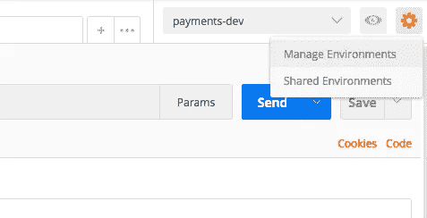
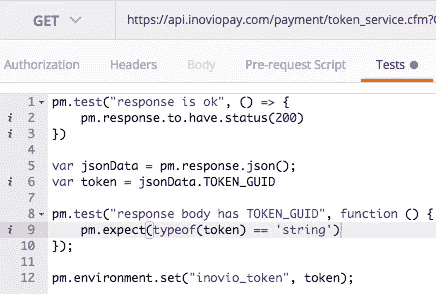
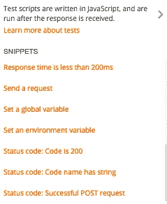
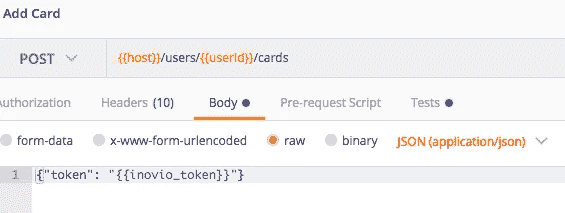
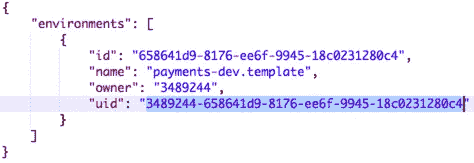
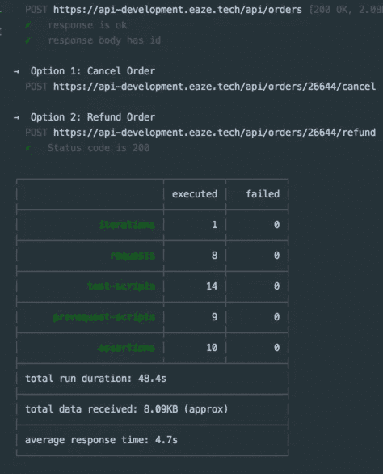

# 通过 Postman & Newman 进行端到端 API 测试

> 原文：<https://itnext.io/end-to-end-api-testing-via-postman-newman-68c99f136d5e?source=collection_archive---------4----------------------->

Postman 是我开发 API 时的首选工具。它使得测试请求变得容易，最近我发现链接请求来创建端到端测试也非常简单。本演练将向您展示如何通过 [Postman](https://www.getpostman.com/) 创建测试，如何在 Node 和命令行中使用 [Newman](https://www.npmjs.com/package/newman) 运行 API 测试，以及如何设置 Newman 到您的 collection &环境的 URL，而不是通过 JSON 手动导入它们。

# 创建邮递员集合和测试

1.  安装[邮递员](https://www.getpostman.com/)
2.  设置环境变量

*   使用左上角的`Manage Environments`部分



*   使用`Tests`选项卡和`Snippets`部分在每个端点上创建测试



示例:

```
pm.test("response is ok", () => { 
  pm.response.to.have.status(200) 
})
```

# 连锁请求

请求完成后，在`Tests`选项卡中设置环境/全局变量以链接请求。

`pm.response.json()`让您访问响应体。示例:

```
var jsonData = pm.response.json(); 
var token = jsonData.TOKEN_GUID;
pm.environment.set("inovio_token", token);
```

我们现在可以在未来的请求中使用`inovio_token` env 变量:



# 在邮递员跑步者中运行测试

*   点击您的收藏名称->运行
*   从步骤 1 中选择您的 env

# 在源代码/CI 中运行测试

1.  获取 [Postman API 键](https://eazeteam.postman.co/integrations)并将其设置为代码库中的 env 变量
2.  获取收藏链接

*   点击收藏名称->共享->收藏链接->获取链接


*   从`Manage Environments`点击`Share`为您的 env 从步骤 1
*   获取所有邮递员环境:

`https://api.getpostman.com/environments?apikey=<postman_key>`



*   保存所需环境的 UID
*   注意:每次你改变你的 env 变量或者集合端点时，你必须重新共享链接来更新它们

1.  使用 [Newman](https://www.npmjs.com/package/newman) 在您的代码库中运行测试。

*   `npm install --save-dev newman`。
*   `newman.run()`使用上述步骤 2 & 3 中的 URL 设置`collection`和`environment`选项:

*   `node test.js`
*   样本输出:



*   Newman 也可以通过命令行脚本运行，即:
*   `newman -c <collection-url> -e <env-url>`

以上任一选项(节点或命令行)都可用于配置项，具体取决于您选择的配置项服务/配置。大多数关于 Newman 的文档都关注于通过 JSON 导入集合和环境，但是我发现用上面的 URL 设置 Newman 环境和集合选项使得测试更加简单，并且消除了每次更新集合时重新导入 JSON 的必要性。