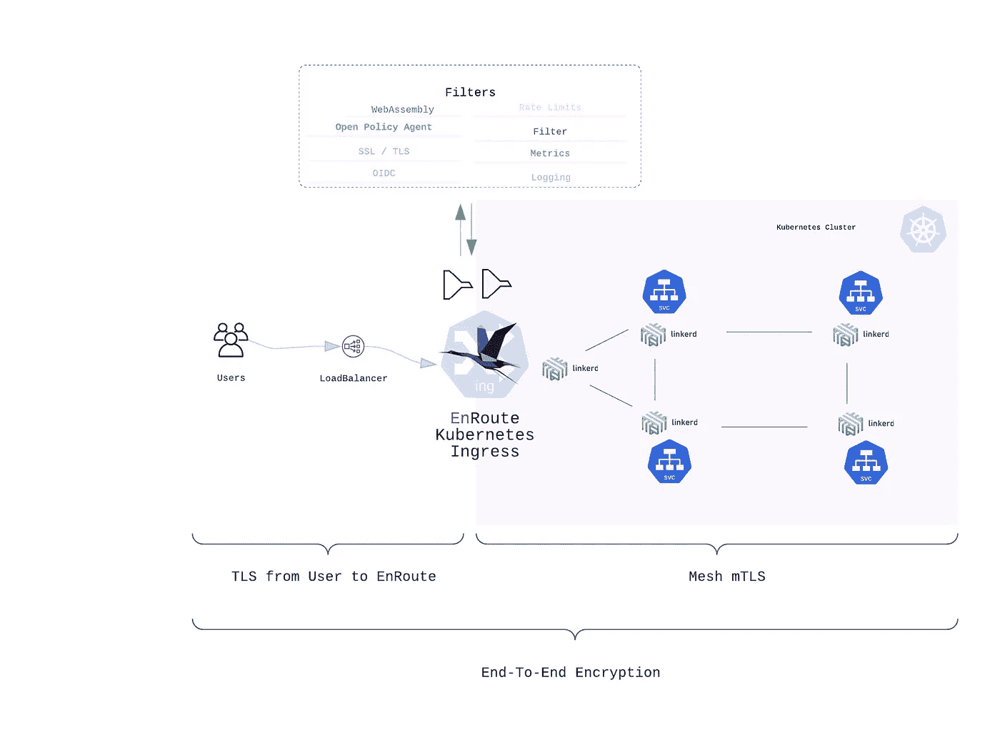
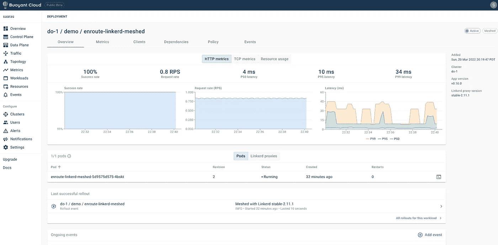
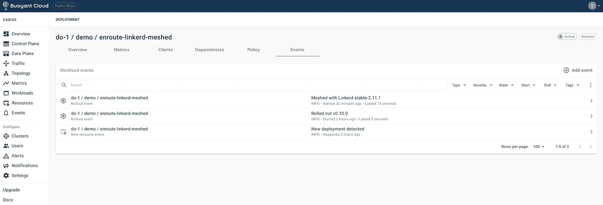
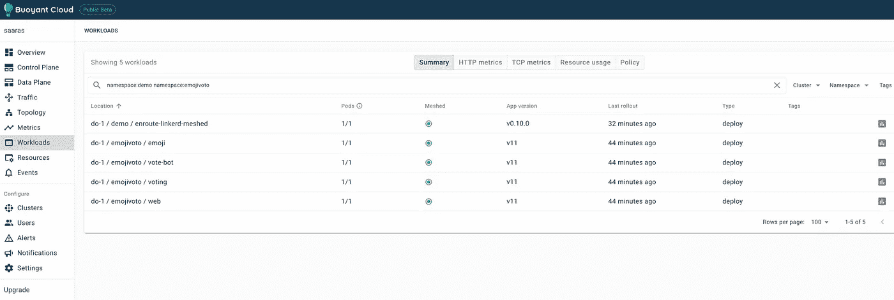
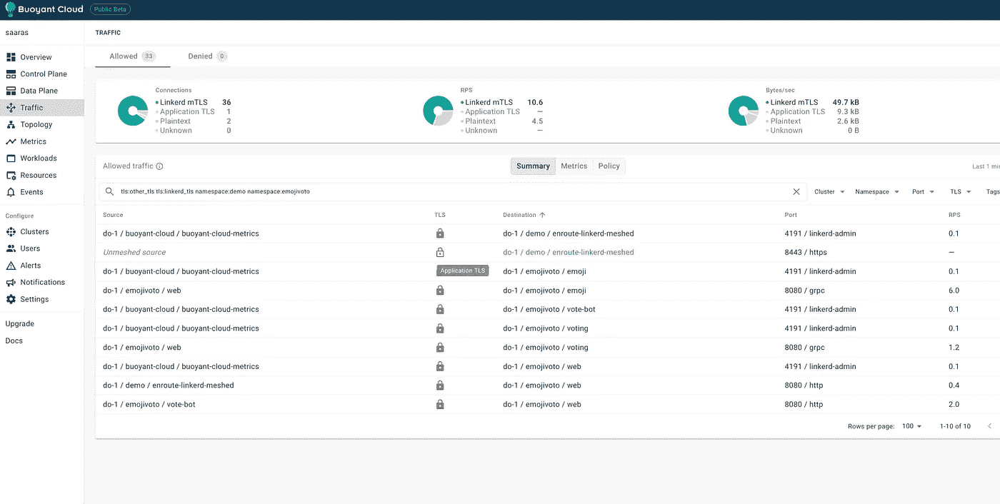
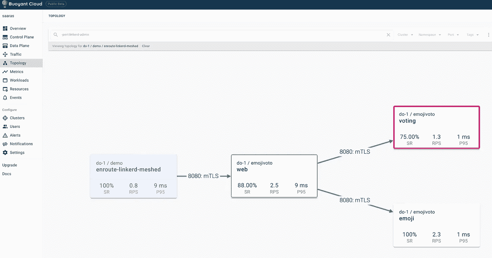

# 使用途中和链路的端到端加密

> 原文：<https://itnext.io/end-to-end-encryption-using-enroute-and-linkerd-2d58875cd59b?source=collection_archive---------3----------------------->



# 1.介绍

本文描述了 EnRoute OneStep 与 Linkerd service-mesh 的集成有多容易。LinkerD 是 CNCF 毕业的服务网格项目，它使用轻量级代理在 Kubernetes 内部设置网格。

与 Linkerd 的途中集成可以一步完成。集成 EnRoute 和 Linkerd 需要设置一个标志

从高层次来看，端到端加密包括-

*   从客户端到途中的加密，以及
*   从途中到网状网内部 MTL 的加密

我们通过将 linkerd 代理注入到它们的 pod 中来网状化工作负载和路由，然后设置客户端证书。

*   我们首先设置集群，安装 linkerd，添加一个示例工作负载 emojivoto，并通过注入 linkerd 来划分这个工作负载
*   接下来，我们安装 EnRoute，公开不带 TLS 的 emojivoto 应用程序，在 EnRoute pod 中注入 linkerd 代理以将其添加到网格中
*   最后一步，我们使用 JetStack cert manager 为 emojivoto 应用程序生成、签名并安装一个 let's Encrypt 证书

在监视集群的 linkerd 代理注入时，我们跟踪上述每个步骤。

我们还在 Bouyant cloud(及其免费层)上验证了上面的一些步骤，它在不同的 UI 屏幕上显示了上面的步骤

# 2.先决条件

这个设置需要一个 Kubernetes 集群。我们有一个包含两个节点的集群设置-

**检查 Kubernetes 集群**

```
**kubectl get nodes**NAME                   STATUS   ROLES    AGE   VERSION
pool-twnynczzy-u9k34   Ready    <none>   8d    v1.21.10
pool-twnynczzy-u9k3i   Ready    <none>   8d    v1.21.10
```

**安装并检查 Linkerd 安装**

linkerd 网站上的入门指南中介绍了 linkerd 的安装步骤，这里不做介绍。一旦安装了 linkerd，我们就可以验证它的安装。

**检查 linkerd 安装是否正常**

```
**linkerd check**Linkerd core checks
**===================**

kubernetes-api
--------------
√ can initialize the client
√ can query the Kubernetes API

kubernetes-version
------------------
√ is running the minimum Kubernetes API version
√ is running the minimum kubectl version

...

linkerd-control-plane-proxy
---------------------------
√ control plane proxies are healthy
√ control plane proxies are up-to-date
√ control plane proxies and cli versions match

Status check results are √
```

# 3.安装途中和 Emojivoto 工作负载

**安装示例工作负载 Emojivoto**

```
**curl -fsL https://run.linkerd.io/emojivoto.yml | kubectl apply -f -**Linkerd core checks
namespace/emojivoto created
serviceaccount/emoji created
serviceaccount/voting created
serviceaccount/web created
service/emoji-svc created
service/voting-svc created
service/web-svc created
deployment.apps/emoji created
deployment.apps/vote-bot created
deployment.apps/voting created
deployment.apps/web created
```

## **安装途中一步**

**添加舵仓**

```
**helm repo add saaras https://getenroute.io
helm repo add jetstack https://charts.jetstack.io
helm repo update
helm search repo**
```

**使用舵安装途中一步**

```
**helm install enroute-linkerd-meshed saaras/enroute \
	--set enrouteService.rbac.create=true \
	--create-namespace \
	--namespace demo**NAME: enroute-linkerd-meshed
LAST DEPLOYED: Mon Mar **21** 03:19:46 **2022**
NAMESPACE: demo
STATUS: deployed
REVISION: **1**
TEST SUITE: None
NOTES:
𝙴𝚗𝚁𝚘𝚞𝚝𝚎 Ingress API Gateway Community Edition Installed!
-------------------------------------------------------
Request a free evaluation license **for** enterprise version
by sending an email to contact@saaras.io

Slack Channel         - https://slack.saaras.io
Getting Started Guide - https://getenroute.io/docs/getting-started-enroute-ingress-controller/
EnRoute Features      - https://getenroute.io/features/
```

# 4.为 Linkerd 配置途中

与 linkerd 在途中啮合只需要在`GlobalConfig`上设置一个标志`linkerd_enabled`

```
**cat <<EOF | kubectl apply -f -
apiVersion: enroute.saaras.io/v1
kind: GlobalConfig
metadata:
  labels:
    app: web
  name: enable-linkerd
  namespace: default
spec:
  name: linkerd-global-config
  type: globalconfig_globals
  config: |
        {
          "linkerd_enabled": true
        }
EOF**globalconfig.enroute.saaras.io/enable-linkerd configured
```

# 5.网状路由和 Emojivoto 工作负载—集群内的加密

**在 Emojivoto 工作量中注入 Linkerd**

示例工作负载没有划分到 linkerd 网格中。为了将其网格化，我们需要为部署提供一个注释来注入 linkerd

```
**kubectl get -n emojivoto deploy -o yaml | linkerd inject - | kubectl apply -f -**deployment "emoji" injected
deployment "vote-bot" injected
deployment "voting" injected
deployment "web" injected

deployment.apps/emoji configured
deployment.apps/vote-bot configured
deployment.apps/voting configured
deployment.apps/web configured
```

这将安装 linkerd 代理以及示例应用程序组件

**在航路吊舱中注入连接器**

一旦 EnRoute 准备好使用 linkerd，我们就在 EnRoute pod 中注入 linkerd 代理

```
**kubectl get -n demo deploy -o yaml | linkerd inject - | kubectl apply -f -**deployment "enroute-linkerd-meshed" injected
deployment.apps/enroute-linkerd-meshed configured
```

我们使用漂浮云来追踪 linkerd 注入和网格形成的状态。下面的图片显示了如何在途中部署中添加 linkerd 代理，这是在 bouyant cloud 的几个屏幕上捕捉到的



事件屏幕还捕获了 linkerd 代理注入-



我们还可以使用`kubectl`来检查 pod，以查看 linkerd 是否插入到 pod 中

```
**kubectl get pods -n demo -o jsonpath='{range .items[*]}{"\n"}{.metadata.name}{":\t"}{range .spec.containers[*]}{.image}{", "}{end}{end}' |sort**enroute-linkerd-meshed-5d9575d575-4bskt:        cr.l5d.io/linkerd/proxy:stable-2.11.1, saarasio/enroute-gwi:latest, redis:latest, envoyproxy/envoy:v1.21.1,
```

# 6.从客户端到途中的加密

安装服务策略图表，通过 L7 策略对外公开服务

```
**helm install emojivoto-service-policy saaras/service-policy   \
--set service.name=web-svc   \
--set service.prefix=/ \
--set service.port=80 \
--namespace emojivoto \
--set service.fqdn=enroute-linkerd-mesh.enroutedemo.com \
--set service.enableTLS=false**NAME: emojivoto-service-policy
LAST DEPLOYED: Mon Mar **21** 05:04:39 **2022**
NAMESPACE: emojivoto
STATUS: deployed
REVISION: **1**
NOTES:
------------------ Configuration Graph -----------------------------------
Filters enabled **for** service **[**web-svc**]**
         **|**
    web-svc-80-luatestfilter
    kubectl edit -n emojivoto httpfilters.enroute.saaras.io web-svc-80-luatestfilter
         **|**
    web-svc-80-rl2
    kubectl edit -n emojivoto routefilters.enroute.saaras.io web-svc-80-rl2 **(**per-route ratelimit**)**
    kubectl edit -n emojivoto globalconfigs.enroute.saaras.io web-svc-rl-global-config **(**ratelimit engine global config**)**

𝙴𝚗𝚁𝚘𝚞𝚝𝚎 Community Edition Service Policy
----------------------------------------
Request an evaluation license **for** enterprise version - contact@saaras.io

Slack Channel         - https://slack.saaras.io
Getting Started Guide - https://getenroute.io/docs/getting-started-enroute-ingress-controller/
EnRoute Features      - https://getenroute.io/features/
```

发送一些流量

```
**curl -I enroute-linkerd-mesh.enroutedemo.com**HTTP/1.1 **200** OK
content-type: text/html
date: Mon, **21** Mar **2022** 05:09:51 GMT
content-length: **560**
x-envoy-upstream-service-time: **4**
vary: Accept-Encoding
lua-filter-says: Hello
server: envoy**while true; do enroute-linkerd-mesh.enroutedemo.com &> /dev/null; done**
```

## 通过为下游客户端连接启用 TLS 来启用端到端 TLS

我们将使用 [JetStack 证书管理器集成](https://getenroute.io/reference/cookbook/cert-manager-with-enroute-ingress/)来安装证书，例如 workload emojivoto。我们需要设置 DNS 来自动验证证书。

设置 DNS

我们为一个域创建一个 DNS 条目，以启用证书验证(使用 Let's Encrypt 安装),并将其安装在我们的示例工作负载上

获取 ExternalIP

检查路由服务是否安装了外部 IP

```
**kubectl get service -n demo**NAME                     TYPE           CLUSTER-IP       EXTERNAL-IP       PORT**(**S**)**                      AGE
enroute-linkerd-meshed   LoadBalancer   10.245.139.117   137.184.245.252   80:30695/TCP,443:31864/TCP   94m
```

**创建 DNS 条目**

创建一个从域名到外部 IP 的 DNS 条目。验证 DNS 设置是否正确-

```
ping enroute-linkerd-mesh.enroutedemo.com
```

**在服务检查证书上安装证书**

```
kubectl get certificates.cert-manager.io --all-namespacesNAMESPACE NAME READY SECRET AGE 
emojivoto enroute-linkerd-mesh.enroutedemo.com True enroute-linkerd-mesh.enroutedemo.com 63s
```

**发送流量**

```
curl -I -v [https://enroute-linkerd-mesh.enroutedemo.com](https://enroute-linkerd-mesh.enroutedemo.com)
```

让我们验证端到端加密

使用我们在 emojivoto 应用上安装的证书加密浏览器到路由的连接-


我们还可以在下面的“网格”列中看到工作负载和途中网格



我们还可以看到，传入流量显示为应用程序 TLS



拓扑屏幕还显示服务和流量方向之间的 MTL



在完成上述步骤后，还可以浏览下面视频中概述的步骤

# 结论

EnRoute 提供了与 linkerd 的极其简单的集成。

EnRoute 可与 linkerd 和 Istio 服务网络轻松集成。与 istio 服务网格的集成将在另一篇文章中介绍。

随着微服务导致攻击面增加，使用零信任原则保护和划分工作负载的需求变得至关重要。EnRoute 与服务网格集成，在集群边界和集群内部实现零信任。有关零信任、SPIFFE、加密强制身份、基于身份的分段以及与其他服务网格集成的更多信息，请参阅以下文章

*最初发布于*[*https://geten route . io*](https://getenroute.io/blog/end-to-end-encryption-mtls-linkerd-enroute/)*。*