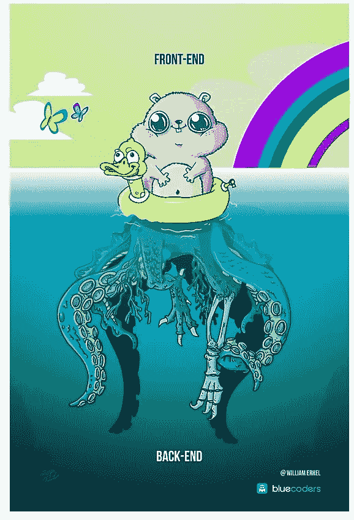
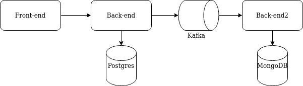

# 从前端到后端的端到端，带捕捉器

> 原文：<https://itnext.io/end-to-end-from-front-end-to-back-end-with-catcher-c6d8e0388258?source=collection_archive---------5----------------------->

捕手外部模块 **5.1.0** 终于发布了。这是个好消息，因为它支持 Selenium step 进行前端测试！



# 正确的 e2e 测试应该是什么样的？

假设您有一个带有漂亮 UI 的用户服务，它允许您获取在您的系统中注册的用户的信息。在后端深处，您还有一个审计日志，它保存所有的操作。



在 5.1.0 之前，您可以使用 HTTP 调用来模拟前端行为，以触发后端的一些动作。

您的测试可能看起来像这样:
-调用 http 端点来搜索用户
-检查搜索事件是否保存到数据库中
-将找到的用户与保存在数据库中的搜索事件进行比较

该测试检查 100%的后端功能。但是前端很可能也是您系统的一部分！因此**正确的**端到端测试应该从**前端**应用开始，在**后端**结束。

如果不接触前端，你可能会在 e2e 测试中得到假阳性结果。一个用户的名字中有一些特殊的符号。所有后端测试都通过了，您就可以在生产中部署您的应用程序了。部署之后，您的用户开始抱怨应用程序的前端部分崩溃。原因是——在渲染名字中带有特殊符号的用户详情时，前端无法处理后端的响应。

使用新的 Catcher 版本，您可以在测试中包含前端。所以——你可以使用 [selenium](https://catcher-modules.readthedocs.io/en/latest/source/selenium.html) step 来代替调用 http。

# 测试

让我们编写一个测试，它将搜索一个用户，并检查我们的搜索尝试是否被记录。

每个测试都是从变量开始的。为了避免误报结果，我们需要保存多个用户，然后检查是否只返回正确的用户。让我们组成我们的用户。由于[随机](https://catcher-test-tool.readthedocs.io/en/latest/source/catcher.modules.filter_impl.html#catcher.modules.filter_impl.bifs.function_random)内置功能，每个用户都将拥有一个随机的电子邮件和随机的名字。

```
variables: 
  users: 
    - name: '{{ random("name") }}' 
      email: '{{ random("email") }}' 
    - name: '{{ random("name") }}' 
      email: '{{ random("email") }}' 
    - name: '{{ random("name") }}' 
      email: '{{ random("email") }}'
```

现在我们准备写我们的`steps`。

## 填充数据

我们需要做的第一步是用[准备](https://catcher-modules.readthedocs.io/en/latest/source/prepare_expect.html)步骤填充数据。

让我们准备一个`users.sql`，它将创建所有后端表(在干净运行的情况下，我们没有它们)。

```
CREATE TABLE if not exists users_table( 
     email varchar(36) primary key, 
     name varchar(36) NOT NULL 
);
```

接下来——我们需要用测试数据填充表格。`users.csv`将使用我们的`users`变量为我们的步骤准备数据。

```
email,name 
 
{{ user.email }},{{ user.name }} 

```

如果需要，该步骤本身将采用`users.sql`并创建数据库表。然后它将基于`users`变量使用`users.csv`填充它。

```
steps: 
  - prepare: 
      populate: 
        postgres: 
          conf: '{{ postgres }}' 
          schema: users_table.sql 
          data: 
            users: users.csv 
      name: Populate postgres with {{ users|length }} users
```

## 选择要搜索的用户

下一步(小)是为我们的搜索选择一个用户。 [Echo](https://catcher-test-tool.readthedocs.io/en/latest/source/catcher.steps.html?highlight=echo#module-catcher.steps.echo) 步骤将从`users`变量中随机选择用户，并将其电子邮件注册为一个新变量。

```
- echo: 
    from: '{{ random_choice(users).email }}' 
    register: {search_for: '{{ OUTPUT }}'} 
    name: 'Select {{ search_for }} for search'
```

## 为我们的用户搜索前端

通过 [Selenium](https://catcher-modules.readthedocs.io/en/latest/source/catcher_modules.frontend.html#catcher_modules.frontend.selenium.Selenium) 步骤，我们可以使用我们的前端来搜索用户。Selenium step 从 resources 目录运行 JS/Java/Jar/Python 中的脚本。

它将 Catcher 的变量作为环境变量传递给脚本，因此您可以在 Selenium 中访问它。它还 greps 了脚本的输出，因此您可以访问 Catcher 后续步骤中的所有内容。

```
- selenium: 
    test: 
      file: register_user.js 
      driver: '/usr/lib/geckodriver' 
    register: {title: '{{ OUTPUT.title }}'}
```

该脚本将运行 register_user 来搜索我们选择的用户，并将注册页面的标题。

## 检查搜索日志

在我们完成搜索后，我们需要检查它是否被记录。想象一下我们的后端用的是 MongoDB。所以我们将使用 [mongo](https://catcher-modules.readthedocs.io/en/latest/source/catcher_modules.database.html#catcher-modules-database-mongo-module) step。

```
- mongo: 
    request: 
      conf: '{{ mongo }}' 
      collection: 'search_log' 
      find: {'text': '{{ search_for }}'} 
    register: {search_log: '{{ OUTPUT }}'}
```

这一步在 MongoDB `search_log`集合中搜索我们用户的任何文本搜索尝试。

## 比较结果

最终步骤与结果比较相关。首先——我们将再次使用`echo`来转换我们的`users`,以便我们可以通过电子邮件搜索用户。

```
- echo: 
    from: '{{ users|groupby("email")|asdict }}' 
    register: {users_kv: '{{ OUTPUT }}'}
```

第二—我们将把从 selenium 获得的前端页面标题与 MongoDB 搜索日志和用户名进行比较。

```
- check: 
    and: 
      - equals: {the: '{{ users_kv[search_for][0].name }}', is: '{{ title }}'} 
      - equals: {the: '{{ title }}', is: '{{ search_log.name }}'}
```

# 硒资源

让我们添加一个 Selenium 测试资源。它将进入你的网站并搜索你的用户。如果一切正常，页面标题将是这一步的结果。

## java 描述语言

Selenium step 支持 Java、JS、Python 和 Jar 归档。在本文中，我将向您展示它们(除了 Jar，它与 Java 相同，但没有编译)。让我们从 JavaScript 开始。

```
const {Builder, By, Key, until} = require('selenium-webdriver');
async function basicExample() {
  let driver = await new Builder().forBrowser('firefox').build();
  try{
    await driver.get(process.env.site_url);
    await driver.findElement(By.name('q')).sendKeys(process.env.search_for, Key.RETURN);
    await driver.wait(until.titleContains(process.env.search_for), 1000);
    await driver.getTitle().then(function(title) {
      console.log('{\"title\":\"' + title + '\"}')
    });
    driver.quit();
  }
  catch(err) {
    console.error(err);
    process.exitCode = 1;
    driver.quit();
  }
}
basicExample();
```

Catcher 将其所有变量作为环境变量传递，因此您可以从 JS/Java/Python 访问它们。本例中的`process.env.site_url`从 Catcher 的变量中获取 site_url，而`process.env.search_for`获取用户电子邮件来搜索它。

你写到 STDOUT 的所有东西都被 Catcher 捕获。在 JSON 的情况下，它将作为字典返回。带有`console.log('{\"title\":\"' + title + '\"}')`声明的 f . e .`OUTPUT.title`将在捕手侧可用。如果 Catcher 不能解析 JSON，它将返回一个文本作为`OUTPUT`。

## 计算机编程语言

下面是同一资源的 Python 实现。也应该放在`resources`目录下。要使用它代替 Java 实现，您需要在 Selenium 步骤中更改`file`参数。

```
from selenium import webdriver
from selenium.webdriver.common.keys import Keys
import os
from selenium.webdriver.firefox.options import Options

options = Options()
options.headless = True
driver = webdriver.Firefox(options=options)
try:
    driver.get(os.environ['site_url'])
    assert "Python" in driver.title
    elem = driver.find_element_by_name("q")
    elem.clear()
    elem.send_keys(os.environ['search_for'])
    elem.send_keys(Keys.RETURN)
    assert "No results found." not in driver.page_source
    print(f'{"title":"{driver.title}"')
finally:
    driver.close()
```

## Java 语言(一种计算机语言，尤用于创建网站)

Java 稍微复杂一点，因为(如果您没有使用已经编译过的 Jar) Catcher 应该在运行之前编译 Java 源代码。为此，您需要在系统中安装 Java 和 Selenium 库。

幸运的是，Catcher 附带了 Docker [image](https://hub.docker.com/repository/docker/comtihon/catcher) ，其中安装了库(JS、Java、Python)、Selenium 驱动程序(Firefox、Chrome、Opera)和工具(NodeJS、JDK、Python)。

```
package selenium;

import org.openqa.selenium.By; 
import org.openqa.selenium.WebDriver;
import org.openqa.selenium.WebElement;
import org.openqa.selenium.firefox.FirefoxDriver;
import org.openqa.selenium.firefox.FirefoxBinary;
import org.openqa.selenium.firefox.FirefoxOptions;

public class MySeleniumTest {

    public static void main(String[] args) {
        FirefoxBinary firefoxBinary = new FirefoxBinary();
        FirefoxOptions options = new FirefoxOptions();
        options.setBinary(firefoxBinary);
        options.setHeadless(true);
        WebDriver driver = new FirefoxDriver(options);
        try {
            driver.get(System.getenv("site_url"));
            WebElement element = driver.findElement(By.name("q"));
            element.sendKeys(System.getenv("search_for"));
            element.submit();
            System.out.println("{\"title\":\""+driver.getTitle() + "\"}");
        } finally {
            driver.quit();
        }
    }
}
```

# 结论

Catcher 的更新 5.1.0 统一了前端和后端测试，允许它们同时存在于一个测试用例中。它提高了覆盖率，使测试真正端到端。