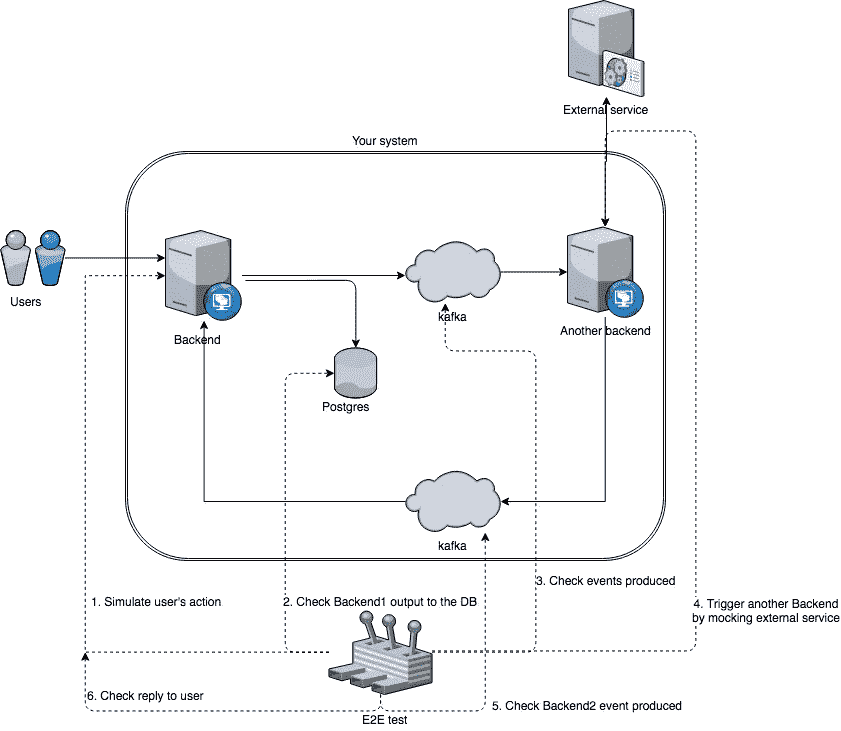

# 使用 Catcher 进行端到端微服务测试

> 原文：<https://itnext.io/end-to-end-microservices-testing-with-catcher-d29e5a2f1394?source=collection_archive---------4----------------------->


我想介绍一个新的端到端测试工具— [Catcher](https://github.com/comtihon/catcher) 。

# 什么是 e2e 测试？

端到端测试通常回答这样的问题:“这个用户真的被创建了吗，或者服务只是返回 200 而没有任何动作？”。

与项目级测试(单元/功能/集成)相比，e2e 是针对整个系统运行的。它们可以调用后端的 http 端点，检查写入数据库、消息队列的值，询问其他服务的变化，甚至模拟外部服务的行为。



E2E 测试是最高水平的测试。它们通常旨在验证系统是否满足需求，以及所有组件是否可以相互交互。

# 为什么我们需要 e2e 测试？

为什么我们需要编写这些测试？甚至 M .福勒[也建议](https://martinfowler.com/articles/microservice-testing/#testing-end-to-end-tips)避免这些测试，转而进行更简单的测试。

然而，在更高的抽象层上编写测试——将会进行更少的重写。在重构的情况下，单元测试通常会被完全重写。在代码更改期间，您还应该将大部分时间花在功能测试上。但是端到端测试应该检查您的业务逻辑，这不太可能经常改变。

除此之外，即使所有微服务的全覆盖也不能保证它们之间的正确交互。开发人员可能会错误地实现协议(命名或数据类型错误)。或者依靠文档中的数据模式开发新功能。无论如何，在 prod 环境中你会得到一个惊喜，因为模式不匹配:数据混乱或者有人忘记更新模式。

每个服务的测试都是绿色的。

# 为什么我们需要自动化测试？

确实如此。在我之前的公司，决定不花精力在建立自动化测试上，因为这需要时间。我们的系统当时还不大(10–15 个微服务加常见的 Kafka)。CTO 说“测试不重要，重要的是——系统应该工作”。所以我们在多种环境下进行手动测试。

它看起来像什么:

1.  与其他微服务的所有者讨论应该部署什么来测试新功能。
2.  部署所有服务。
3.  连接到远程 kafka(通过网关的双 ssh)。
4.  连接到 k8s 日志。
5.  手动创建并发送 kafka 消息(感谢上帝是普通的 json)。
6.  检查日志，试图了解它是否工作。

现在让我们添加一个美中不足的地方:大多数测试需要创建新用户，因为重用现有用户很困难。

用户注册的样子:

1.  插入各种数据(姓名、电子邮件等)。
2.  插入个人数据(地址、电话、各种税务数据)。
3.  插入银行数据。
4.  回答 20-40 个问题。
5.  Pass [IdNow](https://www.idnow.io/) (有 dev 的模型，但是 stage 花了 5 分多钟，因为他们的沙箱有时会过载)。
6.  这一步需要开设银行账户，你不能通过前端。你必须通过 ssh 访问 kafka，并充当一个模拟服务(发送一条消息，该帐户已被打开)。
7.  转到另一个前端上的版主帐户，批准您刚刚创建的用户。

超级，用户刚刚创建！现在让我们添加另一个 fly:一些测试需要不止一个用户。当测试失败时，你必须重新开始注册用户。

新功能如何通过业务团队的检查？下一个环境需要做同样的动作。

一段时间后，你开始觉得自己像一只猴子，点击这些众多的按钮，注册用户和执行手动步骤。此外，一些开发人员在 kafka 连接方面有问题，或者不知道 tmux，并且面临默认终端和 80 字符限制的问题。

**优点**:

*   不需要做设置。只是在现有环境下测试。
*   不需要很高的资质。可以由廉价的专家来完成

**缺点**:

*   要花很多时间(越远—越多)。
*   通常只测试新的特性(不保证之前测试的所有特性都没问题)。
*   通常手动测试是由合格的开发人员执行的(昂贵的开发人员从事廉价的工作)。

# 怎么自动化？

如果你读到这里，仍然确信手工测试是可以的，并且在这个公司里所有的事情都做对了，那么我文章的其他部分你就不会感兴趣了。

开发人员可以有两种方法来自动化重复操作。它们取决于程序员的类型，他们有足够的时间:

*   独立的后端服务，存在于您的环境中。测试是内部硬编码的，通过端点触发。可以通过 CI 实现部分自动化。
*   带有硬编码测试的脚本。只是运行方式不同。您需要连接到某个地方(可能通过 ssh)并调用这个脚本。可以放入 Docker 图像中。也可以通过 CI 实现自动化。

听起来不错。有问题吗？

是的。这种测试通常是使用作者知道的技术创建的。通常它是一种脚本语言，如 python 或 ruby，它允许您快速、轻松地编写测试。

然而，有时您可能会偶然发现一些 bash 脚本、C 语言或其他更奇特的东西。有一次，我花了一周时间将 bike on bash 脚本重写为 python，因为这些脚本不再可扩展，没有人真正知道它们是如何工作的，或者它们测试什么。自制端到端测试的例子这里是[这里是](https://github.com/comtihon/metrics)。

**优点**:

*   它们是自动化的！

**缺点**:

*   对开发人员的资格有额外的要求(例如，主要语言是 Java，但测试是用 Python 编写的)
*   你写一个代码来测试一个代码(谁来测试这些测试？)

# 有没有开箱即用的东西？

当然了。看看 [BDD](https://en.wikipedia.org/wiki/Behavior-driven_development) 就知道了。有[黄瓜](https://cucumber.io/)或[规](https://www.gauge.org/)。

简而言之，开发人员用一种特殊的语言描述业务场景，然后编写实现。这种语言通常是人类可读的。假设它不仅会被开发人员读/写，也会被项目经理读/写。

与实现场景一起存储在独立项目中，由第三方服务(Cucumber、Gauge……)运行。

场景:

```
Customer sign-up 
================ 
* Go to sign up page

Customer sign-up 
---------------- 
tags: sign-up, customer* Sign up a new customer with name "John" email "jdoe@test.de" and "password" 
* Check if the sign up was successful
```

实施:

```
@Step("Sign up as <customer> with email <test@example.com> and <password>") 
public void signUp(String customer, String email, String password) { 
  WebDriver webDriver = Driver.webDriver; 
  WebElement form = webDriver.findElement(By.id("new_user"));
  form.findElement(By.name("user[username]")).sendKeys(customer); 
  form.findElement(By.name("user[email]")).sendKeys(email); 
  form.findElement(By.name("user[password]")).sendKeys(password); 
  form.findElement(By.name("user[password_confirmation]")).sendKeys(password); 
  form.findElement(By.name("commit")).click(); 
} @Step("Check if the sign up was successful") 
public void checkSignUpSuccessful() { 
  WebDriver webDriver = Driver.webDriver; 
  WebElement message = webDriver.findElements(By.className("message"));
  assertThat(message.getText(), is("You have been signed up successfully!")); 
}
```

完整的项目可以在[这里](https://github.com/getgauge-examples/java-maven-selenium)找到。

**优点**:

*   业务逻辑是用人类可读的语言描述的，并且存储在一个地方(可以用作文档)。
*   使用现有的解决方案。开发者只需要知道如何使用它们。

**缺点**:

*   经理不会读/写这些规范。
*   您必须维护规范和实现。

# 为什么我们需要捕手？

当然，为了简化流程。

开发者只需用 json 或 yaml 编写一个测试场景，catcher 执行它们。该场景只是一组连续的步骤，例如:

```
steps: 
  - http: 
      post: 
        url: '127.0.0.1/save_data' 
        body: {key: '1', data: 'foo'} 
  - postgres: 
      request: 
        conf: 'dbname=test user=test host=localhost password=test' 
        query: 'select * from test where id=1'
```

Catcher 支持 [Jinja2](http://jinja.pocoo.org) 模板，所以可以用变量代替硬编码的值。您还可以将全局变量存储在清单文件中(如 ansible 中)，从环境中获取它们或注册新的变量。

```
variables: 
  bonus: 5000 
  initial_value: 1000 
steps: 
  - http: 
      post: 
        url: '{{ user_service }}/sign_up' 
        body: {username: 'test_user_{{ RANDOM_INT }}', data: 'stub'}     
      register: {user_id: '{{ OUTPUT.uuid }}' 
  - kafka: 
      consume: 
        server: '{{ kafka }}' 
        topic: '{{ new_users_topic }}' 
        where: 
          equals: {the: '{{ MESSAGE.uuid }}', is: '{{ user_id }}'}   
      register: {balance: '{{ OUTPUT.initial_balance }}'}
```

此外，您可以运行验证步骤:

```
- check: # check user's initial balance 
     equals: {the: '{{ balance }}', is: '{{ initial_value + bonus }}'}
```

您也可以从一个测试运行另一个测试，这允许您重用代码并保持它在逻辑上的分离。

```
include: 
  file: register_user.yaml 
  as: sign_up 
steps: 
  # .... some steps 
  - run: 
      include: sign_up 
  # .... some steps
```

Catcher 还有一个标记系统——您可以只运行包含测试中的一些特殊步骤。

除了内置的[步骤](https://catcher-test-tool.readthedocs.io/en/latest/source/catcher.steps.html)和额外的[存储库](https://github.com/comtihon/catcher_modules)之外，还可以用 python(简单地通过继承 [ExternalStep](https://catcher-test-tool.readthedocs.io/en/latest/source/modules.html#python-module) )或任何其他语言编写自己的模块:

```
#!/bin/bash 
one=$(echo ${1} | jq -r '.add.the') 
two=$(echo ${1} | jq -r '.add.to') 
echo $((${one} + ${two}))
```

并执行它:

```
--- 
variables: 
  one: 1 
  two: 2 
steps: 
  - math: 
      add: {the: '{{ one }}', to: '{{ two }}'} 
    register: {sum: '{{ OUTPUT }}'}
```

建议将测试放在 docker 中，并通过 CI 运行它们。

Docker image 还可以在 Marathon / K8s 中用于测试现有环境。目前我正在做一个后端(AnsibleTower 的模拟)来使测试过程更加容易和方便。

一组微服务的 e2e 测试的例子就是这里的。
Travis 集成的 e2e 测试的工作示例是[这里是](https://github.com/comtihon/surveyor)。

**优点**:

*   无需编写任何代码(仅在定制模块的情况下)。
*   通过库存文件切换环境(如 ansible)。
*   易于扩展定制模块(任何语言)。
*   准备使用模块。

**缺点**:

*   开发人员必须知道不太容易被人理解的 DSL(与其他 BDD 工具相比)。

# 而不是结论

你可以使用标准技术或者自己写一些东西。但是我这里说的是微服务。他们的特点是各种各样的技术和大量的团队。如果对于`JVM`团队[来说，JUnit](https://junit.org/junit5/)+[test containers](https://www.testcontainers.org/)将是一个很好的选择，`Erlang`团队将选择 common [test](http://erlang.org/doc/man/common_test.html) 。在你的部门发展壮大后，所有的 e2e 测试都将交给一个专门的团队——基础设施或 qa。想象一下他们会因为这个动物园而有多开心？

我在写这个工具的时候，只是想减少平时花在测试上的时间。在每家新公司，我通常都要编写(或重写)这样的测试系统。然而，这个工具比我想象的更加灵活。F.e. Catcher 还可以用于组织集中迁移和更新微服务系统，或数据管道集成测试。