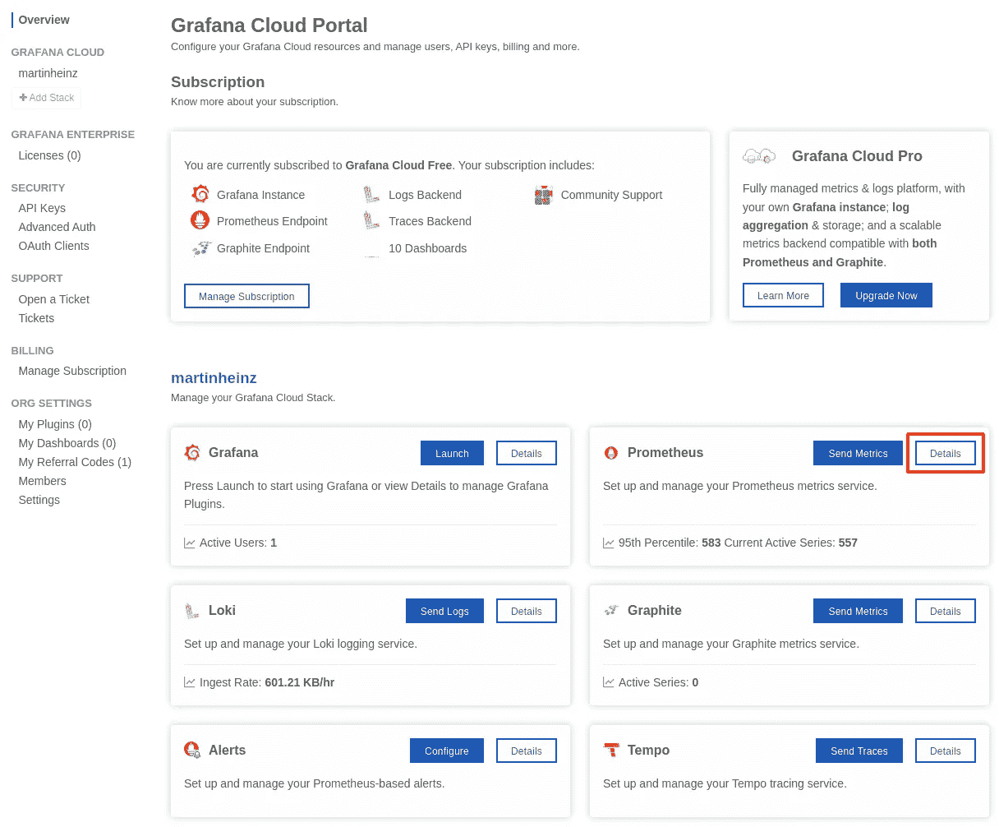
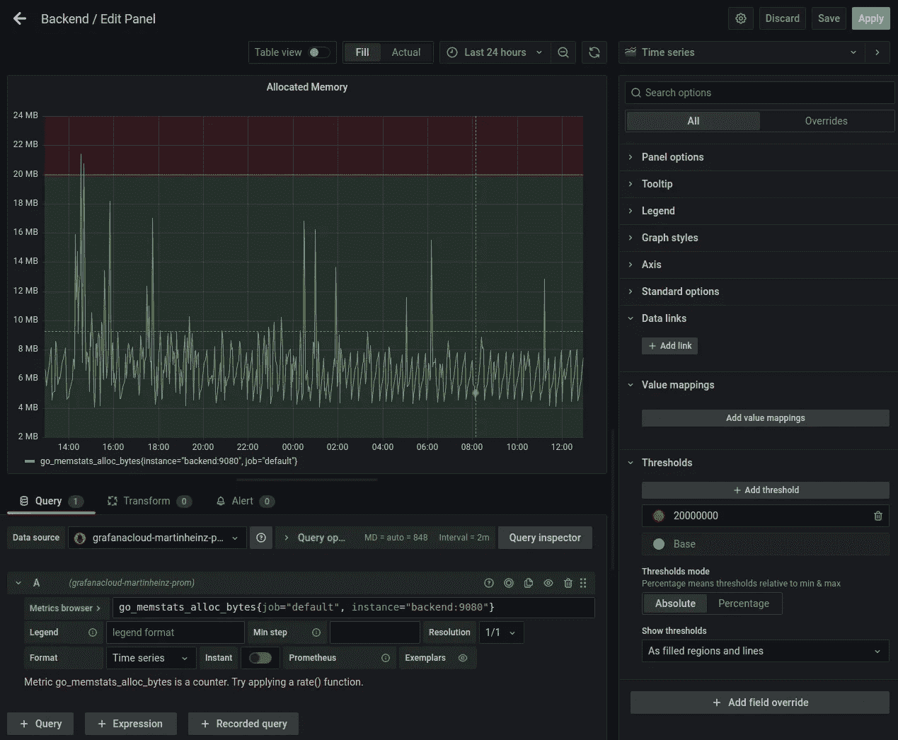
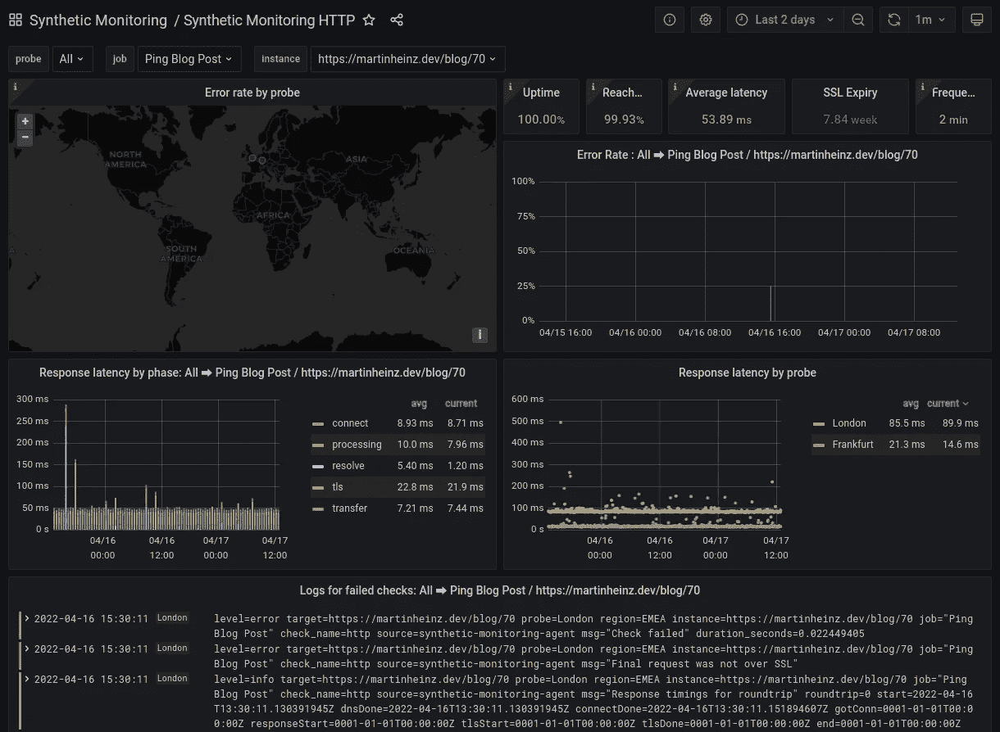
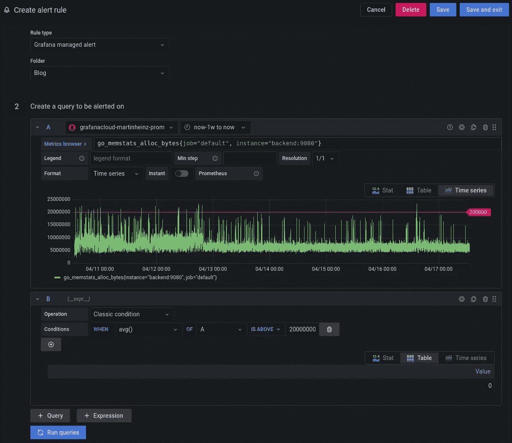
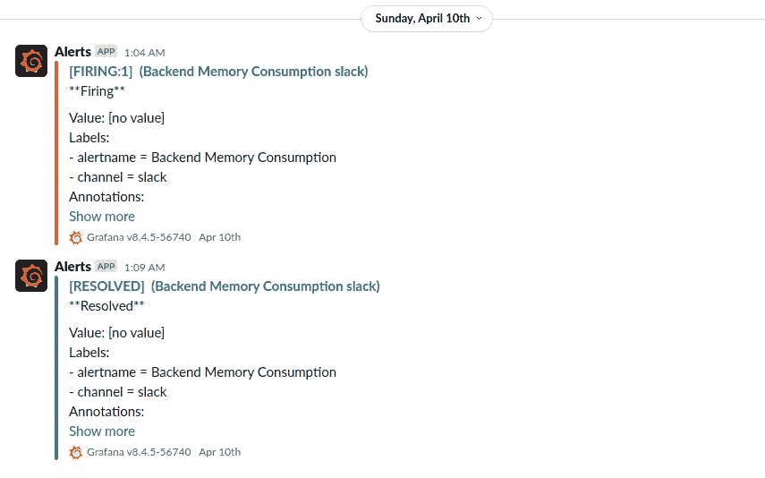
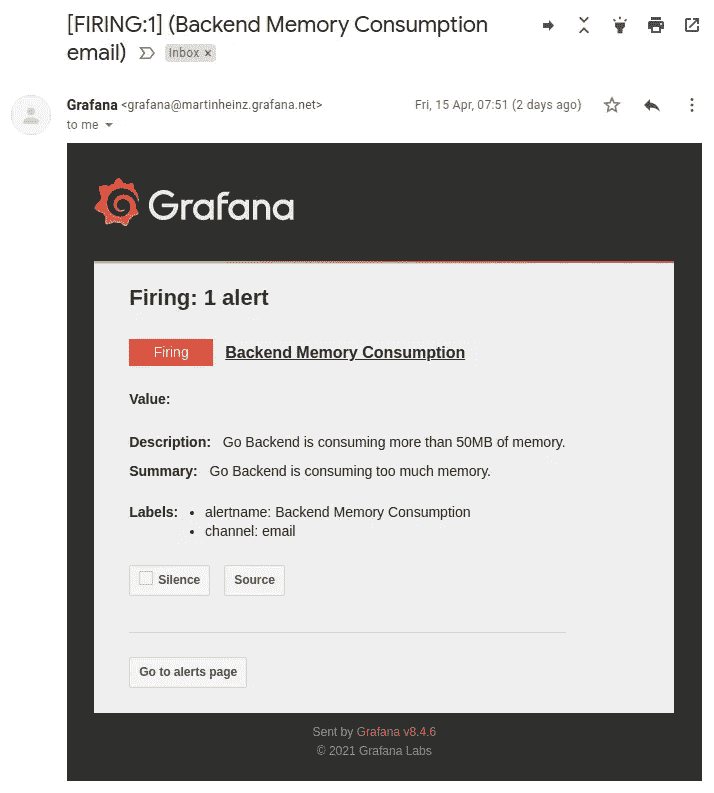
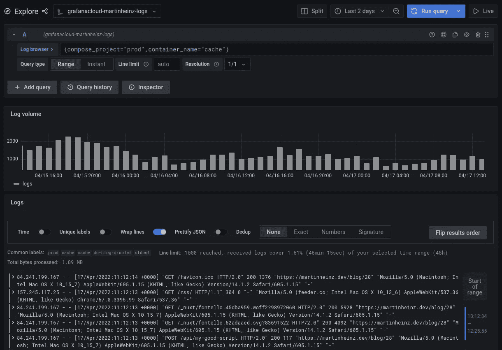

# 借助 Grafana Cloud 轻松实现端到端监控

> 原文：<https://itnext.io/end-to-end-monitoring-with-grafana-cloud-with-minimal-effort-a3052d402149?source=collection_archive---------2----------------------->

## Grafana Cloud 提供完整的监控设置，包括指标、综合数据、日志、警报、跟踪等，全部免费

在构建应用程序时，监控通常在清单的最后，但它对于确保应用程序平稳运行以及快速发现和解决任何问题至关重要。

构建完整的监控—包括聚合日志记录、指标、跟踪、警报或综合探测—需要大量的精力和时间，更不用说构建和管理所需的基础架构了。因此，在本文中，我们将探讨如何使用 Grafana Cloud 快速、轻松地设置所有这一切，并且不需要任何基础设施，全部免费。

# 基础设施提供商

中小型项目不保证建立完整的监控基础设施，因此托管解决方案是一个不错的选择。同时，没有人愿意花大价钱只为了让几个微服务活下去。

但是，有几个带有免费层的托管监控解决方案可以提供您可能需要的所有东西。

首先是 *Datadog* ，它提供免费的[基础设施监控](https://www.datadoghq.com/pricing/?product=infrastructure#infrastructure)，这不会让我们走得太远，尤其是考虑到不包括警报

更好的选择是*新遗迹*，它有一个[免费计划](https://newrelic.com/pricing)，可能包括你可能需要的一切。一个缺点是 New Relic 使用了一套专有工具，这造成了供应商锁定，并使其难以迁移到另一个平台或拥有基础设施。

第三，在我看来，这里最好的选择是 *Grafana Cloud* ，它有一个相当慷慨的[免费计划](https://grafana.com/pricing/)，包括使用一套流行的开源工具(如 Prometheus、Alertmanager、Loki 和 Tempo)进行日志记录、度量、警报和综合监控。这是我能找到的最好的免费平台，我们将用它来设置我们的监控。

为了完整起见，我也看了 Dynatrace、Instana、Splunk、Sumo Logic 和 AWS Managed Prometheus，那些都没有免费计划。

正如我提到的，我只考虑免费选项。如果你需要在你的基础设施上运行一个监控栈，我强烈推荐使用*“普罗米修斯和朋友”*，也就是普罗米修斯、Alertmanager、灭霸和 Grafana。最简单的部署选择是使用[普罗米修斯操作器](https://github.com/prometheus-operator/prometheus-operator)。

*注意:这不是赞助的(呵，我希望)，我只是决定在这个平台上转一圈，我真的很喜欢它，所以我决定为你和我未来的自己写一篇文章。*

# 韵律学

你可以在[https://grafana.com/products/cloud/](https://grafana.com/products/cloud/)注册 Grafana Cloud 帐户，假设你已经这样做了，你现在应该可以在[https://USERNAME.grafana.net/a/cloud-home-app](https://USERNAME.grafana.net/a/cloud-home-app)访问你的帐户。

我们将通过向客户发送 Prometheus metrics 开始构建我们的监控。在我们开始之前，我们需要访问 Grafana Cloud 为我们提供的 Prometheus 实例。您可以在位于[https://grafana.com/orgs/USERNAME](https://grafana.com/orgs/USERNAME)的 Grafana 云门户网站上找到您帐户中所有可用服务的实例。从那里你可以通过点击*细节*按钮导航到普罗米修斯配置。在那里，您将找到向实例发送数据所需的所有信息，即用户名、远程写端点和 API 密钥(您需要生成这些信息)。

Grafana 云门户—作者图片

通常 Prometheus 抓取指标，在 Grafana Cloud 中，Prometheus 实例配置为使用推送模型，其中您的应用程序必须使用 [Grafana Cloud Agent](https://grafana.com/docs/agent/latest/) 推送指标。在上述 Prometheus 配置页面上，您还会看到示例`remote_write`配置，您可以将它添加到您的代理中。

为此，我们将使用`docker-compose`构建一个简单的应用程序和代理:

上面的配置为代理和 sample Go 应用程序提供了合理的默认设置。它通过环境变量设置 Prometheus 主机、用户名和 API 密钥(密码)，这些变量应该使用`.env`文件提供。

除了上述`docker-compose.yml`，您还需要代理配置，例如:

这个配置告诉代理抓取在`api:8080`运行的示例应用程序，并在`/metrics`公开指标。它还告诉代理在推送指标时如何向 Prometheus 进行身份验证。

在现实世界的应用程序中，您可能倾向于在 HTTPS 上运行`/metrics`端点，但是这在这里是行不通的，所以要确保服务器监听 HTTP，而不是 HTTPS。

最后，在运行`docker-compose up`之后，您应该能够使用`curl localhost:8080/metrics`访问 API 指标，还可以看到代理的日志，例如:

要查看代理本身收集和发送的度量，您可以使用`curl localhost:12345/metrics`。

# 仪表板

随着数据流向您的 Prometheus 实例，是时候在仪表板上可视化它了。导航至 https://USERNAME.grafana.net/dashboards[的](https://USERNAME.grafana.net/dashboards)，点击以下屏幕中的*新仪表板*和*新面板*。选择`grafanacloud-<USERNAME>-prom`作为数据源，您应该会看到*指标浏览器*字段填充了您的指标。

下面你可以看到一个示例仪表板，显示了一个 Go 应用程序的内存消耗。仪表板被额外配置为显示 20MB 的阈值，该阈值可以在右侧面板的底部设置。

仪表板面板—按作者分类的图像

# 人工合成材料

除了使用应用程序公开的指标来监控应用程序之外，您还可以利用综合监控来持续探测服务的状态代码、响应时间、DNS 解析等。

Grafana Cloud 提供合成监控，可在[https://username . grafana . net/a/grafana-synthetic-monitoring-app/home](https://USERNAME.grafana.net/a/grafana-synthetic-monitoring-app/home)访问。从那里您可以导航到*检查*选项卡并点击*添加新检查*。您可以从 HTTP、PING、DNS、TCP 或 Traceroute 选项中进行选择，这些选项在[文档](https://grafana.com/docs/grafana-cloud/synthetic-monitoring/checks/)中有解释。填写剩余字段应该是不言自明的，但是在选择探测位置时，要注意运行的探测越多，生成的日志就越多，这些日志会计入您的消耗/使用限制。

Grafana Cloud Synthetics 的一个很好的特性是，你可以将它们导出为 *Terraform* 配置，这样你就可以通过 UI 手动构建检查，并获得代码形式的配置。为此，导航至[https://username . grafana . net/plugins/grafana-synthetic-monitoring-app](https://USERNAME.grafana.net/plugins/grafana-synthetic-monitoring-app)并点击*生成配置*按钮。

创建完支票后，您可以查看为每种类型的支票自动创建的仪表板。例如，HTTP check dashboard 将如下所示:

HTTP Synthetics —作者图片

如果您正在监控配置了 web analytics 的网站，那么您会希望从分析收集中排除 Grafana 探针的 IP。不幸的是没有静态 IP 的列表，但是你可以使用下面的 [DNS 名称](https://grafana.com/docs/grafana-cloud/reference/allow-list/#synthetic-monitoring)来查找 IP。

# 警报和通知

度量和合成探测都为我们提供了大量数据，我们可以使用这些数据来创建警报。要创建新的警报，您可以导航至[https://USERNAME.grafana.net/alerting/list](https://USERNAME.grafana.net/alerting/list)并点击*新警报规则*。如果您使用 Prometheus 遵循上面的示例，那么您应该选择`grafanacloud-<USERNAME>-prom`作为数据源。您应该已经看到两个准备好的查询字段，您可以在字段 A 中输入您的指标，在字段 b 中输入表达式来计算规则。完整的配置应该如下所示:

警报-作者提供的图像

当您滚动浏览可用指标时，您可能会注意到它现在还包括诸如`probe_all_success_sum`(通常为`probe_*`)之类的字段，这些是由前面部分中显示的合成监视器生成的指标，您也可以使用这些指标创建警报。一些有用的例子是:

*   SSL 过期时间:

*   API 可用性:

*   Ping 成功率:

*   代理看门狗:

您还可以使用现有的合成监控仪表板来获得灵感——当您将鼠标悬停在仪表板中的任何面板上时，您将看到用于创建它的 *PromQL* 查询。您还可以进入仪表板设置，使其可编辑，然后从每个面板复制查询。

准备好警报后，我们需要配置一个*联系点*，他们将向其发送通知。那些可以在[https://USERNAME.grafana.net/alerting/notifications](https://USERNAME.grafana.net/alerting/notifications)看到。默认情况下，会为您创建一个电子邮件联系方式，但是您应该填写其电子邮件地址，否则您将不会收到通知。您可以通过点击*新接触点*来添加更多接触点。

最后，为了将警报路由到正确的联系点，我们需要在[https://USERNAME.grafana.net/alerting/routes](https://USERNAME.grafana.net/alerting/routes)配置*通知策略*，否则它将成为默认的电子邮件联系人。单击*新策略*并设置您选择的联系人，如果您只想向该联系人分配一部分提醒，还可以选择设置匹配标签。在我的例子中，我将警报和策略的标签都设置为`channel=slack`。

下面是分别发送到电子邮件和 Slack 的结果警报。如果您不喜欢警报消息的默认模板，您可以通过单击*新模板*在*联系人*选项卡中添加您自己的模板。

宽限通知-按作者排序的图像

电子邮件通知—按作者分类的图像

# 日志

Grafana Cloud 还允许您使用 *Loki* 收集日志。实例是自动为您提供的。要开始将日志从您的应用程序发送到 Grafana Cloud，您可以前往 *Grafana Cloud Portal* 并检索 Loki 的凭据，与之前 Prometheus 的相同。

你可以使用代理发送日志，或者如果你用 Docker 运行应用程序，你可以使用 Loki 日志插件，我们将在这里做。

首先，您需要安装插件:

之后，您需要像这样更新`docker-compose.yml`:

上面为每个容器设置了 Docker Loki 插件提供的日志驱动。如果你想为以`docker run`开始的单个集装箱设置驱动程序，那么在这里检查单据[。](https://grafana.com/docs/loki/latest/clients/docker-driver/configuration/#change-the-logging-driver-for-a-container)

在使用更新的配置启动容器后，您可以通过检查`agent`容器中的`/tmp/positions.yaml`文件来验证代理是否找到了日志。

随着日志流向 Grafana Cloud，您可以通过选择`grafanacloud-USERNAME-logs`作为数据源并查询您的项目和容器，在[https://USERNAME.grafana.net/explore](https://USERNAME.grafana.net/explore)中查看它们:

日志—按作者分类的图像

# 跟踪

监控设置的最后一块拼图是使用*速度*的轨迹。同样，与 Prometheus 和 Loki config 类似，您可以从 Grafana Cloud Portal 获取 Tempo 的凭证和代理配置示例。

代理需要的附加配置应该如下所示:

另外`docker-compose.yml`和`.env`应该包括`TEMPO_HOST`、`TEMPO_USERNAME`和`TEMPO_PASSWORD`的凭证变量。重启容器后，您应该在`agent`日志中看到跟踪组件已经初始化:

在上面的输出中，您可以看到收集器在`0.0.0.0:4318`监听踪迹。因此，您应该配置您的应用程序，将遥测数据发送到此端点。参见 [OpenTelemetry reference](https://opentelemetry.io/docs/reference/specification/protocol/exporter/) 找到与您的 SDK 相关的变量。

要验证跟踪是否被收集并发送到 Tempo，您可以运行`curl -s localhost:12345/metrics | grep traces`，它将向您显示以下指标:

# 结束语

最初，我对 15 天的 Pro 试用有些恼火，因为我想测试免费计划的局限性。然而，在试用到期后，我意识到我甚至没有超过免费计划的限制，也没有接触到专业/付费功能，所以免费计划似乎很慷慨，特别是如果你只是试图监控几个流量较低的微服务。

即使使用免费计划，Grafana Cloud 也能真正提供您需要的所有工具，以实际零成本为合理的大规模部署设置完整的监控。我还非常喜欢这样的做法，即只根据公制系列和对数线的数量来计算使用量，这样很容易跟踪。这也得益于全面的*计费/使用*仪表盘。

*本文最初发布于*[*martinheinz . dev*](https://martinheinz.dev/blog/72?utm_source=medium&utm_medium=referral&utm_campaign=blog_post_72)

[成为会员](https://medium.com/@martin.heinz/membership)阅读媒体上的每一个故事。**你的会员费直接支持我和你阅读的其他作家。**你还可以在媒体上看到所有的故事。

 [## 通过我的推荐链接加入媒体-马丁·海因茨

### 作为一个媒体会员，你的会员费的一部分会给你阅读的作家，你可以完全接触到每一个故事…

medium.com](https://medium.com/@martin.heinz/membership) 

你可能也喜欢…

 [## 所有 Python 项目的终极 CI 管道

### 您对 Python 项目持续集成管道的所有期望—启动并运行…

towardsdatascience.com](https://towardsdatascience.com/ultimate-ci-pipeline-for-all-of-your-python-projects-27f9019ea71a)  [## 通过 Pod 就绪关口提高应用程序可用性

### 当 Pod 就绪和活性探测不够好时，您能做什么？

towardsdatascience.com](https://towardsdatascience.com/improving-application-availability-with-pod-readiness-gates-4ebebc3fb28a)