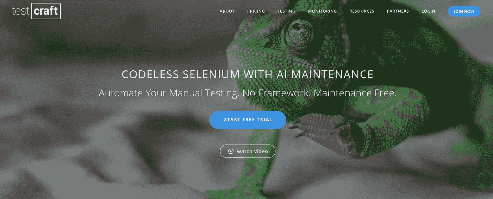

# 关于端到端测试，您需要知道的是

> 原文：<https://itnext.io/end-to-end-testing-78033fb768a8?source=collection_archive---------3----------------------->

在今天的软件工程行业中，端到端测试已经变得非常普遍。它们由不同规模的团队执行，目的是确保软件产品的所有组件，内部的和外部的，都被开发为需求规格中规定的功能。

软件团队进行各种各样的测试，以确保他们的产品按预期运行。这些测试可能是单元测试、回归测试、集成测试等等。今天的软件系统可能变得非常复杂，与同一公司其他团队的大量外部服务和内部服务相互连接，因此需要一种方法来确保系统的所有部分协调工作。

端到端测试通常使用生产环境中使用的类似参数来执行，目的是确保系统中数据的正确流动。

在本文中，我们将学习很多关于端到端测试的知识，并找出一些令人兴奋的工具来帮助我们完成这些测试。

**端到端测试需要什么**

团队在测试阶段包含的关于端到端测试的细节对于端到端测试的成功非常重要。

成功的端到端测试的第一步是创建用户功能，这些功能能够正确地模拟要测试的软件产品所执行的真实活动。这将使测试团队能够根据传递给这些用户函数的参数来设置测试成功或失败的条件。

一旦这些都准备好了，就有可能建立模拟真实工作流的测试用例，并提供测试条件下的性能基准。

为了衡量这些测试的成功，团队可以考虑每周完成的测试的数量，同时根据计划的测试总数记录成功和失败。其他需要注意的事项包括:

*   测试用例准备的当前状态与已经计划的测试用例数量的对比。
*   一周结束时已处理或无人处理的检测数量。还应该注意到这些缺陷基于优先级和严重性的分布。
*   与计划测试执行的总时间相比，执行测试所花费的时间。

**端到端测试流程**

端到端测试因不同的组织而异，这是因为跨这些组织执行的工程过程的独特性。但是，端到端测试中涉及的主要活动包括:

*   对现有系统及其测试要求的分析
*   概述设置测试环境的硬件/软件要求以及所有相关团队成员的责任。
*   每个子系统的测试用例的分析和设计。
*   能够记录每个系统的输入和输出数据，并将它们与目标指标进行比较。

**如何进行端到端测试**

在上一节中，我们看了端到端测试中经常执行的关键活动。在这里，我们看看这些活动可以实施的实际方法。

实现端到端测试可能是一个费力的过程，特别是对于有几个互连系统要测试的大型组织。因此，作为实现端到端测试的第一步，明智的做法是为最关键的业务组件或最容易出现缺陷的组件确定测试，并尽快为这些组件设计测试用例。

下一步是选择一个测试框架。对于全球团队在系统设计中使用的各种技术，存在几种测试框架。这些测试框架中的一些是技术相关的，而另一些则不是。

常见的解决办法是[硒](https://www.selenium.dev/)。正如维基百科所描述的，

*   ***Selenium*** *是一个测试 web 应用的可移植框架。Selenium 为创作功能测试提供了回放工具，而无需学习测试脚本语言(Selenium IDE)。*

它是一个开源的测试框架，专注于 web 应用程序。为端到端测试开发 Selenium 自动化框架需要考虑一系列问题。

首先，框架需要从头开始建立，并适应产品的需求。这可以在内部完成，也可以外包。

接下来，做这件事的时间和成本也需要考虑。开发这个测试套件可能需要几个月的时间，这取决于操作的复杂性和规模。当外包时，成本通常会更高。

将这个自动化框架集成到整个开发工作流程中也是一件麻烦的事情，因为需要创建新的流程来将工作整合到框架中并定义特定的条件。

其他考虑因素包括创建新工作流程的成本、建立测试实验室的成本、建立测试和开发团队的成本以及确保整合的成本。

一个更好的选择是无代码测试自动化平台。一个很好的例子就是 [Testcraft](https://www.testcraft.io/) 。它为端到端测试提供测试自动化，作为一个软件服务，具有易于使用的界面，因此不需要自动化专家来建立框架或外包工作。

它使用机器学习技术来减少有效维护团队的 Selenium 测试流程所需的时间和资源，并在每次运行时生成详细的报告。这些报告中包含的详细信息是屏幕截图和视频，说明需要修复的内容。

测试执行也可以很容易地安排，内置的测试实验室节省了为传统自动化框架建立测试实验室的时间和成本。

其他值得注意的特性包括与 [CI/CD](https://en.wikipedia.org/wiki/CI/CD) 工具的平滑集成，简化了与团队现有的[软件开发生命周期(SDLC)](https://en.wikipedia.org/wiki/Systems_development_life_cycle) 的集成，防止测试在 web 产品变化时中断的智能绑定，以及简化维护过程的交互式 UI 元素。

**端到端测试的安全实践**

为了确保软件团队能够从在他们的系统上执行端到端测试中获得最佳效果，以下实践可能会有所帮助:

*   从用户的角度测试相关的系统。这有助于测试用例的正确设计。
*   端到端测试应该只测试典型的用户活动。可以进行集成测试和单元测试，以确保系统不会异常运行。
*   专注于系统的高风险部分或构成业务关键部分的部分。分析每个系统组件带来的风险会很有帮助。

**结论**

我们研究了端到端测试，以及它如何确保系统网络按预期工作。

今天的软件应用程序是建立在几层之上的，一个特定组件的故障可能会使整个产品瘫痪。确保正确执行端到端测试可以指出复杂系统中的这些故障点，并防止大规模损坏和收入损失。

**进一步解读**

*   [https://dzone.com/articles/what-is-end-to-end-testing-1](https://dzone.com/articles/what-is-end-to-end-testing-1)
*   [https://www.testcraft.io/ui-testing/](https://www.testcraft.io/ui-testing/)
*   [https://www . freecodecamp . org/news/why-end-to-end-testing-is-important-for-your-team-CB 7 EB 0 EC 1504/](https://www.freecodecamp.org/news/why-end-to-end-testing-is-important-for-your-team-cb7eb0ec1504/)
*   [https://www . software testing help . com/what-is-end-to-end-testing/](https://www.softwaretestinghelp.com/what-is-end-to-end-testing/)
*   [https://www.guru99.com/introduction-to-selenium.html](https://www.guru99.com/introduction-to-selenium.html)
*   [https://www.testcraft.io/resources/](https://www.testcraft.io/resources/)