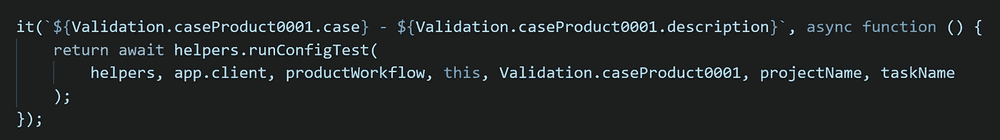
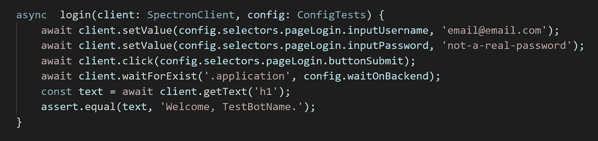
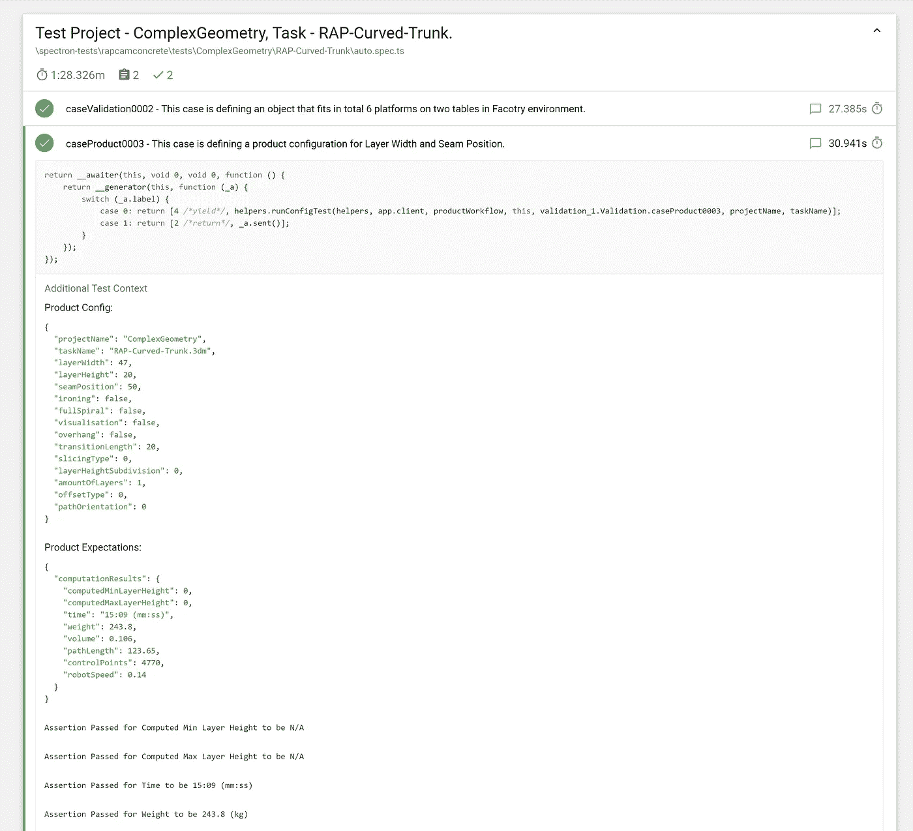

# 端到端测试增材制造软件

> 原文：<https://itnext.io/end-to-end-testing-additive-manufacturing-software-f2d28ae4b2f4?source=collection_archive---------4----------------------->

## 我们如何应对 RAP 技术的衰退和压力

在 [**RAP Technologies**](http://raptech.io) 我们为**机器人 3D 打印**构建软件。我们的算法必须解释人们在设计过程中可能会想到的无限多的几何图形。我们提供了许多不同的设置，这些设置会影响正在生成的打印路径的各个方面。这些打印路径的质量对于打印的最终结果至关重要。我们的客户希望我们的软件在生产时是完美的，因为他们每周 7 天、每天 24 小时都在运营他们的工厂。在紧急情况下或无法生成指令时，我们有责任尽快提供可行的解决方案。我们的 B2B SLA 协议有着严格的规则，当问题出现时，这一点也不好玩。

大规模增材制造

> gCAD&CAM 应用中的几何处理算法与基于云的现代技术相结合，为我们的系统基础设施带来了额外的复杂性&，当引入新功能或更新框架时，这可能会导致意外的倒退。当开发团队将新版本的软件投入生产时，随之而来的是压力。本文旨在通过我们在 RAP Technologies 构建产品时获得的经验来分析**自动化 E2E 测试作为软件系统稳定性**背后的保护原则。为了缩小范围，单元测试及其重要性没有被提及。我们稍后可能会详细说明这一点。

# 对抗复杂性

我们的产品由许多活动部件组成，这些部件必须协同工作。我们有代码处理**电子、NodeJS** 、**角度、WebGL、Azure Blob 存储**、**宇宙& Mongo 数据库**、 **Azure 无服务器功能**、各种 **CAD & CAM** 库、**机器人** **模拟器**等。我们软件的算法每天都在改进，库和框架定期更新，以确保我们产品的安全，正如之前所述，事情可能会也确实会出错。不是若**的问题，而是**时**的问题。因此，当回归出现时，立即找到它们是至关重要的，这样可能的原因的表面会更小，开发人员可以更快地查明问题。**

> 考虑到我们的应用程序的性质，不可能雇佣足够多的测试人员在每次引入新特性时都有时间点击所有不同测试用例几何的所有可能的设置排列。此外，我们希望我们的测试人员专注于测试新代码，建立良好的测试脚本，并积极参与开发过程。重新评估旧的断言不是他们应该花费时间的地方。

自动化似乎为我们的问题提供了一个答案。在架构上，我们基于**电子**的应用程序使得使用 [**分光镜**](https://electronjs.org/spectron) 来实现 **E2E** 测试成为可能。我们预计这项投资的回报将体现在团队生产力的提高、更快的回归检测以及不可低估的更好的情绪上。不过，做出这个决定并不便宜。开发人员将花费精力编写测试用例，并投入时间与测试人员就必须确定的有效场景达成一致。但是我们踩下了加速踏板，再也没有回头，这是一个伟大的投资，这就是为什么。

# 我们如何管理自动化

很明显，必须为所有的特性状态排列编写大量的测试用例。幸运的是，开发人员在节省测试时间时非常有创造力。我们将这种“创造力”发挥到了极致。**开发者可以自由地做他们最擅长的事情——抽象和概括**。我们对待测试就好像它是代码库的一个史诗般的特性。

我们的 **E2E** 战略的想法非常简单，它必须遵循基本的 AAA 模式:

**排列**->-**动作**->-**断言**

我们将这个想法发挥到了极致，将 AAA 模式与算法概念相匹配

**输入- >功能- >输出**

这意味着我们将**安排**步骤抽象到一个 JSON 配置中，该配置描述了应用程序状态和对断言的基本期望。 **Act** 步骤变成了一个通用的应用程序解释器**函数**，它基于**输入**配置将应用程序设置为所需状态，并在流程中运行指定的断言。从我们的 **E2E** 基础设施出来的**输出**被自动处理为报告。

为了清楚起见，我包括了这个 AAA 函数映射的小方案。

**输入/排列** — App 状态+期望配置。

**功能/行为** —通用驱动程序，根据情况描述逐步执行应用程序并检查预期。

**输出/断言** —报告中通过/失败的断言。

正如您所想象的，函数部分花了最长的时间来实现。这是所有点击事件发生的地方，输入值被设置为使应用程序进入“正确的思维状态”。对于每个工作流，我们都构建了一个通用的运行器，它可以处理 UI 的所有排列，并读取输出的所有排列来做断言。为此，通用应用程序解释器必须理解应用程序的基本逻辑组件，只需读取页面上的 HTML 元素。再往下，同样的代码必须能够通过解释输入状态配置来执行模拟用户的各种步骤。

运行 E2E 测试的屏幕截图

这种方法允许我们通过提供简单的排列期望输入来测试各种各样的工作流。我们试图让 **E2E** 测试的功能部分对工作流的所有测试用例保持不变。只有当特性改变时，我们才会去接触功能层中的代码。整个测试项目变成了应用中的应用。在这一段的底部，我们提供了一个抽象完成后的单个 **E2E** 测试的例子。事实上，所有的测试看起来都是一样的，只是案例号和工作流运行者在不同的情况下会有所不同。我们甚至可以更进一步，通过解析所有的案例并生成这个测试，去掉 **it** 函数。为了方便起见，现在只使用 **xit** 和 **it.only** 助手。

启动产品工作流程的 E2E 测试的单一函数调用

# **技术堆栈**

如前所述，我们基于**的 UI 运行在 [**电子**](https://electronjs.org/) 外壳中，这允许我们使用**Spectron**——一个支持编写 **E2E** 测试的伟大工具。 **Spectron** 本身只是在**web driver**&**Selenium**之上的一层。它包含了一些简单的方法来与**电子**应用实例进行交互。开发者通过 **Selenium** 和 **WebDriver** 与 DOM 元素进行交互，WebDriver 负责操纵位于电子版的 Chromium 浏览器。**

**通常在构建应用程序时，泛型是自底向上传播的。更深的层次通常包含大量的泛型，然后一层一层地向上移动到各种库和框架，直到到达应用层。Spectron 提供了一个良好的基础抽象，并向开发人员公开了整个 **Selenium** API，但我们希望构建更高级别的抽象，这些抽象与我们的组件库和应用程序工作流更相关。**

> **必须开发测试的功能层，所有标准质量检查和林挺配置都要到位。对于**电子**中的**节点**代码和 UI 中的**角度**代码，我们已经在使用**类型脚本**。纯 Javascript**似乎也不是编写 **Spectron** 测试的好选择——很大程度上是因为完整 API 的规模。我们选择使用 **Typescript** 来获得最先进的 **IntelliSense、IntelliCode** 以及这个超级 Javascript 在原始代码库中为我们提供的所有其他好东西。****

****这被证明是正确的选择，因为该团队只对编写 **Selenium** 测试和 **Typescript** 帮助我们学习得更快。开发人员不需要仅仅为了开始而滚动无限量的 Selenium 文档。经过几个小时的编程，我们已经有了一些运行测试的工作原型，这些测试登录到我们的应用程序并检查其标题，然后再次关闭一个应用程序——e2e 的**你好世界**。****

****我们选择了 [**摩卡**](https://mochajs.org/) 作为测试框架。它有一个熟悉的类似单元测试的语法和**描述/it** 范例。标准的 **Spectron** 断言库是开箱即用的，对于报告框架，我们得到了 [**Mochawesome**](https://www.npmjs.com/package/mochawesome) 。附加信息&通过 **addContext** 方法记录错误截图。我们选择不使用 Promise chaining 语法，而是用 **async** / **await** 代替，因为它与 **Typescript** 一起使用效果更好。在底部，你可以看到我们的代码片段。实际上，这很简单。****

********

****Spectron 登录测试示例****

## ****用 Mochawesome 报道****

****对于任何测试框架来说，提供一个好的、简洁的、详细的、可以在团队中共享的报告都是至关重要的。对我们来说，Mochawesome 拥有我们在记者身上寻找的一切。它提供了独立的 HTML 报告的可能性，没有任何复杂的依赖性——比如运行 NodeJS 服务器或奇怪的 CLI 工具。我们正在研究的其他一些替代方案正是这样做的，使得设置非常复杂，感觉超出了范围。****

********

****Mochawesome 报表示例****

****Reporter 还显示了每个测试用例运行的时间。向它记录额外的信息很容易，只是要记住，如果你想使用带有 addContext 的 arrow 函数，你必须将原始的' **this** '上下文从最初的测试函数作用域向下传递到你的 lambdas，或者通过其他方式提供它。****

# ****从一个**端 2** 到另一个**端******

****当编写任何测试时，理解覆盖的内容和应用程序触发的路径是很重要的。幸运的是，E2E 测试触及了基础设施的所有部分。它不仅识别功能算法故障，还遍历我们的 UI、所有后端云 web 服务、数据库和 blob 存储。如果这些组件中的一个不工作或者出了故障，测试将会报告一个问题。起初，真正的问题可能并不明显，但通常通过深入挖掘，很容易找到真正的原因。****

****事实上， **E2E** 代码库比任何文档都更好地反映了真实应用中发生的事情。通过阅读这样的代码，新程序员可以对应用程序的能力形成整体的理解。它变成了一个很好的抽象，将应用程序视为一个黑盒，但以一种任何程序员都可以掌握的简单的方式公开了它的特性。****

******在 RAP Technologies E2E** 测试正在**测试**服务器上运行，但是因为所有的 **DTAP** 街道服务都部署在 Azure 上，并且是按照“基础设施即代码”的思想实现的，所以很容易切换到开发、验收甚至生产服务器。这为将来在整个 DTAP 环境中进行健全性检查提供了一些优势。****

> ****尽管 E2E 测试并没有很好的覆盖率测量机制，但我们最终还是在意想不到的地方发现了意想不到的问题，这一切都是值得的。****

# ****投资回报率****

****虽然实施的初始设置成本确实很高，但事实是红利在实施后立即开始回流。本来会被我们的用户检测到的问题现在被冷血算法检测到了。与接收来自时间紧张的用户的反馈相比，用自己制作的工具发现一个 bug 或回归会在情绪上令人振奋。如前所述，这也节省了我们的测试人员的时间，他们现在可以专注于测试新的特性，而不是担心那些不应该退化的东西。****

## ******标准化排列******

****我们很快认识到，在不同的几何图形中，许多输入配置都是相似的，因此我们决定更进一步，将一些基本的排列配置标准化为一个简单的集合，该集合可以应用于我们测试的任何类型的几何图形。由于不同的几何图形会产生不同的结果，即使使用相同的设置，每次也只需要重新配置期望值。目前，我们有大约 100 个排列配置，它们被应用到我们包含在测试集中的每个新的几何图形中。这暴露了很多我们以前从未发现的错误。如果几何图形需要更多的检查，这个数字总是可以增加。****

## ****表演****

****对于复杂的算法来说，运行 **E2E** 测试可能是一个相当缓慢的过程，但因为开发人员构建功能的同时也在构建测试，他们开始以一种新的方式重新评估算法的性能。 **E2E** 测试允许在运行算法时看到真实的速度，只有单元测试使得获得整体性能图更加困难。识别和消除性能瓶颈使应用程序的工作流程解决得更快。这证明了测试和实际应用之间的积极共生关系。****

# ****结论****

****我们走了很长一段路，但这段旅程还没有结束。我们的 **E2E** 项目正在增长，新的挑战不断出现，我们仍在学习如何管理它。管理所有的测试配置需要相当多的时间，我们正在寻找最好的方法来做到这一点。由于我们希望测试多种几何图形并将性能提升到一个新的水平，因此未来必须研究并行性。与此同时，我们才开始看到这种设置带来的所有好处。我们将在接下来的帖子中分享更多关于我们质量方法的故事，所以请订阅，访问我们的网站 [raptech.io](https://raptech.io) 并在 [LinkedIn](https://www.linkedin.com/company/raptech) 上关注我们。****