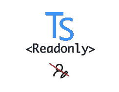

# Typescript 的不变性:提升重构过程

> 原文：<https://itnext.io/enforce-immutability-with-typescript-to-boost-refactor-process-70055dac5d52?source=collection_archive---------9----------------------->

最近我一直在重构我们代码库中的一个巨大模块。

重构对组织来说是一个昂贵的过程，这意味着我把我的(昂贵的)时间花在改进已经给该领域带来价值的东西上，而不是创造有助于销售产品的新功能。

但这也意味着，下一次有人需要向模块添加新功能时，花费的时间会比以前少，这也是该过程的好处之一。

## 重构背后的动机:

*   码脱钩，使其[干](https://en.wikipedia.org/wiki/Don%27t_repeat_yourself)，减少 WTF 规模——使其[实](https://en.wikipedia.org/wiki/SOLID)
*   代码应该为下一个开发人员讲述一个清晰的故事，该开发人员将从我停止的最后一点开始维护或继续([开闭原则](https://en.wikipedia.org/wiki/Open%E2%80%93closed_principle))。
*   提高当前性能。
*   **使向模块添加新功能变得更加容易(再次强调开闭原理)。**

代码重构是一门艺术，也是一个巨大的话题——我不会在这篇文章中深入探讨。

## 使用<readonly>更快地获得单一来源的事实</readonly>

我用遗留代码“继承”的一个实体反映了几个状态(它的每个属性都是一个状态)，这些状态在这么多地方被这么多操作修改了，这真的很难跟踪！

[**Readonly**](https://www.typescriptlang.org/docs/handbook/utility-types.html#readonlyt)**式来救援！**

自己做的形象

> 构造一个类型，其所有属性设置为 T1，这意味着构造的类型的属性不能被重新分配。

由于 TS 惊人的类型系统(因为我在编译时破坏了代码),通过使该实体不可变，我可以很快跟踪它，并且我修复了代码，使其更具声明性，讲述了一个更清晰的故事。

后来我发了以下微博:

## 不可变对象定义

> “在[面向对象](https://en.wikipedia.org/wiki/Object-oriented_computer_programming)和[函数式](https://en.wikipedia.org/wiki/Functional_programming)编程中，不可变对象(不可改变的[【1】](https://en.wikipedia.org/wiki/Immutable_object#cite_note-1)对象)是一个[对象](https://en.wikipedia.org/wiki/Object_(computer_science))，它的状态在创建后不能被修改。”

该推文被 [SentinelOne 的](https://www.sentinelone.com/)天才团队架构师 [Benny Yashinovsky](https://medium.com/u/2ac9b766143e?source=post_page-----70055dac5d52--------------------------------) 查看，他向我提出了以下问题:

“琐事问题——给出一个超越并发性的不平凡的理由，其中不变性很重要”

## 案例研究——更快更容易的重构

以下是我对本尼问题的回答总结:

*   为了**清晰的叙述性故事的不变性。**

通过清除**声明性故事**我的意思是，当你声明一个变量，给它一个信息性的名字，并把它赋给一个函数——希望它能做一件事——代码变得更“讲故事”,因为你可以通过信息性的名字很容易地预测输出，你保留了一个上下文。这同样适用于使用返回新状态的函数，而不是只获得状态并对其进行变异而不返回值的函数(命令式函数——这比使用对象属性/访问器要好),但这是个人喜好的问题，有人可能会说——所以变异并返回变异，我个人倾向于在审查其他代码时注重实效，变异是可以的。

*   **更容易的重构过程**:使用 Readonly 类型强制 TS 不变性导致类型系统抛出错误，这帮助我在保持上下文的同时更快地破坏函数:)。

*   [**组合**](https://en.wikipedia.org/wiki/Function_composition) 当你返回一个类型而不仅仅是改变它时，组合就被激活了:)(函数组合——假设你有两个函数(可以更多),第一个函数的结果/输出可以是第二个函数的输入)

(**并发**(在同一时间从不同线程写/尝试修改状态的意义上)顺便提一下，当运行在单线程 v8 抽象上时，并没有考虑到。)

享受下面的片段，不要停止变异！就用你的常识:)

顺便说一句，如果你喜欢这篇文章，你可能也会喜欢以下内容:

 [## 短时间学习 Haskell 可以很快提高您的打字技能！

### 键入任意函数！仿制药太牛逼了！😎 👏哈斯克尔为了更大的利益。

itnext.io](/a-short-time-learning-haskell-can-shortly-improve-your-typescript-skills-523505900ac0)  [## 识别功能模式——虚拟列表函子实现

itnext.io](/recognising-functional-patterns-functors-for-dummies-2a829c875767)  [## 2 分钟静态键入的 Typescript！

### 介于静态和动态之间，这意味着什么:TS 是一个结构类型系统。

itnext.io](/2-minutes-of-statically-typed-typescript-bb97f894e2f9) 

再次感谢[本尼·雅辛诺夫斯基](https://medium.com/u/2ac9b766143e?source=post_page-----70055dac5d52--------------------------------)一如既往的挑战视角:)

感谢 [Uri Shaked](https://medium.com/u/355b1dfe86ae?source=post_page-----70055dac5d52--------------------------------) 为我评论这篇文章:)

干杯，

利伦。