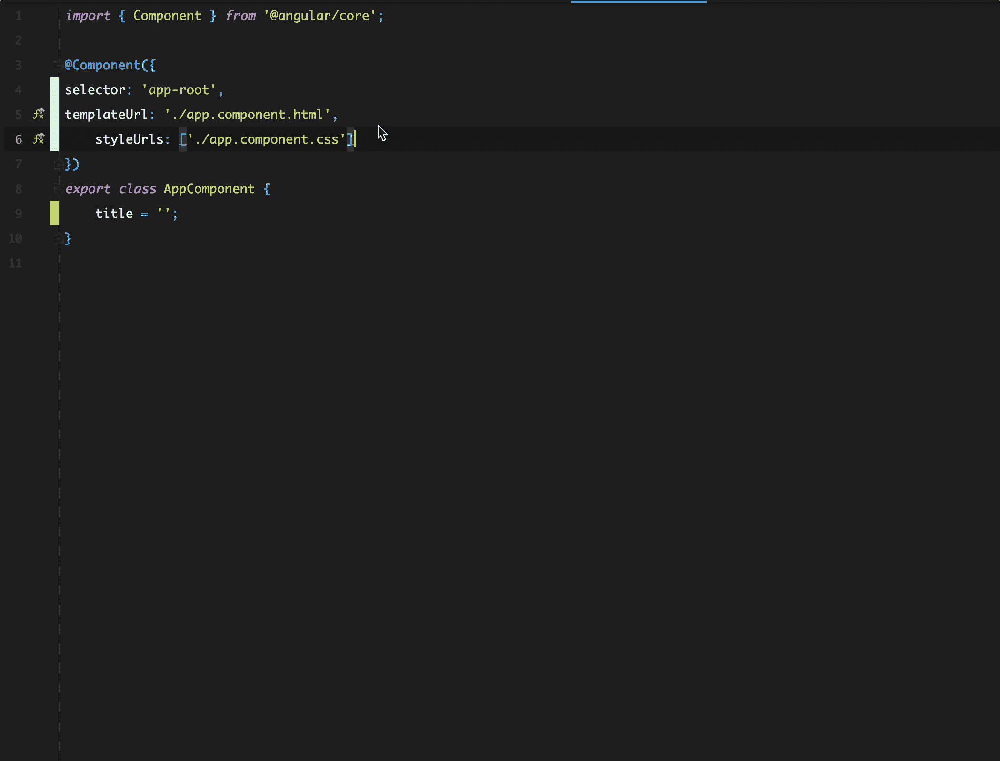

# 用更漂亮的和 TsLint 来加强你的团队的编码风格

> 原文：<https://itnext.io/enforce-your-team-coding-style-with-prettier-and-tslint-9faac5016ce7?source=collection_archive---------5----------------------->



一个项目的编码风格是一个新的高级雇员第一次浏览代码库时首先要关注的，也是最引人注目的特征。

从表面上看，这是因为这可能是一眼就能评估代码库的最简单的方法。从更深层次来说，这是因为优秀的程序员只是喜欢整洁、简单和连贯。这三个简单的方面将决定或打破你的雇员对你的项目和公司的第一印象。

很明显，虽然吸引那些对你的代码库感兴趣的人很重要，但是保持你的代码库的干净和连贯是项目长久和成功的基础。

为什么拥有一个干净一致的代码库是至关重要的，这一系列原因都是众所周知和有据可查的，但对我来说，这些是最重要的原因:

*   使用熟悉的代码库意味着工作得更快更好
*   拥有一致的代码库有助于新员工更快上手
*   拥有一致的代码库使得重构和维护更加容易
*   …

# 开发者体验(DX)很重要🤓

从来没有像今天这样，开发者可以享受无与伦比的开发者体验。尤其是在前端领域，DX 的改进非常重要，不容忽视:静态检查、条件类型、更智能的 ide、linters、自动化测试框架等等。

如果有什么事情让一个团队效率低下，没有动力，那绝对是一个糟糕的 DX。

出于以下几个原因，使 DX 成为团队开发过程的关键部分是架构师/经理的工作:

*   为当前团队和新员工保持技术堆栈的整洁和高效
*   保持团队的快乐和积极性。你团队的士气和你产品的质量一样重要

虽然一个好的 DX 是一个广泛而庞大的主题，但我在本文中要谈论的是好代码的支柱之一:编码指南。

虽然社区范围的指导方针很重要，并且是最佳实践的标准指标，但是我倾向于更重视团队对某种风格的看法，而不是整个社区。团队永远是第一位的——但同时，每一个违背社区标准的决策都应该是合理的，并有文档记录。一个(好的)新员工最终会质疑这样的决定。

对我来说，**编码指南是团队每个成员都同意遵守和尊重的一套规则**。因为这在项目的开始阶段肯定是最重要的，所以现在可用的工具，像 Prettier 和 TsLint，允许项目在任何阶段都符合编码指南。

# 漂亮+简洁=整洁、简单和连贯

正如我之前指出的，整洁、简单和一致是每个开发人员都关心的三件事。beautiful 和 TsLint 对此有何帮助？

*   整洁:多亏了 TsLint 规则(或者 EsLint，如果你使用 JS 的话),理想情况下所有团队都同意这些规则，当违反规则时，开发人员会得到警告
*   简单性:通过添加 pre-commit 钩子，您就免除了开发人员处理某些格式细节的责任，他们可以专注于重要的事情
*   一致性:由于自动格式化，所有的代码看起来都一样，不管是谁写的

正如现在大多数团队使用 PR 和代码评审一样，另一件要提及的重要事情是，根据我的经验，大多数评论通常关注代码风格，而不是实际的潜在错误或 bug。这是令人沮丧的，因为不仅是审查它，而且修复它也是浪费时间。

问题是，代码审查人员**应该**指出那些错误，但理想情况下他们**不应该非得**。

避免在琐事上浪费时间的唯一方法是建立一个轻松的设置，承担提交者几乎所有的格式化责任。

## 如何设置更漂亮和 TsLint ⚙️

设置更漂亮和 TsLint 非常简单。首先，我们安装这两个包:

```
npm install --save-dev prettier tslint-config-prettier
```

如果您使用框架的 CLI 启动项目，那么您可能已经在项目中创建了一个 *tslint.json* 文件。如果没有，请创建它并简单地添加以下内容:

```
{
  "extends": ["tslint:recommended", "tslint-config-prettier"]
}
```

如果您已经拥有了它，只需向*扩展*属性添加“ts lint-config-appellister ”,就像上面的代码片段一样。这是必要的，以便使更漂亮和 TsLint 很好地一起工作。

之后——是时候把*设置得更漂亮*了。为了创建配置文件，我们可以使用各种文件格式，如 *JSON* 、 *JS* 、 *YAML* 或*TOML*——但我喜欢 *YAML* ，所以请在您的根目录(即您的 *package.json* 所在的位置)创建一个文件，并将其命名为 *.prettierrc.*

下面简单介绍一下*。包含我倾向于使用的选项的 prettierrc* 文件:

```
tabWidth: 4
singleQuote: *true* bracketSpacing: *true* printWidth: 80
```

要查看所有可用选项的列表，请访问 beauty 的网站。

这很好，但是这到底有多简单呢？事实并非如此，所以让我们为您的团队简化一下。

你有三个选择:

*   创建一个[预提交钩子](https://prettier.io/docs/en/precommit.html),如漂亮者网站所述
*   设置你的 IDE(如果你使用 WebStorm [使用一个监视器](https://prettier.io/docs/en/webstorm.html)，或者如果你使用 VSCode [使用一个插件](https://prettier.io/docs/en/editors.html))
*   …更好的是，两者都用！对于一个开发者来说，感觉总是提交正确的东西是一件很棒的事情，而且还能得到一个干净的、格式化的文件的即时反馈。

## 外卖⭐️

*   DX 很重要——确保你的团队开心
*   编码风格很重要——确保你的整个团队都同意这一点
*   使用更漂亮和 TsLint(或 EsLint)更好更快地工作

最初发布在 [Frontend Consulting 的博客](https://frontend.consulting/enforce-your-team-coding-style-with-prettier-and-ts-lint)