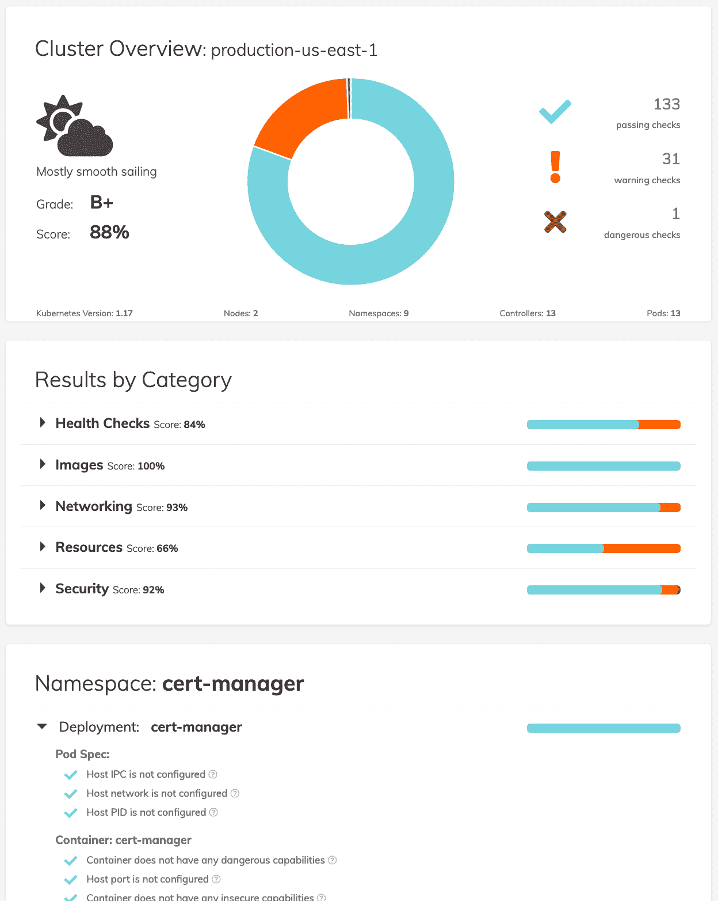

# 在 Kubernetes 执行政策

> 原文：<https://itnext.io/enforcing-policies-in-kubernetes-c0f6192bd5ca?source=collection_archive---------3----------------------->

Kubernetes(K8S)已经成为基于容器的工作负载的首选平台，许多公司已经开始或即将开始将其工作负载迁移到 Kubernetes。

Kubernetes 提供了许多现成的功能，并且向开发人员公开了许多与基础设施相关的控件。不习惯处理这些基础设施级别问题的开发人员可能会努力掌握所有这些不受他们支配的新控件和抽象。培训(比如这里的)当然有助于开发人员快速掌握 K8S，但是如果我们真的想确保我们的应用程序满足所有要求(比如可用性、安全性等)。)我们希望它们实现，我们最好做的不仅仅是在内部网维基页面上发布最佳实践，并期望开发人员虔诚地遵守这些最佳实践。

但是您如何执行您公司的 K8S 最佳实践呢？您如何创建涵盖安全性和高可用性问题的“策略”？如何管理软件服务的行为？

*的所有相关文件都可以在* [*这个 git 回购*](https://github.com/mcelep/blog/tree/master/opa-policies/conformance-testing) *中找到。*

## 输入开放策略代理(OPA)

[开放策略代理(OPA)](https://www.openpolicyagent.org/) 是一个云本地计算基础项目，旨在解决跨云本地堆栈(Kubernetes、Docker、Envoy、Terraform 等)的“策略执行”问题。).

OPA 附带了一种叫做[减压阀](https://www.openpolicyagent.org/docs/latest/policy-language/)的语言来高效地创作策略，除了减压阀，OPA 中还有许多工具&组件来使策略的使用更加简单&高效。

## 实施策略和运行策略检查的不同选项

我们看到了几个选项来执行策略并通知用户与策略的一致性。

## 准入控制器

最终级别的强制策略直接发生在 K8S 集群上。也就是说，可以挂钩到 Kubernetes 的[准入控制器](https://kubernetes.io/docs/reference/access-authn-authz/admission-controllers/)机制来拒绝策略不允许的 K8S 资源修改。

OPA 附带了一个名为 [Gatekeeper](https://www.openpolicyagent.org/docs/latest/kubernetes-introduction/) 的组件，这个组件是一个准入控制器，它的目标是在 K8S 集群上轻松管理和实施策略。

OPA 网守可以(自 2020 年 10 月 30 日起)拒绝接纳请求(可选地提供一些关于接纳被拒绝的原因的解释)或不带任何解释地接受接纳请求。目前，没有办法接受许可，而是向用户返回一个**警告**(一个用例可能是这样的:一个请求可能在那个时间点被许可，但由于即将到来的策略更新，在稍后的日期将不再被许可)。Github 上有一个[未解决的问题](https://github.com/open-policy-agent/gatekeeper/issues/701)是关于增加一个*警告*动作。

使用*准入控制器*带来了一种二进制方法来接受 K8S 集群上 API 资源的更改。这有助于确保没有不符合策略的工作负载在平台上运行，但是它没有区分推荐的和强制的实践。这就是基于“成绩单”的方法派上用场的地方。

## 可视化/报告卡

为 K8S 集群上运行的工作负载创建一个“一致性”报告是一个很好的方法，可以提高应用程序团队对其应用程序如何满足需求的认识。在我们的专业服务项目中，包括将应用程序调试到生产环境中，我们通常会准备一份定制的“生产准备就绪清单”文档，其中包括强制项目和推荐项目。该列表中的某些点可能非常普遍，但由于高可用性、性能或法规要求(如金融服务法规)等需求，有些点是特定于客户的。

创建一个按需(或定期)以编程方式生成的报告卡，并以一种视觉上令人愉悦的方式向用户显示该报告，对于许多拥有许多 K8S 应用程序的大型组织来说非常有用。

[北极星 OS 项目](https://github.com/FairwindsOps/polaris)自带了这样一个开箱即用的功能，见下图:



当创建这样的报告时，不仅显示失败的策略检查，而且提供关于为什么创建这样的策略规则以及如何修复该问题的一些解释(通常通过提供到内部 wiki 页面的链接)，将会被报告的读者非常欣赏。

## CI/CD

您可以根据策略测试 K8S 资源的另一个点/阶段是 CI/CD 管道，更准确地说，是 CI/CD 的 CD(连续交付)部分。在大多数 CI/CD 解决方案中，向部署管道添加一个“策略检查步骤”应该很容易。作为部署管道的一部分运行策略一致性检查的好处是，一致性检查结果不仅可以包括 **Ok** 或 **Nok** s，还可以包括警告。CI/CD 系统还可能允许您保存报告。此外，如果 K8S 集群(尤其是生产集群)只能通过 CD 管道访问(而不是像我们在许多企业中看到的那样由用户直接访问)，并且如果您可以在所有部署管道中强制执行这样的“策略检查步骤”，那么您最终会得到一个类似于“准入控制器”的解决方案。

## 外地加工措施政策实践

在这一节中，我们将编写一些策略来更好地理解这个过程。

## 减压阀

[减压阀](https://www.openpolicyagent.org/docs/latest/policy-language/)是一种 DSL，进入它并不困难，但据说需要一些时间来适应。

[如果您想从基于自定进度视频的培训开始，这个](https://academy.styra.com/courses/opa-rego)免费课程会很有帮助。

学习它的最好方法是使用它，在学习减压阀时，在交互式 shell 中练习会非常有帮助，下面是一些选项:

*   Playground 可以方便地在线测试 rego 表达式。
*   如果你想有一个本地环境来测试 rego 中的东西，可以使用 rego 的 REPL 环境。

如果您使用 Visual Studio 代码作为编辑器，您可能还会发现[这个](https://marketplace.visualstudio.com/items?itemName=tsandall.opa)插件在开发减压阀策略时很有帮助。

## Conftest

[Conftest](https://www.conftest.dev/) 是一个帮助编写/维护针对文件(结构化数据)的基于[减压阀](https://www.openpolicyagent.org/docs/latest/policy-language/)的策略的实用程序。

我们将使用 conftest 来运行单元测试。OPA cli 和 conftest 都有运行单元测试的方法。随着我们创建的策略文件变得越来越复杂，单元测试会让我们安心一些。在编写那些单元测试时，我们应该注意测试正反两种情况。例如，如果我们测试一个应该“警告”我们的规则，我们需要编写单元测试来触发一个警告，但也是一个“快乐的路径”,因为没有警告被触发。

我们旨在编写的策略涵盖了部署方面的以下问题:

*   一个部署应该至少有 2 个副本(为了高可用性)
*   部署中的容器应该有一个活动探测器
*   容器是一个部署，应该有一个准备就绪探测器
*   部署中的容器应该为*限制*和*请求*定义资源
*   部署应设置反关联性规则

以上这些问题只是为了提供一组在 K8S 集群上运行生产应用程序的基本最佳实践。它们并不意味着是完整的，它们只是作为试验减压阀政策的输入。

在*策略*文件夹下有策略文件及其对应的单元测试文件(后缀: *_test* )。

Conftest 为规则提供了 3 个级别:*拒绝、违反和警告*。在我们的示例部署策略文件(Deployment.rego)中，我们决定使用 *warn* 级别，并在 *warn_* 之后的部分包含一个描述性名称。比如`warn_at_least_2_replicas[msg]`。本例中称为 *msg* 的变量用作输出变量。在我们的规则中，*消息*的值是静态的，它不依赖于该规则接收的数据，但是您可能希望使*消息*的值是动态的，以提供关于输入数据的哪一部分不符合规则的解释/提示。

在与策略文件 *deployment.rego* 相同的文件夹中提供了一个附带的单元测试 *deployment_test.rego* 。单元测试中使用的数据也嵌入到单元测试文件中。例如，对于以规则*warn _ at _ least _ 2 _ replicas*为目标的测试，有两个名为 *deployment_1_replica* 和 *deployment_2_replica* 的变量包含相关数据。尽管将大量的测试数据嵌入到单元测试文件本身并不是一个理想的解决方案，但是这部分应该得到改进。在*助手*中有一个 python 脚本，它被编写用来将 yaml 转换成 json，同时删除空元素，因为它们被证明对 rego 编译器是有问题的。

## 运行单元测试

Conftest 附带了单元测试功能来检查规则的健全性，这被证明是一个非常有用的特性。减压阀，虽然它不是一种很难掌握的语言，但需要一些时间来适应，所以为每个规则编写快乐和不快乐路径的单元测试将有助于提高质量保证。

可以使用以下命令执行单元测试:

```
#Make sure you are in the folder that includes the folder policy
conftest verify --trace
```

## 执行策略检查

可以针对静态文件测试策略文件:

```
#Make sure you are in folder conftest
cat helpers/deployment.yaml | conftest test -
```

或实时 Kubernetes 资源:

```
k get deployments nginx -n test -o yaml | conftest test -
+ kubectl get deployments nginx -n test -o yaml
WARN - There must be a readinessProbe for each container
WARN - There must be at least 2 replicas for each deployment
WARN - Pod affinity rules should have been set

8 tests, 5 passed, 3 warnings, 0 failures, 0 exceptions
```