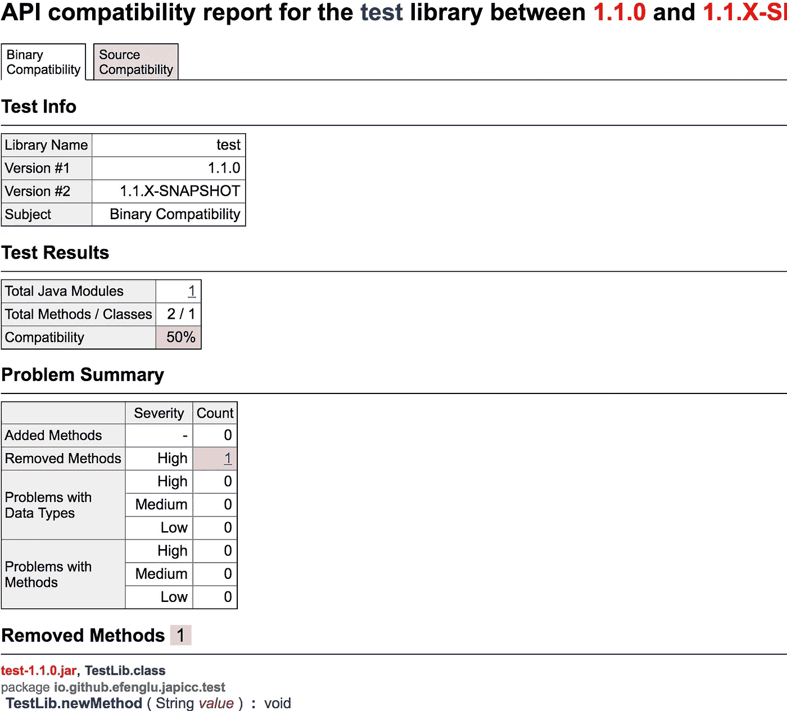

# 实施语义版本控制

> 原文：<https://itnext.io/enforcing-semantic-versioning-fcad774db7f0?source=collection_archive---------5----------------------->


由[rawpixel.com](https://www.pexels.com/@rawpixel)发自[Pexels.com](https://www.pexels.com/photo/two-person-shaking-each-others-hands-872957/)

> 合同*名词*/ˇk ntrakt/
> 
> 书面或口头协议，尤指关于雇佣、销售或租赁的协议，旨在通过法律强制执行。

大多数开发人员都熟悉[语义版本化](https://semver.org/)的概念。当您从一个版本的代码更改到另一个版本的代码时，这是一个很好的方式，可以快速方便地通知用户会发生什么。本协议是您和您的消费者之间的合同。

作为一名优秀的库开发人员，您同意:

*   为你的代码提供合理的支持
*   通知用户代码中的更改
*   保持现有工作代码正常工作*

(*)库是变化的，有时不得不以不兼容的方式变化。这个决定不应该轻易做出。图书馆将通过遵循这些规则来培养善意。

我不介意库以不兼容的方式改变。我理解总是支持遗留代码的危险。我不能原谅的是图书馆对我撒谎。重大变更必须伴有重大版本号变更。

不管出于什么原因，一些开发人员对增加版本号犹豫不决。他们担心通过改变主要版本人们不会升级。他们没有意识到的是，在不改变版本的情况下破坏兼容性，必然会给他们的消费者带来更多的痛苦，而不是更少。

不要害怕发布大量的主要版本。看看 Chrome，我最后一次检查是在 76 版。

我也意识到没有人是完美的，我们都会犯错。我们都做过一些我们认为是向后兼容的改变，但实际上不是。

以这个 Java 变化为例:

```
<     public static final String ID = "myID";
---
>     public static final String ID = "myID2";
```

这是向后兼容吗？大多数开发人员会不假思索地说是。事实上，它是兼容的 API。不过，难道是**不是** ABI 兼容的。

Java *内嵌编译代码中的常量*。这意味着没有重新编译的旧代码将继续使用旧的**值，而不是新的值。**

分析一个 API 的向后兼容性并不是一项简单的任务。这通常需要开发人员熟练掌握语言的细节。即便如此，错误还是会发生。

如果我们有办法在我们的 API 上实施语义版本规则就好了。

*   需要时强制修改库，不允许开发者撒谎
*   确保总是以相同的方式检查所有向后兼容性规则
*   以可重复的方式快速完成这项工作，如果违反了规则，就中断构建


来自 [Pexels](https://www.pexels.com/photo/person-holding-black-pen-1109541/?utm_content=attributionCopyText&utm_medium=referral&utm_source=pexels) 的 [Lex 摄影](https://www.pexels.com/@lexovertoom?utm_content=attributionCopyText&utm_medium=referral&utm_source=pexels)

# 工具作业

不正确的语义版本已经成为我们办公室的一个长期问题。我们需要一个自动化的解决方案来集成到我们的工作流程中。我们是一家利用 Maven 作为构建工具的 Java 商店。所以我去寻找一个可以集成到我们构建过程中的 Maven 插件。当我什么也没找到时，我很惊讶。我确实找到了一些命令行工具:

*   [JAPICC](https://github.com/lvc/japi-compliance-checker)
*   Eclipse(仅用户界面)
*   [PkgDiff](http://lvc.github.io/pkgdiff/)
*   [Clirr](http://clirr.sourceforge.net/)

虽然 Clirr 提供了一个 maven 插件，但它似乎也是不活跃的，自 2005 年以来一直没有更新。PkgDiff 是一个更通用的工具，它不显示类中的变化，也不确定变化是否向后兼容。

Eclipse 实际上有一个基于 Java 的工具，用于在 RCP 应用程序中对 OSGi 包进行版本控制。它在 Eclipse 内部工作得很好，但在外部几乎不可能使用。尤其是在单个库上。

jap ICC—Java API Compliance Checker 是一个相对活跃的 perl 脚本，最高支持 Java 9。它产生了一个非常容易阅读的 API 和 ABI 兼容性报告。唯一真正的缺点是它是用 perl 编写的，而且没有可用的 maven 插件。

直到现在…


照片由 [Somchai Kongkamsri](https://www.pexels.com/@chaikong2511?utm_content=attributionCopyText&utm_medium=referral&utm_source=pexels) 从 [Pexels](https://www.pexels.com/photo/police-army-commando-special-task-force-20258/?utm_content=attributionCopyText&utm_medium=referral&utm_source=pexels) 拍摄

# 如何使用

介绍 [Maven JAPICC 插件](https://github.com/efenglu/japicc-plugin)。这个插件允许你在你的 java 项目上实施语义版本规则。

先决条件:

1.  以前的工件必须可以通过 Maven 仓库获得
2.  构建环境必须安装 Perl

设置您的 pom 以启用插件:

```
<**plugin**>
    <**groupId**>io.github.efenglu.japicc</**groupId**>
    <**artifactId**>japicc-plugin</**artifactId**>
    <**version**>1.0.1</**version**>
    <**executions**>
        <**execution**>
            <**goals**>
                <**goal**>check</**goal**>
            </**goals**>
            <**phase**>verify</**phase**>
        </**execution**>
    </**executions**>
</**plugin**>
```

该插件将尝试在相同的主要系列中查找以前的构建工件。

例如，如果你正在开发版本 2 . 4 . 3-快照，那么插件将检查 2.4.2 或它在 Maven repo 中找到的任何版本。这可能意味着版本 2.4.1 或 2.4.0。

如果它找不到以前的版本，它将认为这是一系列中的第一个版本，并跳过执行。

默认情况下，该插件基本上忽略了 *micro* 版本号，只是试图找到最新的版本号。例如，如果您将版本设置为 2.4.5-SNAPSHOT，并且您的最后一个发布工件是 2.4.2，那么插件会将当前的构建 jar 与版本 2.4.2 进行比较。

# 它是如何工作的

maven 插件包含原始 JAPICC Perl 脚本的副本。当插件被调用时，它将:

1.  将先前发布的工件下载到您的本地 maven 存储库中
2.  将它与目标目录中构建的工件进行比较

该插件假设 perl 安装在/usr/bin/perl 的典型位置。这可以在配置中更改。

你**不**需要安装 JAPICC。该插件会将工具和所有相关文件“安装”到一个临时位置。

根据 perl 脚本的返回代码，插件要么让构建失败，要么让构建通过。如果脚本失败，插件将输出报告的位置，并使构建失败。

失败的报告看起来是这样的:



# 后续步骤

如果能把 perl 脚本翻译成 Java 来消除对 Perl 的依赖，那就太好了。

在以下位置签出插件源代码:

[](https://github.com/efenglu/japicc-plugin) [## efenglu/jap ICC-插件

### 一个增强 Java 语义版本控制的 Maven 插件

github.com](https://github.com/efenglu/japicc-plugin)