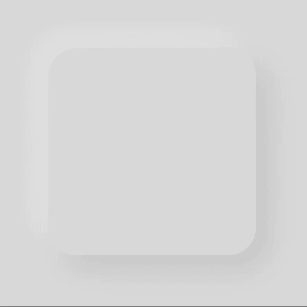
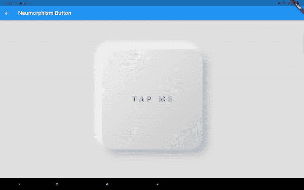
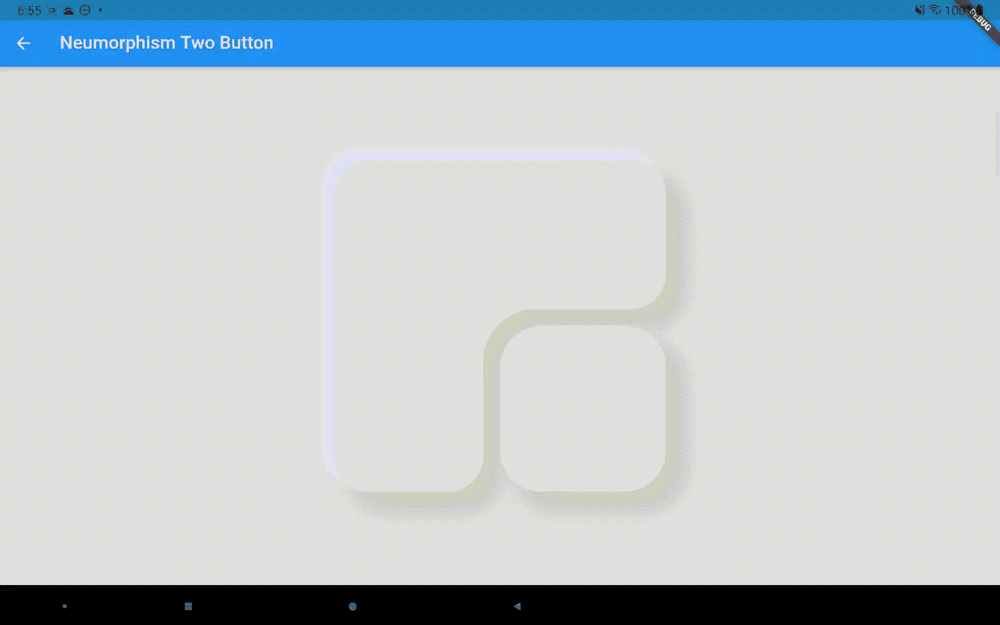
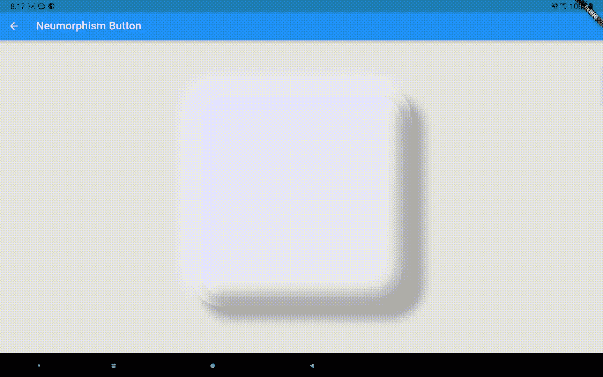
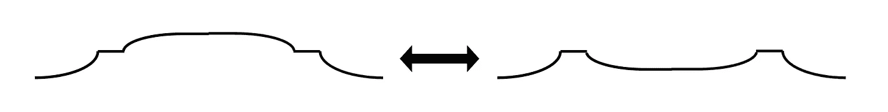
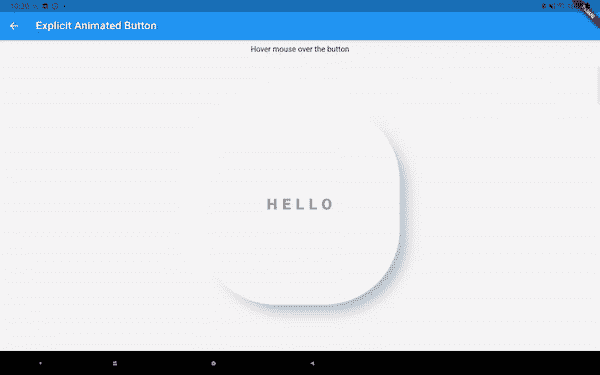

# 用嵌入阴影增强你在扑动中的变形设计

> 原文：<https://itnext.io/enhance-your-design-of-neumorphism-in-flutter-with-inset-shadows-1228a3fe4377?source=collection_archive---------4----------------------->

神经形态是去年最热门的设计话题之一。它为你的用户界面提供了一种柔和自然的感觉。这是对阴影、背景颜色/渐变和周围环境的精心选择。已经有多种在颤振中实现神经变形的包。最著名的是[颤振 _ 神经变形](https://pub.dev/packages/flutter_neumorphic)。如果你只是想达到 neumorphism 的效果，我强烈推荐这个包。这个包的优势在于能够让被“压”在表面下的按钮产生动画效果。Flutter 中以前的大多数文章/包都不支持这一点，因为没有像 CSS 那样内置的嵌入阴影。



一个从抬高到按下的纽形按钮

[flutter _ neuro morphic](https://pub.dev/packages/flutter_neumorphic)通过扩展 BoxPainter 类实现了这种内部阴影效果，并使用深度值来确定阴影应该在哪里。我想采取 CSS 的方法，直接支持嵌入阴影，因为它会给你更多的定制能力。如果你现在看一下 [morphable_shape](https://pub.dev/packages/morphable_shape) 包，有一个叫做 DecoratedShadowedShape 的小部件，看起来如下:

```
Widget widget = DecoratedShadowedShape(
    shape: shape,
    shadows: shadows,
    insetShadows: insetShadows,
    decoration: decoration,
    child: child
);
```

它将按照以下顺序绘制自己:阴影->装饰-> insetShadows ->子元素->形状的边框，并根据形状参数裁剪自己。

但这不是我在本文中要直接使用的。我实际使用的是 [animated_styled_widget](https://pub.dev/packages/animated_styled_widget) 包。对于这个包的概述，看看这个[中型职位](/make-implicit-and-explicit-animations-with-the-responsive-styled-widget-package-7303bffe5c53)。它基本上允许您定义一个类似于 CSS 的样式实例，并构造一个响应性的小部件。它还允许您隐式或显式地制作动画。

下面是使用这个包的神经形态按钮的样子:



相关的代码如下所示:

```
beginStyle = Style(
    width: 400.toPXLength,
    height: 400.toPXLength,
    padding: DynamicEdgeInsets.symmetric(vertical: 20.toPXLength),
    backgroundDecoration: BoxDecoration(
        gradient: LinearGradient(
            begin: Alignment.*topLeft*,
            end: Alignment.*bottomRight*,
            colors: [Colors.*grey*.shade50, Colors.*grey*.shade200])),
    shapeBorder: RectangleShapeBorder(
      borderRadius:
          DynamicBorderRadius.all(DynamicRadius.circular(50.toPXLength)),
    ),
    shadows: [
      DynamicShapeShadow(
          blurRadius: 20.toPXLength,
          spreadRadius: -5.toPXLength,
          color: Colors.*grey*.shade400,
          offset: DynamicOffset(20.toPXLength, 20.toPXLength)),
      DynamicShapeShadow(
          blurRadius: 20.toPXLength,
          spreadRadius: -5.toPXLength,
          color: Color(0xFFFEFEFE),
          offset: DynamicOffset(-20.toPXLength, -20.toPXLength)),
    ],
    mouseCursor: SystemMouseCursors.*click*);endStyle = beginStyle.copyWith(
    backgroundDecoration: BoxDecoration(
        gradient: LinearGradient(
            begin: Alignment.*topLeft*,
            end: Alignment.*bottomRight*,
            colors: [Colors.*grey*.shade50, Colors.*grey*.shade200])),
    shadows:[],
    insetShadows: [
      DynamicShapeShadow(
          blurRadius: 20.toPXLength,
          spreadRadius: -5.toPXLength,
          color: Colors.*grey*.shade400,
          offset: DynamicOffset(20.toPXLength, 20.toPXLength)),
      DynamicShapeShadow(
          blurRadius: 20.toPXLength,
          spreadRadius: -5.toPXLength,
          color: Color(0xFFFEFEFE),
          offset: DynamicOffset(-20.toPXLength, -20.toPXLength)),
    ]);...@override
Widget build(BuildContext context) {
    return AnimatedStyledContainer(
        duration: Duration(milliseconds: 100),
        style: toggleStyle ? beginStyle : endStyle,
        child: Container());
}
```

你只需要定义 beginStyle 和 endStyle，框架会自动为你在它们之间制作动画。

您可以将两个异形按钮组合在一起，并协调它们的阴影。



在上面的场景中，光线来自左上角。所以如果大按钮没有被按下，小按钮的左上角不会有较浅的阴影。



或者你可以将两个纽形按钮嵌套在一起，使对比度更大。该按钮的侧视图如下所示:



由于有了 [morphable_shape](https://pub.dev/packages/morphable_shape) 包，你还可以在动画中轻松地改变按钮的形状。



今天就到这里。嵌入阴影支持和一个简单的方法来创建扑动中的 neumorphism 设计。谢谢大家！