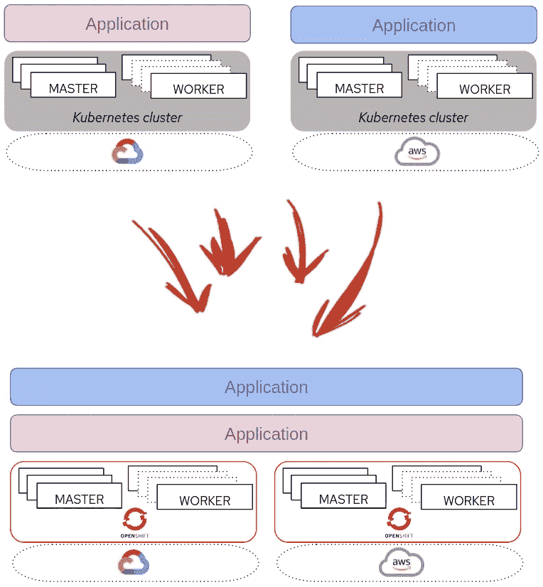

# 通过将您的应用程序分布到多个 OpenShift 集群来增强可靠性—第一部分

> 原文：<https://itnext.io/enhancing-reliability-by-distributing-your-app-into-multiple-openshift-clusters-part-i-a506d90f00f2?source=collection_archive---------3----------------------->

关于在多个 Kubernetes / OpenShift 集群中部署分布式应用程序的想法。

图片:[维多利亚诺·伊斯基耶多](https://unsplash.com/@victoriano)

在这一系列文章中，我想分享一些关于使用多个 Kubernetes / OpenShift 集群部署应用程序的想法。除非您不太在乎公共云的成本，或者您已经为公共云准备好了内部基础架构，否则您可能不希望在所有应用程序中使用这种架构。也许您只是想将您的集群分成不同的可用性区域(类似于我在 OpenShift "系列中的“ [*安全区域”中解释的内容)，这就足够了，但是在多个集群中部署应用程序对于您的一些应用程序来说是值得考虑的事情，正如我们将在第一篇文章中看到的。*](/security-zones-in-openshift-worker-nodes-part-i-introduction-4f85762962d7)

 [## OpenShift 工作节点中的安全区域—第一部分—简介

### 在这个系列文章中，您将看到如何将 OpenShift 工作人员分成多个安全区域。

itnext.io](/security-zones-in-openshift-worker-nodes-part-i-introduction-4f85762962d7) 

# 为什么要为一个“单一应用”考虑多个 Kubernetes/OpenShift 集群？

你有一个基于微服务的应用。您的应用程序在 Kubernetes/OpenShift 集群上运行多个副本。这些副本分布在多个故障域中的多个工作节点上。您不会受到基础设施故障的影响，不是吗？…嗯…是也不是…

让我们明确一点，你将永远处于危险之中。你永远不会完全安全，你可以最小化风险，但这有一个隐含的成本，**这里的重要部分是在风险/成本之间取得正确的平衡**。

> 当讨论可靠性、故障恢复场景等时，要提出的问题是"*如果你的应用在 XXXX 时间不工作，要花多少钱(在金钱、声誉等方面)？*”，那么你将有一个有意义的最大投资的大约金额，以确保你的应用程序不会失败超过 XXXX 时间。

在这里找到一个例子:

> 即使您的 Kubernetes/OpenShift 集群节点位于多个故障域中(通常是 3 个可用性区域)，仍然存在单点故障，Kubernetes 集群…这并不容易，但可能会发生中断集群影响应用程序的情况，如果有人错误配置了集群覆盖网络之类的东西，会发生什么情况？如果失去集群控制平面(即损坏的 ETCD 数据库)？如果出现灾难性升级失败，会发生什么情况？…或者有人删除了错误的集群…好吧，所以你需要更多的集群…
> 
> 因此，您部署了更多的集群(增加了成本)…但是设想您的集群运行在公共云上。可能您将它们部署在同一个云区域…这又是一个单点故障…所以您需要更多的区域…
> 
> 你使用更多的区域。部署在不同的云区域总是会增加成本，但是，即使在这种情况下，在本例中，您仍然有一个单点故障，即云提供商！，因此您需要多个云提供商…
> 
> …如果您有不止一个云提供商，您有多种管理和使用经验，因此您的团队将需要一套不同的新技能，这意味着成本增加(和风险)…。

显然，由于相关成本的原因，并不是所有的应用程序都足够关键，以至于您的企业会考虑将它们部署到位于不同云提供商的多个地区的多个 Kubernetes 集群中(或在内部部署+云环境中),我不只是在谈论钱(即。网络流量成本)，**考虑管理成本**，但是您的车队中可能有一些需要以多集群方式部署。

此外，如果您使用 OpenShift 而不是“普通的”Kubernetes 集群，这将简化和标准化您的集群的使用和管理(您可以管理/使用 OpenShift，您甚至不知道您是否运行在 VMWare、裸机节点或公共云之上)**您正在减少“管理成本”障碍**(如果您添加高级集群管理等产品，这将更大)，这意味着考虑将您的应用部署到多个集群中是有意义的，即使它们“*不是那么关键*

每个集群运行应用程序与在多集群模式下运行应用程序

此外，多个集群的使用不限于此用例，通过扩展您的应用来提高可靠性，您可能还需要**减少公共云锁定**，或者**增强您的可伸缩性**(在您需要大型集群的情况下)，或者能够执行**云爆发**，或者通过使用多个 OpenShift 集群来实现**更好的隔离**，或者甚至能够将您的应用部署在靠近消费者的地方(**边缘用例**所有这些都可能与将应用部署到多个集群有关。****

我想强调的是，从一开始就考虑多集群架构可能是值得的，因为迟早你会意识到你需要它，否则无论你的集群在哪里运行，从无缝管理和使用体验中受益都为时已晚。

# 在多个 Kubernetes/OpenShift 集群中运行我的应用需要什么？

我说服了你多集群应用部署…接下来呢？。你至少需要考虑三个要点:

*   **多集群应用互联**

当在不同的集群上运行您的应用微服务时，您需要提供一种方式让它们相互连接。显而易见的答案是发布所有的服务并从其他集群访问它们，但是这在安全性和整个应用程序架构方面有一些影响。另一种方法是使用“*连接*不同集群网络的技术。

*   **多集群应用存储**

另一个含义是对存储的访问。根据您应用的存储需求，我们应该考虑不同的解决方案，例如对象存储地理分布、数据块或文件存储同步/异步复制、应用内数据复制等。

*   **多集群应用管理**

您希望获得可靠性，但不希望以过度复杂化应用程序管理为代价。有多个选项可以简化多集群应用程序部署，例如任何 GitOps 工具或 CI/CD 产品，但是您还需要考虑管理(即多集群日志记录和监控、RBAC、…)、机密管理或所有集群的安全性和策略合规性。

# 第二部分的下一步是什么？

在接下来的部分中，我想介绍在使用 OpenShift 和相关产品组合时如何解决前面的三个问题。

关于管理，我们可以从 OpenShift 功能中受益，以确保安全性和合规性，我们可以使用 OpenShift GitOps 和 OpenShift pipelines 来增强多集群应用部署，但我们也可以讨论其他组件的使用，如高级集群管理或高级集群安全性，以提供真正的多集群单一管理平台，并提供改进的安全选项。

存储问题的答案将取决于所选的存储后端，但我们可以讨论 OpenShift Data Foundation 的方法。

在下一篇文章中(找到下面的链接)，我将深入探讨第一点，应用程序互连性问题，以及**如果您使用 OpenShift，如何找到多种不同的解决方案来连接您的集群，如 Submariner、Skupper 或 Istio Service Mesh。**

下一篇文章再见…

 [## 通过将您的应用程序分布到多个 OpenShift 集群来增强可靠性—第二部分

### 关于在多个 kubernets/open shift 集群中部署分布式应用程序的思考。

itnext.io](/enhancing-reliability-by-distributing-your-app-into-multiple-openshift-clusters-part-ii-2d01d80f41db)