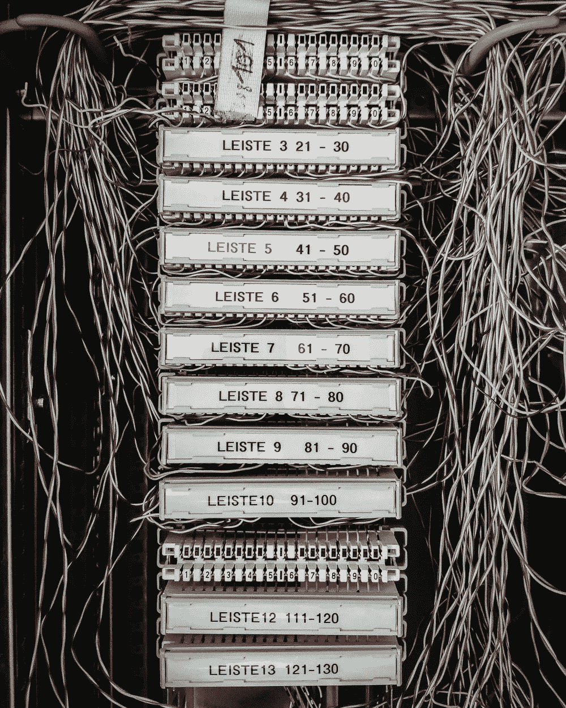
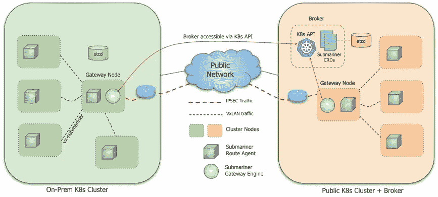
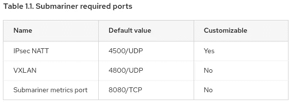
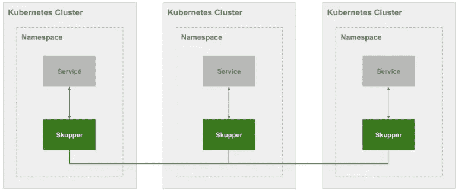
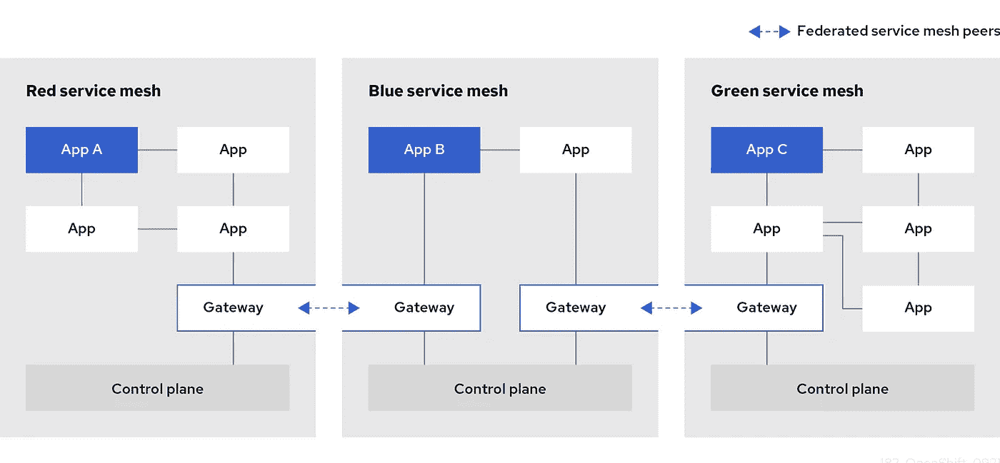
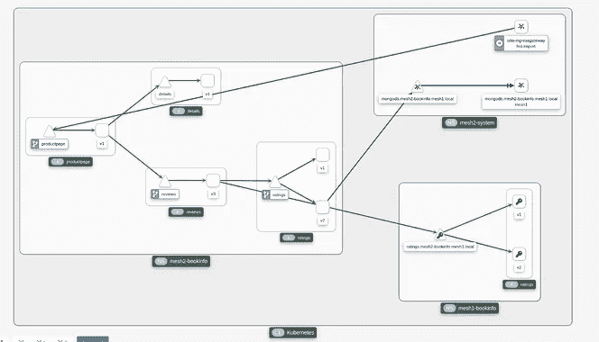

# 通过将您的应用程序分布到多个 OpenShift 集群来增强可靠性—第二部分

> 原文：<https://itnext.io/enhancing-reliability-by-distributing-your-app-into-multiple-openshift-clusters-part-ii-2d01d80f41db?source=collection_archive---------2----------------------->

关于在多个 Kubernetes / OpenShift 集群中部署分布式应用程序的想法。



图片来自[米卡·鲍梅斯特](https://unsplash.com/@mbaumi)

正如我们在第一部分中所看到的，有时将您的微服务部署到多个 Kubernetes 集群中可能是一个好主意，因为它增强了可靠性，但也为您提供了更多选择使用哪个基础架构/公共云的自由，它为您提供了更好的可扩展性和执行云爆发的机会，允许在地理分布式解决方案中灵活放置工作负载，简化了灾难恢复和故障转移，支持新的用例(即边缘计算部署)等…不仅如此…前几天与 [Nethopper](https://www.nethopper.io/) (多云应用网络解决方案)的首席执行官克里斯·芒福德(Chris Munford)交谈时，他给了我另一个暗示，为什么公司会对多云部署感兴趣:监管。

如果你认为在监管非常严格的行业，比如 FSI，有时需要在多个云中构建环境，由于当地的主权法律，甚至可能每个国家或地区一个。这意味着他们将需要在多个云/集群上部署应用程序，即使上述任何原因适用于该客户。

[](https://luis-javier-arizmendi-alonso.medium.com/enhancing-reliability-by-distributing-your-app-into-multiple-openshift-clusters-part-i-a506d90f00f2) [## 通过将您的应用程序分布到多个 OpenShift 集群来增强可靠性—第一部分

### 关于在多个 OpenShift 集群中部署分布式应用的思考。

luis-javier-arizmendi-alonso.medium.com](https://luis-javier-arizmendi-alonso.medium.com/enhancing-reliability-by-distributing-your-app-into-multiple-openshift-clusters-part-i-a506d90f00f2) 

另一方面，遵循在多个集群中部署应用的方法，我们需要克服一些挑战，主要是关于“如何提供通用网络和存储”，以及“如何管理多集群应用”

在本文中，我们将探索一些可用的选项，我们必须将运行在不同 Kubernetes 集群上的微服务相互连接，更具体地说是在 OpenShift 中，以解决“公共网络”问题。

我不会讨论所需的外部设置(全局负载平衡器、DNS 等)，因为我将重点讨论如何允许在一个 OpenShift 集群上运行的微服务访问在另一个集群上运行的微服务，这是允许多集群应用部署所需要的。

这一次，我将不再赘述我以前在文章中提到的技术细节(部署和测试),因为否则的话，这篇文章会太长。如果人们觉得有趣，我可能会写额外的文章展示每个选项的测试。

作为第一点，我将介绍在集群之间提供东西“互连”的最简单方法，然后**我将回顾 Submariner、Skupper 和 Service Mesh (ISTIO)联盟背后的思想**，并以这三个选项的简短回顾结束本文。

# “容易的道路”以及为什么你不应该走这条路。

为什么互联互通会如此混乱？将任何东西连接到我的集群上运行的微服务都很容易，不是吗？您可以只创建一个“入口”(您可以在 OpenShift 中选择“路由”对象)或配置 NodePorts、ExternalIP 或负载平衡器类型的 Kubernetes 服务…

你是对的！，即使有更多的选择，你也可以使用 *Multus* 在你的微服务中配置一个额外的网络，让它们使用 VLAN 直接连接…但这不是重点…想想那些不应该对外“发布”的微服务，内部数据库会怎么样？，还是内部消息系统？，还是与关键的微服务？…

> 注意:如果您将 Multus 与 SR-IOV 结合使用，以获得与裸机节点相同的网络性能，那么在多集群部署中使用 Multus 仍然有意义。如果你想了解更多，可以看看我写的这篇文章:

[](https://medium.com/swlh/enhanced-platform-awareness-epa-in-openshift-part-iv-sr-iov-dpdk-and-rdma-1cc894c4b7d0) [## OpenShift 中增强的平台意识(EPA)——第四部分，SR——IOV、DPDK 和 RDMA

### 在本文中，我们将回顾一些有助于最小化随机延迟和提高网络性能的概念…

medium.com](https://medium.com/swlh/enhanced-platform-awareness-epa-in-openshift-part-iv-sr-iov-dpdk-and-rdma-1cc894c4b7d0) 

如果您创建路由、外部服务，或者使用 Multus 来提供对应用程序中必须由外部组件访问的部分的外部访问，那么您可能会在您的体系结构中造成安全威胁。您需要将访问权限仅限于允许的配对。您可以通过在 Kubernetes 中配置安全策略规则来实现这一点(除非您使用 Multus 方法),但是安全策略特性主要是为了实施内部网络访问而设计的，因此您目前可能不具备您可能需要的功能，也不具备您在外部防火墙中针对这种情况所具备的功能(此外，您还会使您的应用程序的生命周期变得复杂)。

您也可以使用外部系统，但这并不总是容易的，例如，认为入口/路由在 TCP 第 7 层工作，因此您不能使用常规的第 4 层防火墙，您需要配置第 7 层防火墙或其间的 HTTP/S 代理，或者如果您配置 Kubernetes 服务，如您需要打开的节点端口(更多？)所有 Kubernetes 工作节点中的端口…

不仅如此，想想那些不应该从外部世界到达的组件之间交换的流量，当那些被设计为“内部”的服务很可能在其通信中没有任何加密时，如何确保没有人“查看”该流量(中间人)。

希望我在安全部分说服了你，但还有更多。

您看到了 Kubernetes/OpenShift 的价值，同时提供了一个平台来实现您的(有希望的)创新想法，因此您努力移动您的流程、应用程序架构和第 2 天的操作，以便更好地适应“Kubernetes 的做事方式”(一切都是代码)，为什么要通过引入您需要“像过去一样”管理的部分来消除一切呢？按照 Kubernetes 的方法，你如何管理你放在服务之间的这些部分？(当我们讨论如何管理您的多集群应用程序时，这将非常重要)

…还有更多要讨论的。您正在考虑让您的应用程序成为多集群，以便获得更多好处，但是您希望通过在 Kubernetes 中运行您的应用程序来保持您已经获得的好处，所以请考虑一件事…如果您使用这种“外部访问方法”，您如何提供一种简单的方法来创建一个 Kubernetes 服务，在多个不同的 Kubernetes 集群中使用副本，而无需在涉及智能负载平衡器的复杂架构中进行中继？或者说，您如何在所有通信中提供特性一致性？(即。考虑一些不能用于外部连接的 Kubernetes 特性，或者考虑应用程序指标和监控)

“简单的道路”可能看起来很方便，但是，如果你开始思考使用它的含义，你可能会意识到你需要别的东西。

# OpenShift 多集群网络连接选项:Submariner、Skupper 和 Istio

有多种解决方案可以弥补上述差距。在本文中，我将重点介绍可以在 OpenShift 中使用的工具。

> 注意:当我说“您可以使用”时，我指的是 OpenShift 中支持的方法。如您所知，由于 OpenShift 的核心是 Kubernetes，您可能会使用任何其他基于社区的集成，但在这种情况下，该架构的特定部分将只使用**一种“尽力而为”的方法**来支持，不支持 SLA。

# 潜水艇人员

> 注意:技术预览功能在这一刻

[Submariner](https://submariner.io/) 带来了一种在 Kubernetes 集群之间提供第 3 层连接和服务发现的方式，而与您使用的 CNI 网络无关。Submariner 可以直接在 Kubernetes 集群上配置，但是当与 OpenShift 一起使用时，您必须使用*高级集群管理器*(检查 ACM 使用的附加组件下方)以便与支持兼容。

[](https://github.com/stolostron/submariner-addon) [## GitHub-stolostron/submariner-addon:ocm 中 submariner 的一个插件，提供网络连接…

### ACM 与潜艇兵的结合。Submariner 使不同的吊舱和服务之间能够直接联网…

github.com](https://github.com/stolostron/submariner-addon) 

虽然 Submariner 有多个部分(网关节点、路由代理、代理、服务发现等等)，但您可以在上面找到一个数据和控制平面。



来自[https://submariner.io/getting-started/architecture/](https://submariner.io/getting-started/architecture/)的潜艇结构图

## 数据平面

数据平面主要由两部分组成:网关节点和路由代理。

网关节点负责执行创建隧道的集群网络的实际连接。如果你看一下 Submariner 的“社区版本”,你会看到 Submariner 是如何提供多种选项来创建这些隧道的:WireGuard、带有 Libreswan 的 IPsec 和未加密的 VXLAN 设置。**当你使用带有 OpenShift 的 Submariner 时，你的网关引擎将使用 Libreswan IPsec 隧道来连接你的集群**。也可以部署不止一个网关，以便在主动/被动模式下获得高可用性。

网关还向控制平面(代理)通告集群端点信息，以便其他集群知道它的存在。

值得一提的是，您将需要**允许集群之间的通信，这包括打开的 IP 可达性和(非 HTTP/S) TCP/UDP 端口**。Submariner 网关节点需要能够接受 UDP 端口 4500 上的 IPsec 流量，因为它们使用该端口创建 IPsec 隧道，但它们还需要 UDP 端口 4800 来封装使用 VXLAN 的流量，为什么？。

Submariner 被设计为独立于您的 Kubernetes 集群中使用的 CNI 插件，因此它需要一种独立的方式来与不在运行网关节点的同一个工作节点上运行的 pod 进行通信(再次检查上面的绘图，并寻找“VX-submariner”连接)。这就是为什么您需要打开一个端口来创建工作节点之间的 VXLAN 隧道。

除了 IPsec 和 VXLAN 端口，OpenShift 中的 Submariner 将使用 TCP 端口 8080 来共享网关节点导出的一些指标:



https://access . red hat . com/documentation/en-us/red _ hat _ advanced _ cluster _ management _ for _ kubernetes/2.4/html-single/services/index 中的端口列表

如果在 AWS 或 GCP 上运行 OpenShift，配置会自动完成，否则，必须执行一些手动步骤来允许集群之间的所有这些连接，包括创建负载平衡或节点端口服务。

在为 Submariner 配置可达性时，还有另一点需要考虑。因为在 OpenShift Submariner 中是使用 IPsec 配置的，所以可以使用一个名为“preferred-server”的功能。这一特性使得在公共或私有 IP 地址和防火墙配置上，只有一个集群端可以到达一对一连接(假设其中一个集群没有发布所需的端口)。

关于用于创建隧道的 IP，通信利用 NAT 穿越，这允许检测连接是否可以使用私有 IP(这是默认的)或者它必须使用公共 IP。如果您想了解更多关于 NAT 遍历如何与 Submariner 一起使用的信息，您可以在文档中仔细检查这个页面:

 [## NAT 穿越

### 默认情况下，Submariner 通过端口 4500/UDP 在集群之间建立数据平面隧道。此端口可以是…

潜艇兵](https://submariner.io/operations/nat-traversal/) 

数据平面的另一个重要部分是路由代理。代理是在配置了 Submariner 的集群的每个节点(DaemonSet)上运行的 POD。**路由代理是 Submariner 和集群**中已配置的 CNI 插件之间的“桥梁”。根据所选的 CNI，有多种不同的实施方式，例如，许多 CNI(包括 OpenShift SDN)使用 *iptables* 来配置节点内部的 Kubernetes 服务对象路由(将对 Kubernetes 服务的请求路由到 POD IP)，但在 OpenShift 中，我们还有 CNI 开放虚拟网络(OVN)，它使用直接在 Open vSwitch 中配置的流。由于路由代理是一个把 CNI 插件和潜艇的其余部分放在一起的组件，代理需要能够处理，在这种情况下， *iptables* 和 OVN 流。路由代理 pod 了解本地端点，并使用这些 *iptables* 或 OVN 集成来配置基础架构，从而可以将流量从所有节点路由到活动网关引擎节点。

## 控制平面

控制平面的主要部分是代理，它是架构的集中部分。它拥有每个网关发送的信息，并在集群之间交换这些信息，以使其他网关能够发现这些信息。

“经纪人”是什么？一个豆荚？。代理实际上是包含在“中央”Kubernetes 集群的 Kubernetes API 中的一组自定义资源定义，所有其他子集群都必须可以访问这些定义。如果您对这些 cdr 感兴趣，可以看看包含 Helm 图表的 Git repo，以部署 Submariner 代理:

[](https://github.com/submariner-io/submariner-charts/blob/devel/submariner-k8s-broker/crds/crd.yaml) [## submariner-charts/CRD . YAML at devel submariner-io/submariner-charts

### 此文件包含双向 Unicode 文本，其解释或编译可能与下面显示的不同…

github.com](https://github.com/submariner-io/submariner-charts/blob/devel/submariner-k8s-broker/crds/crd.yaml) 

这里有一件重要的事情要提一下。正如我所说的，代理“运行”的 Kubernetes API 必须可以被所有其他集群访问……但是如果这个集中的部分出现任何故障，会发生什么呢？。如果代理不可用，这并不意味着数据平面受到影响，因此未受影响的群集之间的连接将继续工作，这也是事实，因为它们将使用代理工作时从代理获得的最后信息，在代理恢复之前，不可能使用新端点或已连接群集的状态等信息来更新该信息。

控制平面不仅必须提供一种方法来创建不同集群网络之间的连接(我们已经介绍过了)，而且还必须提供一种方法来共享和发现不同的 Kubernetes 服务，以便在 Submariner 网络中包含的任何集群上运行的 pod 能够知道将它们的请求推到哪里。

**为了使一个集群中的服务对其他集群可见，Submariner 提供了一个名为 ServiceExport** 的特定 CRD(您可以在上面显示的 Git repo 中找到它)。发布服务时，您将能够使用以下格式从 Submariner 网络的任何其他集群部分使用服务:

`<service>.<namespace>.svc.**clusterset**.local`

作为 Submariner 控制平面的一部分，我们发现另一个值得一提的部分正在开发中(这意味着它还不是 OpenShift 支持的功能的一部分):Globalnet 控制器

这个组件试图解决 Submariner 的一个主要限制:集群中有重叠的 CIDRs。如果您在部署集群时没有考虑到这一点，这可能会是一个大问题(可能是因为那时您甚至不知道需要使用 Submariner)。Kubernetes 集群通常有两个主要网络，一个用于 Kubernetes 服务，另一个用于“集群网络”(用于 PODs 的 IPs)。在 OpenShift 中，可以配置这些 CIDRs，但大多数情况下，如果您没有发现可能需要从集群中的 pod 访问的 IP 与外部系统重叠的问题，您通常不会接触它们。这意味着您的集群可能具有相同的 CIDRs，这将导致潜艇控制平面不知道如何将流量路由到正确的集群/服务/POD。

此外，如果你仔细想想，这种具有非重叠网络的模型并不能很好地扩展，因此 Globalnet 控制器通过(简化它)在每个集群的当前 CIDR 之上分配一个新的来解决这一限制，为潜艇控制平面提供一种区分它们的方法。这就像如果集群网络是“专用网络”,而 Globalnet IP 是“公共网络”,并且在两者之间有一个 NAT/映射。

我想提到的最后一点是可观察性和监控。Submariner 提供了一些端点，Prometheus 可以使用这些端点来获取平台的指标,但是，正如您在下面的列表中看到的，仍然有一些对可观察性和跟踪建议有用的信息是不可用的(还没有？)，这意味着如果您需要手动将应用程序分散到多个集群中，故障排除可能会有点困难(这也再次强调了这样一个信息，即在所有集群之上有一个适当的管理层，为您提供可见性和自动化，这是您采用多云/多集群时“必须的”)。

 [## 监视

### Submariner 提供了许多 Prometheus 指标，并设置了允许这些指标…

潜艇兵](https://submariner.io/operations/monitoring/) 

# 斯库伯

> 注意:技术预览功能在这一刻

[Skupper](https://skupper.io/) 采用了与 Submariner 不同的方法，不是像 Submariner 一样提供一个集中式节点/路由器来执行集群之间的 IPsec 隧道，而是使用一个分散模型，其中 Kubernetes 名称空间中的一个类似代理的服务器执行第 7 层服务互连。



图片来自 https://skupper.io/docs/overview/index.html

Skupper 背后的想法是让用户自己创建所谓的“虚拟应用网络”(VAN)，这是一个覆盖在集群网络之上的网络，而不是依赖于集群管理员设置的互连性，这是一个关键的优势:

> “…VAN 部署在应用程序层，目的是为单个分布式应用程序提供服务。它不需要成为网络基础设施的一部分，开发人员或运营商可以快速轻松地创建 VAN，而无需访问管理权限或特殊的网络基础设施，如 VPN、IPSec、SDN、防火墙映射规则等……”

[](https://netprototalk.wordpress.com/2019/11/12/virtual-application-networks-for-hybrid-cloud-interconnect/) [## 面向混合云互连的虚拟应用网络

### 多云和混合云计算是最近的热门话题。在…的便携性方面取得了良好的进展

netprototalk.wordpress.com](https://netprototalk.wordpress.com/2019/11/12/virtual-application-networks-for-hybrid-cloud-interconnect/) 

## 数据平面

**Skupper proxy** ，将数据从一个名称空间移动到另一个名称空间(可能在另一个集群中)，**基于** [**Apache Qpid 调度路由器**](http://qpid.apache.org/components/dispatch-router/) ，这是一个轻量级的无状态消息路由器，使用 **AMQP** (发布/订阅架构)与其他 Qpid 路由器通信。请记住，虽然 Skupper 代理是一个 AMQP 路由器，但它不像典型的 AMQ 消息服务用例，在那里您的应用程序需要与消息服务一起工作，有了 Skupper，您可以继续使用您的应用程序而无需修改，因为使用消息协议的是 Qpid 路由器，而不是应用程序。

Qpid 不像 Submariner 那样基于 IP 地址进行路由，而是使用服务名称，这使得避免集群之间的重叠更加简单，并且还实现了多播连接或负载平衡。

这也意味着，如果您的应用程序协商要使用的 TCP/UDP 端口(如 FTP ),您将无法在 Skupper 端之间创建这样的通信，因为协商不会发生。

Skupper 代理还**使用它们之间的 MTL**保护与其他代理的连接(使用它自己的 CA)。

谈到简单性，在 Skupper 路由器之间授权连接还有另一个值得注意的地方。当我们回顾 *Submariner* 数据平面时，我们看到了我们如何需要允许在我们的集群上运行的应用程序的非 HTTP 端口连接，这意味着使用负载平衡器或节点端口服务。与 Skupper 不同，您可以遵循这种方法，但是**您也可以使用 OpenShift Route/Ingress 来访问 Skupper 代理**。当您使用" *skupper init* "命令执行 Skupper 初始化时，将在您的 OpenShift 集群中创建一个新的路由对象(类型" Edge ")，并绑定到该名称空间中部署的 skupper 代理。您可以使用该 URL 来连接远程 Skupper 代理。

由于这种虚拟网络可以由非特权用户轻松设置，并且由于其简单性，这对于例如开发人员来说是小菜一碟，不仅可以在不同集群上运行的微服务之间设置连接，还可以在他们开发微服务时，甚至从他们自己的笔记本电脑上运行的环境到中央 OpenShift 集群设置连接，这可以非常方便地简化微服务开发，而不必使用云上 IDE(如 OpenShift 代码就绪工作区)。请点击此处查看示例:

[](https://developers.redhat.com/blog/2020/01/01/skupper-io-let-your-services-communicate-across-kubernetes-clusters#use_case__a_local_service_exporter_with_skupper) [## io:让您的服务在 Kubernetes 集群之间进行通信

### 在过去的几年中，容器的普及和采用飞速发展，Kubernetes 容器…

developers.redhat.com](https://developers.redhat.com/blog/2020/01/01/skupper-io-let-your-services-communicate-across-kubernetes-clusters#use_case__a_local_service_exporter_with_skupper) 

关于高可用性，Qpid 路由器的多个副本的使用正在开发和测试中，并将在不久的将来可用，此时 Skupper 路由器的 HA 由 Kubernetes 自修复功能提供。

## 控制平面

控制平面的分布原理与我们在传统网络中发现的原理相同，在传统网络中，您依赖路由协议来做出路由决策。Apache **Qpid 路由器使用类似于 OSPF** 的链路状态路由协议来了解网络拓扑，并使用网络中两点之间成本最低的路径进行路由。

与其它链路状态路由协议一样，您可以通过将“内部”角色分配给需要入口和出口连接的路由器，将“边缘”角色分配给不需要入口连接的路由器，来控制路由表的复杂性并改进最佳路径的计算。

控制平面中还有另一个部分， **skupper-controller** (也运行在启动 skupper 的名称空间上)。它管理部署在运行 Skupper 的名称空间中的资源，以及关于 Skupper 网络中公开的服务的信息。说到这个…和*潜艇兵*一起，我们决定使用 CRD 共享哪些服务，Skupper 是如何做到的？

使用 Skupper 更容易，您只需要在 Kubernetes 服务中添加一个注释:

```
skupper.io/proxy: tcp
```

一旦服务发布，它将出现在另一个 Kubernetes 集群中，就像它是一个本地 Kubernetes 服务一样。

潜艇覆盖的另一点是可观察性。对于 Skupper，我们有两个控制台，一个是 Apache Qpid 调度控制台，另一个是 Skupper 控制台。Skupper 控制台稍微简单一点，但它可以让您很好地了解 Skupper 中存在的站点和连接，但如果您需要更详细的信息，可以查看 Qpid 控制台，它可以为您提供有关网络中发生的连接的多个方面的更多详细信息。

默认情况下，在 OpenShift 中，我们默认启用 s upper 控制台，但不启用 Qpid 控制台，可以通过更改 s upper 初始化时创建的 s upper-site config map 中的参数来激活它(您可以在初始化期间使用命令"*s upper init-enable-router-Console*")来启用它

> 注意:configmap 还管理其他重要方面，例如，它向 Skupper 指出，在初始化时，它必须创建一个入口对象类型“Route”。

如果你想看看 Skupper 的实际操作，包括控制台的可观察性，看看这个由 Ted Ross(Nethopper 的首席技术专家)和 Burr Sutter(Red Hat 的开发者体验总监)主持的演示:

# 服务网格(Istio)联盟

服务网格是 OpenShift 中 Istio 实现的特性的名称。我过去已经写了一些关于它的文章，所以我不会详细介绍它试图解决什么问题或者它的架构是什么样子的，如果你想看一看的话，这是该系列的第一篇:

[](https://medium.com/swlh/openshift-service-mesh-essentials-part-i-the-why-and-what-of-it-a3ef09bf8aa8) [## open shift Service Mesh Essentials—第一部分—原因和内容

### 在第一篇文章中，我们将讨论一些关于 OpenShift 服务网格的介绍性问题，包括它的特性…

medium.com](https://medium.com/swlh/openshift-service-mesh-essentials-part-i-the-why-and-what-of-it-a3ef09bf8aa8) 

在这里，我将把重点放在我发表这些文章时还没有准备好的一个特性上，即 Istio Federation，因为它也可以帮助多个不同的 Kubernetes 集群相互连接。

> 注意:服务网格联合可以用同一个集群上的多个服务网格来完成(可以用 OpenShift 来部署)，但是这里我将着重于联合不同 OpenShift 集群中的服务网格。

我想在这里强调一些非常重要的事情，这也是我每次谈到 ISTIO 时都会给出的建议。如果您只是在寻找 ISTIO 的单一功能(在这种情况下是集群互连，但您也可以将此评论应用于其他功能，例如，如果您只想在应用中设置 MTL，并且不打算使用服务网格提供的更多其他功能……可能您不应该选择此选项，因为它增加了一层复杂性，应该通过一系列超越集群之间东西可达性的优势来平衡。

关于支持，您还可以在文档中找到一些值得一提的内容:

> Red Hat OpenShift 服务网格联合方法连接网格有以下限制:
> 
> * open shift 专用版不支持网格联盟。
> 
> * Microsoft Azure Red Hat open shift(ARO)不支持网格联盟。
> 
> * AWS(ROSA)上的 Red Hat OpenShift 服务不支持网格联盟。

 [## 联合—服务网格 2.x |服务网格| OpenShift 容器平台 4.9

### 跨云和内部基础架构构建、部署和管理应用

docs.openshift.com](https://docs.openshift.com/container-platform/4.9/service_mesh/v2x/ossm-federation.html) 

## 数据平面

专用于服务网格互连的数据平面的主要部分是网关，它将用于路由它们之间的所有流量



图片来自[https://docs . open shift . com/container-platform/4.9/service _ mesh/v2x/ossm-Federation . html](https://docs.openshift.com/container-platform/4.9/service_mesh/v2x/ossm-federation.html)

通常，服务网格网关将管理网格的入口和出口流量。当您联合多个服务网格时，您将有特定的网关用于连接到其他网格，这里的一个好方法(为了避免对象重叠的问题)是每个网格对有特定的网关，所以如果您有三个想要直接连接的服务网格，您将为每个连接创建不同的网关(即网关 A-C 和网关 A-B)。

创建完成后，您使用特定的 CRD ( *ServiceMeshPeer* )配置远程网关连接，然后您将在不同的服务网格之间使用 TLS 获得一个**加密的 TCP 连接，但是首先，您需要确保不同网关之间的连通性。您应该通过运行在第 4 层的负载平衡器(用于 h a)来公开它们。**

提供这种负载平衡连接的方式将取决于您的 OpenShift 在哪里运行，以及您可以用于该平台的服务是什么，例如，如果您在内部运行 Kubernetes 服务类型 *LoadBalancer* (可能使用 MetalLB？).在无法使用*负载平衡器*类型的情况下，您可以配置服务节点端口，以便将网关直接发布到您的集群之外，并使它们可以从其他网关到达。

关于使用*负载平衡器*类型的网关发布，还有另一点需要考虑:负载平衡模式应该是第 4 层平衡，这在一些公共云中，如 AWS，不是默认的(您需要添加一个注释:*service.beta.kubernetes.io/aws-load-balancer-type: NLB*)。

联盟流量由用于发现的 HTTPS 和用于服务流量的加密 TCP 组成。请记住允许 TLS 通信(默认情况下使用端口 TCP 15443)以及在网关之间使用 TCP 端口 8188 进行的发现请求。

关于内部流量的数据平面的最后一句话，请考虑当流量从一个网状网跨越到另一个网状网时，**它会丢失来自发起连接的源的有趣信息(**因为目的地服务从入口网关而不是原始源 **)** 获得请求，因此目的地将无法知道发起工作负载的身份。这可能会影响一些依赖这些信息做出决策的应用程序，如果这是你的情况，所有的部分都将在同一个服务网格控制平面下。

## 控制平面

当使用多个集群时，基本上有两种不同的社区 Istio 部署模型:

*   集群中同时拥有控制平面和数据平面
*   您要么拥有控制平面，要么拥有数据平面

例如，您可以有两个群集，一个包含控制平面和数据平面，另一个仅包含数据平面(由位于远程群集中的控制平面管理)。

如果您想查看一些图表并获得更多关于 community Istio 部署方法的信息，您可以阅读下面的页面。

 [## 部署模型

### 在配置 Istio 的生产部署时，您需要回答许多问题。网格会被限制吗…

istio.io](https://istio.io/latest/docs/ops/deployment/deployment-models/) 

**OpenShift 目前仅支持一种模型，其中每个集群拥有自己的服务网格控制平面以及服务网格数据平面**，因此目前您无法配置一个控制平面来管理位于不同集群中的多个数据平面。这是目前正在调查的事情(有几个安全性和可用性方面必须审查)，它可能会在未来作为与*高级集群管理器的集成包括在内。*

该方法不需要打开从一个集群到其他集群的 Kubernetes API 的连接，这提供了一种共享一些资源的方式，而不必向其他集群公开 Kubernetes 控制平面，从而提高了安全性。它还保证了，潜在地，**每个网格可以由不同的独立管理员组管理**。

与潜在的不同管理员维护独立的控制平面也使您有机会维护不同的信任域，或者决定您想要共享哪些服务以及您想要从其他人那里将哪些服务导入到您的网格中。您可以**使用 CRD *ExportServiceSet*** 选择想要导出的服务，并使用 *ImportedServiceSet* 选择要在您的集群中导入哪些服务，这些服务可以通过使用以这种方式形成的名称来访问:

```
<export-name>.<export-namespace>.svc.<ServiceMeshPeer.name>-exports.local
```

关于可观察性，您得到的或多或少与本地服务网格服务相同。您甚至可以在您的 Kiali 仪表板中看到远程服务(已经在您的控制面板中导出和导入),以下是一个示例:



图片来自[https://cloud . red hat . com/blog/introducing-open shift-service-mesh-2.1-Federation-has-arrival](https://cloud.redhat.com/blog/introducing-openshift-service-mesh-2.1-federation-has-arrived)

# 摘要

我们已经看到了三种不同的选择，您可以采取这三种选择来创建在不同集群中运行的 pod 之间的东西向通信。虽然最终目标是相同的，但实现和方法是不同的，我们已经看到了一些差异，使每个选项都是独特的。在这最后一部分，我将尝试重述所有这些要点，并对我们所涉及的内容做一些总结。

**集中式 vs 分布式**

我们有三种选择，事实上有三种不同的模式。

首先我们有**潜航员**，它有一个完整的集中式模型。位于“中枢”集群中的潜艇代理将拥有网络的信息。我还提供了一个集中的管理点，集群管理员可以在这里控制如何使用和配置这些网络扩展。该模型与*高级集群管理器*解决方案所采用的方法非常匹配，这也是该产品支持该模型的原因。

另一方面，我们有 **Skupper** 有相反的做法。一个完整的分布式体系结构，遵循与众所周知的路由协议相同的思想，其中网络信息在该网络中涉及的所有节点之间共享。在这种情况下，Skupper 的设计使互连没有单一的集群管理级别的管理员，而是每个应用程序管理员成为其管理域的互连管理员，换句话说，应用程序管理员将负责他们自己的应用程序在集群之间的通信。

最后，我们有**服务网状联盟**，我认为它是集中式和分布式解决方案的混合体。它可以被视为集中式解决方案，因为我们有一个管理网络的集中式服务网格控制平面，但它也采用分布式方法，因为我们有多个控制平面参与交换有关其自己网络的信息的服务网格联盟。借助服务网格，我们可以为每个网格网络配备一名差异化的管理员，因此我们在这里采用了与 Skupper 相同的方法，管理应用程序的人员也将拥有网络管理，这样，如果您有一个应用程序(或一组应用程序)，管理员将能够完全控制其应用程序的所有方面，包括集群之间的互连，而无需依赖全局集群管理员。

**集群之间的连接**

我们已经看到了这方面的一些差异。向使用非 HTTP/S 协议的解决方案(如 Submariner 或 Service Mesh)授予集群之间所需的互连可能会稍微困难一些，因为您需要利用基础架构来提供连接和负载平衡方法，以便能够到达每个网络所需的入口点。如果我们在集群之间有 NAT(尽管 Submariner，因为它创建了一个 IPsec 隧道，所以利用 NAT-T 在连接中设置正确的 IP ),或者如果您在集群中有重叠的网络(在 OpenShift 中 Submariner 还不支持，需要更多的测试),这可能会更加复杂。相比之下，在像 Skupper 这样的解决方案中，我们甚至可以使用 Ingress/Route 对象来发布网关，实现所需的互连变得容易得多。

关于每个解决方案所隐含的连接，还必须审查其他方面，以便了解该方法对于您的架构和应用程序是否有效，例如不同 pod 的负载平衡方式，或者互连解决方案可能影响的特定使用情形，例如，请记住应用程序协商端口不能与 Skupper 解决方案一起使用，或者在使用服务网状联盟时连接源的 id 在集群间连接中丢失。

**遗言**

集中式解决方案在管理和可观察性方面有一些好处，因为您可以从一个点控制和检查网络。这里我们有 Submariner，它允许与全局云管理器元素(*高级集群管理器*)轻松集成，但仍然需要利用集中化的优势稍微提高一点可观察性。

另一方面，Skupper 具有良好的“每链路”可见性，但我们缺乏开箱即用的集中功能，无法让您全面了解您的网络中发生了什么，并选择哪些是共享的，哪些不是(一些其他产品正在向 Skupper 提供这一缺失的功能)。

**选择一个或另一个解决方案的关键点是，关于谁拥有互连的管理，你想要采取的方法。**问题是谁在集群之间建立“桥梁”,在什么级别(集群全局或每个名称空间/应用程序),谁决定共享什么服务，谁维护连接，等等

在我们的模型中，集群管理员拥有一切(Submariner ),其余的人使用它，我们有一个不同的想法，终端用户拥有并创建这些连接(Skupper ),每个应用程序/命名空间一个(请记住，与 Submariner 创建的唯一隧道相比，要考虑更大的资源消耗),我们有服务网状联盟，您可以在其中基于位置和应用程序集创建管理区域。

因此，总而言之，如果您已经很好地定义了您的管理模型，您可能会马上找到正确的解决方案。如果您不在那个位置，我建议您考虑一下，不仅要管理集群内部连接，还要管理应用程序的任何其他 OpenShift 功能。

在一些组织中，让用户/开发人员对某些方面进行高度控制是不可取的，他们更喜欢将管理保持在一个更集中的点上(集群管理管理员)，但对于其他组织来说，如果您有一组管理应用程序的人员，那么允许该组也负责影响其应用程序的其他方面是有意义的，例如在这种情况下，集群之间的互连性…归根结底，我们不都主张遵循 DevOps 方法吗？