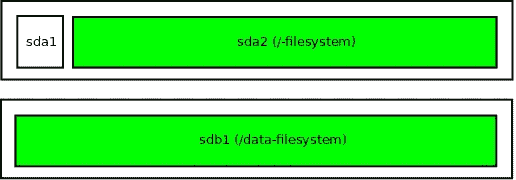
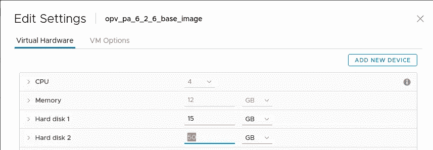
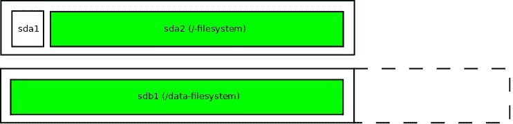
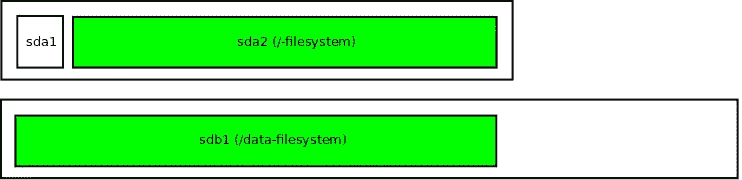
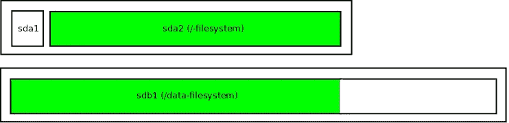
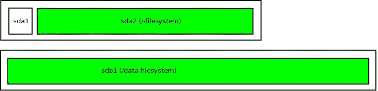

# 无需重启即可扩大任何 Linux 虚拟机的磁盘和分区

> 原文：<https://itnext.io/enlarge-a-disk-and-partition-of-any-linux-vm-without-a-reboot-fbe0e9b6f23b?source=collection_archive---------5----------------------->

# 无需重启即可扩大任何 Linux 虚拟机的磁盘和分区

几天前，我们的一位[性能分析器](https://www.opvizor.com)客户在一次研讨会上询问我们如何处理数据随时间的增长，以及他们如何调整数据分区的大小。像许多其他客户一样，他们希望确保磁盘不会很快被填满。

另一方面，我们的目标是，客户不需要增加数据磁盘的容量，而我们的自动调整大小功能以一种非常方便的方式解决了这个问题:

**只需要简单地调整虚拟设备的虚拟磁盘大小，我们设备中的脚本会自动处理其他所有事情。**

这可以在虚拟机使用几乎任何现代 linux 发行版运行时完成——只要确保没有快照处于活动状态！

*第一次在生产系统上遵循该指南时，我们会推荐备份(没有快照)。*

Performance Analyzer 足够智能，可以检测到这种变化，并扩大分区和分区中包含的文件系统。

所有这些都在 cron 作业中完成:

*   检测引导或数据磁盘的大小
*   调整最后一个分区的大小以添加新空间

# 但这背后的魔力是什么？

我们没有提到的一件事——**没有 LVM 一切都完了**！

让我们进入一些细节:

性能分析器装置具有两个磁盘的配置。第一个磁盘保存操作系统，第二个磁盘保存数据。我们跳过了交换分区，在根文件系统中有一个交换文件。这是可以接受的，因为我们无论如何都要避免交换。

重要的是要知道，只有磁盘中最后或唯一的分区(绿色)可以直接调整大小。
性能分析器的磁盘布局如下所示:



如果您想扩大第二个磁盘，只需更改虚拟机配置并增加那里的磁盘。如果该选项呈灰色，请确保删除现有快照。



尽管磁盘被调整了大小，但是 Linux 内核并不知道这种变化。



要让内核知道，可以以 root 用户身份发出以下命令:

```
echo 1 > /sys/class/block/sdb/device/rescan
```

这将触发设备 sdb 的重新扫描。如果您调整了另一个磁盘的大小，请用您更改的磁盘号替换 sdb。您可以按照 syslog 中的过程操作，您应该会看到类似下面的几行:

```
[89741.613318] sd 2:0:1:0: [sdb] 106954752 512-byte logical blocks: (54.8 GB/51.0 GiB) [89741.613393] sdb: detected capacity change from 53687091200 to 54760833024
```

当内核完成重新扫描时(通常在几分之一秒内)，它会意识到更大的磁盘:



分区不会自动调整，还需要分两步调整大小

*   调整分区大小
*   让内核知道更大的分区

通常，fdisk 是第一步的首选工具，而 partprobe(或 reboot)是第二步的首选工具。但是事情发生了变化，你可以使用一个很棒的软件，叫做[](http://manpages.ubuntu.com/manpages/cosmic/man1/growpart.1.html)

*是 **cloud-utils-package** 的一部分，应该可以在你的发行版的仓库中获得，以防它还没有安装在你的操作系统中。Debian 或 Ubuntu:*

```
*sudo apt-get install -y cloud-utils*
```

*使用 growpart，将分区扩大到最大大小并通知内核更改后的分区大小是一行代码:*

```
*growpart /dev/sdb 1*
```

*第一个参数是磁盘设备，第二个参数是要调整大小的分区的数量。运行 growpart 后，您的磁盘如下所示:*

**

*现在分区的大小已经调整，内核已经在使用新的分区表了。*

*最后缺失的部分是文件系统。由于我们在 Performance Analyzer 中使用 Ubuntu 上的 ext4 文件系统，这也是一个单行程序，甚至可以在挂载的文件系统上运行:*

```
*resize2fs /dev/sdb1*
```

*如果您使用任何其他文件系统，您需要检查合适的工具来调整大小。*

**

*就这样，磁盘、分区和文件系统都调整了大小，您可以立即使用新获得的磁盘空间，无需重新启动或使用 LVM。*

# *将碎片拼在一起*

*Opvizor 通过创建每 5 分钟运行一次的 cron 作业来自动化这一过程。该作业检查性能分析器的一个磁盘的大小是否改变，并调整该磁盘上的分区和文件系统的大小。*

# */etc/cron . d/size _ disk*

*例如，以 root 用户身份每 5 分钟运行一次 disk_resize 脚本，只需将下面一行添加到/etc/cron.d/resize_disk 中*

```
**/5 * * * * root /usr/local/bin/disk_resize.sh*
```

# *disk_resize.sh*

*脚本/usr/local/bin/disk_resize.sh 本身看起来像是:*

```
*#!/bin/bash
LOGFILE=/data/log/speed/resize.log
LOCKFILE=/tmp/enlarge.lock
export PATH=/usr/sbin:/usr/bin:/sbin:/bin

NEEDREBOOT=0

dotlockfile -r 0 $LOCKFILE || exit 1

echo 1 > /sys/class/block/sda/device/rescan
sleep 5
GROWPART_OUT=`growpart /dev/sda 2`
if [ $? -eq 0 ]; then
    echo `date` >> $LOGFILE
    echo "trying to resize fs" >> $LOGFILE
    echo $GROWPART_OUT >> $LOGFILE
    resize2fs /dev/sda2 >> $LOGFILE 2>&1
    echo `date` >> $LOGFILE
    echo "resize done" >> $LOGFILE
    #TODO: need reboot
    NEEDREBOOT=1
fi

echo 1 2>/dev/null >/sys/class/block/sdb/device/rescan
sleep 5
GROWPART_OUT=`growpart /dev/sdb 1`
if [ $? -eq 0 ]; then
    echo `date` >> $LOGFILE
    echo "trying to resize fs" >> $LOGFILE
    echo $GROWPART_OUT >> $LOGFILE
    resize2fs /dev/sdb1 >> $LOGFILE 2>&1
    echo `date` >> $LOGFILE
    echo "resize done" >> $LOGFILE
    #TODO: need reboot
    NEEDREBOOT=1
fi

dotlockfile -u $LOCKFILE

if [ $NEEDREBOOT -eq "1" ]; then
    /sbin/reboot
fi*
```

**原载于 2020 年 2 月 24 日 https://www.opvizor.com*[](https://www.opvizor.com/enlarge-a-disk-and-partition-of-any-linux-vm-without-a-reboot)**。***