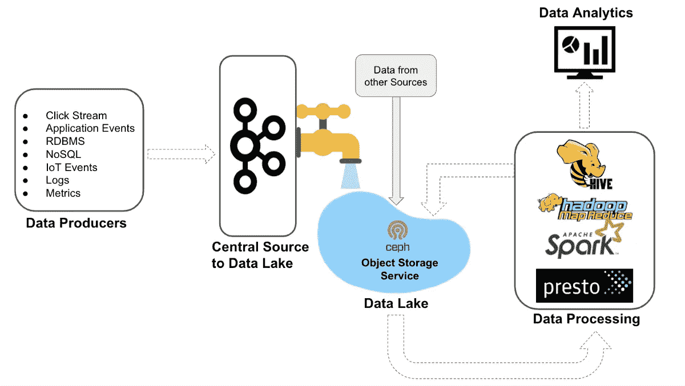
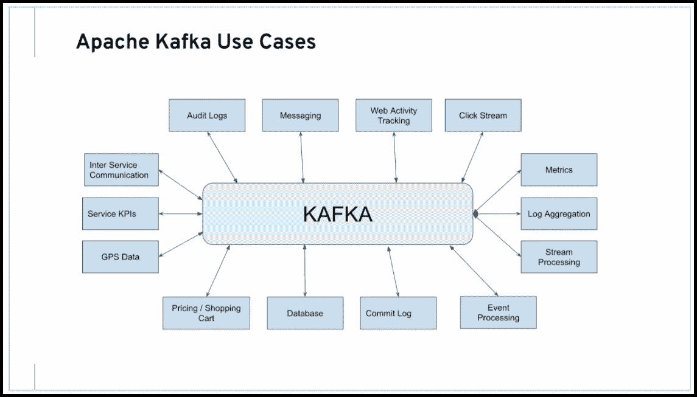
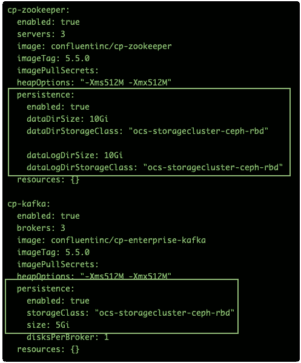
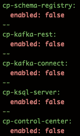
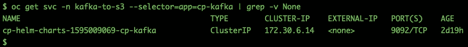
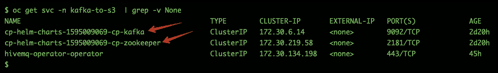
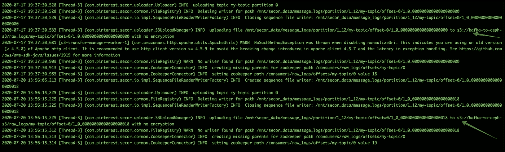

# 通过利用 Kafka 作为数据源来丰富您的 Ceph 对象存储数据湖

> 原文：<https://itnext.io/enrich-your-ceph-object-storage-data-lake-by-leveraging-kafka-as-the-data-source-e9a4d305abcf?source=collection_archive---------4----------------------->

*了解如何使用 Secor 将 Kafka 消息移动到 Ceph S3 对象存储中*



> 如果你的业务是你的太阳系，那么你的数据就是太阳，它既有引力又有质量，一切都围绕着它转，它必须永远存在——我自己

# 介绍

Kafka 是最受欢迎的消息系统之一，用于实时数据流，收集大数据，或进行实时分析或两者兼而有之。Kafka 用于将数据流导入数据湖、应用程序和实时流分析系统。



Apache Kafka 用例

# Kafka:数据湖的主要来源

Kafka 是一把瑞士军刀，用于构建可扩展的容错架构。虽然您可以在各种用例中使用 Kafka，但这篇文章将详细介绍如何利用 Kafka 作为您的数据湖的主要来源。


上面显示的高级架构很简单，您关心的长期存储数据，无论是与业务决策相关、分析相关还是与合规性相关，或者只是您不想删除这些数据，您都可以选择将 Kafka 中的数据转储到符合 S3 标准的共享对象存储中(如 Ceph)。S3 和 S3A 接口无处不在，几乎所有您喜欢的工具都支持这些协议。你永远不会觉得自己被锁在里面。

对于绿地部署，如果您要在公共云上构建数据基础架构，可以使用 AWS、GCP、Azure 和 Oracle Cloud。您拥有来自各个提供商的对象存储服务，您可以利用它来构建这个体系结构。

对于内部绿地/棕地部署，在为您的架构选择组件时，您需要非常谨慎。如果你的业务是你的太阳系，那么你的数据就是太阳，它既有引力又有质量。一切都围绕着它，它必须永生。

公共云以较低的成本为您带来灵活性。有了 Snow Ball / Snow Mobile 这样的服务，把自己多年积累的数据转移到公有云对象存储服务上并不是超级困难的事情。最被忽视的想法是“*如何从公共云服务*把你的数据带回家”。在云计算巨头发布的任何产品和服务公告中，您是否听说过他们中的任何一家推出了一项服务，可以帮助您以合理的成本将存储在他们的任何服务中的数据大规模移动到您的内部位置？

> 公共云==锁定专有技术

如果您已经战略性地选择将您的计算保留在本地，那么构建您自己的本地对象存储服务作为您的共享数据存储库是完全有意义的。开源数据存储解决方案，如 Red Hat Ceph Storage/Red Hat open shift Container Storage，不仅帮助您获得对数据的完全控制，还为您面向未来的数据服务提供了一个经济高效且可扩展的选项。你在这种情况下考虑 HDFS 的日子已经一去不复返了。HDFS 在过去十年表现出色，你应该投资于符合行业标准、面向未来的本地云解决方案，如 Ceph S3 对象存储。

# 将数据从 Kafka 移动到 Ceph S3 对象存储

有多种方法可以将数据从 Kafka 主题转移到 Ceph S3 对象存储，例如使用开源工具，如 [Secor(最初来自 Pinterest )](https://github.com/pinterest/secor) 、Apache-Camel🐪S3 连接器([见我的另一个博客](https://medium.com/@karansingh010/exporting-data-from-apache-kafka-red-hat-amq-streams-topics-to-s3-using-apache-camel-connector-66a56af490e))或汇合的卡夫卡 S3 连接器。

在这篇文章中，我们将深入探讨如何在 OpenShift 上部署 Secor，并将其配置为将 Kafka 主题消息移动到 Red Hat OpenShift 容器存储 S3 对象存储服务。


## 先决条件

*   运行 RedHat OpenShift 4 集群
*   运行 Red Hat OpenShift 容器存储 4

## 履行

**第 1 部分:在 OpenShift 上设置 Kafka 集群**

*   验证您的 OpenShift 集群

```
oc get nodes
oc get sc
```

*   在 OpenShift 上部署 Kafka 集群

```
oc new-project kafka-to-s3 wget[https://github.com/confluentinc/cp-helm-charts/releases/download/v5.5.0/cp-helm-charts-0.5.0.tgz](https://github.com/confluentinc/cp-helm-charts/releases/download/v5.5.0/cp-helm-charts-0.5.0.tgz)tar -xvf cp-helm-charts-0.5.0.tgz
```

*   编辑 Kafka 头盔图表值文件`vim cp-helm-charts/values.yaml`，为 Zookeeper 和 Kafka 舱添加持久存储。运行`oc get sc`获取您的 OCP 块存储类的名称



*   禁用目前不相关的其他服务



*   这个 Kafka helm 图表使用需要 root 权限的 docker 映像，调整 OCP 安全上下文约束来启用它

```
oc adm policy add-scc-to-user anyuid -z default
```

*   安装卡夫卡

```
helm install cp-helm-charts --generate-name -n kafka-to-s3
oc get all -n kafka-to-s3
```

**第 2 部分:启用 Ceph S3 对象存储服务**

*   使用`oc project openshift-storage`切换到`openshift-storage`项目
*   用以下内容创建一个 CR 文件`ceph_rgw_object_store.yaml`

```
apiVersion: v1
items:
- apiVersion: ceph.rook.io/v1
  kind: CephObjectStore
  metadata:
    generation: 1
    name: s3a
    namespace: openshift-storage
  spec:
    dataPool:
      crushRoot: ""
      deviceClass: ""
      erasureCoded:
        algorithm: ""
        codingChunks: 0
        dataChunks: 0
      failureDomain: zone
      replicated:
        size: 3
    gateway:
      allNodes: false
      instances: 1
      placement:
        nodeAffinity:
          requiredDuringSchedulingIgnoredDuringExecution:
            nodeSelectorTerms:
            - matchExpressions:
              - key: cluster.ocs.openshift.io/openshift-storage
                operator: Exists
        podAntiAffinity:
          preferredDuringSchedulingIgnoredDuringExecution:
          - podAffinityTerm:
              labelSelector:
                matchExpressions:
                - key: app
                  operator: In
                  values:
                  - rook-ceph-rgw
              topologyKey: kubernetes.io/hostname
            weight: 100
        tolerations:
        - effect: NoSchedule
          key: node.ocs.openshift.io/storage
          operator: Equal
          value: "true"
      port: 80
      resources:
        limits:
          cpu: "1"
          memory: 2Gi
        requests:
          cpu: "1"
          memory: 1Gi
      securePort: 0
      sslCertificateRef: ""
    metadataPool:
      crushRoot: ""
      deviceClass: ""
      erasureCoded:
        algorithm: ""
        codingChunks: 0
        dataChunks: 0
      failureDomain: zone
      replicated:
        size: 3
kind: List
metadata:
  resourceVersion: ""
  selfLink: ""
```

*   应用 CR `oc create -f ceph_rgw_object_store.yaml -n openshift-storage`
*   这将触发 Ceph RGW 吊舱的创建，使用`oc get po | grep -i rgw`进行验证
*   通过应用以下 CR 文件创建对象存储用户

```
apiVersion: ceph.rook.io/v1
kind: CephObjectStoreUser
metadata:
  name: s3user1
  namespace: openshift-storage
spec:
  store: s3a
  displayName: "s3 user1"
```

如果您在没有有效 SSL 证书的 OpenShift 环境中尝试这样做，那么您必须生成 Let's Encrypt 证书，并将这些证书应用到 OpenShift 集群。SSL 证书的缺失会给 Secor 联系不安全的 S3 端点带来问题。[使用我的另一个博客](https://medium.com/@karansingh010/lets-automate-let-s-encrypt-tls-certs-for-openshift-4-211d6c081875)来实现使用 Let's Encrypt 的 SSL 证书。

**第 3 部分:验证对 OpenShift 容器存储对象服务的访问**

*   出口`AWS_ACCESS_KEY` `AWS_SECRET_KEY` `RGW_ENDPOINT`

```
export AWS_ACCESS_KEY_ID=`oc get secret -n openshift-storage rook-ceph-object-user-s3a-s3user1 -o 'jsonpath={.data.AccessKey}' | base64 --decode;echo`export AWS_SECRET_ACCESS_KEY=`oc get -n openshift-storage secret rook-ceph-object-user-s3a-s3user1 -o 'jsonpath={.data.SecretKey}' | base64 --decode;echo`export RGW_ENDPOINT=$(oc get route -n openshift-storage --selector='app=rook-ceph-rgw' -o 'jsonpath={.items..spec.host}')
```

*   尝试使用 s3cmd 命令行工具列出和创建存储桶

```
s3cmd --access_key=$AWS_ACCESS_KEY_ID --secret_key=$AWS_SECRET_ACCESS_KEY --ssl  --host=$RGW_ENDPOINT  --host-bucket="$RGW_ENDPOINT/%(bucket)" lss3cmd --access_key=$AWS_ACCESS_KEY_ID --secret_key=$AWS_SECRET_ACCESS_KEY --ssl  --host=$RGW_ENDPOINT  --host-bucket="$RGW_ENDPOINT/%(bucket)" mb s3://kafka-to-ceph-s3s3cmd --access_key=$AWS_ACCESS_KEY_ID --secret_key=$AWS_SECRET_ACCESS_KEY --ssl  --host=$RGW_ENDPOINT  --host-bucket="$RGW_ENDPOINT/%(bucket)" ls
```

**第四部分:与卡夫卡集群的联系和互动**

*   使用这个 YAML 创建一个 Kafka 客户端

```
oc project kafka-to-s3vim kafka-client.yamlapiVersion: v1kind: Pod
metadata:
  name: kafka-client
spec:
  containers:
  - name: kafka-client
    image: confluentinc/cp-kafka:5.5.0
    command:
      - sh
      - -c
      - "exec tail -f /dev/null"oc create -f kafka-client.yamloc get po
```

*   抓取 Kafka 集群端点

```
oc get svc -n kafka-to-s3 --selector=app=cp-kafka | grep -v None
```



*   登录 Kafka 客户端窗格，使用`kafka-console-producer`生成一些消息

```
oc project kafka-to-s3
oc rsh kafka-client## Replace kafka endpoint with your environmentkafka-console-producer --broker-list cp-helm-charts-1595009069-cp-kafka:9092 --topic my-topic
>
```

*   在`>`提示符下生成几条随机信息，按`ctrl+c`退出
*   使用`kafka-console-consumer`重新连接并列出您的消息，然后按`ctrl+c`退出。

```
kafka-console-consumer --bootstrap-server cp-helm-charts-1595009069-cp-kafka:9092 --topic my-topic --from-beginning
```

*   如果您能够查看您的消息，那么到目前为止一切都很顺利
*   生成几条关于卡夫卡主题的信息

```
cat /etc/sysctl.conf | kafka-console-producer --broker-list cp-helm-charts-1595009069-cp-kafka:9092 --topic my-topic
```

**第 5 部分:部署 Secor 服务**

正如本文引言部分所解释的，我们将使用开源部门项目(由 Pinterest 开发)向 Ceph S3 对象存储服务发送 Kafka 主题消息。让我们在 OpenShift 容器平台上部署 Secor 应用程序

*   创建一个名为`secor-kafka.yaml`的 YAML 文件。在应用之前，您需要根据您的环境更改一些变量

```
apiVersion: apps/v1
kind: Deployment
metadata:
  labels:
    app: secor
  name: secor
spec:
  replicas: 1
  selector:
    matchLabels:
      app: secor
  strategy: {}
  template:
    metadata:
      labels:
        app: secor
    spec:
      containers:
      - image: karansingh/secor-0.29-hadoop-2.9.2:latest
        name: secor-0-29-hadoop-2-9-2
        env:
        - name: ZOOKEEPER_PATH
          value: "/"
        - name: ZOOKEEPER_QUORUM
          value: "cp-helm-charts-1595009069-cp-zookeeper:2181"
        - name: KAFKA_SEED_BROKER_HOST
          value: "cp-helm-charts-1595009069-cp-kafka"
        - name: KAFKA_SEED_BROKER_PORT
          value: "9092"
        - name: AWS_ACCESS_KEY
          value: "YOUR_ACCESS_KEY"
        - name: AWS_SECRET_KEY
          value: "YOUR_SECRET_KEY"
        - name: AWS_ENDPOINT
          value: "rook-ceph-rgw-s3a-https-aws-lb-openshift-storage.apps.presto.ceph-s3.com:443"
        - name: AWS_PATH_STYLE_ACCESS
          value: "true"
        - name: SECOR_S3_BUCKET
          value: "kafka-to-ceph-s3"
        - name: SECOR_GROUP
          value: "raw_logs"
        - name: SECOR_S3_PATH
          value: "kafka-messages"
        - name: KAFKA_OFFSETS_STORAGE
          value: "zookeeper"
        - name: SECOR_MAX_FILE_SECONDS
          value: "10"
        - name: SECOR_MAX_FILE_BYTES
          value: "10000"
        - name: SECOR_UPLOAD_MANAGER
          value: "com.pinterest.secor.uploader.S3UploadManager"
        - name: SECOR_MESSAGE_PARSER
          value: "com.pinterest.secor.parser.OffsetMessageParser"
        - name: DEBUG
          value: "True"
        - name: SECOR_KAFKA_TOPIC_FILTER
          value: "my-topic"
        resources: {}
status: {}
```

*   至少，你需要改变变量的值，比如`ZOOKEEPER_QUORUM` `KAFKA_SEED_BROKER_HOST` `AWS_ACCESS_KEY` `AWS_SECRET_KEY` `AWS_ENDPOINT`
*   以下命令应该会给您提供正确的值

```
oc get svc -n kafka-to-s3  | grep -v Noneexport AWS_ACCESS_KEY_ID=`oc get secret -n openshift-storage rook-ceph-object-user-s3a-s3user1 -o 'jsonpath={.data.AccessKey}' | base64 --decode;echo`export AWS_SECRET_ACCESS_KEY=`oc get -n openshift-storage secret rook-ceph-object-user-s3a-s3user1 -o 'jsonpath={.data.SecretKey}' | base64 --decode;echo`export RGW_ENDPOINT=$(oc get route -n openshift-storage --selector='app=rook-ceph-rgw' -o 'jsonpath={.items..spec.host}')echo $AWS_ACCESS_KEY_ID
echo $AWS_SECRET_ACCESS_KEY
echo $RGW_ENDPOINT
```



卡夫卡和动物园管理员端点

*   一旦有了正确的值，更新`secor-kafka.yaml`并部署扇区服务

```
oc create -f secor-kafka.yaml
oc get all -n kafka-to-s3
```

**第 6 部分:验证 Secor 移动数据到 Ceph S3**

由于我们在 Kafka 主题中已经有了名为`my-topic`的消息，只要您部署 secor 服务，它就会检测到主题中有一些未被移动的 Kafka 消息，它会立即处理这些消息，并将它们移动到选定的 Ceph S3 桶中。

*   要看到神奇之处，例如 secor 如何将 Kafka 主题消息移动到 Ceph S3 桶，您需要跟踪 secor 日志

```
# On one terminal tail secor logsoc logs -f <secor_pod_name>
```

*   在日志中，您会看到如下条目，这验证了 Secor 正在向 Ceph S3 bucket 发送 Kafka 消息

```
2020-07-20 13:56:15,225 [Thread-3] (com.pinterest.secor.uploader.S3UploadManager) INFO  uploading file /mnt/secor_data/message_logs/partition/1_12/my-topic/offset=0/1_0_00000000000000000018 to s3://kafka-to-ceph-s3/raw_logs/my-topic/offset=0/1_0_00000000000000000018 with no encryption
```



Secor 向 Ceph S3 铲斗发送信息

*   列出 Ceph S3 存储桶，以验证 Ceph 对象存储服务正在从 Kafka 接收数据

```
s3cmd --access_key=$AWS_ACCESS_KEY_ID --secret_key=$AWS_SECRET_ACCESS_KEY --ssl  --host=$RGW_ENDPOINT  --host-bucket="$RGW_ENDPOINT/%(bucket)" ls s3://kafka-to-ceph-s3/raw_logs/my-topic/offset=0/
```


列出 Ceph S3 桶以验证 Kafka 消息的输入

# 摘要

*   Red Hat OpenShift 容器存储对象服务使您能够为您的业务开发一个数据湖库。
*   开源项目 **Secor** 提供了一种将你的 Kafka 数据转移到 S3 对象存储器的可靠方法
*   Ceph 是一个符合 S3 标准的可扩展对象存储开源解决方案，与 S3 it 部门一起还支持 S3A 协议，这是消费对象存储兼容数据湖解决方案的行业标准方式。
*   一旦数据被接收到 Ceph 数据湖中，就可以使用您选择的引擎对其进行处理，使用您选择的工具对其进行可视化。