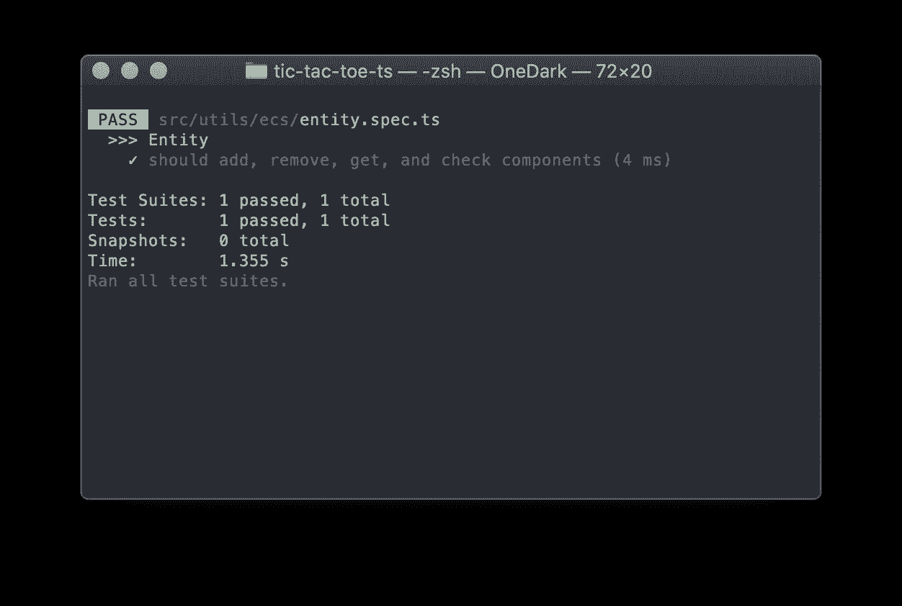
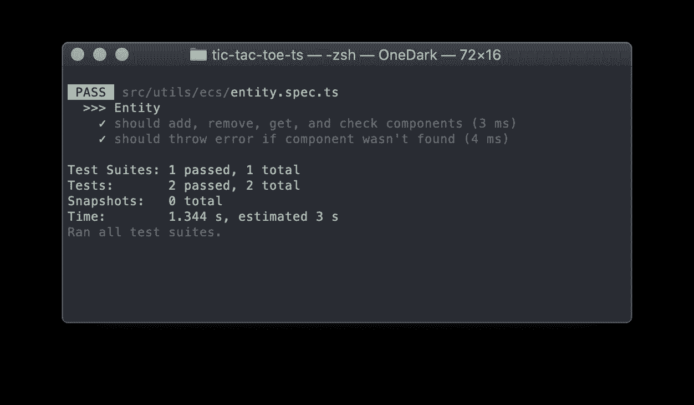

# 用 TypeScript 构建游戏。实体和组件

> 原文：<https://itnext.io/entity-component-system-in-action-with-typescript-f498ca82a08e?source=collection_archive---------0----------------------->

关于如何用 TypeScript 和本地浏览器 API 从头开始构建游戏的系列教程的第一章

[free pik 创建的业务向量](https://www.freepik.com/free-photos-vectors/business)

欢迎阅读“**用打字稿**构建游戏”系列的第一篇文章！我们从最广泛使用的 gamedev 模式之一开始我们的旅程:实体组件系统。

# 目录:

1.  什么是 ECS？
2.  实现组件
3.  实施实体
4.  测试
5.  结论

# 什么是 ECS？

这是一种架构模式，它允许我们组合和合成代码库的元素，而无需创建强大的层次互连。简言之，它支持在运行时将功能附加到系统元素上或从系统元素上分离。

好吧，但是这到底是什么意思，*确切的说是*？考虑玩家可以施展魔法的 RPG 游戏。不同的游戏方式取决于玩家选择的角色类别。例如，法师可以施法，圣骑士可以用重剑屠杀敌人。从技术角度来说，所有这些 ***行为*** 都可以在玩家选职业的时候 ***附加*** 。更有甚者，这种情况会在**实时**中发生:当玩家达到一个新的等级，新的行为会变得对他们可用。

[由宏向量创建的书籍向量](https://www.freepik.com/free-photos-vectors/book)

在这个例子中，玩家是一个*实体，*，而施展法术或用剑战斗的能力是 ***组件*** 。我们可以给一个实体分配不同的组件来提供新的功能，而不需要改变它的代码。

*一个* ***实体*** 可以是任何东西:玩家、格子、场景、子弹，甚至游戏本身。ECS 不会对实体的功能施加任何限制。只有一条规则:一个实体必须能够处理组件。

*一个组件*可以是任何东西，只要它能附加到一个实体上。有些组件可以被一个实体 *required* ，意思是:没有它实体就不能真正存在。

在我们的游戏中，我们会有相当多的实体和组件。一个例子是船，它可以飞行、攻击、损坏等等。

# 实现组件

首先，我们应该看看我们的项目。源代码位于 [GitHub](https://github.com/soloschenko-grigoriy/gamedev-patterns-ts) 中。切换到`init`分支，您应该会看到一个完全设置好但为空的项目。

看一下`src`文件夹。它只有一个空的`main.ts`文件和一个在`main.spec.ts`的虚拟测试。既然不再需要`main.spec.ts`了，那就杀了吧。

[free pik 创建的背景矢量](https://www.freepik.com/free-photos-vectors/background)

在这篇文章中，我们将创建一些助手来放置实体组件系统。我们将在后面的章节中使用 ECS 来构建游戏元素:船只、玩家、网格和节点。

然而，这些助手不依赖于游戏本身，并且可以在其他游戏中重用。让我们首先创建一个文件夹来保存这个项目中所有类似的助手。我就叫它`utils`。

ECS 由两个元素组成:实体和组件。我们从最简单的开始:组件。如前所述，ECS 并不关心实际组件的“内部厨房”。它可以是任何东西，只要*是组件*。这意味着任何声称是组件的人都必须符合组件的接口。我们来定义一下！

在`utils`下，我为实体组件系统创建了一个专用文件夹，并将其命名为`ecs`。在这个文件夹中，我创建了一个包含`IComponent` 接口的文件:`component.h.ts`。这是我在这个项目中遵循的命名惯例之一。所有只包含类型的文件都会有后缀`.h`(读作:*头文件*)。

我还将把*桶* `index.ts`文件添加到整个项目的每个文件夹中，以避免循环依赖并简化模块的导入/导出:

我们可以就此打住，让组件像这样超级通用。但是，它至少应该表明它属于什么实体(如果有的话！记住组件可以在任何时候从实体中分离出来)。所以，让我们稍微调整一下界面:

这时打字稿抱怨不存在的实体。是时候解决了！

# 实施实体

实体是一种更复杂的动物。它应该能够:

1.  将组件添加到自身
2.  将组件从自身移除
3.  如果添加了组件，则按其类型返回组件
4.  回答问题“这个组件加不加？”

为了满足所有这些需求，it 必须跟踪连接的组件。换句话说，它必须保持自己的*状态，*它不能成为接口。

这个实体将成为真实游戏实体的基础:玩家、子弹、船只。它们中的每一个都有自己的类型和自己的功能。实例化基本实体没有任何意义。所以，我将把它定义为一个抽象类:

> *注意，没有’。文件名中的“h”后缀。那是因为文件中包含了* ***实现*** *，而不是一个***(读作:类，不是一个接口)**

*让我们不要忘记调整桶文件来重新导出实体:*

*该实体应该跟踪附加的组件。最简单的方法是存储该类的内部成员:*

*我们不希望任何外部代码搞乱这个列表，但是我们可以完全访问它的后代；因此成员是`protected`。但是，我们可以为外部世界提供只读访问。为此，让我们为该字段添加一个公共 getter:*

*漂亮！现在，让我们支持组件的添加。为此，我们创建了一个专用的方法。此方法将组件添加到数组中，并设置对实体的引用:*

*厉害！接下来是`GetComponent`。这个有点棘手。我们可以这样做:*

*但是它要求代码的消费者提供一个对特定组件的引用。如果他们已经有了这个参考，那就没有必要去查了。*

*我们应该实现的是一个方法，它通过提供的*类型*返回一个对特定组件的*引用*。考虑这个例子:*

*为了实现这一点，我们的 GetComponent 必须期望一个类型(read: *class* )，而不是一个实例(read: *object* )，然后返回该类型的组件。当然，这种类型必须符合 IComponent:*

*让我们消化一下。首先，我们定义符合`IComponent`的类属:*

*我们需要它来链接参数中的构造函数和返回类型。*

*然后，我们定义一个参数`constr`，它必须是这个奇怪的东西的类型:`{ new(...args: any[]): C }`这样我们让 TypeScript 知道我们想要构造函数(注意关键字`new`)，它可以有任意数量的任意类型的参数(读:`...args: any[]`)，并且产生一个类型为`C`的对象*

*实际的搜索很简单:我们遍历数组并返回指定类型的实例组件。如果没有这样的组件，方法会发出错误提示:*

*现在移除是直接了当的。我们期望组件的类型与我们在 GetComponent 中期望的一样。唯一的区别是`RemoveComponent`不返回任何东西:*

*有很多方法可以从数组中移除一个元素。比如我们可以利用`splice`。它依赖于要移除的元素的索引，我们可以用`indexOf`来标识。问题是`indexOf`使用的是*值*而不是该值的*类型*。要获得索引，我们必须首先手动遍历数组:*

*顺便说一下，我们可以使用另一种方法。我们可以创建一个新数组，简单地遍历旧数组，复制除了要删除的值之外的所有值:*

*然而，从性能角度来看，使用`splice`的方法更可取，因为它是一种[就地](https://en.wikipedia.org/wiki/In-place_algorithm)操作。还要注意，我们不迭代整个数组，我们一找到要找的东西就中断。*

*最后，如果消费者想要安全地探索*是否有*一个特定类型的组件，他们可以使用 HasComponent 方法。它的工作方式与 GetComponent 相同，但它返回 true/false，而不是抛出错误:*

*很好，但是你可能注意到我们重复了很多次`{ new(...args: any[]): C }`。让我们稍微简化一下我们的生活，为它定义一个专用类型:*

*我们不打算在这个模块之外使用它，所以让我们通过省略`export`关键字使它成为*内部*。另外，这次我使用了类型安全版本的`any`:`unknown`。现在我在方法中引用这种类型:*

*最后一点:让我们给`component.h.ts`添加实体依赖，这样它就不会再抱怨了:*

*厉害！如果你运行`npm start`，你的代码应该编译无误*

# *测试*

*所有这一切听起来很有趣，但是…我们如何验证任何东西*实际上*工作？虽然没有游戏，但我们不能只打开浏览器就看到我们的系统在运行。但是我们可以单元测试！*

**

*[pikisperstar 创建的圆矢量](https://www.freepik.com/free-photos-vectors/circle)*

*让我们为我们的实体创建一个单元测试:*

*首先，我们需要建立模拟实体和组件。让它们尽可能简单:*

*这里我们创建了满足所有必要承诺的空类:`E`扩展抽象实体，而`C1`、`C2`和`C3`实现 IComponent 接口并期望附加到`E`。*

*现在，让我们实例化它们，准备工作已经完成:*

> **注意，我不用每次都实例化组件。清理一个实体就足够了。**

*我们测试我们可以从实体中添加、获取和删除组件，并验证组件是否存在:*

*为此，我将简单地调用我们所有的方法并检查实体的状态:*

*首先，我们检查实体没有组件。应该是因为我们还没有添加任何东西。然后，我们添加所有三个组件，并期望实体的组件数组将变成三个项目长。此外，我们期望实体包含适当的组件。*

*然后，我们删除了第二个组件，并验证了实体的状态会相应地更新。*

> **注意，我们提供的是它的类型，而不是引用。幸运的是，我们* ***能够在这种情况下*** *提供一个参考。但是，正如你将在以后的章节中看到的，情况并不总是这样。**

*最后，我们检查 GetComponent 和 HasComponent 是否按预期工作。*

*如果我们运行`npm t`，我们应该看到我们的测试通过了:*

**

*我们唯一没有提到的是，如果消费者试图访问缺失的组件，GetComponent 会抛出一个错误。让我们定义另一种情况:*

*让我们再次运行`npm t`并确保所有测试都通过:*

**

> *Y 你可以在[库](https://github.com/soloschenko-grigoriy/gamedev-patterns-ts)的`*ecs*`分支中找到这篇文章的完整源代码。*

**

*[由 macrovecto](https://www.freepik.com/free-photos-vectors/food) r 创造的食物媒介*

*恭喜你。您已经完成了本系列的第一章！*

*在本章中，我们建立了一个项目，学习了什么是**实体组件系统**以及如何使用接口和抽象类用 TypeScript 实现它！我们还用*单元测试*覆盖它们，以确保它们按预期工作。*

*在[下篇](https://medium.com/@gregsolo/gamedev-patterns-and-algorithms-with-typescript-game-loop-part-1-2-699919bb9b71)中，我们要说的是另一种常见的模式:**游戏循环**。保重，到时见！*

**这是“用 TypeScript 构建游戏”系列教程的第一章。其他章节可点击此处:**

*   *[简介](https://medium.com/@gregsolo/gamedev-patterns-and-algorithms-in-action-with-typescript-d29b913858e)*
*   *第一章实体组件系统*
*   *第二章。游戏循环([第一部](https://medium.com/@gregsolo/gamedev-patterns-and-algorithms-with-typescript-game-loop-part-1-2-699919bb9b71)，[第二部](https://medium.com/@gregsolo/gamedev-patterns-and-algorithms-in-action-with-typescript-game-loop-2-2-c0d57a8e5ec2))*
*   *第三章。绘制网格([第一部分](https://medium.com/@gregsolo/building-a-game-with-typescript-drawing-grid-1-5-aaf68797a0bb)、[第二部分](https://medium.com/javascript-in-plain-english/building-a-game-with-typescript-drawing-grid-2-5-206555719490)、[第三部分](https://medium.com/@gregsolo/building-a-game-with-typescript-drawing-grid-3-5-1fb94211c4aa)、[第四部分](https://medium.com/@gregsolo/building-a-game-with-typescript-iii-drawing-grid-4-5-398af1dd638d)、[第五部分](https://medium.com/@gregsolo/building-a-game-with-typescript-drawing-grid-5-5-49454917b3af))*
*   *第四章。舰船([第一部分](https://medium.com/@gregsolo/building-a-game-with-typescript-colors-and-layers-337b0e4d71f)、[第二部分](https://medium.com/@gregsolo/building-a-game-with-typescript-team-and-fleet-f223d39e9248)、[第三部分](https://medium.com/@gregsolo/building-a-game-with-typescript-drawing-ship-14e6c19caa38)、[第四部分](https://gregsolo.medium.com/building-a-game-with-typescript-ship-and-locomotion-4f5969675993))*
*   *第五章输入系统([第一部分](https://gregsolo.medium.com/building-a-game-with-typescript-input-system-1-3-46d0b3dd7662)、[第二部分](https://gregsolo.medium.com/building-a-game-with-typescript-input-system-2-3-cd419e36027c)、[第三部分](https://gregsolo.medium.com/building-a-game-with-typescript-input-system-3-3-8492552579f1))*
*   *第六章。寻路与移动([第一部分](https://blog.gregsolo.me/articles/building-a-game-with-typescript-pathfinding-and-movement-17-introduction)、[第二部分](https://blog.gregsolo.me/articles/building-a-game-with-typescript-pathfinding-and-movement-27-highlighting-locomotion-range)、[第三部分](https://blog.gregsolo.me/articles/building-a-game-with-typescript-pathfinding-and-movement-37-graph-and-priority-queue)、[第四部分](https://blog.gregsolo.me/articles/building-a-game-with-typescript-pathfinding-and-movement-47-pathfinder)、[第五部分](https://blog.gregsolo.me/articles/building-a-game-with-typescript-pathfinding-and-movement-57-finding-the-path)、[第六部分](https://blog.gregsolo.me/articles/building-a-game-with-typescript-pathfinding-and-movement-6-instant-locomotion)、[第七部分](https://blog.gregsolo.me/articles/pathfinding-and-movement-7-animated-locomotion))*
*   *第七章。玛奇纳州*
*   *第八章。攻击系统:生命和伤害*
*   *第九章。比赛的输赢*
*   *第十章敌人 AI*