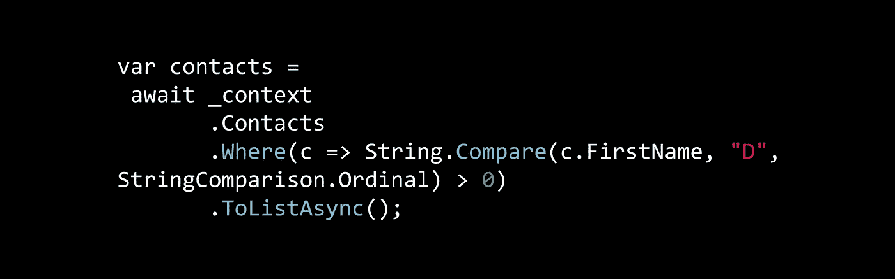

# 实体框架核心:客户端评估

> 原文：<https://itnext.io/entity-framework-core-client-side-evaluation-473077eee5d?source=collection_archive---------2----------------------->



基于我在 [Reddit](https://www.reddit.com/r/dotnet/comments/a9422k/entity_framework_core_string_filter_tips/) 上看到的，我几周前在[Entity Framework Core:String Filter Tips](https://elanderson.net/2018/12/entity-framework-core-string-filter-tips/)上的帖子可能会被认为对客户端评估过于苛刻。我的意思不是说当你需要的时候不应该使用客户端评估，而是你应该选择什么时候使用客户端评估，当查询在客户端运行时，这是很容易错过的。

[TimeRemove](https://www.reddit.com/user/TimeRemove) 很好地解释了检测和处理客户端评估的方法，本文将对此进行回顾。示例应用程序与在示例应用程序部分定义的[实体框架核心:字符串过滤器提示](https://elanderson.net/2018/12/entity-framework-core-string-filter-tips/)中使用的应用程序相同。

# 示例客户端查询

下面是我们将用来触发客户端评估的查询。

```
var contacts = await _context .Contacts .Where(c => String.Compare(c.FirstName, "D", StringComparison.Ordinal) > 0) .ToListAsync();
```

# 没有变化

在不改变应用程序的情况下运行这个查询实际上会在**调试窗口**中给出以下警告。

> *微软。EntityFrameworkCore.Query:警告:LINQ 表达式“where (Compare([c].名字，" D "，序数)> 0)'无法翻译，将在本地进行计算。*

我不确定这个警告有多久了，但这是我第一次注意到它。这是一个很好的提醒，可以更频繁地确认和检查调试窗口。

# 客户端评估引发异常

对 DbContext 进行以下更改将导致 Entity Framework Core 在进行客户端评估时抛出异常，而不仅仅是显示警告。在本例中，我们覆盖了 DbContext 的**on configuration**函数，并更改为在调试模式下构建应用程序时抛出异常。

```
protected override void OnConfiguring(DbContextOptionsBuilder optionsBuilder) { #if DEBUG optionsBuilder.ConfigureWarnings(w => w.Throw(RelationalEventId.QueryClientEvaluationWarning)); #endif base.OnConfiguring(optionsBuilder); }
```

现在运行示例查询会导致以下异常。

> *InvalidOperationException:为警告“Microsoft。EntityFrameworkCore . query . queryclientevaluationwarning:LINQ 表达式“where (Compare([c].名字，“D”，序数)> 0)“无法翻译，将在本地进行计算。”。可以通过传递事件 ID“relational event ID”来取消或记录此异常。将“QueryClientEvaluationWarning”添加到“DbContext”中的“ConfigureWarnings”方法。“OnConfiguring”或“AddDbContext”。*

有时候，客户端评估是您想要的。如何处理这种需求并使异常处于启用状态，以便在客户端评估发生时收到通知？为此，您需要将查询分成多个部分，运行服务器评估部分，然后在不同的语句中运行客户端评估部分。下面是我们分解的示例查询，这样就不会引发异常。

```
//Server evaluation var contacts = await _context.Contacts.ToListAsync(); //Client evaluation contacts = contacts .Where(c => String.Compare(c.FirstName, "D", StringComparison.Ordinal) > 0) .ToList();
```

# 包扎

如果我引入了任何困惑，我希望这篇文章能帮助澄清它。100%清楚客户端评估并不坏，但是我觉得这是开发者做出的一个选择，这很重要。我希望以上能给你一些工具，让你在选择客户端评估的时候更加清楚。

再次感谢 [TimeRemove](https://www.reddit.com/user/TimeRemove) 对我最初帖子的澄清。

*原载于 2019 年 1 月 27 日*[*【elanderson.net*](https://elanderson.net/2019/01/entity-framework-core-client-side-evaluation/)*。*