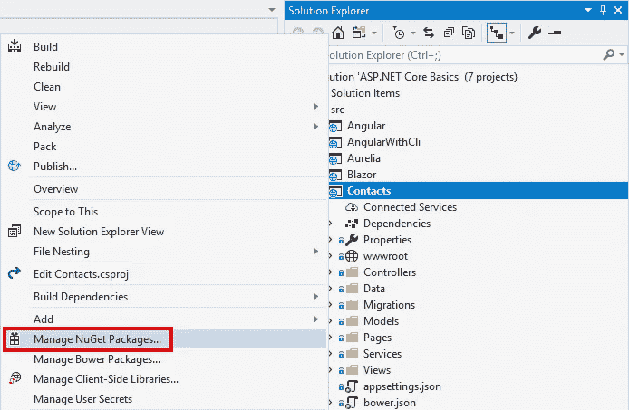
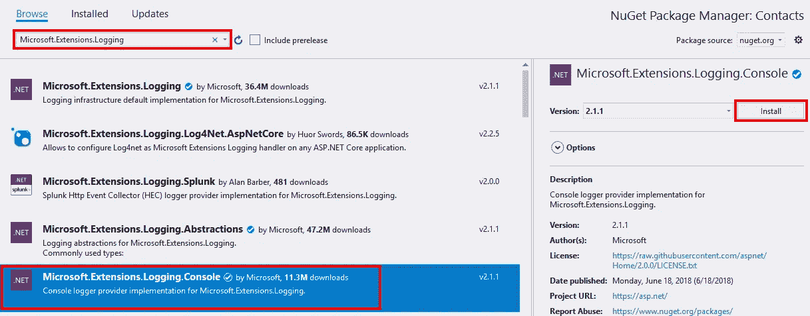
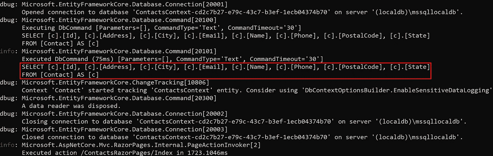

# 实体框架核心:日志记录

> 原文：<https://itnext.io/entity-framework-core-logging-295493b08f9b?source=collection_archive---------2----------------------->

前几天，我不得不深入研究一些使用实体框架核心的流程的性能问题。作为流程的一部分，我需要查看由 Entity Framework Core 生成的查询，以确保它们不是问题的根源(它们不是)。如果你想知道我是从哪里开始的，我将使用我的[ASP.NET 核心基础回购](https://github.com/elanderson/ASP.NET-Core-Basics)中的联系人项目进行这些更改。

首先，我们将讨论添加日志提供者。接下来，我将向你展示我想出的方法，然后我将向你展示微软文档建议的方法(我后来才发现)。

## 日志记录提供程序

首先，我们需要选择记录信息的方式。一个好的起点是使用微软提供的可以在 NuGet 上找到的软件。右键单击您想要添加日志的项目，然后单击 **Manage NuGet Packages** 。



在搜索框中输入**微软。Extensions.Logging** 获得一个好的日志选项列表。在这篇文章中，我们将使用微软提供的控制台记录器。选择**微软。然后点击屏幕右上方的**安装**按钮。**



## 一下子

对于我的第一次尝试，所有的改变都在`Startup`类的`ConfigureServices`函数中。下面是我在函数末尾添加的代码，它将把所有查询记录到控制台窗口(如果您使用 IIS Express，请使用调试记录器)。

```
var scopeFactory = services.BuildServiceProvider()
                           .GetRequiredService<IServiceScopeFactory>();

using (var scope = scopeFactory.CreateScope())
{
    using (var context = scope.ServiceProvider
                              .GetRequiredService<ContactsContext>())
    {
        var loggerFactory = context.GetInfrastructure()
                                   .GetService<ILoggerFactory>();
        loggerFactory.AddProvider(new ConsoleLoggerProvider((_, __) => true, true));
    }
}
```

这段代码创建了一个作用域来获取`ContactsContext`的实例，然后使用上下文来获取它的相关记录器工厂，并向它添加一个控制台记录器。这并不是世界上最干净的，但可以完成工作，特别是如果这只是为了快速调试会话，而不是一些会留下来的东西。

## 微软方式

虽然上面的工作我最终在实体框架核心文档中找到了一个[日志页面。撤销上面所做的更改后，打开`ContactsContext`(或任何你的 DBContext)并为 logger 工厂添加一个类级静态变量。该类级别变量将用于防止每次创建上下文时创建日志记录类的新实例所导致的内存和性能问题。](https://docs.microsoft.com/en-us/ef/core/miscellaneous/logging)

```
public static readonly LoggerFactory LoggerFactory = 
       new LoggerFactory(new[] {new ConsoleLoggerProvider((_, __) => true, true)});
```

接下来，添加/更新对`OnConfiguring`的覆盖，以使用上面定义的记录器工厂。以下是我的例子中的全部功能。

```
protected override void OnConfiguring(DbContextOptionsBuilder optionsBuilder)
{
    base.OnConfiguring(optionsBuilder);

    optionsBuilder.UseLoggerFactory(LoggerFactory);
}
```

## 输出

无论哪种方式，下面是登录后的输出示例。



该查询在上面的红框中突出显示。如你所见，有很多输出，但是有用于过滤的[选项，在文档中有详细描述。](https://docs.microsoft.com/en-us/ef/core/miscellaneous/logging#filtering-what-is-logged)

## 包扎

Entity Framework Core 做得很好，但是上面给了你一个检查它在做什么的选项。如果您使用的是 SQL Server，也可以使用 SQL Server Profiler 获取查询。

*原载于* [*安德森*](https://elanderson.net/2018/10/entity-framework-core-logging/) *。*