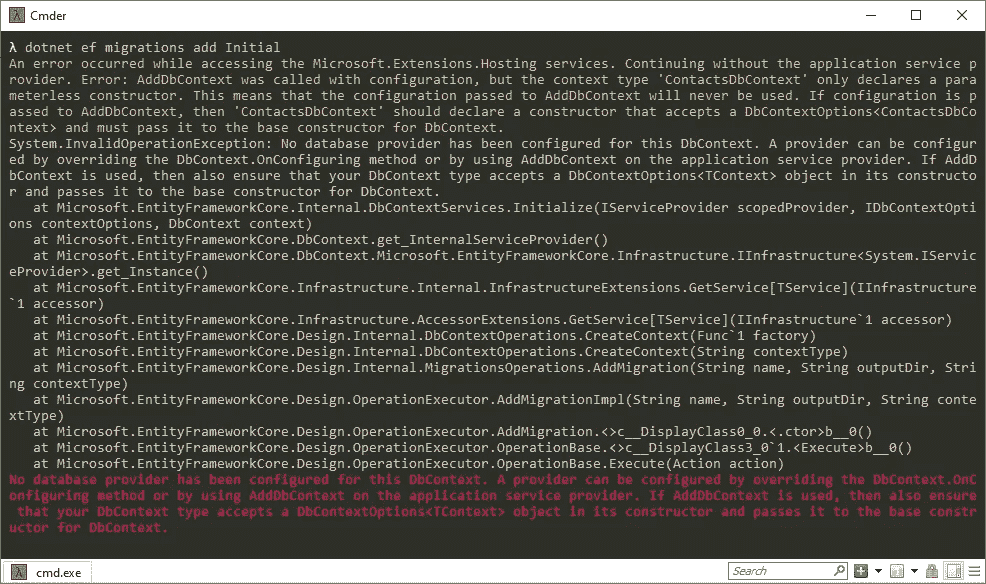

# 实体框架核心:没有为此 DbContext 配置数据库提供程序

> 原文：<https://itnext.io/entity-framework-core-no-database-provider-has-been-configured-for-this-dbcontext-a02d9b192877?source=collection_archive---------2----------------------->

在编写[ASP.NET 核心 3:向现有项目添加实体框架核心](https://elanderson.net/2019/11/asp-net-core-3-add-entity-framework-core-to-existing-project/)时，我正准备添加我的初始实体框架核心迁移，这时我收到了一个巨大的错误消息，最后一位是红色的。

> 没有为此 DbContext 配置数据库提供程序。可以通过重写 DbContext 来配置提供程序。OnConfiguring 方法或通过在应用程序服务提供者上使用 AddDbContext。如果使用了 AddDbContext，那么还要确保 DbContext 类型在其构造函数中接受一个 DbContextOptions <tcontext>对象，并将其传递给 DbContext 的基本构造函数。</tcontext>

## 项目状态

我从事的项目是一个 API，它有一个如下定义的单一模型。

```
public class Contact
{
    public int Id { get; set; }
    public string Name { get; set; }
    public string Address { get; set; }
    public string City { get; set; }
    public string State { get; set; }
    public string PostalCode { get; set; }
    public string Phone { get; set; }
    public string Email { get; set; }
}
```

DbContext 看起来像这样。

```
public class ContactsDbContext : DbContext
{
    public DbSet<Contact> Contacts { get; set; }
}
```

最后**配置服务**功能**启动**。

```
public void ConfigureServices(IServiceCollection services)
{
    services.AddDbContext<ContactsDbContext>(options =>
        options.UseSqlite(Configuration.GetConnectionString("DefaultConnection")));
    services.AddControllers();
}
```

## 错误

此时，我在命令提示符下运行以下命令来添加迁移。

```
dotnet ef migrations add Initial
```

这将导致以下错误。



## 保持冷静，阅读和修复

不要和我犯同样的错误，反复检查你申请中的所有内容。异常消息的黄色和红色部分告诉您应该如何修复。

对于这个应用程序，我想在**启动时使用连接字符串设置。配置服务**。要做到这一点，如错误所述，如果您费心去读它，DbContext 需要添加一个构造函数，它接受一个 **DbContextOptions** 并将该值传递给基类的构造函数，如下所示。

```
public ContactsDbContext(DbContextOptions<ContactsDbContext> options) : base(options)
{ }
```

或者，如果您在您的应用程序中不希望从配置中获取数据库信息，您可以在您的 DbContext 中覆盖**on configuration**，并在那里设置您的连接字符串，如下所示。

```
protected override void OnConfiguring(DbContextOptionsBuilder options)
    => options.UseSqlite("DataSource=app.db");
```

我不推荐第二种选择，但既然它是有效的，我觉得它需要被包括在内。

## 包扎

对我来说，这是一个很好的提醒，让我放慢速度，真正地去阅读错误，即使它们是一堵文字墙。希望我写这篇文章能帮助我记住这一课。

*最初发表于* [*埃里克·安德森*](https://elanderson.net/2019/11/entity-framework-core-no-database-provider-has-been-configured-for-this-dbcontext/) *。*