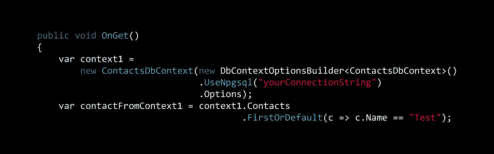

# 实体框架核心:Postgres 并发检查

> 原文：<https://itnext.io/entity-framework-core-postgres-concurrency-checks-aeccdf17d224?source=collection_archive---------4----------------------->



上周关于 [SQLite 并发检查](https://elanderson.net/2018/12/entity-framework-core-sqlite-concurrency-checks/)的帖子使用了[这个](https://github.com/elanderson/ASP.NET-Core-Entity-Framework) repo，它包含了使用实体框架核心与 SQLite 和 Postgres 的例子。这篇文章将使用 Postgres 来处理并发检查，以保持 repo 中的项目具有相同的功能级别。您可以在任何更改之前获取示例代码[这里](https://github.com/elanderson/ASP.NET-Core-Entity-Framework/tree/d1415d23f00117e3fb727d428dbdd7664ee17a0d)。这整个职位将只是触摸文件中发现的 Postgres 文件夹/项目。

## 上下文变化和数据迁移

与 SQLite 不同，Postgres 对并发检查有更好的内置支持。如果您阅读关于[开放式并发和并发令牌](http://www.npgsql.org/efcore/misc.html#optimistic-concurrency-and-concurrency-tokens)的官方文档，您会发现所有的表都有一个隐式/隐藏的系统列调用 [**xmin**](https://www.postgresql.org/docs/current/ddl-system-columns.html) ，它保存最新更新事务的 ID，这意味着每当一行被更改时，它都会自动更改。

Postgres 实体框架核心提供了一个扩展，使得使用 xmin 列作为并发令牌变得非常简单。在 **ContactDbContext** 中，将以下内容添加到 **OnModelCreating** 函数中，以启用指定实体上的并发检查，在本例中，是一个**联系人**。

```
modelBuilder.Entity<Contact>().ForNpgsqlUseXminAsConcurrencyToken();
```

接下来，在与项目文件位于同一目录的命令提示符下，使用以下命令。NET CLI 命令为上述更改生成迁移。这种迁移有点奇怪，因为从技术上来说该列已经存在，但迁移似乎是必要的。

```
dotnet ef migrations add Concurrency --context ContactsDbContext
```

然后，使用以下命令将迁移应用到您的数据库。

```
dotnet ef database update --context ContactsDbContext
```

## 测试它

为了快速测试，我在**联系人**目录下添加了一个**并发测试** razor 页面。这个函数将确保特定的 contact 存在，然后从两个不同的 DBContexts 中提取 contact，对产生的 contact 对象进行变异，然后尝试保存。第一次保存会成功，第二次应该会失败。请注意，这个函数不是一个应该如何做的例子，只是一个快速和肮脏的方法来证明并发检查正在发生。

```
public void OnGet()
{
    var context1 = 
        new ContactsDbContext(new DbContextOptionsBuilder<ContactsDbContext>()
                              .UseNpgsql("yourConnectionString")
                              .Options);
    var contactFromContext1 = context1.Contacts
                                      .FirstOrDefault(c => c.Name == "Test");

    if (contactFromContext1 == null)
    {
        contactFromContext1 = new Contact
                              {
                                  Name = "Test"
                              };

        context1.Add(contactFromContext1);
        context1.SaveChanges();
    }

    var context2 = 
        new ContactsDbContext(new DbContextOptionsBuilder<ContactsDbContext>()
                              .UseNpgsql("yourConnectionString")
                              .Options);
    var contactFromContext2 = context2.Contacts
                                      .FirstOrDefault(c => c.Name == "Test");

    contactFromContext1.Address = DateTime.Now.ToString();
    contactFromContext2.Address = DateTime.UtcNow.ToString();

    context1.SaveChanges();
    context2.SaveChanges();
}
```

运行应用程序并点击**concurrency test**路径，对于我的测试，该路径是[https://localhost:44324/Contacts/concurrency test](https://localhost:44324/Contacts/ConcurrencyTest)。下面是产生的异常。

# 处理请求时出现未处理的异常。

> DbUpdateConcurrencyException:数据库操作预期影响 1 行，但实际影响了 0 行。自实体加载后，数据可能已被修改或删除。关于理解和处理开放式并发异常的信息，请参见 http://go.microsoft.com/fwlink/?LinkId=527962。

## 包扎

这个过程使用 Postgres 比 SQLite 简单得多。不是说 SQLite 版本很难，只是路径不那么简单。

最终状态的代码可以在这里找到。

*最初发表于* [*埃里克·安德森*](https://elanderson.net/2019/01/entity-framework-core-postgres-concurrency-checks/) *。*