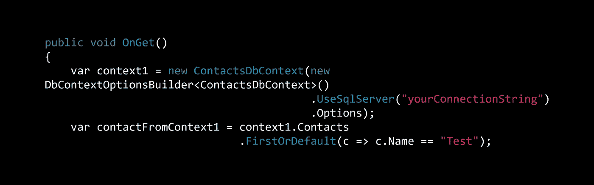

# 实体框架核心:SQL Server 并发检查

> 原文：<https://itnext.io/entity-framework-core-sql-server-concurrency-checks-fea21ac7b1b8?source=collection_archive---------1----------------------->



在过去的几周里，我在 [SQLite](https://elanderson.net/2018/12/entity-framework-core-sqlite-concurrency-checks/) 和 [Postgres](https://elanderson.net/2019/01/entity-framework-core-postgres-concurrency-checks/) 中介绍了并发检查。本周，我将扩展我的实体框架示例 repo，以包括一个基于 SQL Server 的示例项目，从而演示并发检查。对于 SQL Server。添加了 SQL Server 项目的 repo，但是在并发检查之前可以在这里找到。

请注意，这篇文章中的所有更改都将在 SqlServer 文件夹下进行。

## 上下文变化和数据迁移

SQL Server 有一个内置的列类型 [rowversion](https://docs.microsoft.com/en-us/sql/t-sql/data-types/rowversion-transact-sql) ，当插入或更新行时，它会自动生成一个唯一的二进制数。为了通过实体框架利用 rowversion 列类型，我们需要向我们的模型添加一个新列，该列具有**时间戳**属性，如下所示，来自**联系人**模型中的示例代码。

```
[Timestamp] 
public byte[] Timestamp { get; set; }
```

接下来，在与项目文件位于同一目录的命令提示符下，使用以下命令。NET CLI 命令为上述更改生成迁移。

```
dotnet ef migrations add ContactTimestamp --context ContactsDbContext
```

然后，使用以下命令将迁移应用到您的数据库。

```
dotnet ef database update --context ContactsDbContext
```

## 测试它

为了快速测试，在**联系人**目录下添加一个**并发测试** razor 页面。这个函数将确保特定的 contact 存在，然后从两个不同的 DBContexts 中提取 contact，对产生的 contact 对象进行变异，然后尝试保存。第一次保存会成功，第二次应该会失败。请注意，这个函数不是一个应该如何做的例子，只是一个快速和肮脏的方法来证明并发检查正在发生。

```
public void OnGet()
{
    var context1 = new ContactsDbContext(new DbContextOptionsBuilder<ContactsDbContext>()
                                         .UseSqlServer("yourConnectionString")
                                         .Options);
    var contactFromContext1 = context1.Contacts
                              .FirstOrDefault(c => c.Name == "Test");

    if (contactFromContext1 == null)
    {
        contactFromContext1 = new Contact
                              {
                                  Name = "Test"
                              };

        context1.Add(contactFromContext1);
        context1.SaveChanges();
    }

    var context2 = new ContactsDbContext(new DbContextOptionsBuilder<ContactsDbContext>()
                                         .UseSqlServer("yourConnectionString")
                                         .Options);
    var contactFromContext2 = context2.Contacts
                              .FirstOrDefault(c => c.Name == "Test");

    contactFromContext1.Address = DateTime.Now.ToString();
    contactFromContext2.Address = DateTime.UtcNow.ToString();

    context1.SaveChanges();
    context2.SaveChanges();
}
```

运行应用程序并点击**concurrency test**路径，对于我的测试来说是[https://localhost:44324/Contacts/concurrency test](https://localhost:44324/Contacts/ConcurrencyTest)。下面是产生的异常。

# 处理请求时出现未处理的异常。

> DbUpdateConcurrencyException:数据库操作预期影响 1 行，但实际影响了 0 行。自实体加载后，数据可能已被修改或删除。有关理解和处理乐观并发异常的信息，请参见[http://go.microsoft.com/fwlink/?LinkId=527962](http://go.microsoft.com/fwlink/?LinkId=527962)。

## 包扎

在这三个提供者中，Postgres 似乎具有最简单的实现，并不是说并发将成为您选择数据库提供者的方式。我目前不打算添加任何更多的提供者，但是如果你正在使用，请留下评论，我会考虑添加另一个例子。

最终状态的代码可以在[这里](https://github.com/elanderson/ASP.NET-Core-Entity-Framework/tree/bd4cd1dedaa50d5949a852b2fdb44135ea62077a)找到。

*原载于*[](https://elanderson.net/2019/01/entity-framework-core-sql-server-concurrency-checks/)**。**