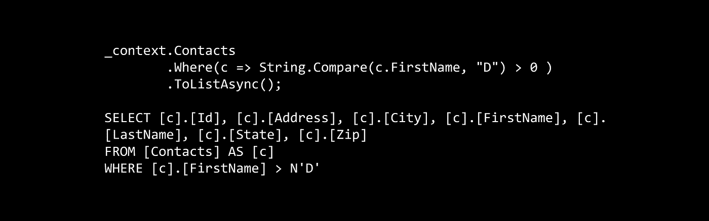

# 实体框架核心:字符串过滤器提示

> 原文：<https://itnext.io/entity-framework-core-string-filter-tips-768139b55ffd?source=collection_archive---------0----------------------->

我一直在使用 SQLite 开发一个由 Entity Framework Core 支持的应用程序，在处理字符串过滤器时，我遇到了一些最初并不太清楚的事情。这篇文章将介绍如何设置一个示例应用程序，并演示在过滤器中使用字符串时需要记住的一些事情。



## 示例应用程序

我使用带有个人身份验证的 Razor Pages 模板作为这个示例的基础，因为它附带的实体框架核心已经设置好并准备就绪。在希望创建示例项目的目录中，使用命令提示符运行以下命令。

```
dotnet new razor --auth Individual
```

在您选择的编辑器中打开结果项目，并添加一个 **Models** 文件夹。像往常一样，我将使用一个联系人作为我的示例，因此在 Models 文件夹中创建一个与以下内容匹配的**联系人**类。在 **ToString** 上的覆盖只是为了在调试时容易看到结果。

```
public class Contact
{
    public int Id { get; set; }
    public string FirstName { get; set; }
    public string LastName { get; set; }
    public string Address { get; set; }
    public string City { get; set; }
    public string State { get; set; }
    public string Zip { get; set; }

    public override string ToString()
    {
        return $"{Id} - {LastName}, {FirstName}";
    }
}
```

接下来，打开在 **Data** 文件夹中找到的 **ApplicationDbContext** ，并添加下面的 **DbSet** 属性来公开我们的联系人。

```
public DbSet<Contact> Contacts { get; set; }
```

将下面的 **OnModelCreating** 函数添加到 **ApplicationDbContext** 中，这将为我们创建一些测试数据。

```
protected override void OnModelCreating(ModelBuilder builder)
{
    builder.Entity<Contact>()
           .HasData(new Contact
                    {
                        Id = 1,
                        FirstName = "Bob",
                        LastName = "Smith",
                        Address = "123 Main Street",
                        City = "Nashville",
                        State = "TN",
                        Zip = "35970"
                    },
                    new Contact
                    {
                        Id = 2,
                        FirstName = "Sam",
                        LastName = "Smith",
                        Address = "1 Sun Lane",
                        City = "Knoxville",
                        State = "TN",
                        Zip = "48909"
                    },
                    new Contact
                    {
                        Id = 3,
                        FirstName = "Clark",
                        LastName = "Swift",
                        Address = "750 10th Street",
                        City = "Chattanooga",
                        State = "TN",
                        Zip = "91590"
                    }
                   );

    base.OnModelCreating(builder);
}
```

回到命令提示符，在与 **csproj** 文件相同的目录中运行以下命令，为我们的新联系模型创建一个迁移。

```
dotnet ef migrations add Contacts
```

最后，运行以下命令将迁移应用到您的数据库。

```
dotnet ef database update
```

## 数据执行

对于这个例子，我并不在乎在 UI 中显示结果，所以我使用了**索引**页面的 **OnGetAsync** 来运行我的查询。下面是我的完整索引页面模型，带有一个返回所有联系人的查询。这篇文章的其余部分将只是展示查询数据库的 LINQ 语句，而不是整个页面模型。

```
public class IndexModel : PageModel
{
    private readonly ApplicationDbContext _context;

    public IndexModel(ApplicationDbContext context)
    {
        _context = context;
    }

    public async Task<IActionResult> OnGetAsync()
    {
        var contacts = await _context.Contacts.ToListAsync();

        return Page();
    }
}
```

以上结果导致所有植入的联系人都被退回。

```
1 - Smith, Bob
2 - Smith, Sam
3 - Swit, Clark
```

## 喜欢的查询

作为实体框架核心 2.0 版本的一部分。增加了像这样的函数，它允许使用通配符，而使用字符串函数翻译是不可能的，字符串函数翻译是以前唯一的选择。这个 StackOverflow 问题的答案很好地概述了好处。以下查询是使用 like 的示例。

```
_context.Contacts
        .Where(c => EF.Functions.Like(c.LastName, "S_i%"))
        .ToListAsync();
```

虽然这在以前是可能的，但我认为查询会很糟糕，并且涉及到某种程度的客户端评估。查询的结果与上面相同。

## 大于/小于

使用**字符串。比较**或**值。CompareTo** 将允许你对字符串进行大于或小于比较。比如说**弦。比较(值)> 0** 给你一个大于和小于零的会为小于。例如，下面是一个字符串比较查询以及生成的 SQL。

```
_context.Contacts
        .Where(c => String.Compare(c.FirstName, "D") > 0 )
        .ToListAsync();

SELECT [c].[Id], [c].[Address], [c].[City], [c].[FirstName], [c].[LastName], [c].[State], [c].[Zip]
FROM [Contacts] AS [c]
WHERE [c].[FirstName] > N'D'
```

重要的是不要尝试使用**字符串的任何重载。比较**,否则您将结束客户端对查询的评估。下面是一个使用重载之一和生成的 SQL 的查询。

```
_context.Contacts
        .Where(c => String.Compare(c.FirstName, "D", StringComparison.Ordinal) > 0)
        .ToListAsync();

SELECT [c].[Id], [c].[Address], [c].[City], [c].[FirstName], [c].[LastName], [c].[State], [c].[Zip]
FROM [Contacts] AS [c]
```

注意，第一个查询有一个 **Where** 子句，而第二个没有。这意味着第二个查询会将所有记录提取到客户端，然后应用过滤器。虽然这对于少量数据来说没有问题，但是对于在客户端进行评估的查询，请小心，因为它们可能会导致性能问题。

以上两个查询都返回以下结果。

```
2 - Smith, Sam
```

## 包扎

这是对我提醒最多的帖子之一。我真的希望这能为你节省一些时间，让你明白实体框架核心是如何处理字符串的。

*最初发表于* [*埃里克·安德森*](https://elanderson.net/2018/12/entity-framework-core-string-filter-tips/) *。*