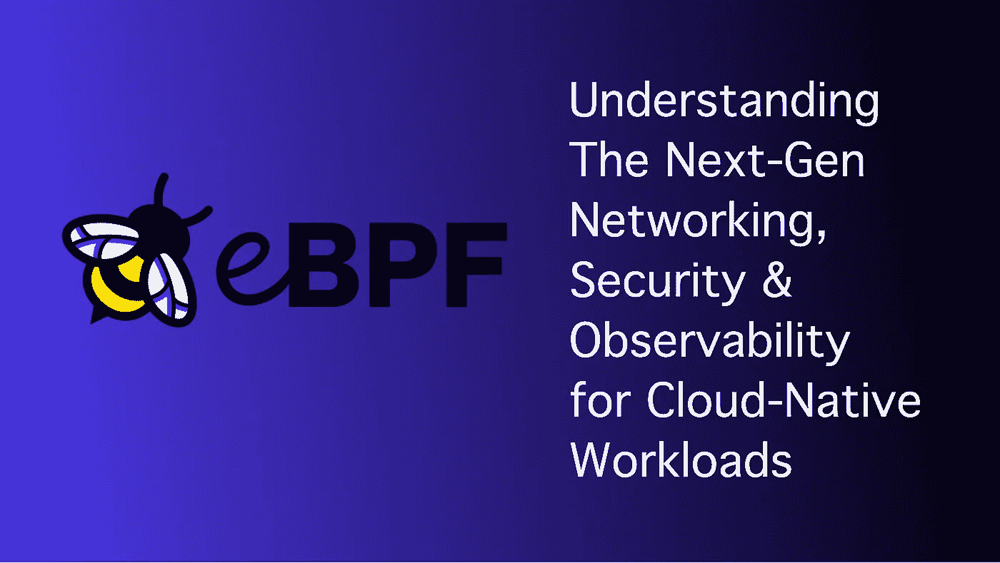
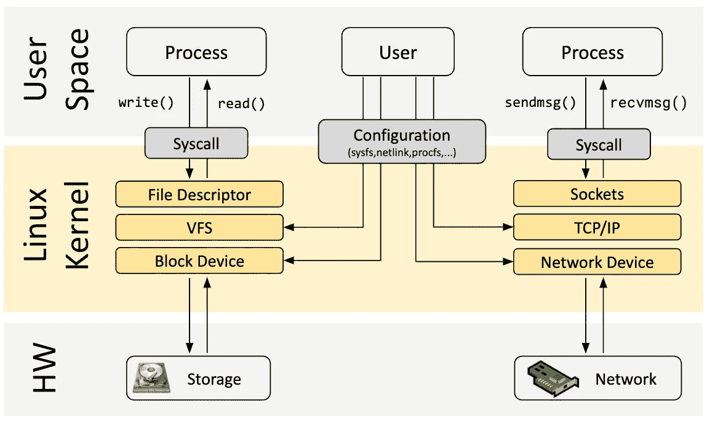
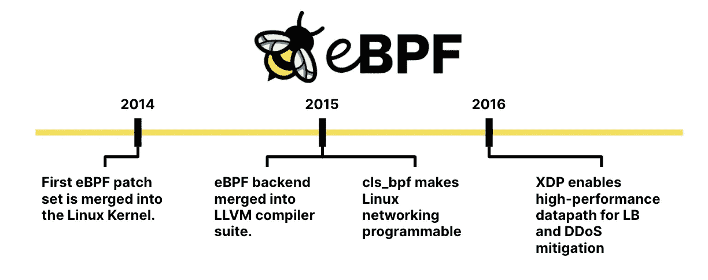
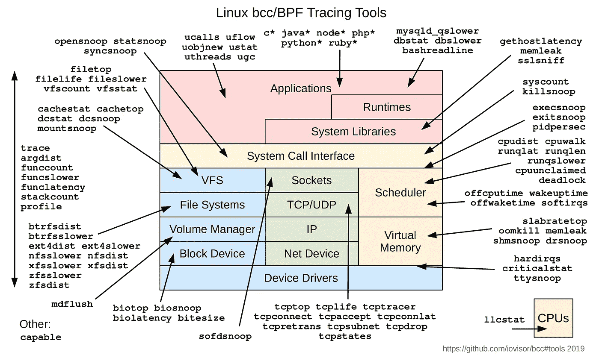
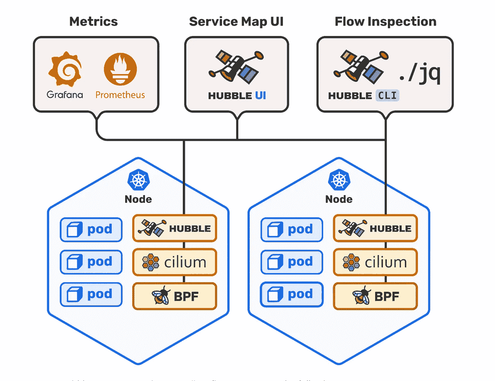
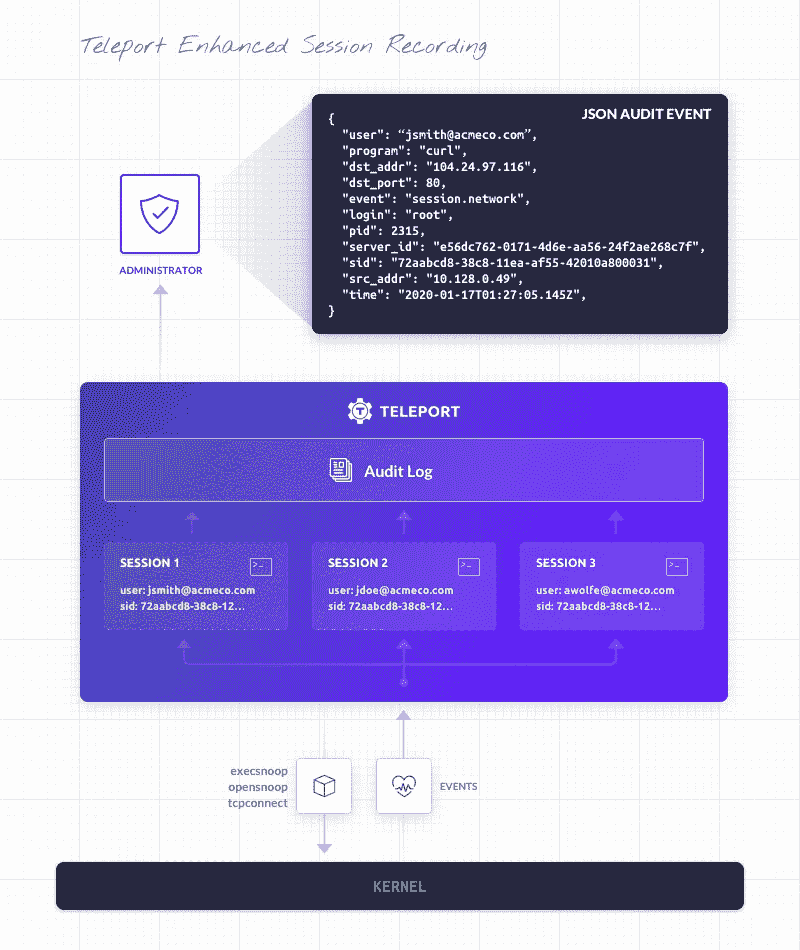

# eBPF —了解面向云原生工作负载的下一代网络、安全性和可观察性

> 原文：<https://itnext.io/epbf-understanding-the-next-gen-networking-security-observability-for-cloud-native-workloads-1fe8ad87ee0f?source=collection_archive---------0----------------------->

作者图片

最近，我有机会在 **InfoQ** 的一次现场会议上从 **Liz Rice** 那里了解 eBPF。当谈到网络、安全和可观察性时，我惊讶地看到它可以带来的超能力和能力。

在本文中，我将探索 eBPF 和构建在它之上的工具，并看看它们如何在云原生世界中提供帮助。

# eBPF 是什么？

Linux 内核由两部分组成—

*   用户空间
*   内核空间

来源—【https://ebpf.io/ 

用户空间是常规应用程序运行的地方，而内核空间是大多数操作系统相关进程运行的地方。内核空间可以直接完全访问硬件。每当用户空间中的应用程序需要连接到硬件时，它都是通过调用内核空间中的 API 来实现的。将这两者分开提供了安全性好处，并且在大多数应用程序中，这已经足够好了。

> **eBPF(extended Berkeley Packet Filter)**为程序员提供了一种机制，使他们可以在内核空间执行定制代码，从而可以用来构建更好的调试、跟踪、防火墙等工具。

eBPF 允许用户空间应用程序打包要在内核空间执行的逻辑，而无需更改内核代码，甚至无需重新加载。

用布兰登·格雷格的话说——

> eBPF 对 Linux 的作用就像 JavaScript 对 HTML 的作用一样。(算是吧。)因此，与静态 HTML 网站不同，JavaScript 让你定义在鼠标点击等事件上运行的迷你程序，这些程序在浏览器中的安全虚拟机中运行。有了 eBPF，而不是固定的内核，您现在可以编写运行在磁盘 I/O 等事件上的迷你程序，这些程序运行在内核中的安全虚拟机上

下图显示了 eBPF 的演变—

来源—[https://cilium . io/blog/2020/11/10/ebpf-未来网络/](https://cilium.io/blog/2020/11/10/ebpf-future-of-networking/)

程序员可以使用 [BCC](https://github.com/iovisor/bcc) 工具包编写 eBPF 程序。有像[验证器](https://github.com/torvalds/linux/blob/master/kernel/bpf/verifier.c)这样的程序来检查程序是否做了合法的事情，并且没有最终锁定内核。

由于 eBPF 程序运行在内核空间中，所以它们具有跨所有进程和应用程序的可见性。因此，它们可以用于许多方面:网络性能、安全、跟踪和防火墙。

# 我如何开始？

对于初学者来说，有相当多已经构建好的工具可以开始使用。有密件抄送工具，比如—

*   execsnoop
*   opensnoop
*   ext4slower
*   生物毒性
*   生物睡眠
*   cachestat
*   TCP 连接
*   tcpaccept
*   tcpretrans
*   runqlat
*   轮廓
*   等等。

你可以在这里阅读更多关于这些工具的信息[。下图显示了密件抄送/BPF 跟踪工具的完整列表。](https://github.com/iovisor/bcc/blob/master/docs/tutorial.md)

来源—[https://github . com/io visor/bcc/blob/master/images/bcc _ tracing _ tools _ 2019 . png](https://github.com/iovisor/bcc/blob/master/images/bcc_tracing_tools_2019.png)

# 基于 eBPF 的项目

既然您已经理解了 eBPF 的强大功能，那么是时候理解它有用的用例了。

上一节描述了 eBPF 工具的跟踪功能，但是还有更多内容。相当多的项目将这种能力提升到了一个新的水平。让我们试着去理解这些项目。

## [纤毛](https://cilium.io/)

Cilium 是一款开源软件，用于保护使用 Docker 和 Kubernetes 等 Linux 容器管理平台部署的应用程序服务之间的网络连接。

由于 Cilium 构建在运行内核的 eBPF 上，因此不需要更改任何应用程序代码。

这里的是一本很好的读物，详细描述了纤毛的功能。通过与 Hubble 的结合，Cilium 可以帮助轻松保护基于 Kubernetes 的工作负载。

来源—[https://github.com/cilium/hubble](https://github.com/cilium/hubble)

你可能还想参考来自 [Luc Juggery](https://medium.com/u/ee455f5da731?source=post_page-----1fe8ad87ee0f--------------------------------) 的一篇[文章](https://betterprogramming.pub/k8s-network-policy-made-simple-with-cilium-editor-a5b55781291c)，它讲述了使用纤毛来建立 K8 网络策略。

## [法尔科](https://falco.org/)

Falco 是一个行为分析工具，可以检测应用程序中的异常。使用 eBPF，它

*   解析系统调用
*   根据定义的规则验证行为
*   违反规则时发出警报

Falco 带有预定义的规则，有助于分析异常行为。

你可以在这里看看一些规则和例子[。](https://falco.org/docs/examples/)

## [瞬间移动](https://goteleport.com/)

Teleport 是一个认证机构，也是基础设施的访问平台。它允许用户在一个地方设置单点登录，并访问 SSH 服务器、K8s 和 web 应用程序。Teleport 的一个重要特性就是分享互动会话。

Teleport 4.2 版本开始使用一些 eBPF 程序来捕获 SSH 会话并将它们转换成事件流。

来源—[https://goteleport.com/blog/what-is-ebpf/](https://goteleport.com/blog/what-is-ebpf/)

## [卡特兰](https://github.com/facebookincubator/katran)

Katran 是一个开源 eBPF 项目，用于构建高性能的第 4 层负载平衡转发平面。Katran 于 2018 年 5 月由脸书开源。

你可以在这里找到更多关于卡特兰[的信息。](https://github.com/facebookincubator/katran)

# 下一步是什么？

eBPF 无疑革新了网络、负载平衡和安全领域。我很确定许多人都在关注这项技术，并且能够用它做更多的事情。

到目前为止，eBPF 的能力仅限于 Linux 工作负载。微软最近[宣布了](https://cloudblogs.microsoft.com/opensource/2021/05/10/making-ebpf-work-on-windows/)一个可以为 Windows 启用 eBPF 的开源项目。

Google 还[宣布](https://cloud.google.com/blog/products/containers-kubernetes/bringing-ebpf-and-cilium-to-google-kubernetes-engine)他们将在 Google Kubernetes 引擎中提供 Cilium 和 eBPF 的功能，以提高基于 K8 的工作负载的安全性。

因此，我们可以肯定地认为，这一领域将迎来激动人心的时刻！

# 嘿，如果你喜欢这个故事，看看[中级会员](https://deshpandetanmay.medium.com/membership)！只要 5 美元/月！

*你的会员费直接支持我和你看的其他作家。你也可以在媒体上看到所有的故事。*

# [现在就成为中等会员吧！](https://deshpandetanmay.medium.com/membership)