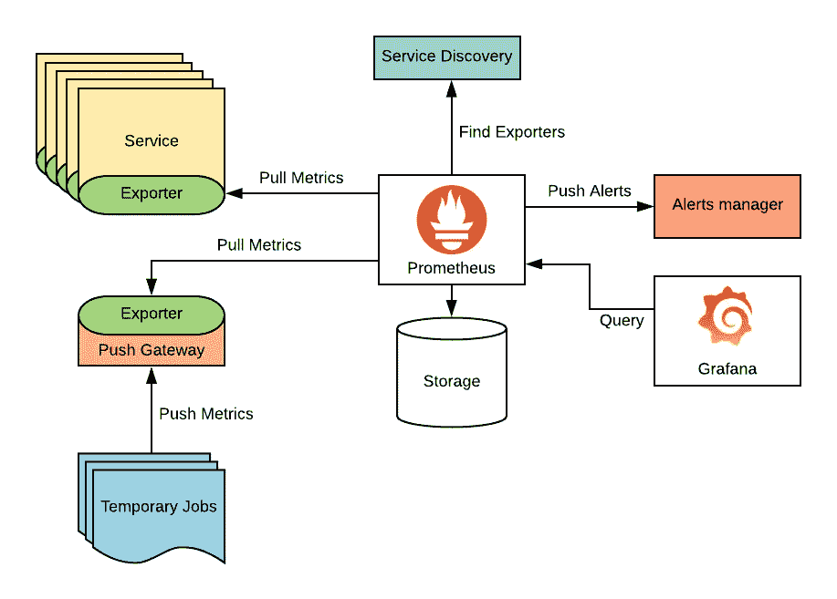
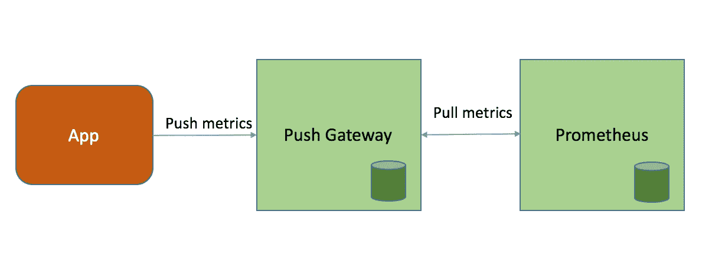
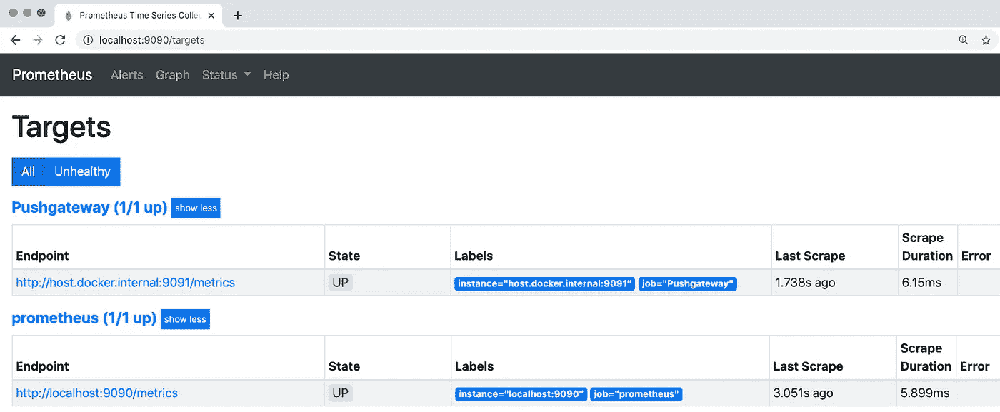
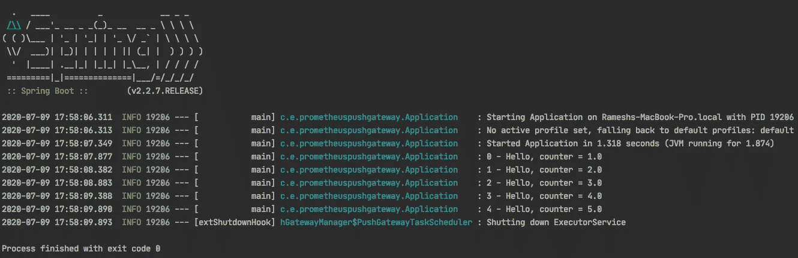
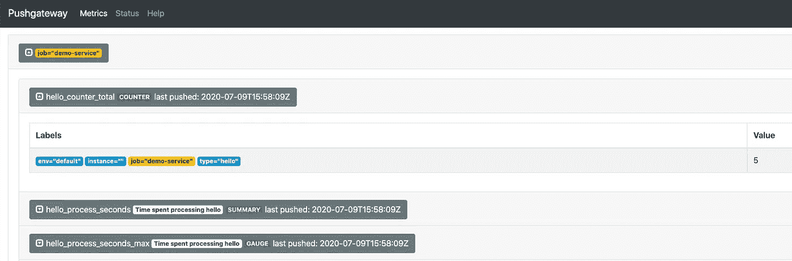
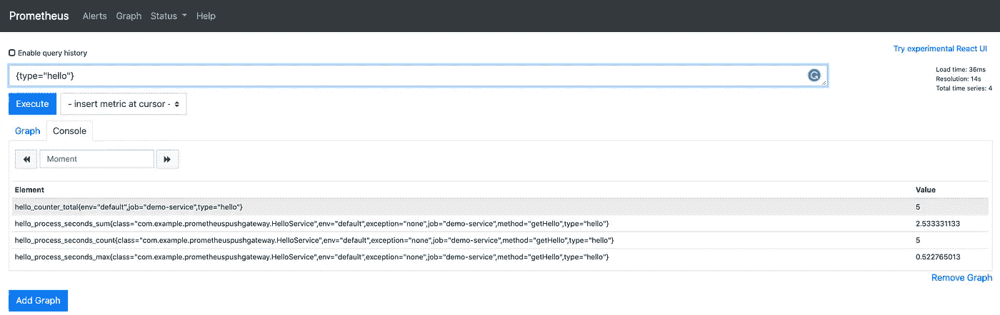

# 使用 Prometheus PushGateway 监控临时作业

> 原文：<https://itnext.io/ephemeral-jobs-monitoring-using-prometheus-pushgateway-917b33486564?source=collection_archive---------2----------------------->



普罗米修斯建筑

在软件系统中，我们通常希望增加一些临时服务或任务，一旦执行了特定的任务，这些服务或任务就可以被终止。例如，如果我们希望每天早上发送用户通知，那么我们不希望该服务整天运行，而是希望服务可以在特定时间启动、执行任务和关闭，从而有效地节省资源和成本。

与任何其他长期运行的服务一样，这些短暂的(或 Kubernetes 术语批处理或 Cron)作业也需要被监控，以收集关键指标，并在出现问题时进行更改。

本文描述了我们如何通过解释来监控这些短命的作业

*   普罗米修斯有什么问题
*   什么是 PushGateway &为什么它是必要的
*   使用示例应用程序进行演示

# 普罗米修斯建筑公司:

关于[普罗米修斯](https://prometheus.io/)的简短介绍如果你还不知道，

> Prometheus 是一个基于开源指标的监控系统，可以记录多维时序数据。它支持强大的查询、仪表板和警报。提供多种集成以连接到各种系统。

## 它是如何工作的？

Prometheus 使用拉模型(也称为抓取)来收集指标，这意味着 Prometheus 服务器将通过调用其配置的 HTTP 端点来获取这些指标，从而联系指定的服务。

例如，`prometheus.yml`文件中定义的以下配置告诉 Prometheus 服务器在指定的端点上每隔 5s 获取一次指标

```
scrape_configs:- job_name: 'auth_server'scrape_interval: 5sstatic_configs:- targets: ['auth.server.com:8080/metrics']
```

## 问题？

Scarping 对长期运行的服务有好处，因为这些服务将在很长一段时间内可供 Prometheus 服务器发出请求并收集它们的指标。这种架构很好，它有助于实现其他一些好处，如健康检查、无瓶颈等。

但是对于像 K8s Batch/Cron Jobs 这样的短命服务，当 Prometheus 决定收集指标时，这些 pod 可能早就被终止了

对于这些类型的用例，推送模型是必要的，以便这些服务可以在需要时(例如，在关机期间)发布其度量

# PushGateway



首先 [PushGateway](https://github.com/prometheus/pushgateway) 不是另一个监控系统或某种类型，而是一个中间指标缓存。

> Prometheus Pushgateway 允许临时和批处理作业向 Prometheus 公开它们的指标。

因此，它是一个中介服务，在它关闭之前，客户端(作业)可以按需推送指标，稍后 Prometheus 可以像往常一样从 PushGateway 获取这些指标。对于请求，它使用与 Prometheus 相同的度量格式。

Pushgateway 仅推荐用于短期服务。要知道确切的原因，请检查一下 [**何时使用 PushGateway**](https://prometheus.io/docs/practices/pushing/)

# 演示

让我们看一些推送网关的演示，

## 设置

首先，我们需要设置我们的环境，包括启动和运行 Prometheus & Pushgateway 实例，为了进行演示，我创建了一个简单的`docker-compose`文件来设置这些环境。

这里我配置了两个服务

*   Prometheus 服务器将在端口 9090 上运行
*   推动网关服务器在端口 9091 上运行

此外，我们需要告诉 Prometheus 从 PushGateway 获取指标，这可以在`prometheus.yml`中完成，

第一项工作是让 Prometheus 废弃它自己的指标，第二项工作是我们定义在目标`host.docker.internal:9091`收集推送网关指标，因为推送网关运行在 docker 容器中，我们需要将主机定义为`host.docker.internal`

运行以下命令启动这些服务，

```
docker-compose up
```

现在 Prometheus & PushGateway 服务器应该启动了，请查看 http://localhost:9090&[http://localhost:9091](http://localhost:9091)。

此外，如果您检查 http://localhost:9090/targets，您可以看到这两个目标是健康的，这意味着 Prometheus 可以从推送网关服务器删除指标，



普罗米修斯目标仪表板

## 示例应用程序

我已经创建了一个示例 Spring Boot 控制台应用程序，它可以被视为一个短命的作业，它将启动，执行一个任务，并在最后关闭。
此应用程序可以打包并配置为作为 Kubernetes 批处理/Cron 作业或通过任何其他系统触发。

为了收集指标，我们使用[千分尺](https://micrometer.io/docs/concepts#_purpose)。

```
<!-- Micrometer -->
<dependency>
   <groupId>io.micrometer</groupId>
   <artifactId>**micrometer-core**</artifactId>
</dependency>
<dependency>
   <groupId>org.springframework.boot</groupId>
   <artifactId>spring-boot-starter-aop</artifactId>
</dependency>

<dependency>
   <groupId>io.micrometer</groupId>
   <artifactId>**micrometer-registry-prometheus**</artifactId>
</dependency>

<dependency>
   <groupId>io.prometheus</groupId>
   <artifactId>**simpleclient_pushgateway**</artifactId>
   <version>0.9.0</version>
</dependency>
```

Micrometer 为最流行的监控系统提供了一个简单的仪器客户端外观，因此我们可以将指标发送到其他几个外部系统，包括 Prometheus。为此，我们还包括了 Prometheus 和 PushGateway 依赖项。默认情况下，micrometer 还收集 JVM 指标。

```
@Slf4j
@SpringBootApplication
@RequiredArgsConstructor
public class Application implements CommandLineRunner {

    private final HelloService service;

    public static void main(String[] args) {
        SpringApplication.*run*(Application.class, args);
    }

    @Override
    public void run(String... args) {

        for (int i = 0; i < 5; i++) {
            *log*.info("{} - {}", i, service.getHello());
        }
    }
}
```

应用程序在启动时将简单地调用 HelloService 几次并终止。我们通过以下方式跟踪我们在 HelloService.java 的指标

HelloService.java

这里我们有两个指标，

`hello.counter` —这是一个[计数器](https://prometheus.io/docs/concepts/metric_types/#counter)，它将在每次调用`getHello()`方法时递增

`hello-process`——测量`getHello()`方法执行需要多长时间，这可以通过简单地从千分尺添加`@Timed`注释来实现。

使用`mvn spring-boot:run`命令运行应用程序，



应用程序日志

从日志中，我们可以看到 hello 服务被调用了几次，在端点处作为关闭挂钩的一部分，`PushGatewayTaskScheduler`被执行，这将把任何未决的指标推送到 PushGateway。

当我们检查位于 [http://localhost:909](http://localhost:90901,) 1 的 PushGateway 仪表板时，我们可以看到我们的所有指标都被成功推送，



PushGateway 仪表板

最后但同样重要的是，我们可以在 Prometheus 仪表板中检查这些指标也是从 PushGateway 成功获取的。



普罗米修斯仪表板

最棒的是，我们不需要添加任何自定义代码或使用另一个监控系统来监控这些短暂的作业。

Github 提供了示例代码，

[](https://github.com/ramesh-dev/prometheus-pushgateway-demo) [## Ramesh-dev/普罗米修斯-pushgateway-demo

### 这是一个演示应用程序，使用 Spring Boot 2.2 与千分尺发布指标到普罗米修斯使用普罗米修斯推…

github.com](https://github.com/ramesh-dev/prometheus-pushgateway-demo) 

**注意:**示例代码还实现了将指标推送到 PushGateway 服务器，该服务器使用 Nginx 反向代理启用了基本身份验证

*   使用 docker-compose 为 Nginx 服务器提供和配置基本认证
*   定义自定义 spring 配置以支持基本身份验证，因为 Prometheus 库自动配置还不支持它，请查看示例代码中的*pushgateway configuration*

# 结论

当您希望使用当前的 Prometheus 设置来监控临时和批处理作业时，PushGateway 非常有用，因此您不必专门为这个用例设置或使用另一个监控解决方案。

快乐监控…