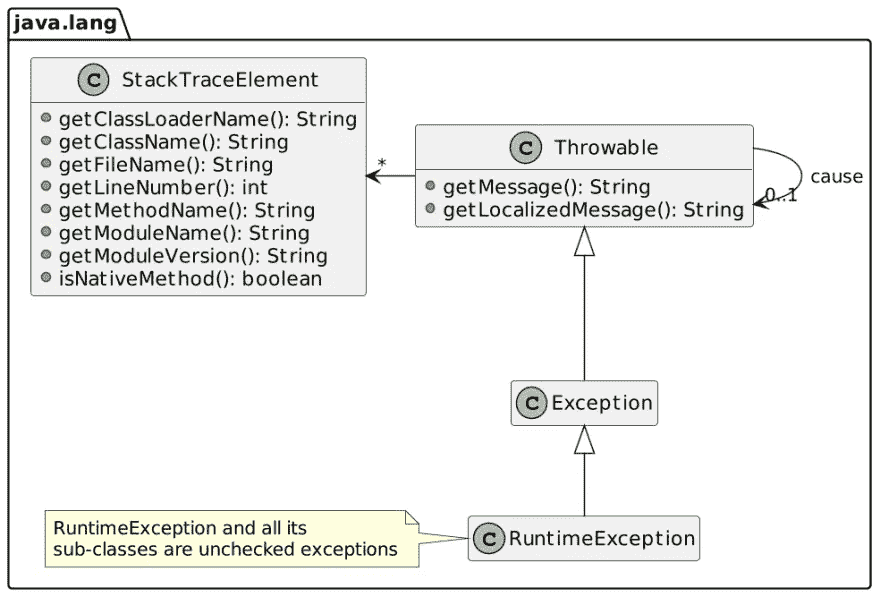
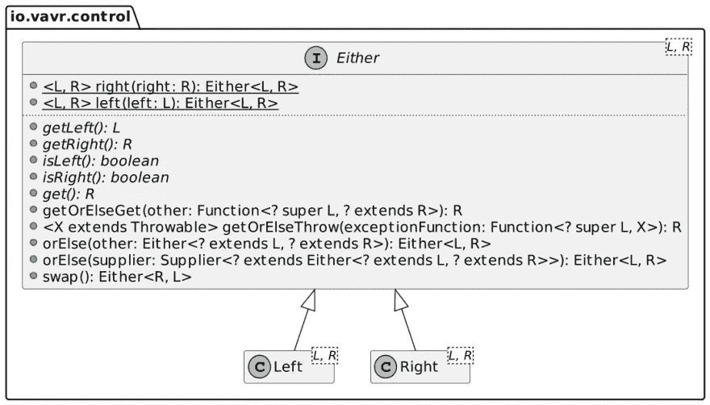
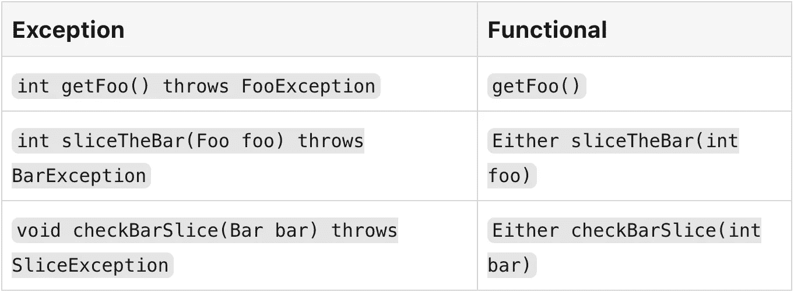

# 跨不同语言的错误处理

> 原文：<https://itnext.io/error-handling-330d7aea1480?source=collection_archive---------4----------------------->


我过去也尝试过围棋，至少我可以说我对它不感兴趣。我最大的苦恼是这种语言如何处理错误，或者更准确地说，它为开发人员提供了管理错误的机制。在这篇文章中，我想描述几种流行的语言是如何处理错误的。

# 我们时代之前的时代

我可能会回到很久以前，但我需要在某个时候选择一个基线。在这篇文章中，基线是 c。

如果您在网上搜索“错误处理 C ”,您可能会经常看到以下内容:

> *C 不直接支持错误处理*

由于缺乏支持，开发人员创建了应对机制。一种方法是让函数返回一个表示错误的值。该值是数字，文档描述了该问题。

如果函数需要返回一个值，你需要选择。
例如:

*   定义发生错误时将被设置的指针参数。如果呼叫成功，将是`null`。
*   另一种方法是使用专用的结构，用一个字段专门存储错误。

最终的解决方案是使用一个全局误差变量— `errno`。

每种选择都有利弊。然而，由于没有固定的方式，最大的问题是缺乏一致性。

# 例外

我不知道是哪种语言首先实现了异常，但我很确定是 Java 普及了异常。异常解决了一个常见的问题:简单的错误检查代码将名义路径和错误处理路径交织在一起:

```
int foo;
int bar;
int slice;
foo = get_foo();
if (foo < 0)
    {
        return foo;
    }
bar = slice_the_bar(foo);
if (bar < 0)
    {
        return bar;
    }
slice = check_bar_slice(bar);
if (slice < 0)
    {
        return slice;
    }
```

异常的好处是将它们清楚地分隔在不同的块中，以便于阅读:

```
try {
    int foo = getFoo();             // 1   // 4
    int bar = sliceTheBar(foo);     // 2   // 4
    checkBarSlice(bar);             // 3   // 4
} catch (FooException e) {
    // Do something with e          // 1
} catch (BarException e) {
    // Do something with e          // 2
} catch (SliceException e) {
    // Do something with e          // 3
} finally {
    // Will be executed in all cases
}
```

1.  如果调用抛出`FooException`，则短路并直接执行相关的`catch`块
2.  `BarException`也是如此
3.  同样适用于`SliceException`
4.  额定通路

Java 异常是在其类型系统中烘焙的。



Java 提供了两种类型的异常:*选中*和*未选中*。检查例外需要:

*   或者在上述的`try` / `catch`模块中进行本地处理
*   或者通过在方法签名中定义异常来“向上”传播，*例如*:

```
Foo getFoo() throws FooException {
    // return a Foo or throw a new FooException
}
```

编译器强制执行这一要求。未检查的异常不需要遵循这个规则，但是可以。

一些后来设计的语言也实现了异常:Scala 和 Kotlin，因为它们共享 Java 的 JVM 根，但也共享 Python 和 Ruby。

# 试用容器

虽然异常是对普通返回值的改进，但它们也不能免于批评。它的主要目的是检查异常，因为它们所基于的机制会使代码变得混乱。此外，一些人认为*所有的*异常都是`GOTO`异常，因为它具有短路的性质。

随着近年来函数式编程的兴起，开发人员提供了库来将其引入主流语言。异常是 FP 实践者所厌恶的，因为它们为部分定义的函数开辟了道路。部分定义的函数是仅对特定范围的参数值有效的函数。例如，`divide()`对除 0 以外的所有参数都有效。在 FP 中，应该返回一个调用的结果，不管是成功还是失败。

在 Java 中， [Vavr](https://docs.vavr.io/) 库用 [Try](https://docs.vavr.io/#_try) 类型在异常和 FP 之间架起了一座桥梁。我们可以用 Vavr 将上面的代码片段重写为:

```
Try.of(() -> getFoo())                      // 1
   .mapTry(foo -> sliceTheBar(foo))         // 1
   .andThenTry(bar -> checkBarSlice(bar))   // 1
   .recover(FooException.class, e -> 1)     // 2
   .recover(BarException.class, e -> 2)     // 2
   .recover(SliceException.class, e -> 3)   // 2
   .andFinally(() -> {})                    // 3
   .getOrElse(() -> 5);                     // 4
```

1.  额定通路
2.  设置返回值，以防引发相关异常
3.  在所有情况下执行的块，名义路径或异常
4.  如果有结果，则获取结果，或者返回供应商执行的结果

# 要么容器

虽然上面的片段可能会吸引你的 FP 端，但我们的编程端可能不会高兴。我们必须给异常分配唯一的返回值。我们要知道`1`、`2`、`3`的意思。

最好有一个专门的结构来存储常规结果或异常。这是`Either<L,R>`型的目标。



按照惯例，左边代表失败，右边代表成功。我们可以将上面的代码片段改写为:

```
Try.of(() -> getFoo())
   .mapTry(foo -> sliceTheBar(foo))
   .andThenTry(bar -> checkBarSlice(bar))
   .andFinally(() -> {})
   .toEither()                             // 1
```

1.  握住一个`Throwable` *或*一个`Integer`

正如我上面提到的，`Try`是从异常抛出设计到 FP 方法的优秀桥梁。随着时间的推移，您可能会改进设计，将`Either`合并到方法签名中。以下是他们的对比:



用户代码现在简单多了:

```
var result = getFoo()
    .flatMap(foo -> sliceTheBar(foo))
    .flatMap(bar -> checkBarSlice(bar));
```

注意前面的`andFinally()`块不需要特殊处理。

# 要么服用类固醇

Java 通过库提供了`Either`，其他语言也是如此。然而，他们中的一些人将它集成到了他们的标准库中:

*   科特林提供了[结果](https://kotlinlang.org/api/latest/jvm/stdlib/kotlin/-result/)。与常规的`Either`相比，它强制左边是一个例外，它不是模板化的，*即*，类型是`Exception`
*   Scala 提供了一个常规的[或者](https://www.scala-lang.org/api/2.13.7/scala/util/Either.html)

然而，在这两种情况下，它“仅仅”是一种类型。铁锈把`Either`带到了另一个层面；它也称之为[结果](https://doc.rust-lang.org/std/result/enum.Result.html)。Rust 的`Result`已经融入了该语言的语法。

下面是 Rust 编程语言在线书籍中的一个示例函数:

```
fn read_username_from_file() -> Result<String, io::Error> {
    let f = File::open("hello.txt");                       // 1
    let mut f = match f {                                  // 2
        Ok(file) => file,                                    // 3
        Err(e) => return Err(e),                           // 4
    };
    let mut s = String::new();
    match f.read_to_string(&mut s) {                       // 2 // 5
        Ok(_) => Ok(s),                                    // 3
        Err(e) => Err(e),                                  // 4
    }
}
```

1.  阅读文件。`File::open`返回一个`Result`，因为它可能会失败。
2.  评估`Result`
3.  如果`Result`是`Ok`，那么继续处理它的内容
4.  如果不是，返回一个新的错误`Result`包装原来的错误
5.  在 Rust 中，如果函数的最后一行是一个表达式(没有分号)，可以隐式返回

Rust 引入了传播错误的捷径`?`。`?`含义如下:

*   如果`Result`包含`Err`，立即返回
*   如果它包含`Ok`，解开它的值并继续

有了它，我们可以将上面的代码片段重写为:

```
fn read_username_from_file() -> Result<String, io::Error> {
    let mut s = String::new();
    File::open("hello.txt")?                                 // 1
         .read_to_string(&mut s)?;                           // 1
    Ok(s)                                                    // 2
}
```

1.  如果`Ok`，展开该值，否则返回`Err`
2.  返回`Result`

# 奇怪的围棋案例

纵观历史，编程语言已经提供了越来越强大的结构来处理错误:从简单的返回值到通过异常的`Either`。它把我们带到了 Go 编程语言。相对来说，它是最近才出现的，它迫使开发人员通过...多个返回值:

```
varFoo, err := GetFoo()                   // 1
if err != nil {                           // 2
    return err
}
sliceBar, err := SliceTheBar(varFoo)      // 1
if err != nil {                           // 2
    return err
}
err := CheckBarSlice(sliceBar)            // 1
if err != nil {                           // 2
    return err
}
```

1.  返回错误引用
2.  检查引用是否指向错误

开发人员必须检查每一个潜在的错误，在名义路径中用错误处理代码来混淆代码。我不知道为什么围棋设计师会选择这样的方法。

# 结论

我不是函数式编程的专家，也不是铁杆粉丝。我只是承认它的好处。例如，您可以围绕不变性来设计您的面向对象模型。

作为一名 JVM 开发人员，我从职业生涯开始就一直在使用异常。然而，对于错误处理来说，`Either`方法更胜一筹。使用正确的语法，比如 Rust 的`?`操作符，您可以用它来编写既简洁又可读的代码。

**更进一步:**

*   [Python 的错误和异常](https://docs.python.org/3/tutorial/errors.html)
*   [Vavr，Java 的持久数据类型和功能控制结构](https://docs.vavr.io/)
*   [Vavr 试用指南](https://www.baeldung.com/vavr-try)
*   [“Go:返回并处理错误”](https://go.dev/doc/tutorial/handle-errors)
*   [“Rust:带结果的可恢复错误”](https://doc.rust-lang.org/book/ch09-02-recoverable-errors-with-result.html)

*原载于* [*一个 Java 怪胎*](https://blog.frankel.ch/error-handling/)*2022 年 3 月 20 日*