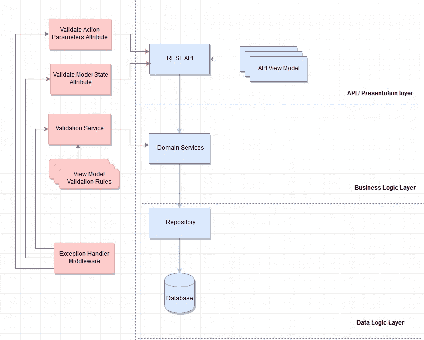

# 中的错误处理和验证架构。网络核心

> 原文：<https://itnext.io/error-handling-and-validation-architecture-in-net-core-c628a108082c?source=collection_archive---------2----------------------->

在许多项目中，错误处理和验证以条件(“if-else”序列)的形式分布在业务逻辑、API 控制器和数据访问层中。这导致违反了[关注点分离原则](https://deviq.com/separation-of-concerns/)，并产生了[意大利面条代码](https://en.wikipedia.org/wiki/Spaghetti_code)，如下例所示。

```
....
    if (user != null)
    {
        if (subscription != null)
        {
            if (term == Term.Annually)
            {
                // code 1
            }
            else if (term == Term.Monthly)
            {
                // code 2
            }
            else
            {
                throw new InvalidArgumentException(nameof(term));
            }
        }
        else
        {
            throw new ArgumentNullException(nameof(subscription));
        }
    }
    else
    {
        throw new ArgumentNullException(nameof(user));
    }
.....
```

在本文中，我描述了将验证和错误处理逻辑从其他应用层中分离出来的方法。下面使用的模式和实践可以在下面的 Git Hub 存储库中找到。

[](https://github.com/Boriszn/DeviceManager.Api) [## Boris Zn/设备管理器。美国石油学会(American Petroleum Institute)

### Web API 解决方案展示了交互式架构，使用实体框架、统一工作、存储库模式…

github.com](https://github.com/Boriszn/DeviceManager.Api) 

# 架构概述

为了简单起见，我使用 N-tire 架构，但是，所解释的方法可以在 CQRS、事件驱动、微服务、SOA 等架构中重用。

示例架构包括以下层:

*   表示层—用户界面/应用编程接口
*   业务逻辑层——服务或域服务(如果您有 DDD 架构)
*   数据层/数据访问层

下图显示了属于不同层的组件和模块，右侧包含表示/API 层、业务逻辑层、数据访问，左侧包含相关的验证和错误处理逻辑。



验证和错误处理架构包含几个组件，我将在接下来的几个部分中描述它们。

## API 验证级别

API 控制器可能包含许多验证，如参数检查、模型状态检查等，如下例所示。我将使用声明性编程将验证逻辑从 API 控制器中移出。

通过创建验证模型属性，可以很容易地清理 API 控制器。以下示例包含简单的模型验证检查。

把这个属性加到 *startup.cs* 里就行了

```
services.AddMvc(options =>
{             
   options.Filters.Add(typeof(ValidateModelStateAttribute));
});
```

为了验证 API 动作方法的参数，我将创建一个属性并移动验证逻辑。属性内部的逻辑检查参数是否包含验证属性并验证值。

如果需要，现在可以将属性添加到操作方法中。(下面的例子)

现在可以将属性添加到 API 方法中，如下例所示。

```
[HttpGet]                               [SwaggerOperation("GetDevices")]                               [**ValidateActionParameters**]
public IActionResult Get(
[FromQuery, **Required**]int page, 
[FromQuery, **Required**]int pageSize)                               
{                                   
  return new ObjectResult(deviceService.GetDevices(page, pageSize));                               }
```

## 业务层验证

业务层验证由两部分组成:验证服务和验证规则。

在设备验证服务中，我已经将所有自定义验证和基于规则的验证逻辑从服务中移出(以下示例中的设备服务)。这个想法很类似于使用[守卫](https://deviq.com/guard-clause/)的模式。下面是验证服务的例子。

在规则中，我已经移动了与视图或 API 模型相关的所有可能的验证检查。在下面的示例中，您可以看到设备视图模型验证规则。验证本身在验证服务内部触发。

基于 [FluentValidation](https://github.com/JeremySkinner/FluentValidation) 框架的验证规则允许您以 fluent 格式构建规则。

## 异常处理中间件

最后，我将介绍错误/异常处理。我将这个主题一直讲到最后，因为所有的验证组件都会生成异常，而处理这些异常并提供适当的 JSON 错误对象的集中式组件是必需的。

在下面的例子中，我使用了[。NET 核心中间件](https://docs.microsoft.com/en-us/aspnet/core/fundamentals/middleware/?view=aspnetcore-2.1)捕捉所有异常并创建 HTTP 错误状态，根据异常类型(在*ConfigurationExceptionType*方法中)并构建错误 JSON 对象。

中间件也可以用来在一个地方记录所有异常。

## 结论

在本文中，我介绍了创建可维护验证架构的几种选择。本文的主要目标是清理业务、表示和数据访问逻辑。我不建议将这些方法视为“银弹”,因为它们有优点也有缺点。

例如:

*   *中间件* —覆盖现有的响应流，这对于 API 来说是个好选择，但对于 Web 解决方案来说可能是个缺点。对于不同的解决方案类型，您可能需要两个中间件。

## 源代码

所有示例都可以在现成的框架[中找到。](https://github.com/Boriszn/DeviceManager.Api)