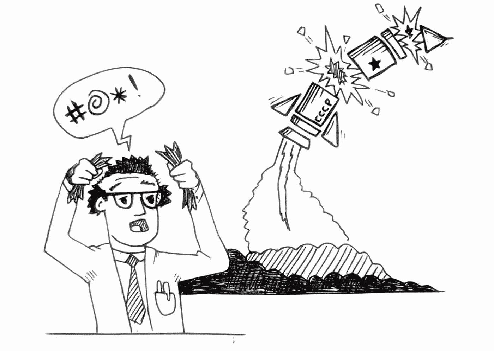

# JavaScript 中的错误处理

> 原文：<https://itnext.io/error-handling-in-javascript-3e444ccae117?source=collection_archive---------1----------------------->


想想 60-70 年代的软件工程师，他们编写了一个代码，将火箭发射到轨道上，使用原始的编辑器和调试工具，没有我们现在所有的花哨功能，我钦佩他们处理可能的边缘情况的自律和专业精神，让意外成为预期。

我们大多数人，即开发人员，不会发射火箭，但我们的产品中仍有许多依赖关系，这些依赖关系可能会在许多方面破裂——数据库可能会失败，服务变得不可用，服务器超时或用户不会用预期的参数调用端点。因此，适当的错误处理是 JavaScript 开发人员睡个好觉的关键，尤其是在 NodeJS 环境中，因为未处理异常的影响比在浏览器中要大得多。

与 bug 相反，理论上异常不是你可以也应该避免的，而是应用程序生命周期的基本现象之一。不应该避免它，而是应该小心处理它，以使应用程序稳定，我称之为异常处理艺术，与应用程序逻辑的其余部分和谐而优雅。

当异常发生时，应该正确地处理它，这意味着客户端应该收到友好的消息，并且应该将它记录在服务器上，以便您可以随时检查日志中可能出现的重复问题，这些问题需要改进。这提高了可维护性、可扩展性和可读性:

*   *可维护性*允许容易地发现新的错误，而没有破坏当前功能或引入新的错误或增加技术债务的风险。
*   *可扩展性*允许程序增长，在不破坏功能的情况下实现新的或改变现有的逻辑，并利用代码的可重用性。
*   *可读性*是关于阅读和理解代码目的的难易程度，这对于发现 bug 或未测试好的代码的效率至关重要。

在进入示例之前，让我们确保了解一些基础知识。我强调了 JavaScript 中的四种错误类型:

1.  *语法错误*发生在解释时，它们被认为是 bug，永远无法正确处理，因为代码从定义上来说就是错误的:

2.*程序错误*，也是 bug。例如，试图读取*未定义的*的一个属性——这可以通过添加一个条件语句来改进这种特殊情况下的代码来避免。

3.**运行时错误被称为异常**，在执行过程中发生:

*   无效的用户输入
*   无法连接到数据库
*   系统内存不足
*   等等..

所有正确编写的程序都应该处理运行时错误，只要处理了异常，它们就不一定表明有 bug 或严重的问题。例如，运行时可能抛出一个*文件未找到*异常，这可能意味着必须首先创建文件。

4.*逻辑错误*是指开发人员在程序的逻辑上犯了错误，并且没有返回预期的结果。这类错误是最难追踪的，因为它们依赖于领域需求。



未正确处理的运行时错误是一个缺陷。例如，如果运行时试图连接到数据库，但它得到一个没有注册处理程序的`NetworkError`，那么程序将崩溃，这就是程序错误——连接失败是运行时错误，但处理失败是程序错误。

一般来说，应该避免在一个集中的地方处理错误——每个逻辑部分都应该自己处理可能的失败，并根据失败的原因做出响应，但是在异常没有适当的处理程序的情况下，拥有一个集中的处理程序是有用的，它的唯一目的是为开发人员记录异常。我们将进一步研究如何在浏览器、NodeJs 和 Express 中处理未捕获的异常。

> **总是创建应用程序错误的层次结构。**
> 
> 为应用程序提供可扩展的、全面的异常处理使得处理故障变得更加容易。

也可以在几个堆栈级别处理相同的错误，例如，当较低的函数与异常无关，只是将错误传播到调用函数时，调用函数可能是唯一知道如何处理它的函数，但这并不意味着您应该在堆栈的顶层报告所有错误，因为单个函数无法知道异常发生的上下文或具体发生了什么。

根据经验，`catch`应该只处理那些我们期望看到的错误，其余的应该用`throw`语句进一步传播。错误`name`用于定义当前级别是否会出现错误。

在 NodeJS 中传递错误有四种基本方法

*   `throw`错误(使其成为*异常*)。
*   将错误传递给一个*回调*，这个函数专门用于处理错误和异步操作的结果
*   将错误传递给*拒绝*承诺功能
*   在 EventEmitter 上发出一个`"error"`事件

## 1.尝试..捕捉..最后施工

在执行代码之前不可能检查有效性条件的情况下，这种构造是必要的，例如`JSON.parse`不能预先检查字符串的正确性:

*   运行时执行`try`段中的代码，如果没有错误，它将跳过`catch`段，转到下一条语句。
*   如果出现错误，`try`部分的代码执行被中断，运行时直接跳转到带有`err`参数的`catch`处理程序，它保存了错误的详细信息。

有两个时刻值得一提:

1.  上面的结构能够通过正确编写的代码只捕捉运行时发生的操作错误，而不是作为 bug 的程序员错误(如缺少右括号)。
2.  它只处理同步代码，下面的代码不起作用:

这里你可以看到我们使用了一个`throw`操作符来抛出一个由 *ajax* 函数返回的错误对象，并且我们在自定义条件下手动抛出`Error`对象。**这两种情况都不会发生**，因为在抛出错误的时候，`try/catch`语句已经执行完毕。回调由 NodeJS 直接调用，没有会导致应用程序崩溃的`try`部分。

## 2.NodeJS 错误-第一次回调

NodeJS 通常使用回调模式，如果在执行过程中遇到错误，该错误将作为回调的第一个参数传递:

1.  **回调的第一个参数是为错误对象保留的。**如果出现错误，将由第一个也是唯一的`err`参数返回。
2.  **回调的第二个参数是为任何成功的响应数据保留的。**如果没有错误发生，`err`将被设置为空，任何成功的数据将在第二个参数中返回。

## ***错误和异常的区别。***

错误是`Error`类的一个实例，它可以作为参数传递给另一个函数，也可以被抛出。该错误在被抛出时成为一个异常。在 JavaScript 中，抛出任何东西都是可能的，不仅是`Error`对象，但不建议这样做，因为在这种情况下，异常不会保存一条可能有用的信息，如名称、消息或调用堆栈:

```
throw new Error('something bad happened');
```

但是您也可以创建一个`Error`而不抛出它:

```
callback(new Error('something bad happened'));
```

这在 Node.js 中更常见，因为大多数错误都是异步的。正如我们将看到的，需要从同步函数中`catch`出一个错误是非常罕见的。

## 3.承诺.拒绝

`Promise`是保持其状态的特殊对象。最初，它处于*等待*或*等待*的状态，然后*完成*(成功完成)或*拒绝*(发生错误)。

我不会详细讨论承诺，只是提到您可以为`fulfilled`和/或`rejected`状态添加两种类型的回调:

```
promise.then(onFulfilled, onRejected)
```

也可以只使用`.catch(onRejected)`而不是`.then(null, onRejected)`来添加错误处理程序，其工作方式相同。

同步`throw`语句作为`Promise`主体中的`reject`调用相应的回调函数:

## 4.处理 EventEmitter 中的错误事件

EventEmitter 以一种特殊的方式处理名为`error`的事件:

如果`error`事件发生在某个地方，并且它没有处理程序，那么 EventEmitter 会生成一个异常。因此，`emit`看似无害，将退出节点进程。

作为最佳实践，应该始终为 `**error**` **事件**添加**监听器。**

让我们看一些应用程序中未处理错误的影响的例子。

我估计还是录个短视频例子比较好:

在本例中，索引 URL 的逻辑如下:

所以`collection.findOne()`有`then`处理程序，但是没有`catch`块来处理*拒绝*承诺的状态。

`Promises`应该总是有`catch`或`throw(null, onRejectedCallback)`来处理拒绝:

此外，对于`async/await`,我们可以并且应该始终使用`try/catch`块:

# 如何正确处理未捕获的异常

让我们看看如何处理一个未捕获的异常，以及如何在浏览器和 NodeJS 环境中处理它们。

强烈反对⚠️尝试从以下处理程序给出的意外错误中恢复！

1.  一个**浏览器**有一个特殊的属性`window.error`，允许给它分配一个函数，这个函数将接收一个错误消息，当前的 URL 和行号，在那里抛出一个异常:

您不应该使用这种结构来恢复程序，在大多数情况下，这在这个阶段是不可能的，而只是向开发人员报告事件。

2.在 **NodeJS** 中有一个 process 对象，它是一个 EventEmitter，可以发布一个事件。我们可以订阅带有`process.on("uncaughtException")`的事件，并且我们可以传递一个回调来处理这个异常。在捕捉到这个未捕捉到的异常的情况下，进程不会终止，我们必须手动完成。处理程序应该只用于记录异常和终止进程，因为没有办法跟踪每个异常的原因并安全地恢复。

这种方法只对同步代码起作用，如果你有一个承诺拒绝，这个代码就不起作用。目前，未处理的承诺拒绝不会终止流程，但在将来，流程会崩溃。

`process`对象有另一个名为`unhandledRejection`的事件，应该用于异步异常。

> **从不从未捕获的异常中恢复**
> 
> 永远不要尝试为基本的`*Error*`类型实现一个无所不包的处理程序。这从来都不是一个好主意，因为它会混淆已经发生的事情，破坏代码的可维护性和可扩展性。在调试实际问题上浪费大量时间的风险，甚至是在一个简单的错误上。还要注意不要过度概括我们的异常处理程序

3.在 **Express** 中，您可以拥有一个中央错误中间件功能，该功能必须添加到所有其他中间件功能的最后:

它应该有四个参数，第一个是`err`参数。异常将通过它传递。为了能够将一个异常传递给这个中间件，您应该将它作为一个参数传递给`next()`回调函数:

如果有一个集中的错误记录逻辑，这是非常有用的，您必须在一个地方更改它，但是请记住，它将忽略 Express 之外的所有内容。这就是为什么我们必须正确处理未处理的异常和未捕获的拒绝。

可以创建一个异步错误捕获函数，它将包装中间件来解决重复的`try/catch`或`.catch`块，并处理 Express 应用程序中的所有异步错误:

现在，我们可以用它来包装应用程序中的所有中间件:

为了使上面的 wrap 函数更具可读性，让我们把它变得更详细一点，并把它转换成`async/await`版本:

这里的问题是，你必须记住把你所有的中间件都包装在这个*包装*函数中，这也使得代码有点嘈杂。相反，你可以使用一个 [express-async-errors](https://www.npmjs.com/package/express-async-errors) NPM 模块，它在运行时对所有的路由处理程序进行猴子修补。

> **记录一切**
> 
> 当然，这种做法不仅仅适用于异常，但是如果有一件事情应该**总是**被记录，那么它就是异常。跟踪我们的异常是非常重要的，这样我们就可以回顾发生了什么，并调查是否有什么事情看起来不对劲。正确的日志消息可以直接为开发人员指出问题的原因，为他们节省大量时间。


异常是程序员生活的一部分。学习如何在你的程序中正确地处理它们以平衡代码质量和可维护性是很重要的。如果上面展示的例子和常见的实践能让你在处理错误案例时更有信心，那就太好了。