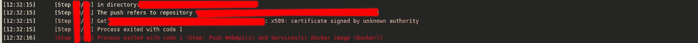

# 错误:x509:返回由未知颁发机构签名的证书错误

> 原文：<https://itnext.io/error-x509-certificate-signed-by-unknown-authority-error-is-returned-f0e5d436f467?source=collection_archive---------0----------------------->


在本文中，我们将研究在尝试将图像推送到我们自己的注册中心时，如何使用自签名证书来解决这个问题。

最近，我不得不处理一个构建错误，在我们的管道中将一个图像推入注册表的阶段，这个问题被证明是平庸的，像往常一样——一件小事，只是有人改变了注册表域并且程序集失败了，整个团队收到了关于一个不成功的构建的警报，并且正如通常发生的那样，他们开始理解这个问题，否则会怎样？这需要一点挖掘，但它很好。因此，如果您遇到证书错误，这份材料是解决将图像推送到 git 存储库的类似问题的手册之一。

**问题描述**

因此，您在构建映像时遇到了问题(例如，它可能在 CI/CD 中):



您无法登录您的 docker 注册表。您正在为 docker 注册表使用自签名证书，而不是由可信证书颁发机构(CA)颁发的证书。docker 守护程序不信任自签名证书，这导致了 x509 错误。

这可能是由于当前证书过期、主机名更改以及其他更改造成的。

在我的例子中，注册表是在一个单独的容器中产生的。在具有特定域名和主机名的服务器上。

**这个问题的解决方案**

因为组装是在公司网络中进行的，所以所有的服务，包括 CI / CD，都与 docker 注册中心在同一个私有网络中。解决方案最终分为两部分:
——生成新的证书；
-使用新证书重启 docker 注册表。

首先，我们需要生成一个密钥:

```
openssl genrsa -des3 -out domainname.com.key 2048
```

接下来，我们生成一个 CSR(证书签名请求):

```
openssl req -new -key domainname.com.key -out domainname.com.csr
```

填写所需信息:

```
Enter pass phrase for example.com.key:You are about to be asked to enter information that will be incorporatedinto your certificate request.What you are about to enter is what is called a Distinguished Name or a DN.There are quite a few fields but you can leave some blankFor some fields there will be a default value,If you enter '.', the field will be left blank.Country Name (2 letter code) [XX]:XXState or Province Name (full name) []:StateLocality Name (eg, city) [Default City]:CityOrganization Name (eg, company) [Default Company Ltd]:CompanyOrganizational Unit Name (eg, section) []:BUCommon Name (eg, your name or your server's hostname) []:*.example.comEmail Address []:admin@domainname.comPlease enter the following 'extra' attributesto be sent with your certificate requestA challenge password []:An optional company name []:
```

从密钥中删除密码:

```
cp domainname.com.key domainname.com.key.org
openssl rsa -in domainname.com.key.org -out domainname.com.key
```

为 SAN 创建配置文件:

```
touch v3.ext
```

生成自签名证书:

```
openssl x509 -req -in domainname.com.csr -signkey domainname.com.key -out domainname.com.crt -days 3650 -sha256 -extfile v3.ext
```

此时，我们已经准备好了一个自签名证书，可以在 docker 注册表中使用。

***要在注册表中使用新证书，请执行以下操作:***
您必须告诉 docker 信任自签名证书，方法是将自签名证书复制到运行 docker 登录命令的机器上的*/etc/docker/certs . d/<your _ registry _ host _ name>*:*<your _ registry _ host _ port>/ca . CRT*。

在您使用 Docker 登录的服务器上创建以下目录:

```
mkdir -p /etc/docker/certs.d/<your_registry_host_name>:<your_registry_host_port>
```

将 docker 注册表证书文件从 docker 注册表主机复制到您登录 Docker 的集群。将 Docker 注册表*证书文件重命名为/etc/Docker/certs . d/<your _ registry _ host _ name>:<your _ registry _ host _ port>/ca . CRT:*

```
scp <your_registry_host_name>:/opt/registry/certs/domain.crt /etc/docker/certs.d/<your_registry_host_name>:<your_registry_host_port>/ca.crt
```

现在，您可以再次重复构建 docker 映像，看看会发生什么。

自动化快乐！