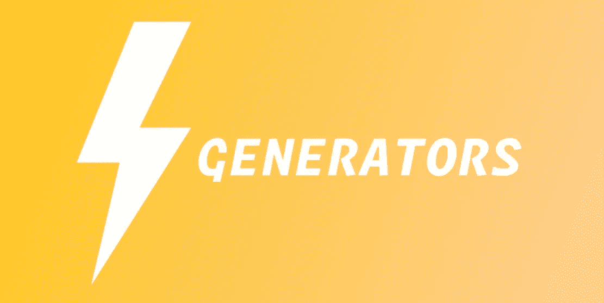

# 用于产生应用程序副作用的 ES 生成器

> 原文：<https://itnext.io/es-generators-for-making-application-side-effects-b0a0a55ca87f?source=collection_archive---------2----------------------->

**发电机简介**

生成器是一种新型的函数，有一天会出现在 ES 标准中。生成器与简单的函数非常相似，但有一些额外的特性:它们的执行可以被挂起，它们可以将执行的中间结果传递给外部环境，您可以将一些外部结果传递给内部，或者事件抛出一些错误，您的函数将继续处理这样的结果或错误。

为了创建新的生成器，我们使用了新的函数生成器语法 **function*。当你第一次运行这样的函数时，它不会立即执行它的主体，而只是返回生成器的具体实例。创建语法如下所示**

创建生成器后，它会保持初始状态。使用发电机的关键方法是`.next`启动发电机，并继续直到遇到第一个`yield`操作员。此时，生成器暂停其状态，并返回定义的值，该值在向外部函数范围让步后保持不变。在我们的示例中，我们只是创建新的生成器，并尝试获得第一个产出值:

在我们的例子中,`firstNumber`得到`10`,之后生成器暂停执行，直到我们下次使用`numbers.next()`。接下来的两次执行也是如此，我们得到值`20`和`30`。

但是问题来了，**什么时候停止执行**？是否有一些标志来表示生成器不再需要返回什么？是的。如你所见，每次它都返回类似于`{value: ..., done: ...}`的对象。这就是我们的答案。最后一次执行将看起来像:

我们需要的标志是返回对象的属性`done`，最后它的值是`true`。每个下一个`.next`调用都会引发错误并返回`{value: undefined, done: true}`对象。

没有替代方法可以重置已创建生成器的状态。目前唯一的方法就是创建新的实例。

**双向数据流和抛出错误**

请考虑下一个例子

在第一次`.next`调用时，我们用问题文本获取返回值，并将其保存在`questionText`变量下的外部作用域中。秒内`.next`叫我们通过`name`论证内情。该参数作为 yield 表达式的结果返回，并保存在生成器中他的`name`变量下，我们可以在代码中进一步移动并合成返回值`Hello ${name}`时操作他。

但是你不仅可以传入值，还可以传入错误。你可以用`.throw`方法来做。这将使用`yield`在线调用发生器内部的异常。用里面的`try{} catch{}`块就可以轻松抓到(下面的例子(1))。在点(2)上，它应该调用示例中的`alert`。

如果你没有在生成器中捕获它，异常将会在生成器外的堆栈中冒泡，并且如果在生成器外也没有捕获阻塞，就会用`unhandled exception`使你的脚本崩溃。

**发电机迭代**

您可以轻松地迭代生成器，因为它们是可迭代的对象(方法`.next`对我们这么说)。

正如你可能已经提到的，`for..of`结构并没有为我们返回最后一个值。这是一个特殊的情况，对于迭代，我们需要用`while`来使用自己的实现，或者对于最后一种情况，只需用`yield`替换`return`即可。

您可以轻松地创建无限的生成器，并将它们用作一些数据的生成器，就像您的生成器主体中的`while(true) { yield Math.random(); }`一样(但是要小心，并始终保持一些逻辑来停止您的迭代)。

**发电机的组成**

每个生成器也可以包含子生成器。为此，包含了特殊的语法。让我们看一下例子:

这种形式的`yield*`只能在另一个生成器内部使用，并将执行委托给内部生成器。即使内部生成器产生无限的数据链，这样的组合也能工作。

**副作用和带有生成器的平面异步代码**

使用生成器的主要领域之一是构建扁平的异步代码链。其主要概念是:

*   `yield`应该回报承诺；
*   发电机应配备称为**管理器**的特殊外部功能。这位经理打电话给`generator.next`，每次都得到新的承诺。解析承诺后，值通过下一个`generator.next`调用传递回生成器。
*   使用`{done: true}`生成器的最后一个生成值，管理器将其作为整个逻辑链的结果值进行处理。

让我们考虑下一个例子:

这里`asyncResult`将在所有产量迭代完成后收集一个结果值。但是让我们一步一步来:

*   `manager`函数获取生成器实例作为参数
*   在管理器调用`.next`方法获得`currentOrganization`请求承诺之后，如果不是生成器中的最后一个产出，则`next.done !== true`管理器等待承诺解析
*   在 promise 解析后，它调用 generator 并将解析的数据作为第二个参数传递。该数据将被存储为 yield 返回值。
*   生成器唤醒并继续运行其代码，直到下一个 yield 运算符。
*   最后一个调用将把`next.done === true`返回给 manager，这是一个写`next.value`作为最终结果的标志。

**后文字**

这种方法有助于有效地构建异步请求链，并有助于避免回调地狱和承诺嵌套地狱。

有一些图书馆在幕后使用这种方法。其中之一是 **co.** 你可以在[官方页面](https://github.com/tj/co)上阅读更多关于实现的信息。

第二个库更适合那些使用 redux 单一商店概念解决方案的人。它被称为**传奇**。用于管理应用程序副作用的出色解决方案，更易于管理，执行效率更高，测试简单，更擅长处理故障。更多信息你可以从[官方页面](https://github.com/redux-saga/redux-saga)找到。