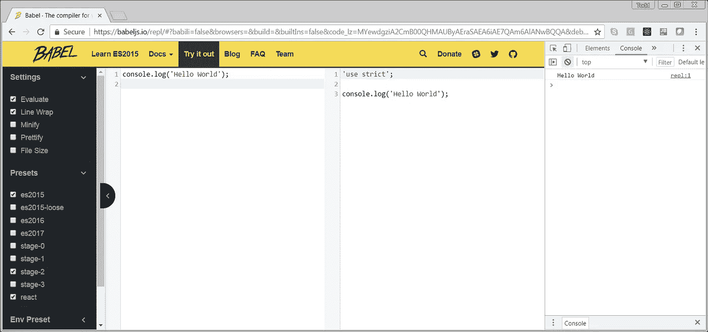

# ES6 破坏

> 原文：<https://itnext.io/es6-destructuring-b8c50a20b46c?source=collection_archive---------6----------------------->

## 或者:那边那些{ }在干嘛？


芬兰赫尔辛基西贝柳斯纪念碑

[*点击这里在 LinkedIn 上分享这篇文章*](https://www.linkedin.com/cws/share?url=https%3A%2F%2Fitnext.io%2Fes6-destructuring-b8c50a20b46c)

最近在通读 Eric Elliott 的优秀系列:
**作曲软件**

[](https://medium.com/javascript-scene/a-functional-programmers-introduction-to-javascript-composing-software-d670d14ede30) [## 一个函数式程序员对 JavaScript(编写软件)的介绍

### 注意:这是学习函数式编程和组合软件的“组合软件”系列的一部分…

medium.com](https://medium.com/javascript-scene/a-functional-programmers-introduction-to-javascript-composing-software-d670d14ede30) 

出于某种原因，下面的代码示例对我来说并不直观:

```
const blep = {
  blop: 'blop'
};// The following is equivalent to:
// const blop = blep.blop;
const { blop } = blep;
blop; // 'blop'
```

作业左边的括号看起来不对。此外，所有这些 blops 没有帮助。出于某种原因，我认为 blop 应该是一个新的对象。

因此，我花了一些时间想出一些例子来让我的头脑理解这个新的 ES6 赋值符号。

# 运行 ES6

如果你需要一种简单的方法来运行 ES6 代码，你可以去 [BABEL](https://babeljs.io/repl) 上的[试用](https://babeljs.io/repl)页面。展开**设置**并确保**评估**被选中。然后打开你的浏览器**控制台**。



巴贝尔 BABEL

# 解构

所以事实证明，这种赋值:`const {x} = foo();`被称为[析构](https://babeljs.io/learn-es2015/#destructuring)。它基本上意味着你可以把一个对象或数组的一部分赋给你自己的命名变量。

## 数组示例

在查看对象之前，让我们先看一些简单的数组示例:

```
const myArray = ['a', 'b', 'c'];
const [x, y, z] = myArray;
console.log('x', x); // x === 'a'
console.log('y', y); // y === 'b'
console.log('z', z); // z === 'c'
```

需要理解的关键是第 2 行中的`[x, y, z]`并不是真正的数组。我知道。它看起来确实像一个数组。但是，它只是被用作一个模式，或者说是我的真实变量`x`、`y`和`z`的[绑定模式](http://www.ecma-international.org/ecma-262/6.0/index.html#sec-destructuring-binding-patterns)。这里真的只有一个阵:`myArray`。

这也适用于对象数组:

```
const myObjectArray = [{}, {a: 1}, {a: 2, b: true}];
const [small, med, large] = myObjectArray;
console.log('small', small); // small === {}
console.log('med', med);     // med === {a: 1}
console.log('large', large); // large === {a: 2, b: true}
```

但是，如果我们不需要数组中的所有元素呢？很高兴你问了。只要省去任何你不需要的元素:

```
const myArray = ['a', 'b', 'c'];
const [x, , y] = myArray;
console.log('x', x); // x === 'a'
console.log('y', y); // y === 'c'
```

## 对象示例

对象析构会变得非常复杂。同样，我们将简单地开始。

```
const car = {
    make: 'Toyota',
    model: 'Camry',
    year: 2018
};const { make, year } = car;
console.log('make', make); // make === 'Toyota'
console.log('year', year); // year === 2018
```

就像上面的数组例子一样，`{ make, year }`不是一个对象。它是一个[绑定模式](http://www.ecma-international.org/ecma-262/6.0/index.html#sec-destructuring-binding-patterns)。

注意声明和初始化两个新变量的行`const { make, year } = car;`。这就像是:

```
const make = car.make;
const year = car.year;
```

在上面的例子中，我们的变量名与对象中的属性名相匹配。但是，我们也可以使用不同的变量名:

```
const car = {
    make: 'Toyota',
    model: 'Camry',
    year: 2018
};const { make: myMake, year: myYear } = car;
console.log('myMake', myMake); // myMake === 'Toyota'
console.log('myYear', myYear); // myYear === 2018
```

`const {make: myMake, year: myYear } = car;`的台词是这样的:

```
const myMake = car.make;
const mYear = car.year;
```

现在让我们来看看埃里克·埃利奥特的例子:

```
const blep = {
  blop: 'blop'
};// The following is equivalent to:
// const blop = blep.blop;
const { blop } = blep;
blop; // 'blop'
```

好了，现在事情开始变得更有意义了:

*   `blep`是这样一个物体:`{ blop: 'blop' }`。
*   `{ blop }`是 BindingPattern。
*   所以我们得到了一个新的变量`blop`，它被赋予了`blep.blop`的值，也就是“blop”。

嗯，还不算太糟。是吗？

介绍完之后，我们现在可以探索一些更复杂、更强大的例子，这些例子应该可以回答重要的问题……

# 为什么要破坏？

在我试验了一些代码后，我问了一个你可能会想到的问题:

"用常规的旧点符号直接访问对象属性不是更容易、更清晰吗？"

嗯，有时是，有时不是。

这里有一个来自 **MPJ** 在[Fun Fun Fun Function](https://www.youtube.com/channel/UCO1cgjhGzsSYb1rsB4bFe4Q)的例子。(你真的需要去看看他的东西。太棒了！)首先，我们将从简单的用于赋值的点符号和老式 JavaScript 开始。

```
var animal = {
    weight: 23,
    sound: 'woof'
};function makeSound(options) {
    var species = options.species || 'animal';
    var sound = options.sound;
    return ('The ' + species + ' says ' + sound + '!');
}// output: The animal says woof!
console.log(makeSound(animal));
```

在这个例子中，我们有一个动物对象，它丢失了它的`species`属性。我们的`makeSound`函数处理这种可能性，并将`species`默认为值:“animal”。还不错。但是，对于它所做的事情来说，它有点冗长。该函数重 5 行，169 个字符。

ES6 让我们使用**析构函数参数**。所以我们的函数可以是这样的:

```
function makeSound({ species, sound}) {
    species = species || 'animal';
    return ('The ' + species + ' says ' + sound + '!');
}
```

这是一个很好的改进。我们只剩下 4 行和 135 个字符。它通过告诉我们它只使用对象的`species`和`sound`属性来帮助函数文档本身。此外，`species`和`sound`像参数一样工作，所以我们不需要在代码中声明它们。

但是，如果我们利用 ES6 的力量**默认参数**:

```
function makeSound({ species = 'animal', sound}) {
    return ('The ' + species + ' says ' + sound + '!');
}
```

这变得越来越好:只有 3 行和 110 个字符！

最后，让我们真的全力以赴，使用 ES6 **箭头函数**和**字符串模板**。现在我们的功能变成了一件艺术品:

```
const makeSound = ({ species = 'animal', sound}) =>
`The ${species} says ${sound}!`;
```

在实际代码中，它只占一行，只有 84 个字符。让我们凝视它片刻，享受它的美丽。啊啊。

以下是 MPJ 的娱乐视频，解释了这一切:

MPJ 关于解构的优秀视频

# 更多示例

既然我们理解了析构，你可能会开始注意到它无处不在。

下面是一个使用它来获取数组长度属性的示例:

```
const myArray = ['a', 'b', 'c'];
for (let i = 0, { length } = myArray; i < length; i++) {
    console.log(myArray[i]);
}
```

当您使用 Redux 时，您可能会看到类似这样的内容:

```
const myReducer = (state, action = {}) => {
  const { type, payload } = action;
  ...
}
```

如果您正在寻找更多的例子和对析构的深入研究，请参阅 Mozilla 文章:

[](https://hacks.mozilla.org/2015/05/es6-in-depth-destructuring/) [## ES6 深度:解构- Mozilla 黑客-网络开发者博客

### ES6 In Depth 是一个系列，介绍 JavaScript 编程语言在第 6 版中增加的新特性…

hacks.mozilla.org](https://hacks.mozilla.org/2015/05/es6-in-depth-destructuring/)