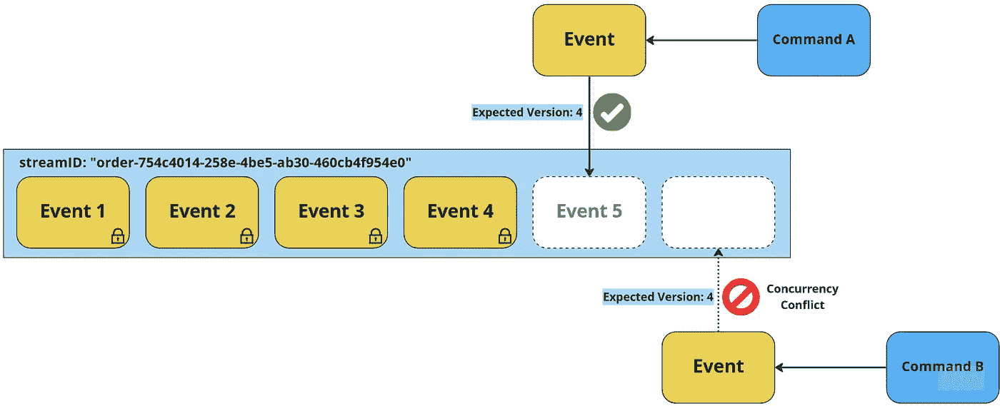
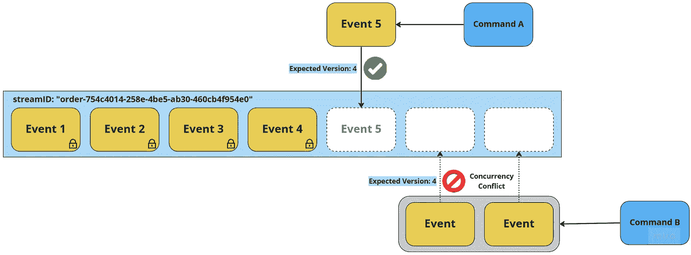
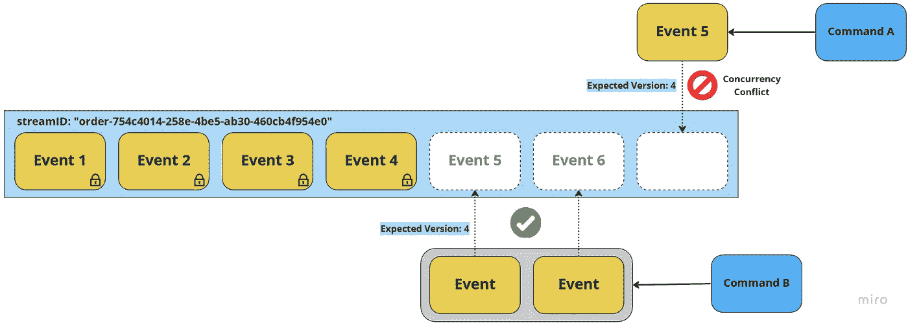
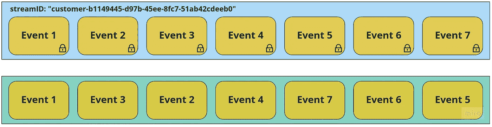

# 用于事件源的事件存储的基本特性

> 原文：<https://itnext.io/essential-features-of-an-event-store-for-event-sourcing-13e61ca4d066?source=collection_archive---------0----------------------->

## 无论是现成的解决方案还是定制的，事件存储都需要提供某些基本功能，并且可能提供一些额外的高级功能。

# 什么是事件存储？

一个*事件存储*是针对 ***事件源*** 的专门存储解决方案。这可以是一个**现成的解决方案**，例如 [EventStoreDB](https://www.eventstore.com/) ，一个**库**或**框架**，提供事件存储应该具有的功能，底层存储可以是 RDBMS、NoSQL 或键值数据库(例如 [Eventous](https://eventuous.dev/) 、 [Marten](https://martendb.io/) 、 [NEventStore](http://neventstore.org/) 、[Event)](https://eventsauce.io/)

> *💡关于提到的库或者框架:
> 还有更多。我对上面链接的那些都没有经验。我不喜欢大框架，其中一些可能对我来说太多了，但是我会让你来决定。*

我所说的“事件存储”指的是**完整的抽象**，包括所有的代码和存储，无论它是如何实现的。我用大写字母写事件存储，因为这是文章的中心主题。

在本文中，我将重点介绍**的基本特性**，这些特性使得事件存储**不同于传统的**有状态**存储解决方案。我不会讨论所有数据库系统共有的特性，比如良好的读写性能或安全访问控制。相反，我将讨论特定于事件存储的特性，并在第二篇文章中以一些**高级特性**结束。**

正如我以前关于这个主题的文章一样，本文中的信息是基于我目前的知识和信念，没有进行额外的研究。已经有很多关于这个主题的优秀文章可能比我的好，但我认为重要的是考虑**多种观点**，以便形成自己的**理解**。我向我的社交媒体朋友询问了他们的想法(只是要点)，并将他们的一些反馈纳入了本文。

## 什么是事件源？

如果您对这个主题不熟悉，需要从基础开始，您可能会发现我以前的文章很有帮助:

[](/event-sourcing-explained-b19ccaa93ae4) [## 事件来源解释

### 互联网上有许多令人困惑的文章，将事件采购与 EDA 和 CQRS 混为一谈。让我们看看它是什么和什么…

itnext.io](/event-sourcing-explained-b19ccaa93ae4) 

# 基本特征

既然介绍已经结束，我们就来讨论生产级事件存储的基本特性。这些功能使事件存储不同于传统的存储解决方案，并且是在生产环境中使用它所必需的。

## 事件流创建和管理

事件存储需要能够将事件组织成**流**，其中一个流由一个*实体*、*集合*或*工作流*的所有事件组成(为了简单起见，下面我将使用**实体**)。为此，它通常使用 **streamID** 的概念——一个流中的所有事件共享一个 streamID，以便事件存储可以提供类似于**将**事件附加到流和**检索**流的所有事件的操作。高级事件存储还可以支持显式创建和删除流，这在逻辑上等同于添加流的第一个事件或删除流的所有事件。这种高级系统通常会存储一些与流分开的关于流的元数据。

一个处理客户实体的事件流的示例 streamID 可以是`customer-b1149445-d97b-45ee-8fc7-51ab42cdeeb0`——因此流的**类型** +实体的**主要的、唯一的 id** 。

**仅追加**

由于事件是发生在**过去**的**事实**，它们不应该被**修改**。相反，为了修改事件源实体的状态，可以将*校正事件*附加到流中。如果事件被修改或删除，就不再可能准确地确定一个实体是如何达到其当前状态的。这就是为什么事件存储必须以持久和**仅追加**的方式存储事件，确保它们的**完整性**和**不变性**。

> *💡虽然可能有一些需要存档和从流中删除旧事件的用例，但这种情况是特殊的，只应出于非常具体和合理的原因，而不是为了纠正错误的事件流。*

**对事件流进行版本控制**

一个事件流应该有一个**版本号**，它允许流内事件的**排序**。在自定义实现中，这可能是一个从 1 开始的简单序列号(表示流中的第一个事件)。例如，如果一个流包含 10 个事件，那么它的当前版本就是 10。

专业事件存储通常使用一个 ***提交版本*** 来代替，这是一个适用于所有流中所有事件的全局版本号。版本控制是一个至关重要的特性，因为它允许以正确的顺序高效准确地重放事件，并启用并发控制。接下来的段落将对此进行更详细的解释。

带有 streamID 的事件流，该流的版本为 6，下一个附加事件会将版本更改为 7。已经存在的事件是“不可改变的”。


带有 streamID 的事件流，该流的版本为 6，下一个附加事件会将版本更改为 7。已经存在的事件是“不可改变的”。

## 并发控制—理想的乐观

导致将一个或多个事件附加到流的**决策**基于系统的**当前状态**，如事件流的当前版本所表示的。当接收到请求改变状态的命令时(通过创建一个或多个新事件)，基于当前流版本的状态对其进行**评估**。仅当流仍处于**预期版本**时，才应追加新事件；否则，发生了**并发冲突**。如果缺少此功能，则**决策过程**(根据业务规则验证命令)将基于过时的状态，如果另一个事件显著改变了状态，则**可能不正确**。这个策略叫做**乐观并发控制**。

处理并发冲突有不同的选择。最简单的方法是**重试**读-决定-写*周期，这通常是足够的。更复杂的方法是将冲突传播给应用程序的用户，允许他们根据系统的更新状态做出新的决定。*

在没有乐观并发控制的情况下，一个后备选项是使用**悲观并发控制**，这涉及到在读操作开始之前在事件流上放置一个**写锁**，并且只有在写操作完成之后才释放它。这在具有**低争用**的系统中是有效的，在这些系统中，对同一个流的并发改变的**概率**是低的。然而，在竞争激烈的系统中，锁定会显著降低性能。



命令“A”获胜，流版本变为 5。事件结果命令“B”期望流是版本 4，但是当它已经改变为版本 5 时，发生了并发冲突。

## 原子地附加多个事件

根据事件的*粒度*，单个命令可能导致多个事件被写入事件存储。在这种情况下，重要的是事件存储能够自动地**附加这些事件**的所有**——要么所有事件都被写入，要么都不被写入。这确保系统不会**丢失信息**或以无效状态结束。为了支持这种功能，事件存储需要某种形式的**事务语义**。这允许多个事件的原子写入，确保系统的一致性和完整性。**



与之前类似，命令“A”获胜。命令“B”产生了 2 个事件，其中没有一个必须被附加，因为流版本不再是 4。



同样的，但是这次命令“B”赢了，而命令“A”遇到了并发冲突。

## 按发生顺序检索事件

当从事件存储中读取事件时，必须按照事件发生的**顺序**和**顺序**进行检索。这对于确保**当前状态**的投影**准确**且**有效**是必要的。考虑下面的例子，其中两个事件以错误的顺序被检索:

```
{
  "eventType": "CustomerEmailAddressChanged"
  "id": "b1149445-d97b-45ee-8fc7-51ab42cdeeb0",
  "emailAddress": "jane.doe@acme.corp"
  "version": 5
}

{
 "eventType": "CustomerEmailAddressChanged"
 "id": "b1149445-d97b-45ee-8fc7-51ab42cdeeb0",
 "emailAddress": "jane.doe@example.org"
  "version": 3
}
```

在这种情况下，我们的客户希望电子邮件发送到他们的 ACME Corp 帐户，而不是他们的旧 example.org 地址。

一个全面的事件存储还应该允许从**多个流**中读取事件，例如**存储中的所有**事件或者一个或多个**指定类型的所有事件**。这在需要从多个流中投射许多不同事件类型的大型报告模型的应用程序中非常有用。为了正确地对这些事件进行排序，除了单个流内的排序之外，事件存储还必须提供所有事件的全局排序。

重要的是要注意到**时间戳**对于排序事件来说**不可靠**。即使一个应用程序不存储每秒 100000 个事件，并且分辨率以纳秒为单位，**计算机时钟**也不总是**准确**，尤其是在多个节点上运行时。时间是一个复杂的概念，即使时钟同步，它们也会受到闰秒等现象的影响。

虽然可以在应用程序逻辑中处理单个流的版本控制，但是不可能跨流处理。因此，事件存储应该处理版本号并提供必要的事件排序，以确保它们总是以正确的顺序被检索。



实际的流在顶部，我们如何在底部无序地读取它们——这不能发生！

## 存储和检索能力

事件存储需要存储的数据量取决于各种因素，例如它是微服务架构(每个服务一个事件存储)的一部分，还是整体应用程序(一个共享事件存储)，事件的粒度和大小，系统吞吐量，以及事件流是否可以在一段时间后归档。

基于事件的应用程序通常比有状态系统需要更多的存储空间，因此事件存储应该能够存储大量的 T21 数据，并且能够通过分片或其他方式轻松扩展。

一个事件存储的**性能**，尤其是读取性能，应该接近**线性**，不管它包含多少数据。这通常不难实现，因为读取事件流通常是主索引查询。但是，如果在关系数据库管理系统(RDBMS)上以需要连接多个表的方式实现事件存储，性能可能会受到影响。

存储为 JSON 的客户实体的有状态表示:

```
{
  "id": "b1149445-d97b-45ee-8fc7-51ab42cdeeb0",
  "emailAddress": "jane.doe@acme.corp",
  "givenName": "Jane",
  "familyName": "Doe",
  "isEmailAddressConfirmed": true,
  "lastChanged": "2022-12-15T11:50:27+0000"
}
```

同一客户存储为事件，历史相对较短。事件包含一些可能的元数据:

```
[
  {
    "eventType": "CustomerRegistered",
    "id": "b1149445-d97b-45ee-8fc7-51ab42cdeeb0",
    "emailAddress": "jane.doe@example.com",
    "givenName": "Jane",
    "familyName": "Doe",
    "version": 1,
    "messageID": "c5351183-46da-46d1-984c-a6360d32dbdf",
    "occurredAt": "2022-12-15T11:47:18+0000"
  },
  {
    "eventType": "CustomerEmailAddressConfirmed",
    "id": "b1149445-d97b-45ee-8fc7-51ab42cdeeb0",
    "version": 2,
    "messageID": "0a387a38-05e6-4779-a20b-604bf0451763",
    "occurredAt": "2022-12-15T11:49:59+0000"
  },
  {
    "eventType": "CustomerEmailAddressChanged",
    "id": "b1149445-d97b-45ee-8fc7-51ab42cdeeb0",
    "emailAddress": "jane.doe@acme.corp",
    "version": 3,
    "messageID": "2580b15d-a93d-47e9-864f-a44671262c6c",
    "occurredAt": "2022-12-15T11:50:13+0000"
  },
  {
    "eventType": "CustomerEmailAddressConfirmed",
    "id": "b1149445-d97b-45ee-8fc7-51ab42cdeeb0",
    "version": 4,
    "messageID": "af4fc789-dcdd-4b38-8453-0921efea8e15",
    "occurredAt": "2022-12-15T11:50:27+0000"
  }
]
```

# 最后的话

在我写完那篇文章后，不知何故我有了写这篇文章的灵感:

 [## 事件采购:为什么 Kafka 不适合作为事件商店

### 不要相信一个公司或者一些顾问想卖给你的一切！

itnext.io](/event-sourcing-why-kafka-is-not-suitable-as-an-event-store-796e5d9ab63c) 

如果你读了，你会发现两者有很多重叠的地方。这篇新文章的观点是不同的(积极的),它更详细地描述了事件存储的更多特性。卡夫卡的文章可能有助于更好地理解某些部分，我只能推荐阅读它。

我还想推荐一篇 Yves 关于同一主题的精彩文章:

[](https://www.eventstore.com/blog/requirements-for-the-storage-of-events) [## 事件存储的要求

### 随着事件源作为一种应用程序持久化模式越来越受欢迎，它正在从一个利基应用程序进入…

www.eventstore.com](https://www.eventstore.com/blog/requirements-for-the-storage-of-events) 

# **第 2 部分现已推出:**

[](https://medium.com/@TonyBologni/advanced-features-of-an-event-store-for-event-sourcing-a457ebd77692) [## 用于事件源的事件存储的高级功能

### 一个通用的事件存储，无论是现成的解决方案还是定制的，都应该提供一些高级的…

medium.com](https://medium.com/@TonyBologni/advanced-features-of-an-event-store-for-event-sourcing-a457ebd77692) 

> *💡* ***免责声明*** *请注意，我在这篇文章中提到过 EventStoreDB，过去也为他们的博客写过付费文章。虽然我写这篇文章没有得到任何奖励，但我确实使用并喜欢他们的产品。此外，我认识几个现在或曾经为这家公司工作的人，其中一些我认为是泛泛之交。因此，我对 EventStoreDB 特性的描述可能有点偏颇。*

## 感谢您的时间和关注！:-)

> *非常欢迎提问和评论，如果你为这篇文章鼓掌(如果你喜欢的话)或者关注我的 Medium、*[*Twitter*](https://twitter.com/TonyBologni)*，或者* [*乳齿象*](https://mastodon.social/@TonyBologni) *！*

[](https://medium.com/@TonyBologni/membership) [## 通过我的推荐链接加入 Medium-Anton stckl

### 阅读我和其他伟大的科技作家的每一个故事！你的会费直接支持我和其他…

medium.com](https://medium.com/@TonyBologni/membership) [](https://medium.com/subscribe/@TonyBologni) [## 每当安东·施特克尔发表文章时，都会收到电子邮件。

### 每当安东·施特克尔发表文章时，都会收到电子邮件。通过注册，您将创建一个中型帐户，如果您还没有…

medium.com](https://medium.com/subscribe/@TonyBologni)