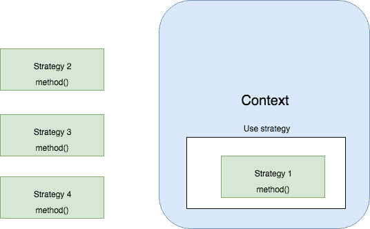

# 基本 JavaScript 模式(pt1)

> 原文：<https://itnext.io/essential-javascript-patterns-pt1-f59a0e3c912e?source=collection_archive---------3----------------------->

设计模式是由比我们聪明得多的开发人员传递给我们的知识，我们可以用它来解决某些软件设计问题。它们帮助我们保持项目的可维护性和代码的优雅性。

在这个由两部分组成的系列中，我将介绍六种基本模式，它们可以帮助您在使用 JavaScript 开发时保持代码的可维护性。设计模式在很大程度上是由 [GoF](https://en.wikipedia.org/wiki/Design_Patterns) (四人帮)推广的。这里描述的这些模式的变体适应了 JavaScript 的多功能特性。

这是由两部分组成的系列文章的第一部分，我们将回顾工厂、代理和策略模式。

# 工厂

这是第一个也可以说是最容易掌握的模式。工厂模式在开发领域被广泛使用，归结为两个简单的概念:

*   通过将对象初始化封装在一个名为“工厂”的函数中来抽象它。
*   让客户端使用工厂，而不是直接初始化对象。

让我们来看一个例子:

想象一下我们有这样一个`Pet`类:

现在我们可以创建一个新的`Pet`实例，如下所示:

到目前为止一切顺利！但是如果我们决定将允许的物种仅限于猫和狗呢？这意味着我们必须修改`Pet`对象初始化的每个实例，并添加对有效物种的检查。如果我们在整个项目中初始化了很多实例，这可能会变得难以管理。

这本来是可以避免的吗？是啊！我们可以定义一个工厂函数，并用它来初始化我们的`Pet`实例:

注意，我们没有导出`Pet`类本身，而是导出了工厂函数`createPet`。此函数创建并返回该类的新实例。

现在我们在项目中到处使用`createPet`来定义新的`Pet`对象。因此，如果我们决定限制允许的物种，我们所要做的就是修改我们的`createPet`函数:

从客户端的角度来看，什么都没有改变，它仍然使用`createPet`函数来初始化新的实例。很明显，工厂模式使我们的对象初始化过程更加灵活。

# 代理人

这种模式的目的是在不修改对象本身的情况下增强对象的功能。增强功能的包装器称为“代理”，而目标对象称为“主题”。代理反映了主体的内部结构，因此两者可以互换使用。

这种模式提供了很多好处，下面是其中的一些:

*   访问控制—代理可以验证客户端是否有权访问主题
*   参数验证—代理可以在将函数参数传递给主题之前验证它们
*   缓存—代理可以缓存主体执行的一些繁重计算的结果，以避免不必要的重新计算。

让我们看一个简单的代理实现:

如您所见，实现代理非常容易。enhanced 方法是我们添加代理的自定义逻辑来增强主题功能的地方。而委托方法是我们不加任何修改地使用主体方法的地方。

您可以使用以下两个选项中的任何一个来避免手动编写委托方法:

*   可以用`[delegates](https://www.npmjs.com/package/delegates)`之类的 NPM 包。
*   新的 ES6 规范包括一个类`Proxy`，可以用来创建一个新的代理:`new Proxy(target, handler)`。这里的`target`是我们的主语，而`handler`是一个特殊的宾语，它指定了代理的行为。

代理的上述实现很简单，但是它不能保证代理和主体之间的完全可交换性。为了解决这个问题，我们可以使用主题的原型来创建代理:

在上面的代码中，我们使用`Object.create()`创建了主题原型的副本。接下来，我们将它分配给用于创建新代理的`Proxy`函数。如果您运行这段代码，您应该会看到`console.log`打印`true`:

使用这个实现，我们增加了代理和主题之间的可交换性。

# 战略

当有某种算法在整个应用程序中不断重复，逻辑上略有变化时，这种模式会非常方便。这种情况下的算法称为“上下文”，而变量部分称为“策略”。

除了在应用程序的不同部分使用不同的策略之外，上下文的逻辑不会改变。一个很好的例子就是具有多个不同可用通道的通知系统。根据用户的偏好，您可以使用不同的渠道发送通知，同时保持系统的核心逻辑不变。

这里有一个图表来说明这个概念:

如您所见，所有策略都有相同的接口，这使得我们的上下文可以在它们之间无缝切换。希望您能很快想象出这种模式可能有用的所有不同场景。

如果你感兴趣，你可以在我的另一篇博客文章中阅读更多关于策略模式的内容。

这个帖子到此为止！在第二部分中，我们将讨论其他三种模式:适配器、观察者和公开构造函数。

感谢您的阅读！

*原载于 2019 年 7 月 14 日*[*【https://isamatov.com*](https://isamatov.com/essential-javascript-patterns-pt1/)*。*