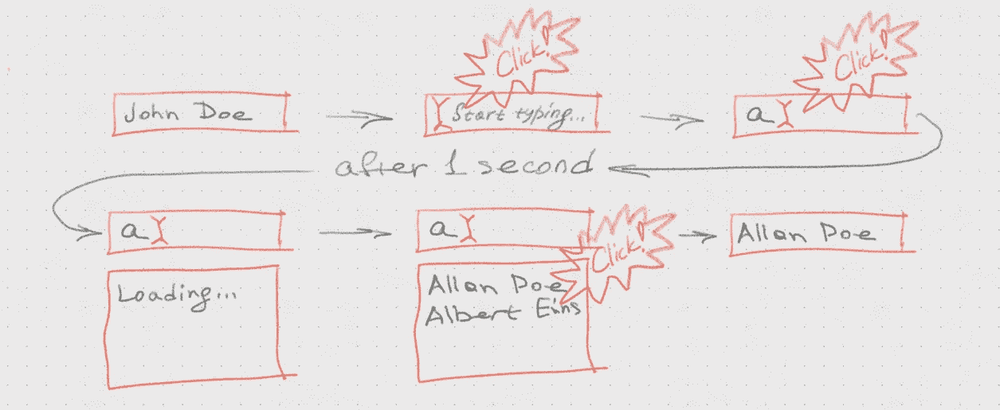
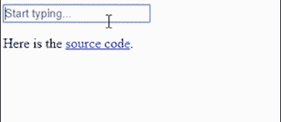
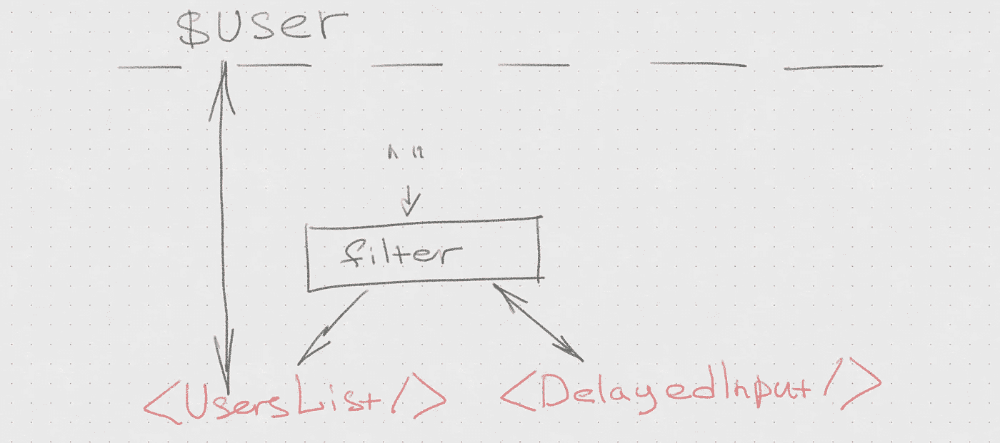
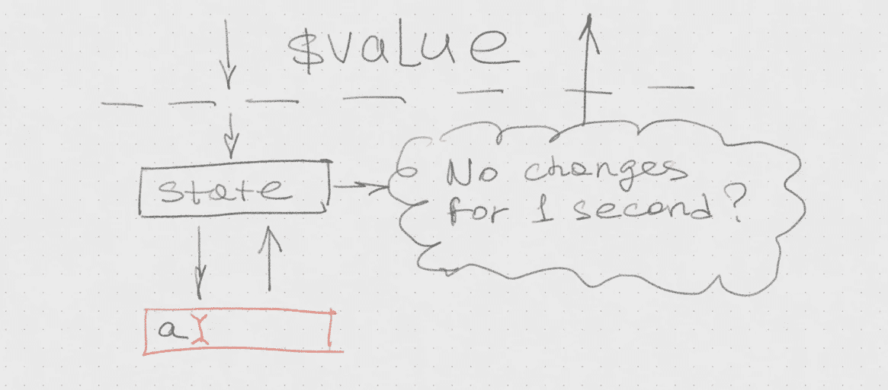
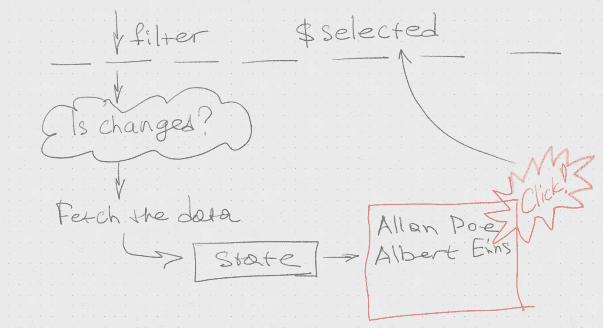

# 基本反应挂钩设计模式

> 原文：<https://itnext.io/essential-react-hooks-design-patterns-a04309cc0404?source=collection_archive---------1----------------------->

## 状态管理和异步 I/O

今天我们探索最近推出的 [React Hooks API](https://reactjs.org/docs/hooks-reference.html) 的通用设计模式。我们将涵盖创建真正的应用程序所需的所有基础知识，从状态管理到异步 I/O 的处理。最好在一些真实示例的上下文中完成，我们将以带有服务器端过滤的“选择用户”表单控件为例。在练习中，我们将识别设计问题，探索 React Hooks API 的所有主要部分，并了解它将如何减少我们每天为支付账单而编写的代码量。

# 选择用户概述

*< PickUser/ >* 表单控件允许我们从数据库中挑选用户。在正常状态下，它只显示用户对象。当您单击它并开始输入时，它将从服务器获取过滤的用户，并显示为下拉列表，以便我们可以选择新值。这种行为与自动完成的下拉列表非常接近，只是数据集可能非常大，并且驻留在服务器上。

<pickuser>用服务器端过滤控制</pickuser>

关于 *< PickUser/ >* 有趣的一点是，它有一个外界不需要的非平凡状态。理想情况下，它应该被封装和隐藏，这样我们就可以像使用常规的< *输入/ >* 一样简单地使用这个控件，并以相同的形式插入它，次数不限。像这样:

*<pick user value = { user } onChange = { setUser }/>*

这意味着我们不能使用全局数据来存储状态，并且 *< PickUser/ >* 应该依靠其本地状态来管理所有的交互。仅这一点，加上不小的副作用和 I/O 的存在，使得 *< PickUser/ >* 成为一项颇具挑战性的任务，也是新 React Hooks API 的完美测试平台。

# 有状态组件设计

鉴于我们*必须*使用本地状态的事实，我们面临一个非常实际的问题。肯定有一些正确和错误的方法来做这件事。*怎么做对？*

只要安装了组件，组件状态就会一直存在。当您决定某些数据是否应该成为特定组件状态的一部分时，您问自己的主要问题是:“*这些数据的寿命有多长？*“谁需要这些数据的问题”*”可能看起来同样重要，也更容易回答，但真正有助于做出最终决策的是数据的生命周期。*

*那么，*数据的生命周期是多少？如果它与特定组件的生命周期相同，它应该是其本地状态的一部分，没有理由暴露它或提升它。**

> *如果数据的生存期与组件的生存期相同，则数据应该属于组件的状态。如果数据的寿命比组件长，它应该作为一个属性被接收，并且可能是某个上层组件状态的成员。只有比任何特定组件存在时间更长的数据才应该全局存储。*

*以我们的 *< PickUser/ >* 为例。当前选中的用户显然可以比 *PickUser* 活得更久，所以它被作为道具接收。仅仅为了显示用户， *PickUser* 还需要什么吗？没有。*

## *组件状态和 useState()反应钩子*

*当我们单击控件时，它会切换模式并显示编辑过滤器的输入。这个“模式”绝对应该是国家的一部分。显然有更多的状态，但是*只在编辑过程中需要，这是相当罕见的*，所以不管它是什么，我们*只要把它推到* < *EditUser/ >中，以后再考虑它。**

> *如果不总是需要状态成员，就有机会将它下推到子组件状态。*

*现在，来认识一下第一个也是最受欢迎的 React 钩子— [useState](https://reactjs.org/docs/hooks-state.html) 。这个钩子返回状态值和更新它的函数。如果你想要很多状态成员，只需多次使用状态。有一件重要的事情需要记住——所有的 *useSomething* 调用必须只在顶层进行。永远不要在循环和如果中做。*

## *编写自定义的 React 挂钩*

**< EditUser/ >* 会修改用户，所以我们需要同时传递 *selected* 和 *setSelected()* 通过。传递大量的状态元素可能会很快造成混乱，所以让我们将 *value* 和 *setValue()* 重新打包到一个可以作为单个值传递的对象中。这样的对象被称为[到状态]的链接，代表对状态元素的可变引用。*

*但是我们怎样才能以一种实际上适合使用的方式做到这一点呢？*

*这是我们的第一个定制钩子——*use link*！一个“自定义钩子”只是一个在*内部调用其他 React 钩子的函数。在你的函数中使用钩子是没问题的，只要以“use”开始它们的名字就可以了，这样会很清楚它们也是“钩子”。**

> *链接是“可写道具”,代表对某些组件状态的可写引用。链接简化了将上层状态向下传递给子节点的过程。*

## *共享组件的状态*

**< EditUser/ >* 将处理编辑。该状态中唯一一个生存期与 *EditUser* 的生存期相等的部分是*过滤器*。我们将需要 *<输入/ >* 来改变*过滤器*，以及另一个组件 *< UsersList/ >* ，每当其*过滤器*属性改变时，该组件将从服务器获取并显示过滤后的用户列表。*

**

*然而，我们应该防止在用户输入过滤器时获取操作过于频繁。因此，我们不能使用普通的 *< input/ >* 并需要一个类似的组件，它将延迟更改，直到用户停止输入。姑且称之为*<DelayedInput/>*。*

*这里我们有一个两个组件以*共享状态运行的例子。*实际上，这样的状态必须提升到相互作用的部件的最近的公共根。*如果这个状态没有一直被使用*，就有机会重新思考组件的结构，创建新的子组件，它将封装这样一个状态，而不会违反“数据生存期规则”。机会不是一种义务，但如果你愿意利用它，可能会让这个系统变得更简单。*

> *在几个组件之间共享的状态应该提升到最近的公共根组件。当你这么做的时候，注意“数据生命周期规则”,必要的时候考虑重构。*

*现在，当我们将问题缩小到两个不同的组件时，我们将分别处理 I/O 问题和延迟输入问题。这就是我们需要 React Hooks 全部力量的地方。*

# *<delayedinput></delayedinput>*

*该控制应类似于常规的*输入*，但会将数值变化延迟给定的毫秒数。如果用户在延迟期间再次输入，则延迟必须延长。因此， *DelayedInput* 从父节点接收它的值，但是它必须保持更改私有，直到延迟结束。但是，如果父节点因为其他原因要改变这个值，那么本地值也必须改变。*

**

*这意味着，我们需要一个与 *$value* 属性单向同步的本地状态。让我们完成这个同步，将它包装在一个定制的钩子中。*

## *状态同步和 useEffect() React 挂钩*

*是时候见见 [React 的 *useEffect()* hook](https://reactjs.org/docs/hooks-effect.html) 了。 *useEffects* ()渲染后执行给定函数，只有当第二个参数中数组的元素发生变化时才会执行。这正是我们所需要的。我们将使用来跟踪 *$value* 的变化并更新状态，我们将把这个逻辑包装到自定义钩子中。*

*绑定状态链接在一个方面不同于普通链接:每当它的默认值改变时，它就改变底层状态，所以我们只需将 prop 值作为默认值传递，它就会完成工作。就这样，状态同步问题解决了。*

> *useEffect() React hook 可以跟踪变化，因此您可以在渲染后轻松地将反应附加到道具变化上。这就是你在替换旧组件时要做的。*

*现在，让我们稍微了解一下 *Link* 模式的威力。手动 *onChange* 事件处理程序从来都不是 React 最令人兴奋的部分。如果*链接*不是一个普通的对象[而是一个包含一些有用方法的类](/react-hooks-and-two-way-data-binding-dd4210f0ed94)会怎么样？它能为我们节省一些键入*为我们*生成* *onChange* *事件处理程序*的时间吗？*如果你正在使用 [*useLink 钩子*](https://github.com/VoliJS/NestedLink/blob/master/valuelink/API.md#-uselink-initvalue---link) 从[*NestedLink 库*](https://www.npmjs.com/package/valuelink) *，答案是“是”。就这么办吧。**

## *将状态同步回 props*

**$ input value . props . onchange*处理程序在用户输入时更新 *$inputValue* 状态。我们希望它这样做，但我们也希望为每次更改设置计时器，当它触发时，我们将更新父状态。如果在此之前发生了另一个状态更新，我们将取消计时器并创建新的计时器。*

*如果没有链接，我们将只是把这个逻辑放到输入的 *onChange 中。*有了[嵌套链接](https://github.com/VoliJS/NestedLink)，我们又多了一个选项[将 *onChange* 监听器直接连接到链接](https://github.com/VoliJS/NestedLink/blob/master/valuelink/API.md#-linkonchange-callback--any--void---link)。让我们这样做，假设我们有一个类似于[洛达什 _ 的东西。节流功能](https://lodash.com/docs/4.17.11#throttle)。*

*可惜我们不能只用 *_。油门，多种原因不起作用*。为了取消之前的计时器，我们必须知道它的 id，这听起来像是 lodash 完全不知道的另一个组件状态。*

> *有人可能会说，我们可以依靠 [**使用回调钩子**](https://reactjs.org/docs/hooks-reference.html#usecallback) 来制作下划线/lodash _。节气门功能正常。不，我们不能。我们需要在组件将要卸载时取消计时器，以防止出现异常，而 lodash 不知道安装和卸载。*

*因此，我们将创建自定义的 *useThrottle hook，*现在我们来认识一下 [useRef React Hook](https://reactjs.org/docs/hooks-reference.html#useref) 。*

## *useRef 和清理效果*

**useThrottle* 获取该函数并生成另一个函数，该函数会将调用延迟给定的毫秒数。我们希望在组件的状态中存储 timer *id* 以便在必要时取消它，但是*我们不希望组件在我们改变它的时候呈现*。我们希望它表现得像旧类*组件*中的原始类成员。这就是 [useRef React Hook](https://reactjs.org/docs/hooks-reference.html#useref) 的设计初衷。*

> *useRef React hook 与 React 类组件的常规类成员具有相同的含义*

*另外， *useThrottle* 采用了一个奇怪的第三个参数[ $value.value ]。需要用它来处理竞争条件:如果在我们打字的时候父代的值改变了怎么办？我们将把它赋回一个旧值，因为我们还有一个定时器。相反，我们需要取消它，为此我们使用了*use effect*hook*clean up*。*

> *Clean-up 是从 useEffect 主体返回的函数，它在下一次 useEffect 主体调用之前和卸载时被调用。*

*无论您从 *useEffect* 中的函数返回什么，都被视为一个*“清理”*函数。在调用 useEffect 主体之前，当 *useEffect* 对更改和卸载做出反应时，将调用该函数。*cleanup 和 body 的区别在于，clean up 绑定到先前 useEffect 体调用的值。*所以，当用户关闭我们的控件时，我们不必担心另一个竞争条件，但是有延迟更新到 dead 状态。*

**延迟输入*完成。有两条消息——好消息，也有好消息。首先，现在我们知道了关于钩子处理异步 I/O 所需的一切。其次，你再也不需要重复这个练习了。我在[链接控制 npm 包](https://github.com/VoliJS/NestedLink/tree/master/linked-controls)中添加了*使用节流*和*延迟输入*，所以如果你需要它们，就从那里抓取。*

**< UsersList/ >* 接受*过滤器*作为道具，并对其变化做出反应，从服务器获取过滤后的数据并显示出来。多亏了*<DelayedInput/>*这种事情不会发生得太频繁。*

**

*我们已经知道 *useEffect* 可以用来跟踪道具的变化。但是我们想使用一个*异步*和*等待*来获取数据，这里有一个问题——*use effect*假设*无论你从内部返回什么都是一个清理函数。异步函数总是返回一个承诺。此外，知道 I/O 操作何时挂起以指示某个东西正在“加载…”也是有用的。让我们将这个逻辑包装在一个定制的 useIO 挂钩中。**

> *不能在 *useEffect 中使用 async 和 await。但是您可以创建一个自定义挂钩来解决这个问题。**

*当我们编写代码时，我们注意到了另一个小问题——当组件将被卸载时，有一个挂起的 I/O 可能会出现异常。让我们用大写字母重复一遍:*

> *你不能只在 I/O 完成时更新你的状态。组件可能被卸载，您会得到一个异常。*

*这听起来相当令人不安，但是我可以向你保证——对于我们刚刚获得的强大的定制钩子编程技能来说，这不成问题。让我们不要惊慌，看看我们能做什么。*

## *检查组件是否已安装*

*为了防止异常，我们需要知道在执行 link.set 时组件是否被挂载了。要是我们有类似于*组件将卸载*的东西就好了……就是它！*清理的作用*是救援。*

*现在，我们大概接触了最重要的*使用效果*用例之一:*

> **useEffect( whenDidMount，[] )* 表现为 *componentDidMount，*并且其清理效果表现为 *componentWillUnmount。**

## *卸载组件时防止状态更新*

*好吧。现在这个任务看起来很琐碎。让我们在另一个定制钩子中做一次，然后忘掉它。*

> *来自 I/O 功能的所有异步状态更新必须防止可能的组件卸载。*

## *带异步等待和加载指示器的 I/O*

*当承诺被解决时，useIO 将返回 true，否则返回 false。如果我们考虑到在前一个 I/O 操作完成之前可能会有*过滤器*的变化，那么这个小需求的实现就变得特别棘手。这意味着一次可能有多个未解决的 I/O 承诺。为了解决这个问题，我们将维护未解决的 I/O 承诺的计数器，如果它为零，我们就决定 I/O 结束。*

*哎呀，我们在这里使用的组件状态是在 *promise.finally()中修改的！*好的，那么把 *useLink* 改成 *useSafeLink。没什么大不了的。不再是了。**

*很难相信，但我们完成了。[这里是](https://volijs.github.io/NestedLink/examples/autocomplete/index.html)，正在工作，[这里是源代码](https://github.com/VoliJS/NestedLink/tree/master/examples/autocomplete/src)。在这个练习中，我们使用了所有重要的 React 钩子，现在我们对新钩子 API 的能力有了大致的了解，并且知道了它的基本应用模式。此外，我们学习了有状态组件的设计和分解的基础知识，并且(我希望)理解了这些新的钩子到底是什么。*

> *React 钩子对于 React 功能组件来说是非常强大的有状态混合，它能够以一种非常简洁优雅的方式封装复杂的设计模式。*

*此外，我们在这个练习中创建了一些非常有用的定制钩子。一遍又一遍地写它们会很丢人，所以我把它们添加到了 [NestedLink 库](https://github.com/VoliJS/NestedLink)。快乐编码。*