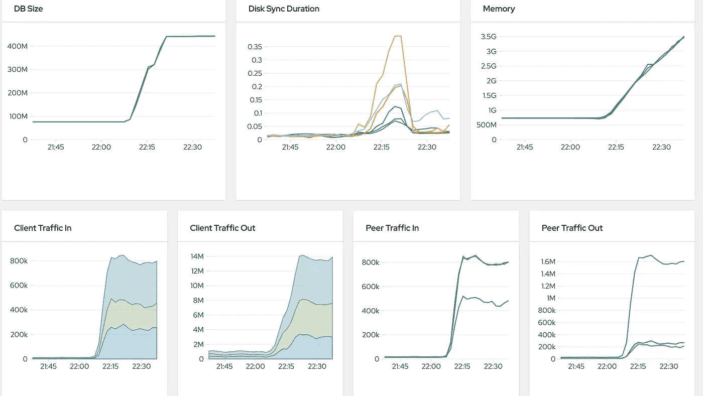
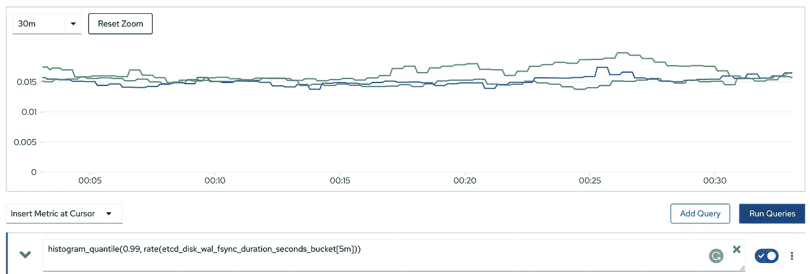

# Etcd 性能考虑

> 原文：<https://itnext.io/etcd-performance-consideration-43d98a1525a3?source=collection_archive---------2----------------------->


Etcd 是库伯内特人的心脏。随着运营商模型的流行，Etcd 不再仅限于使用 Kubernetes 核心集群引擎。

以下是部署基于运营商的解决方案框架时，我的 OpenShift 集群上的主要 Etcd 指标的屏幕截图。您可以看到，在普通的 OCP 平台上，数据库大小和内存都增加了 3 到 4 倍。



另一方面，如果不考虑一些硬件和软件因素，Etcd 的稳定性将受到严重影响。

## 硬盘延迟

Etcd 故意对磁盘延迟非常敏感。如果当前的领导者由于磁盘速度慢而不能及时将 Raft 日志同步到磁盘，那么集群将失去领导者。领导者选举过程被触发。如果新当选的领导人不能及时同步数据，那么就会形成一个死循环。连锁效应将会被触发，API 服务器不可用，OpenShift 集群操作符不可用，应用操作符也不能正常工作…

Etcd 以分发格式公开了两个与磁盘相关的指标。当 Etcd 向磁盘提交其最近更改的增量快照时，调用 *backend_commit* ，对应的普罗米修斯度量是*Etcd _ disk _ back end _ commit _ duration _ seconds _ bucket*。当 Etcd 在应用之前将其日志条目保存到磁盘时，调用 *wal_fsync* ，对应的普罗米修斯度量是 Etcd _ disk _ wal _ fsync _ duration _ seconds _ bucket。

一般来说， *wal_fsync* 的 99 个百分点应该小于 10 ms， *backend_commit* 的 99 个百分点应该小于 25 ms，我们可以用普罗米修斯公式来显示这些指标，

```
histogram_quantile(0.99, rate(etcd_disk_wal_fsync_duration_seconds_bucket[5m]))histogram_quantile(0.99, rate(etcd_disk_backend_commit_duration_seconds_bucket[5m]))
```

下面是我的集群上的两个指标分布。


后端提交的 99%



wal_fsync 的百分之 99

您可以看到，由于负载过重，磁盘延迟指标达到了各自要求的极限。

SATA 旋转磁盘不再是一个选项。主/etcd 节点需要 SSD 级别的磁盘。

## KVM 虚拟机磁盘调整

通常 Kubernetes 节点运行在虚拟机中。现代虚拟机管理程序技术已经取得了足够的进步，虚拟机磁盘性能几乎与裸机服务器相当。通常，虚拟机的默认设置将能够利用 SSD 磁盘。

在我的 KVM 中，我做了一些小的优化。

1.  磁盘映像是原始格式。
2.  磁盘驱动程序正在使用高速缓存设置为“无”的虚拟模式。

下面列出了使用 virsh 创建 VM 的示例命令。

```
virsh vol-create-as {{ .pool }} {{ .vmName }}.img {{.diskSize}}virt-install --name={{ .vmName }} --ram={{ .mem }} --vcpus={{ .cpu }} --disk path={{ .path }}/{{ .vmName }}.img,**bus=virtio,cache=none** --noautoconsole --graphics=vnc --network network={{ .network }},model=virtio --boot hd,cdrom --cdrom {{ .isoPath }}
```

## 主/Etcd 节点的数量

我曾经运行一个主/etcd 节点来节省测试环境中的资源。在上面的 OpenShift 4.4 中，我应用了一些漫游来支持一个主节点。

```
oc patch etcd cluster -p='{"spec": {"unsupportedConfigOverrides": {"useUnsupportedUnsafeNonHANonProductionUnstableEtcd": true}}}' --type=merge
```

然而，在最新的 OpenShift 4.6 中，我的磁盘延迟处于推荐值的边缘。我别无选择，只能在测试环境中选择 3 个高手，或者面对一个不稳定的集群。

## 结论

磁盘延迟对 Kubernetes 集群的整体稳定性有很大影响。选择固态硬盘和多个 Etcd 节点。