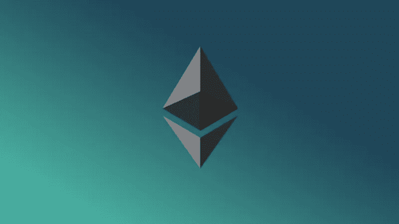

# 区块链中的以太坊

> 原文：<https://itnext.io/ethereum-in-blockchain-7127c002a8b?source=collection_archive---------0----------------------->

区块链中的以太坊

[*点击这里在 LinkedIn* 上分享这篇文章](https://www.linkedin.com/cws/share?url=https%3A%2F%2Fitnext.io%2Fethereum-in-blockchain-7127c002a8b)

## 关于以太坊

为了开发和建立基于区块链的应用程序，我们可以使用以太坊，这是一个开源的区块链平台。以太坊区块链应用的主要优点是，它可以通过共享和分布式网络执行，没有第三方干扰、审查和假货。与其他运行在集中式服务器上的应用程序和网站不同，区块链中的[以太坊有一个分散的系统，它们分布在世界各地许多独特的计算机中，它们被称为节点。](http://www.blockchainexpert.uk/blog/what-is-ethereum)

它使用智能合同来管理网络，它们是自治程序，无需使用中央机构。

## 智能合同

契约可以简单定义为代码和数据(分别是功能和状态)在以太坊区块链中某个特定地址的存储。在每个契约中定义了状态变量、方法、事件等，它可以管理区块链网络中块之间的事务。

## 醚

以太就像现金一样，不需要第三方的认可和交易。这就像一个奖励(比特币)。

## 不同的以太网

与其说它是一个网络本身，不如说它更像是一个节点间通信的协议。以太加密货币的交易通过社区以太坊网络进行。一些私有区块链网络是:

*   开发模式中的私有节点
*   专用网
*   公共测试网络
*   全以太网

## 以太坊客户端

为了挖掘和开发的目的，我们可以用以太网连接不同的开源软件包。

*   eth (C++实现)
*   geth (GoLang 实现)
*   pyethapp (python 实现)

最初发布于[区块链专家](http://www.blockchainexpert.uk/)

*原载于 2017 年 11 月 6 日*[*medium.com*](https://medium.com/blockchainexpert-blog/ethereum-in-blockchain-69f35bf8039d)*。*