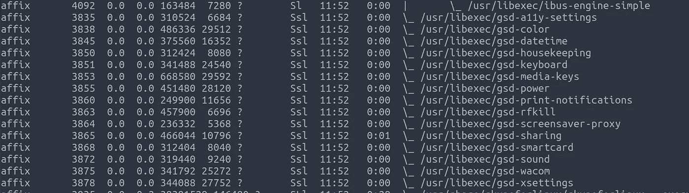
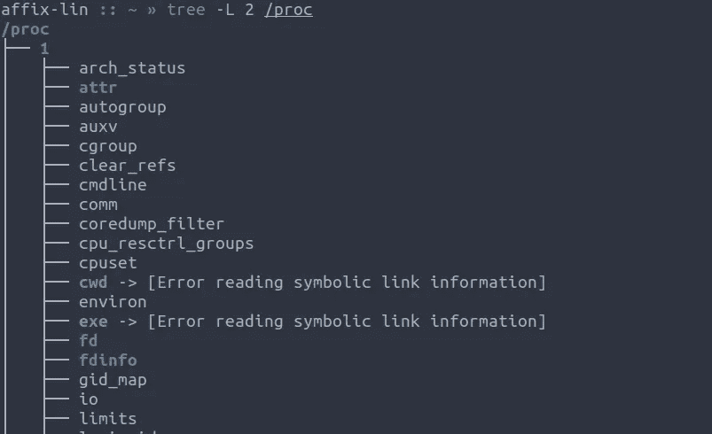
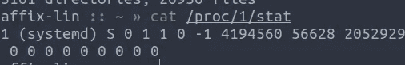
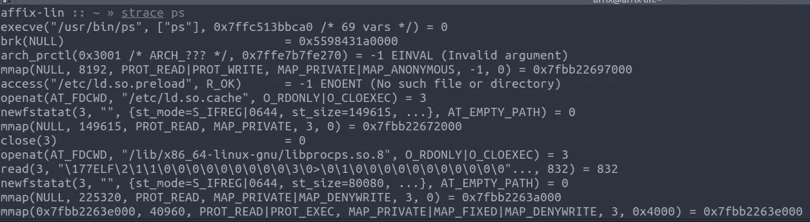
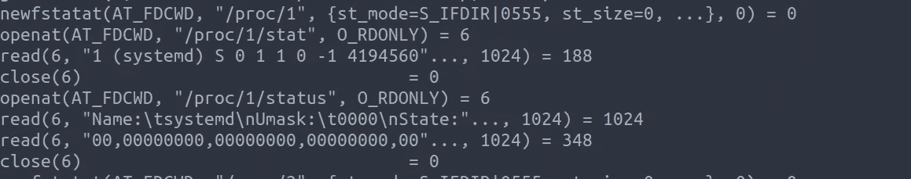
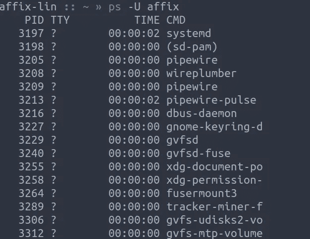
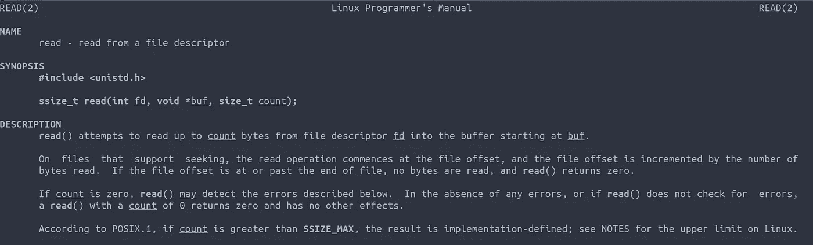
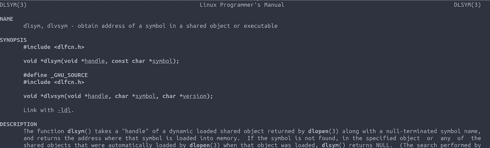
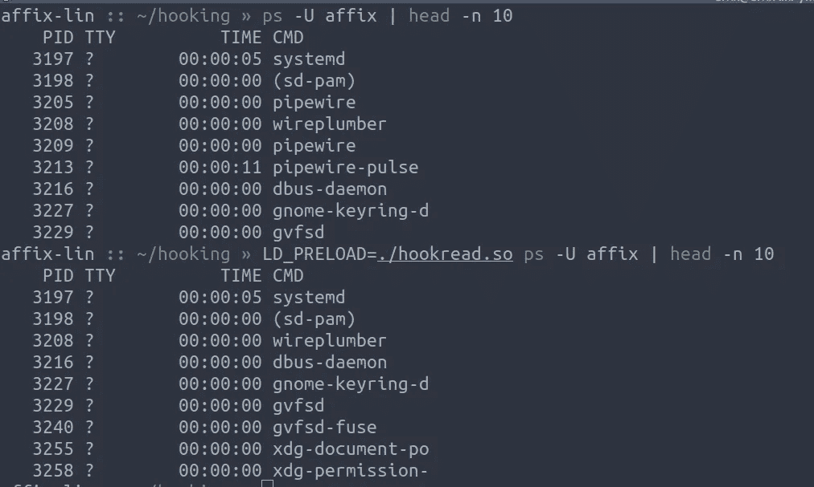

# 规避技术——对“ps”隐藏您的过程

> 原文：<https://itnext.io/evasion-techniques-hiding-your-process-from-ps-2122cf487485?source=collection_archive---------2----------------------->

Linux 中的一切都是文件，甚至包括你的进程信息。它位于文件系统的/proc 目录中。今天，我们将使用并滥用这一知识来隐藏目标进程，使其不被 Linux 中的`ps`命令看到，本质上也是隐藏在其他基于 Unix 的系统中。但是首先…

# `ps`命令是如何工作的？

如前所述，Linux 中的一切都是文件，包括`/proc`中的进程树。

/proc 目录树的一部分

`/proc`文件系统中的每个子目录都对应一个进程 id，现在进程 id 1 几乎都是 systemd，这可以通过阅读`/proc/1/stat`来验证

将进程 ID 1 显示为 systemd

现在我们已经了解了基础知识，我们可以看看`ps`命令是如何工作的。

通过使用`strace ps`命令，我们可以开始检查这个命令是如何工作的。

最初`ps`启动并加载`libprocps.so`共享库。从这里我们可以查找 procps 的代码，但是这有什么意思呢？让我们继续追踪。

读数统计和状态

当我们通读时，我们来到一个部分，其中`ps`正在打开文件`/proc/<PID>/stat`和`/proc/<PID>/status`，使用`read()`读取这些文件，以确定通过命令向用户显示的数据，如进程名称、状态、Umask、内存使用等...

现在我们了解了`ps`命令的工作原理，让我们继续。

# 使用 C 隐藏进程

在我们开始隐藏一个进程之前，我们需要一个目标进程。我使用`ps -U affix`从我的工艺列表中选择了工艺`pipewire`

ps -U 词缀输出

## 函数挂钩，基础

函数挂钩是拦截对已经存在的函数的调用的行为，比如`read()`和`write()`来构建一个包装函数，在将数据返回给调用应用程序之前执行额外的任务。在 linux 中，这可以通过使用动态加载器 API 来实现，它允许我们在运行时动态加载和执行共享库中的函数。使用`LD_PRELOAD`环境变量或`/etc/ld.so.preload`文件可能会被滥用。

`LD_PRELOAD`变量用于指定链接加载器应该首先加载的一些预加载库，类似于 windows 上的`AppInit_DLLs`或者 MacOS 上的`DYLD_INSERT_LIBRARIES`。

## 这对我们有什么帮助？

正如我们上面讨论的，`ps`命令利用`read()`调用从`/proc`文件系统中读取数据，以确定要向用户显示的进程信息。

通过挂钩`read()`调用，我们可以确定进程名并隐藏它，或者重写它，以防止`ps`知道我们真正的进程名。

## 挂钩读取()

read()联机帮助页

为了挂钩`read()`函数，我们需要在代码中定义它，从手册页中我们知道函数签名是`ssize_t read(int fd, void *buf, size_t count);`

> fd 是我们正在读取的文件描述符，这是在使用`openat()`系统调用的`ps`命令中定义的。
> 
> *buf 是我们的目标读取缓冲区，它作为指向内存中某个位置的指针传递给`read()`
> 
> count 是从 fd 中读取的字节数

让我们定义挂钩函数

dlsym 的联机帮助页

为了成功模拟`read()`功能，我们需要利用`dlsym()`来获取现有的`read()`符号地址。

现在我们的函数将调用原来的 read 函数并返回正确的结果。

***第 7 行*** 定义了我们的`*orig_read()`指针来匹配`read()`的方法签名

***第 10 行*** 利用`dlsym()`获取`read()`符号的地址，并将其分配给我们的`new_read()`指针。

使用`RTLD_NEXT`确保它将返回下一个`read()`符号声明的地址，这样我们就不会调用我们刚刚创建的那个。

***第 12 行*** 调用`new_read()`方法读取数据，并将返回值存储在一个结果变量中，返回给调用函数。

恭喜你，你已经写了一个功能函数钩子。在这个阶段，我们可以编译我们的代码，以确保它的工作，但是我们不会看到任何不同。

## 隐藏我们的目标进程

因为我们的函数已经调用了原始的`read()`函数，所以我们拥有了在`buf`指针中隐藏进程所需的所有信息。

我们更新的代码现在完全挂钩并隐藏了我们在 ***第 6 行*** 中定义的`PROC_NAME`常量中定义的目标流程

***第 16 行*** 与`strstr()`进行比较，检查缓冲区中是否存在我们的进程名，如果存在，我们`return 0`到调用者。这欺骗了`ps`认为它已经读取了一个空文件，进程被忽略。

## 编译和测试

现在我们已经完成了我们的代码，我们可以用 gcc 把它编译成一个带有`-shared`标志的共享库，为了正确工作，我们需要用`-fPIC`把它编译成依赖代码中的位置

为了正确使用`dlsym`函数，我们需要使用`-ldl`链接 libdl，并使用`-D_GNU_SOURCE`定义`_DNU_SOURCE`常量。这也可以在代码中用`#define _GNU_SOURCE`定义为预处理器指令。

`# gcc hookread.c -o hookread.so -shared -ldl -fPIC -D_GNU_SOURCE`

然后我们可以用`LD_PRELOAD`环境变量测试这个库。

成功！

成功！我们的目标进程，在我的例子中是 pipewire，已经从`ps`命令中隐藏了。带上蓝队！

为了保持这一点并且不需要环境变量，我们可以在`/etc/ld.preload.so`中定义 so 文件的完整路径。这意味着当其他用户使用系统时，我们可以保持隐藏。

## 挂钩的其他用途

挂钩还有许多其他令人不快的用途，这只是隐藏一个进程。其他用途包括但不限于:

*   躲避 netstat
*   挂钩 SSH 函数调用以构建 rootkit
*   MiTM 挂钩 SSL 调用
*   特权取消

谢谢你花时间阅读我的教程。我希望你发现它信息丰富。