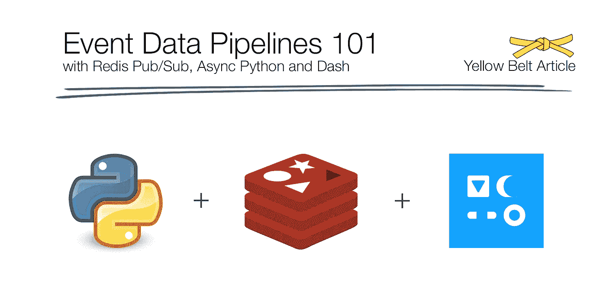
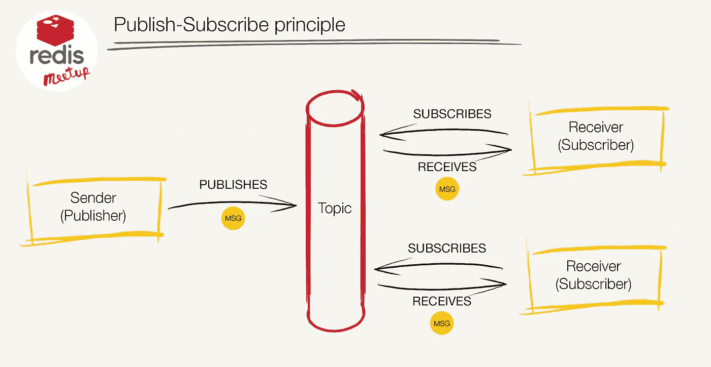
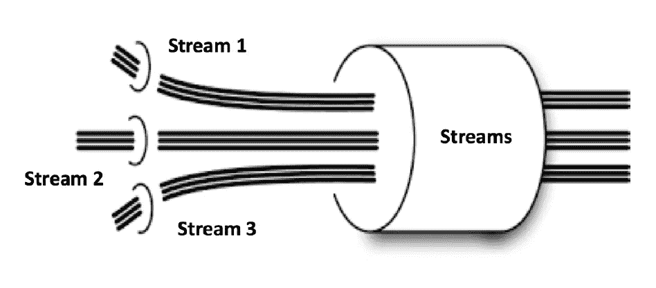
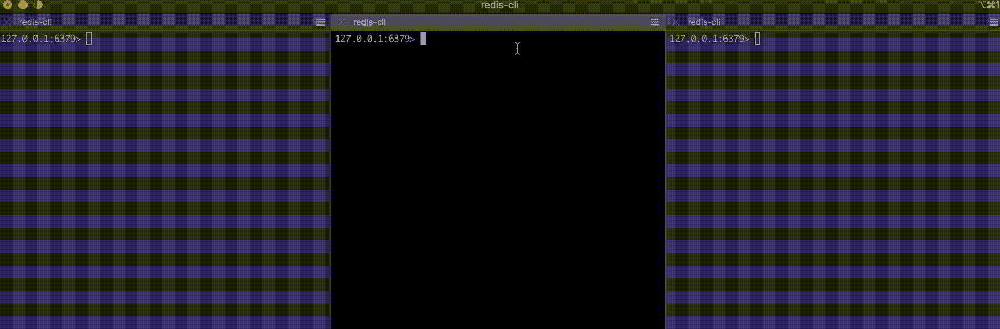
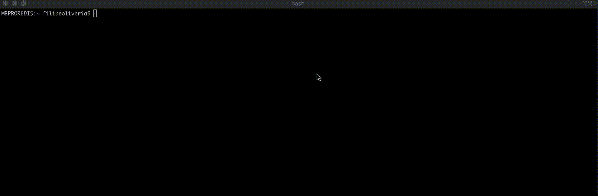
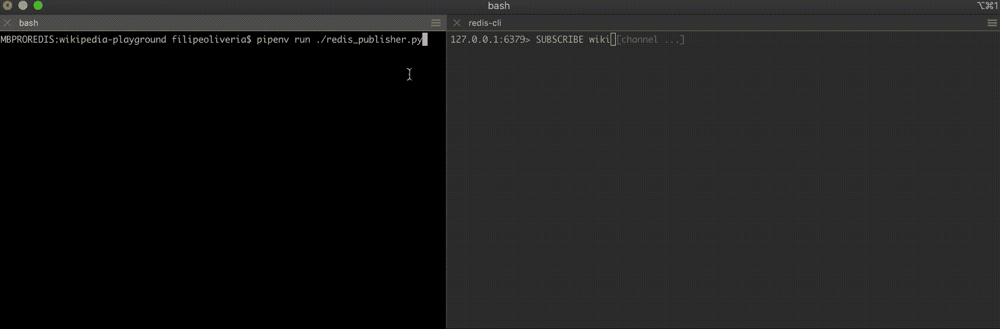
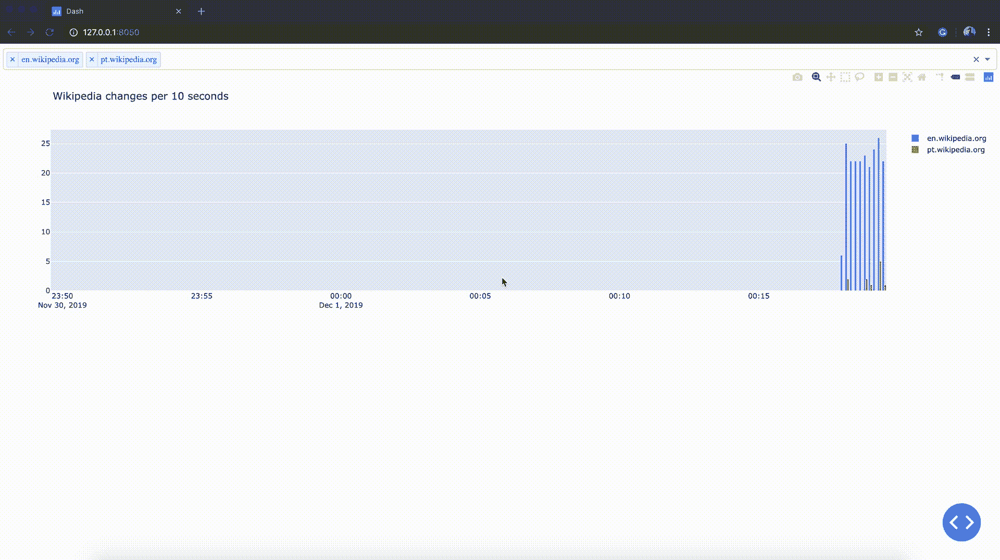

# Redis 发布/订阅、异步 Python 和 Dash 的事件数据管道

> 原文：<https://itnext.io/event-data-pipelines-with-redis-pub-sub-async-python-and-dash-ab0a7bac63b0?source=collection_archive---------0----------------------->



本文是对由 [Python Porto](https://www.meetup.com/pyporto/) 和 [RedisPortugal](https://www.meetup.com/Redis-Portugal/) 组织的 [meetup](https://www.meetup.com/pyporto/events/lfpdhryzqbcb/#) 的补充，旨在围绕 Async Python、Dash 和 Redis Pub/Sub 组织一整天的研讨会，可以用来熟悉成功的模型事件数据管道的技术和模式。将此视为白/黄带整体难度，但所有专业水平都可以利用它来学习或记忆重要概念。

我们创建了一个迷你项目，让事情变得更实际。我们将简要介绍事件数据管道的概念，以及如何使用 Python 和 Redis Pub/Sub 实用地实现它。动手项目由 **Roman Imankulov、**构思，在 GitHub 上的以下[链接](https://github.com/imankulov/wikipedia-playground)中完全可用。

我们将认为您已经启动并运行了一个 Redis 服务器实例，如其他 meetup 事件系列的前一篇文章[所述 https://medium . com/@ fcosta _ Oliveira/Redis-5-x-under-the-hood-1-download-and-installing-Redis-locally-3373 Fe 67 a 154](https://medium.com/@fcosta_oliveira/redis-5-x-under-the-hood-1-downloading-and-installing-redis-locally-3373fe67a154)。

# 事件数据管道 101

事件数据管道遵循发布-订阅原则，如下图所示:



在发布/订阅系统中，发送者向中间消息代理或事件总线发布消息，订阅者向中间代理注册订阅，让代理将消息分发给订阅者。每个订阅主题的订阅者都会收到自己发布的每条消息的副本。由一个发布者产生的单个消息可能被分发给数百、数千甚至数百万订阅者。

发布者可以产生关于多个主题的各种事件，消费者将订阅他们感兴趣的主题。在市场上可用于实现事件数据管道的多种解决方案中，它们都有一个共同的最基本的设计原则:

> 发布者和接收者是分离的。

## 发布-订阅高级原则

一些更先进的设计原则，如:

*   长期订阅
*   消息传递服务质量(最多一次、仅一次、至少一次)
*   高可用性
*   容错

将取决于所选择的解决方案，并且应该是决定事件数据管道主干的考虑因素之一。

一些可用的工具将使您能够结合这些重要的设计原则，包括 Apache Kafka、AWS Kinesis、RabbitMQ、AWS SMS、Azure Service Bus Event Hub、Google Pub/Sub 和 Redis(带有 Pub/Sub、Streams、Lists，甚至是排序集)。

除了每个工具的可用设计原则之外，您还应该考虑数据管道的**总数据量**——如果您打算使用持久订阅的话，以及在每个时刻预期的**消息速率。事件数据管道需要以可靠、高效的方式处理由许多数据源产生的大量事件数据。**

## 关于事件数据管道的发布/订阅或事件流的快速说明



虽然在发布/订阅中消息通常是*(见上图)*触发并忘记*并且永远不会被存储*(见上图)，但是事件[流](https://redis.io/topics/streams-intro)以一种完全不同的方式工作。流抽象对于构建响应式应用是有用的(从开发人员的角度来看)

支持容错和可伸缩性的分布式系统。在决定发布/订阅还是事件流时，您应该问自己以下问题:

*   您的应用程序需要能够检索**历史事件**吗？
*   您的应用程序是否需要**横向扩展接收**？—这意味着添加客户端组，以协作使用同一数据流的不同部分。
*   您的应用程序是否需要**细粒度订阅**，即以比基于主题的方法更精细的粒度来选择事件？
*   根据您希望接收事件的主题，您的应用程序是否要求不同的**服务质量**？

大多数可用的市场工具通常使您能够安置流处理平台或消息传递/发布-订阅系统。使用上述问题和您可能需要的其他更高级的功能，您应该可以确定消息发布/订阅或事件流解决方案是否最合适。

# Redis 中的发布/订阅操作



我们可以使用本地 Redis 实例和`redis-cli`实用程序来尝试发布-订阅原则。启动三个`redis-cli`实例。

为了订阅频道`meetup`，在两个连接的客户端中，发出 [SUBSCRIBE](https://redis.io/commands/subscribe) 命令，提供频道名称:

```
SUBSCRIBE meetup
```

此时，从另一个客户端，我们对名为`meetup`的通道发出一个[发布](https://redis.io/commands/publish)操作，其中包含您想要发送的消息:

```
PUBLISH meetup hello
```

发送的消息将由 Redis 推送到所有订阅的客户端，如上面的 GIF 所示。

在订阅客户端的上下文中允许的命令有[订阅](https://redis.io/commands/subscribe)、 [PSUBSCRIBE](https://redis.io/commands/psubscribe) 、[取消订阅](https://redis.io/commands/unsubscribe)、 [PUNSUBSCRIBE](https://redis.io/commands/punsubscribe) 、 [PING](https://redis.io/commands/ping) 和 [QUIT](https://redis.io/commands/quit) 。

## 发布/订阅全局范围

如官方文档所述，Pub/Sub 与 Redis 密钥空间无关，因此具有全局范围。因此，在 db 10 上发布的内容将被 db 1 上的订阅者听到。如果您需要某种类型的范围，请在通道前面加上环境的名称(测试、试运行、生产等)。

## 最多一次 Redis 发布/订阅

因为 Redis Pub/Sub 是*触发并忘记的，所以如果您的应用程序需要**可靠的事件通知**，也就是说，如果您的 Pub/Sub 客户端断开连接，并在稍后重新连接，则在客户端断开连接期间交付的所有事件都将丢失，因此无法使用该特性。*

## 在 Redis，到处都是酒吧

在 Redis 中，一个众所周知的特性是[键空间通知。它们允许客户端接收以某种方式影响 Redis 数据集的事件。事件是使用 Redis 的普通发布/订阅层交付的，所以即使您可能没有隐式地使用发布/订阅，它也会显式地在您的客户端上运行。](https://redis.io/topics/notifications)

# 微型项目——用 Redis 可视化维基百科更新流

现在我们已经熟悉了发布-订阅原则，以及如何在 Redis 中使用它，我们将深入研究一个更实际的例子。这个实践计划是由**罗曼·伊曼库洛夫**构思的，在 GitHub 上的以下[链接](https://github.com/imankulov/wikipedia-playground)中可以找到。要立即开始，只需遵循以下步骤:

```
git clone [https://github.com/imankulov/wikipedia-playground.git](https://github.com/imankulov/wikipedia-playground.git)
cd [wikipedia-playground](https://github.com/imankulov/wikipedia-playground.git)
```

为了给你一个我们想要建模的项目的快速介绍，维基百科为所有维基媒体项目的更新提供了一个实时的 [SSE](https://developer.mozilla.org/en-US/docs/Web/API/Server-sent_events) feed。你可以从维基百科的[https://wikitech . wikimedia . org/wiki/Event _ Platform/Event streams](https://wikitech.wikimedia.org/wiki/Event_Platform/EventStreams)找到关于事件流的文档。

事件流源可在 https://stream.wikimedia.org/v2/stream/recentchange[获得，并可方便可视化发布:](https://stream.wikimedia.org/v2/stream/recentchange)

```
curl [https://stream.wikimedia.org/v2/stream/recentchange](https://stream.wikimedia.org/v2/stream/recentchange)
```



## 出版者

文件 [redis_publisher.py](https://github.com/imankulov/wikipedia-playground/blob/master/redis_publisher.py) 使用 aioredis，一个异步 redis 客户端库，从 SSE 读取消息并将其发布到通道“wiki”。

不要担心复制代码的每个要点。完整的项目可以在 GitHub 的以下[链接](https://github.com/imankulov/wikipedia-playground)中找到。在项目文件夹中，运行脚本:

```
pipenv run ./redis_publisher.py
```

它立即开始向通道发布事件。您可以用一个简单的 Redis 客户机将它们可视化

```
redis-cli subscribe wiki
```

键入 Ctrl+C 退出。



## 订户

有一个脚本 [redis_subscriber.py](https://github.com/imankulov/wikipedia-playground/blob/master/redis_subscriber.py) 使用来自发布订阅通道的事件，并使用普通的 redis 数据结构将它们建模为时序事件。Redis 中有几种建模时间序列数据的方法，无论是使用有序集、流、使用模块( [RedisTimeSeries](https://oss.redislabs.com/redistimeseries/) )还是使用更简单的散列方法(正如我们在本次会议中想要做的)。

在项目文件夹中，运行脚本:

```
pipenv run ./redis_subscriber.py
```

作为脚本工作的结果，将在 Redis 中创建一些关键字:

```
$ redis-cli
127.0.0.1:6379> keys *
...
7306) "ev:www.wikidata.org"
7307) "ev:no.wikipedia.org"
7308) "ev:cs.wiktionary.org"
```

正如您将进一步探索的，我们已经在 subsbscriber.py 脚本中使用了 Redis [集合](https://redis.io/commands#set)和[散列](https://redis.io/commands#hash)。每种数据类型都提供不同的操作，每种操作都伴随着更高的复杂性和/或性能。你可以在官方文档中找到更多关于 Redis 不同数据类型的信息。

读完上面的要旨，你可以看到:

-特别是对于集合，我们使用 [SADD](https://redis.io/commands/sadd) 命令对**已知域名**密钥和**{域名}** 成员进行如下操作。我们这样做是为了跟踪每个不同的域:

```
SADD known_domains {domain_name}
```

如果您对 **known_domains** 键使用 [SMEMBERS](https://redis.io/commands/smembers) 命令，您将获得当前正在更新的不同域:

```
$ redis-cli
127.0.0.1:6379> **SMEMBERS****known_domains**1) "da.wikipedia.org"
2) "fi.wikipedia.org"
3) "zh.wikipedia.org"
4) "nl.wikibooks.org"
5) "he.wikipedia.org"
6) "et.wiktionary.org"
7) "fr.wikiversity.org"
8) "es.wikibooks.org"
...
```

*   特别是对于散列，我们使用 [HINCRBY](https://redis.io/commands/hincrby) 命令来处理散列的**{域名}** 和**{时间戳}** 成员。对于每个不同的域，我们将时间序列数据建模为散列中的一组时间序列元素。然后，对于每个时间戳块，我们有一个相关的事件数。

```
HINCRBY ev:www.wikidata.org {timestamp} 1
```

得到的数据结构具有以下属性:

*   按域名聚集的事件。
*   硬编码值`expiration_timeout_sec`定义事件在 Redis 中存储多长时间
*   另一个硬编码值`aggregation_interval_sec`定义了事件聚合间隔(以秒为单位)。

此时，每个不同的域都有一个哈希，哈希包含多个字段，每个字段都是一个时间戳组。

如果您使用 [HKEYS](https://redis.io/commands/hkeys) 命令对其中一个编码域哈希 **"en.wikipedia.org"** 进行操作，您将获得不同的时间戳组:

```
$ redis-cli
127.0.0.1:6379> HKEYS filipe:en.wikipedia.org1) "1575199840"
2) "1575199850"
3) "1575199860"
4) "1575199870"
5) "1575199880"
6) "1575199890"
7) "1575199910"
8) "1575199920"
9) "1575199940"
...
```

# 用破折号可视化时间序列事件

Dash 是一个开源的 web 框架，用于构建交互式数据驱动的应用程序，主要是数据可视化和仪表板。

文件 [dash_app.py](https://github.com/imankulov/wikipedia-playground/blob/master/dash_app.py) 包含一个示例应用程序，它让您选择一个或多个域名来获取更新统计信息。

在项目文件夹中，运行脚本:

```
pipenv run ./dash_app.py
```

因此，您应该会看到:



# 关键要点和后续步骤:

我们简要介绍了事件数据管道概念，以及如何使用 Python 和 Redis Pub/Sub 实际实现它，以及如何使用 Dash(Plotly 的一个开源可视化平台)实时可视化数据流。

正如您所想象的，这只是理论概念和所用工具的实践方面的冰山一角。通过钻研以下内容来跟上学习进度:

*   电子书 Redis 在行动。【计数器和统计】一章
*   [维基媒体事件流](https://wikitech.wikimedia.org/wiki/Event_Platform/EventStreams#Python)
*   [Python 客户端 for Redis (redis-py)](https://github.com/andymccurdy/redis-py)
*   [Plotly Dash 文档](https://dash.plot.ly/)
*   [Plotly 时间序列示例](https://plot.ly/python/time-series/)
*   [Plotly Python API 参考](https://plot.ly/python/reference/)

您还可以参加 RedisLabs 的 Redis 大学的几门课程，这些课程将使您能够学习成功建模各种数据结构的技术和模式，以有效和高效地使用 Redis，并深入研究更高级的主题，如这里描述的主题:

*   [Redis 数据结构介绍](https://university.redislabs.com/courses/course-v1:redislabs+RU101+2020_01/about)
*   [Redis 流](https://university.redislabs.com/courses/course-v1:redislabs+RU202+2020_01/about)
*   [Redis 认证开发者计划](https://university.redislabs.com/courses/course-v1:redislabs+DEVELOPER-CERTIFICATION-1+2019-2020/about)