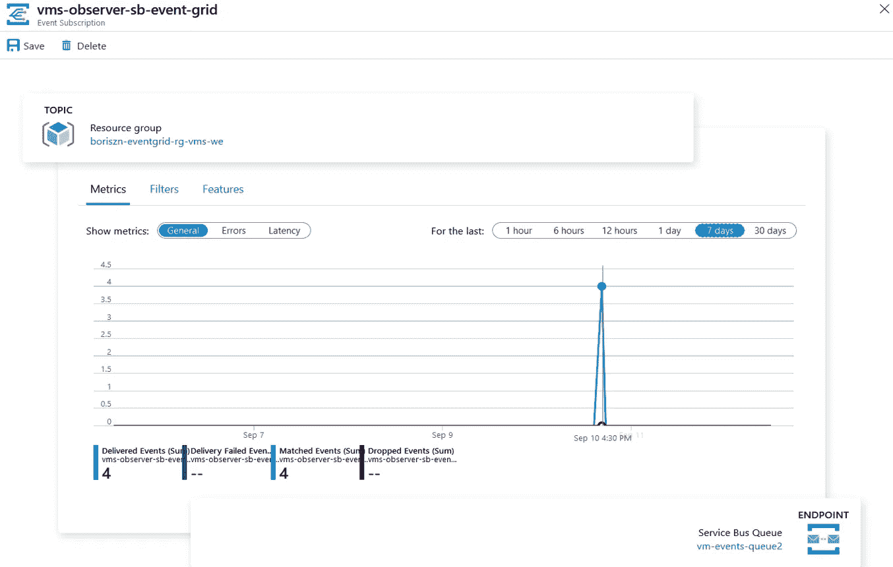
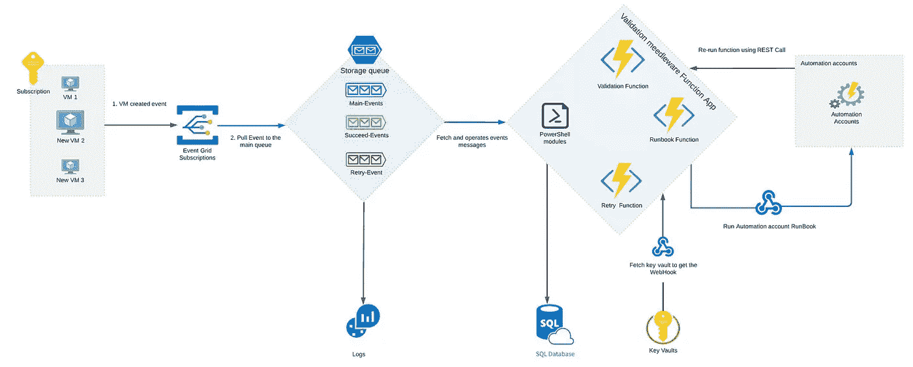
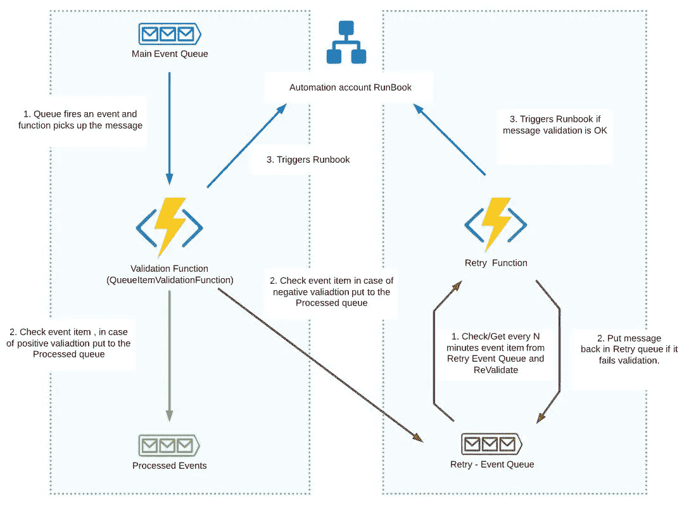
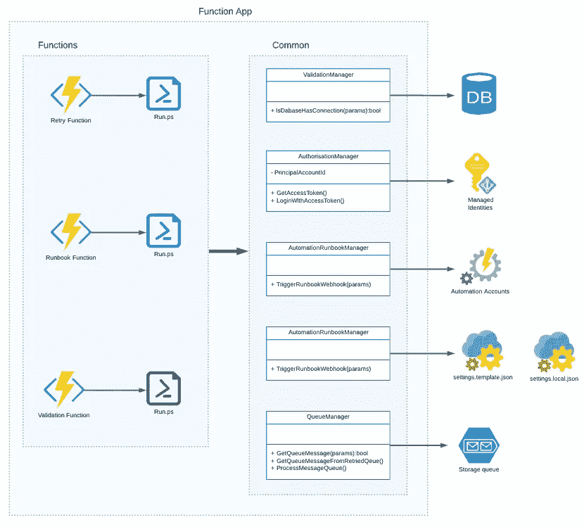
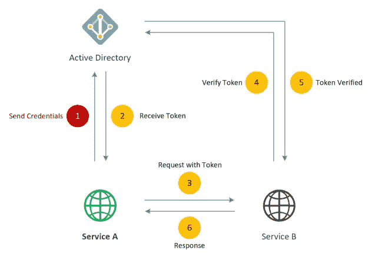
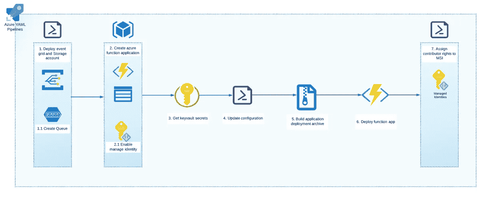

# 需要在 Azure 中构建事件驱动的架构？使用 Azure 事件网格和 Azure 函数很容易！

> 原文：<https://itnext.io/event-driven-and-microservices-architecture-with-azure-function-and-azure-event-grid-51bd612d99b6?source=collection_archive---------2----------------------->


由于所有部署步骤的自动化，在大型组织中构建和支持基础架构可能是一项具有挑战性的任务，例如，为拥有一组虚拟机的部门创建云环境，这些虚拟机包含预安装的软件、实用程序、服务等，它们可能有自己的依赖项，如数据库和存储、与日志分析和其他日志服务的连接。实用程序和服务也可能具有外部依赖性。因此，您需要一种机制来检查并确保建立了所需的连接，安装了依赖项，触发了正确的自动化操作手册。该机制应该提醒管理员出错，执行备份。

为了建立这个机制，我将使用以下 azure 资源。

[**事件网格**](https://docs.microsoft.com/en-us/azure/event-grid/concepts) 是作为主事件事件处理器的关键组件，包含:

*   主题是代表生成事件的组件的 azure 资源。
*   订阅/端点是处理事件的 azure 资源。

下图显示了发布者组件、事件、主题和订阅者/端点之间的关系。


事件网格包含:

*   [死信队列](https://docs.microsoft.com/en-us/azure/event-grid/manage-event-delivery)和重试策略——如果消息无法到达端点，那么您还应该配置重试策略
*   [事件过滤](https://docs.microsoft.com/en-us/azure/event-grid/event-filtering) —允许事件网格将特定事件类型传递到端点的规则。例如:当在主题容器(资源组、订阅等)中创建新的 VM 时，事件将被捕获并交付给端点(服务总线队列、存储队列)



**队列存储账户**

正被用作主事件存储。当事件将通过事件网格生成时，最终目的地将是一个队列。

**Azure 功能**

用作微服务的功能，包含验证所需资源和连接的逻辑。每个功能还可以包含用于存储配置或状态管理数据的数据库。

在一个相当高层次的架构描述之后，我将在下面提供更多的细节。

# 体系结构



正如您已经注意到的，事件网格与一个订阅相链接，该订阅监听与新虚拟机创建相关的事件。有必要在这里添加过滤，否则，每当在订阅或目标资源组中创建任何资源时，事件网格都会生成消息。所有交付的事件都在存储队列中交付。在我的项目中，我使用了三个队列:

*   主队列是事件网格中所有消息的目的地。
*   重试队列接收在验证的第一步中失败并计划在以后重试的所有邮件。
*   成功队列用于所有成功处理的消息。在我的项目中，我将这个队列用于将来的统计和报告。

此外，一个存储帐户链接到 Azure Log Analytics 以同步所有日志和警报，例如，如果重试队列中的消息多于预期，则 Log Analytics 会将此记录为错误警报管理员。

下一个组件是 Azure function 应用程序，它包含几个带有验证、消息处理和触发 runbook 的逻辑的 Azure 函数。

**验证功能**与主事件队列链接。当事件网格向主队列发送消息时，该函数被自动触发。

**重试功能**基于定时器触发，将持续运行以检查打算重试的失败消息(在重试事件队列中)。

**API 函数** (HTTP trigger)意在从 runbook、Admin UI 等触发(重新运行)整个流程。

整个功能工作流程描述如下。



# 架构代码库

函数 app 是在 PowerShell ( [Powershell 类](https://docs.microsoft.com/en-us/powershell/module/microsoft.powershell.core/about/about_classes?view=powershell-7))上编写的，使用了 OOP 的原理。这种方法允许我们构建模块化的良好支持的代码，并随时添加或删除功能。

为什么我选择 PowerShell 而不是 c#或 JavaScript？主要原因是一个基于 PS 的解决方案不仅可以得到开发者的支持，还可以得到云管理员和系统工程师的支持。

## Azure 功能 app

我已经根据消费计划将解决方案放在一个 azure function 应用程序容器中，这样它就不会使用太多的资源，另一方面，如果需要更多的 CPU 能力或内存，它可以自动扩展。

每个函数都包含一个表示函数和绑定配置文件的运行文件，可以在该文件中设置函数触发器。解决方案还包含通用类(模块),代码可在与云资源相关的功能和操作之间重复使用，例如*AutomationAccountManager*模块包含触发 runbook 的功能等。



下面你可以看到主*验证函数*例子的代码示例。

如您所见，我在文件头中引用了*公共*模块，然后使用 *param* 指令、*添加了输入绑定，因此当新的 VM 将被创建并且事件数据将被放入主队列时，该函数将被触发，并且 *$QueueItem* 变量接收有效载荷(此处为[事件网格有效载荷的示例)，包括关于 VM 的信息。](https://gist.github.com/Boriszn/bf8b4dc96d665345feaab9682b873ba2)*

## 公共类/模块

*   **验证模块**包含用于检查数据库服务器连接的逻辑，但是您可以在其中放置其他验证逻辑。首先，它检查参数，将密码转换为安全字符串并构建 [*PSCredential 对象*](https://docs.microsoft.com/en-us/dotnet/api/system.management.automation.pscredential?view=pscore-6.2.0) ，然后设置 *SimplySql 模块*(如果它不存在的话)( [SimplySql](https://www.powershellgallery.com/packages/SimplySql/1.6.2) 包含建立连接和执行数据库查询的逻辑)

*   [**自动化账户管理器**](https://github.com/Boriszn/AzureValidationMiddleware/blob/master/src/AzureValidationMiddlewareFunctionApp/common/AutomationRunbookManager.psm1) 是包含触发运行手册的逻辑的模块，检索虚拟机的私有 IP，当然还可以包含与自动化账户相关的其他逻辑，例如基于模板创建运行手册、删除等。
*   [**配置**](https://github.com/Boriszn/AzureValidationMiddleware/blob/master/src/AzureValidationMiddlewareFunctionApp/common/Configuration.psm1) 从本地和主设置配置文件中检索配置选项，还提供在本地配置设置和生产/测试环境之间切换的逻辑。我将在下面的 **CI/CD 架构和管道**部分详细解释配置。
*   [**authorization manager**](https://github.com/Boriszn/AzureValidationMiddleware/blob/master/src/AzureValidationMiddlewareFunctionApp/common/AuthorisationTokenManager.psm1)**是一个提供对 Azure 资源的访问的模块。基于 Azure 托管身份并使用基于 JWT 令牌的 OAuth2 协议。允许功能应用程序的本地开发。要使用这个选项，您需要获得 JWT 令牌并在模块中添加更新 auth 变量。带 AuthorisationManager 的 MSI 将在 **CI/CD 架构和管道**部分详细说明。**
*   **[**queue manager**](https://github.com/Boriszn/AzureValidationMiddleware/blob/master/src/AzureValidationMiddlewareFunctionApp/common/QueueManager.psm1)**代表 azure 存储帐户队列资源，包含获取队列消息、添加/创建消息的操作。****

# ****CI/CD 架构和管道****

****在我开始解释 CI/CD 架构和管道之前，让我们先来看看 Azure 托管身份主题。****

## ****托管身份****

****管理身份(MSI)是一种服务，允许您的应用程序或功能访问其他 azure 资源。基于主账户和 OAuth 的 MSI。在我的情况下，我需要从功能应用程序接收存储队列的访问权限。****

****为您的资源启用 MSI 时，Azure 将在与此资源关联的 Active Directory 中创建服务主体，但此主体帐户没有权限，因此我们需要显式分配权限。这将是管道的最后一步。****

****创建主体并分配所需权限后，MSI 将基于基于 OAuth2 令牌的算法工作。在访问存储队列之前，函数应用服务主体发送凭证信息以从 AAD 接收 JWT 令牌。最后，函数在访问队列存储之前发送这个令牌进行验证。整个过程可以在下图中找到。****

********

****MSI 的详细信息超出了本文的范围，不过在这里[和](https://docs.microsoft.com/en-us/azure/active-directory/managed-identities-azure-resources/overview)这里[你可以获得关于这个主题的更多信息和示例。](https://blogs.endjin.com/2019/01/managing-applications-using-azure-ad-service-principals-and-managed-identities/)****

****如何在基于 powershell 的函数 app 中实现这一过程，有两种选择:****

1.  ****使用[***profile . PS1***](https://github.com/Boriszn/AzureValidationMiddleware/blob/master/src/AzureValidationMiddlewareFunctionApp/profile.ps1)*文件包含几行代码，其中函数做这个认证。这种方法的缺点是这个选项并不总是在本地有效。*****
2.  *****创建自己的类/模块来实现 MSI 认证过程。你可以看到下面的例子。*****

*****`AuthenticationTokenManager`使用 MSI 执行认证，并允许在本地和“真实”环境之间切换。对于当地的发展，它需要 JWT 令牌。您可以使用这个命令`az account get-access-token --resource 'https://resource.azure.net'`获得它。*****

## *****CI 管道*****

**********

*****管道设置所有需要的基础设施。首先，它创建带有主题的事件网格，并设置容器来观察订阅/资源组([此处](https://docs.microsoft.com/en-us/azure/event-grid/event-sources)您可以找到事件网格源)，它还为事件存储创建带有三个队列的存储队列帐户。代码的最后一步，配置[事件网格订阅过滤器](https://docs.microsoft.com/bs-latn-ba/azure/event-grid/event-filtering)仅在新虚拟机出现时起作用:*****

```
***az eventgrid event-subscription create \....--included-event-types Microsoft.Resources.ResourceWriteSuccess \--advanced-filter data.operationName StringContains 'Microsoft.Compute/virtualMachines/write'***
```

*****如果您需要高级和更高性能的事件存储，您也可以选择 Azure Service Bus 而不是 Storage Queue，它支持事务、过滤、事件转发、死信队列、主题([此处为](https://docs.microsoft.com/en-us/azure/service-bus-messaging/service-bus-messaging-overview#advanced-features)所有高级服务总线特性的列表)。*****

*****下一步是将功能应用程序部署为资源，并启用托管身份(MSI)。*****

```
***"identity": { "type": "SystemAssigned"},***
```

*****这包括存储项目文件和应用程序日志所需的存储帐户的部署。*****

*****之后，我们需要从 key-vault 中读取秘密，这被认为是存储和检索秘密的最佳实践，如主数据库帐户、存储和虚拟机密码等。，但是我们将跳过示例中的步骤。*****

*****最后一步是压缩(zip)函数的文件源，并将归档部署到函数应用程序容器中，这是我们之前创建的。*****

*****[**在这里**](https://github.com/Boriszn/AzureValidationMiddleware/blob/master/src/Deployment/AzureValidationMiddlewareFunctionAppDeployResources.yaml) 你可以找到已经配置好的管道，可以导入到你的 Azure DevOps 项目中。*****

# *****丰富*****

*   *****对于重试功能，我正在使用计时器功能，其中我正在基于 Cron 作业格式配置轮询间隔(`0 */5 * * * *`每 5 分钟)，它可以替换为具有重试策略的[队列触发](https://docs.microsoft.com/en-us/azure/azure-functions/functions-bindings-storage-queue?tabs=csharp#trigger---polling-algorithm)功能或[触发轮询](http://Trigger - polling algorithm)。下面是一个配置示例:*****

```
***{
    "version": "2.0",
    "extensions": {
        "queues": {
            "maxPollingInterval": "00:05:00",
            "visibilityTimeout" : "00:00:60",
            "batchSize": 16,
            "maxDequeueCount": 3,
            "newBatchThreshold": 5
        }
    }
}***
```

*   *****配置文件与授权模块。除了使用授权模块，您还可以使用 profile.ps1 和身份验证脚本部分*****

```
***....
if ($env:MSI_SECRET -and (Get-Module -ListAvailable Az.Accounts)) {         Connect-AzAccount -Identity}
....***
```

*****但是，此选项可能在本地环境中不起作用，您应该配置 MSI 环境变量。*****

*   *****添加 azure 函数代理以修改 URL 格式*****

# *****结论*****

*****在本文中，我描述了如何构建事件驱动架构来管理虚拟机、相关实用程序和组件。*****

*****所提出的解决方案可以在以下场景中重复使用:*****

*   *****密钥库和 SSL 证书管理(检查证书到期时间，记录和通知，自动更新证书)*****
*   *****创建自定义逻辑以构建云费用报告*****
*   *****云资源备份、检查可用性和日志(使用日志分析或其他工具)*****
*   *****资源清理管理*****
*   *****容器管理解决方案*****

## *****源代码*****

*****[](https://github.com/Boriszn/AzureValidationMiddleware) [## Boris Zn/AzureValidationMiddleware

### 使用 Azure 函数、Azure 事件网格和 Azure 队列构建的 Azure 验证中间件解决方案展示了…

github.com](https://github.com/Boriszn/AzureValidationMiddleware)***** 

# *****奖金*****

*****因为这个主题在云和软件架构领域非常有用和流行。此外，这些方法解决了许多业务问题。考虑到这一点，我决定开设一门实用的互动课程。它基于我为企业客户构建 EDA 架构的经验。*****

*****课程中可以**玩代码**，测试架构**，直接**运行管道！您可以在下面找到一个链接并注册该课程。*****

*****[](https://www.educative.io/courses/event-driven-microservices-azure) [## 在 Azure 中构建事件驱动和微服务架构-交互式学习

### 构建云基础架构可能是一项具有挑战性的任务。您的软件中有许多依赖项，而且…

www.educative.io](https://www.educative.io/courses/event-driven-microservices-azure)*****